# UC-111 · Validar docent novell i generar un dret de descompte futur

**Objectiu del catàleg:** separar l'evidència de titulació i la seva validació de la compra d'origen; **només després de confirmar el cobrament** s'emet una sola vegada el benefici futur. No es modifica ni es torna a emetre la factura inicial per concedir el dret.

**Estat revisat el 22/09/2026:** les migracions defineixen `discount_validation`, `discount_evidence`, `commercial_entitlement` i `commercial_entitlement_event`. El PHP web llegat identifica la promoció de novell i, quan `CURS='JASOM'` i es marca novell, crea `recent_titulat(ID_INSC)`; la intranet té un botó de validació que crida `Intranet::sendMsgValidatCurosProfessorNovell()`. **El cos del mètode i el SQL d'actualització han estat aportats posteriorment per l'usuària:** la validació Sí/No actualitza `recent_titulat.VALIDAT` a 1/2 i prepara correus segons el tipus de descompte. L'extracte no mostra cap comprovació del cobrament real ni cap INSERT de promoció futura, i tampoc acredita el servei SIF que emet el dret després del pagament. La comunicació del canal web anuncia un codi per valor monetari. Les decisions de negoci de concessió única per persona, import igual al JASOM íntegrament pagat, un any de vigència i consum parcial ja estan confirmades als apartats següents. **Auditoria posterior del llegat:** s'ha identificat un fragment que prepara el correu del codi al callback de pagament, però no s'hi observa INSERT d'un codi nou; el generador efectiu desplegat i el consumidor encara no estan verificats. No confondre-ho amb el saldo promocional aprovat ni amb saldo de fons prepagats. [Auditoria específica UC-111](00-auditoria-casos-pendents-lot-02-uc-111-2026-09-22.md).

## 1. Fitxa específica

| Aspecte | Contracte i límit |
| --- | --- |
| Actors | Persona titulada, operador autoritzat que comprova evidència i worker de pagament de la compra inicial. |
| Entrada | Titular, titulació/prova mínima, emissor i data quan siguin exigibles segons regla real, `ID_INSC_ORIGEN`, `UUID_OPERATION_ORIGEN`, `UUID_PAYMENT` **confirmat**, regla/versió, valor o percentatge i caducitat acordada. |
| Evidència | `discount_evidence` preveu `UUID_VALIDATION`, `STORAGE_REF`, hash, finalitat, classificació i retenció; **l'esquema no demostra** que el fitxer existeixi ni que sigui accessible només a gestió. |
| Condicions | Dret acadèmic/documental vàlid **i** moviment econòmic d'origen efectiu i pertinent. Una intenció `PENDING`, factura abans de cobrar o un camp `PAGAMENT` del llegat **no acrediten** per si sols l'ingrés. |
| Emissió | `commercial_entitlement.ORIGIN_UUID_OPERATION` i `IDEMPOTENCY_KEY` poden vincular dret amb compra original. Per a una compra elegible, idempotència per regla+titular+operació; no crear dos codis per retries de worker. |
| Dret futur | La classe econòmica **no està decidida**. Si és cupó de descompte, redueix preu d'una altra compra segons regla; si és valor ja cobrat reutilitzable, requereix ledger de procedència i tractament d'aplicació de valor, no fingir un segon ingrés. |
| Fiscalitat | La factura inicial queda immutable. La compra posterior incorpora el seu propi snapshot fiscal segons el tipus de dret; una cancel·lació de compra inicial exigeix decisió expressa sobre dret derivat. |

### Flux i alternatives

1. L'operador comprova evidència de docent novell amb mínima informació i registra aprovació/rebuig amb actor i data; cap dret es crea només per pujar un document.
2. L'alta/compra original segueix UC-14/112. El processador espera un **pagament real confirmat** i reconciliat per `UUID_OPERATION_ORIGEN` i `ID_INSC`, no el primer callback no processat.
3. El coordinador **pendent** llegeix decisió vàlida i pagament; aplica política comercial aprovada (tipus, titular, transferibilitat, valor, caducitat) i crea/reutilitza `commercial_entitlement` amb event d'emissió, sense tocar factura inicial.
4. Un retry equivalent retorna dret anterior; si canvia regla, titular, valor o origen, bloqueja contradicció.
5. En compra posterior UC-117 valida reserva, consum i import del dret; només si és valor monetari **prepagat** el ledger proposat vincula import original i destí individual.
6. Si la compra inicial es retorna o s'anul·la, no eliminar el dret silenciosament: expedient/decisió segons política i event de reversió si correspon, amb possibles efectes fiscals/econòmics separats.

**Proves pendents:** evidència invàlida/caducada, factura abans de cobrar, pagament parcial o denegat, dos callbacks equivalents, reintent després d'emetre dret, compra posterior, devolució d'origen i codi consumit abans de la cancel·lació. No s'han executat proves PHP.

### 1.1. Validació `recent_titulat` i codi personal del llegat

La documentació de la promoció de docents novells identifica una consulta a `recent_titulat` per `ID_INSC` i `VALIDAT=1`. El correu històric pot comunicar un codi del patró `MACABODETITULAR#...`, el descompte i la data de validesa. La taula `promocions` conté titular, curs, mes, percentatge, estat `USED` i dates de vigència; el procediment `cnsSiTePromocioDispo` comprova la disponibilitat del codi. Aquestes són **peces del circuit llegat**, no una demostració que existeixi al SIF un worker que expedeixi drets nous a partir del cobrament.

`recent_titulat.VALIDAT=1` acredita la decisió de validació acadèmica del llegat, **no el cobrament de la compra d'origen**. L'objectiu de la fitxa exigeix comprovar per separat el `UUID_PAYMENT` real i la regla comercial abans d'emetre el dret futur. Una factura emesa abans de cobrar o una intenció Redsys pendent no són suficients. Si un callback es repeteix després de concedir el codi, cal recuperar el mateix dret en comptes d'emetre'n un segon; si falla només el correu, reintentar el lliurament sense crear una nova promoció.

En una compra futura, el codi personal es valida segons UC-20d/117. Si la compra inicial es retorna després que el codi ja s'hagi consumit, conservar les dues operacions i el seu historial, i sotmetre la reversió a una decisió expressa. El xat recuperat no estableix un mecanisme automàtic per desfer descomptes de factures futures ja emeses.

### 1.2. Proves addicionals de docent novell (no executades)

| ID | Escenari | Resultat |
| --- | --- | --- |
| DN-01 | recent_titulat.VALIDAT=1 i factura d'origen encara pendent | No concedir el dret per una factura no cobrada. |
| DN-02 | Compra confirmada amb doble callback Redsys | Un sol codi/dret amb origen i titular identificats. |
| DN-03 | El dret ja existeix però falla el correu | Reintentar només el lliurament, no duplicar el dret. |
| DN-04 | Codi personal presentat per una altra persona | Denegar ús sense revelar les dades del titular. |
| DN-05 | Retorn posterior de compra d'origen amb codi ja consumit | Expedient de reversió, no reactivació ni edició automàtica de factura futura. |

### 1.3. Contrast dirigit amb el codi actual de la web i intranet (22/09/2026)

**Alta i origen:** [`web-actual/ajax/enviarInscripcio.php` L36–69](../../codi-drive/web-actual/ajax/enviarInscripcio.php#L36-L69) llegeix `novell` i dades de titulació. A [L586–620](../../codi-drive/web-actual/ajax/enviarInscripcio.php#L586-L620) insereix la inscripció i **només quan el codi del curs és `JASOM` i novell** insereix `recent_titulat(ID_INSC)`. Això no prova per si sol la titulació, el cobrament o l'existència de la promoció. Identificar altres rutes possibles abans de generalitzar la regla a qualsevol curs. El missatge de [L403–420](../../codi-drive/web-actual/ajax/enviarInscripcio.php#L403-L420) indica validació del títol abans de reserva/pagament i després un **codi de descompte per valor de l'import del curs d'origen** per al pròxim curs: confirmar política comercial vigent, càlcul, titular, productes aplicables, caducitat i incompatibilitats, sense convertir automàticament «valor» en «crèdit bancari».

**Justificant:** [`web-actual/ajax/enviarImatgeSocRecentTitulat.php` L13–45](../../codi-drive/web-actual/ajax/enviarImatgeSocRecentTitulat.php#L13-L45) desa un fitxer a `resguards/` amb nom derivat de dades d'alta i extensió enviada. [L40–76](../../codi-drive/web-actual/ajax/enviarImatgeSocRecentTitulat.php#L40-L76) construeix referència a `ajax/carnets/` per al correu, sense acreditar aquí que el destí coincideixi amb la ubicació escrita. La ruta revisada NO demostra validació segura del document, autorització del titular ni registre de hash/retenció a `discount_evidence`; comprovar configuració real i no traslladar justificants personals a repositoris públics.

**Gestió i accions d'intranet:** [`alumnes-validar-descomptes.js` L42–53](../../codi-drive/intranet-actual/js/alumnes-validar-descomptes.js#L42-L53) només alterna el Sí/No visual del resguard; [L95–117](../../codi-drive/intranet-actual/js/alumnes-validar-descomptes.js#L95-L117) envia `idInsc` i `verificat` per GET a [`sendMsgValidatProfessorNovell.php`](../../codi-drive/intranet-actual/ajax/alumnes/sendMsgValidatProfessorNovell.php#L13-L25), que delega a `Intranet::sendMsgValidatCurosProfessorNovell()`. El cos d'aquest mètode de `Intranet.php` **no està verificat en aquest lot**; no afirmar que comprova el cobrament, genera el codi o envia la comunicació fins que se n'obtingui el codi i les dades de persistència.

**Model final i dependències:** migració 000004 defineix `discount_validation` i 000005 defineix `discount_evidence`, `commercial_entitlement` i els seus events; **SQL definit no prova servei ni persistència executada**. Completar a UC-117 la reserva i el consum del codi amb autorització, titularitat, import no negatiu i concurrència. Per a aquest UC, separar (1) validar evidència, (2) confirmar ingrés real, (3) expedir o recuperar dret, (4) notificar-lo i (5) consum futur; no alterar la factura original.

**Privacitat (P0 fins a revisió):** l'arbre de `main` del repositori públic conté justificants amb identificadors personals en noms d'arxiu a carpetes de web. No reproduir ni enllaçar fitxers individuals. Revisar i restringir la publicació i l'historial amb el responsable de dades abans de sincronitzar o desplegar-los; **no s'ha verificat que les còpies siguin les mateixes que en producció**.

**Traçabilitat i prova:** [auditoria UC-111 · lot 02](00-auditoria-casos-pendents-lot-02-uc-111-2026-09-22.md) inclou matriu d'accions, decisions, 4 diagrames d'activitat parcials (alta web actual/final i apartat d'intranet actual/final) i DN-111-01…12. **NO EXECUTATS**. La cobertura integral de cadascuna de les dues pàgines continua pendent de RM-037.

## 2. UML de casos d'ús

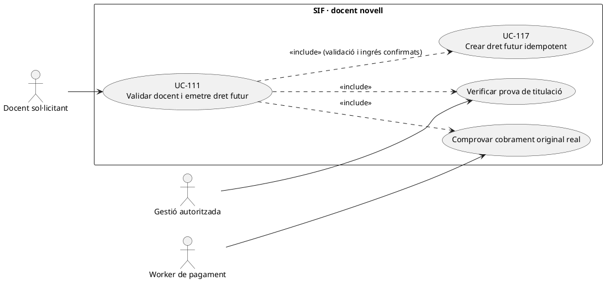
```plantuml
@startuml
left to right direction
actor "Docent sol·licitant" as D
actor "Gestió autoritzada" as G
actor "Worker de pagament" as W
rectangle "SIF · docent novell" {
 usecase "UC-111\nValidar docent i emetre dret futur" as Main
 usecase "Verificar prova de titulació" as Verify
 usecase "Comprovar cobrament original real" as Paid
 usecase "UC-117\nCrear dret futur idempotent" as Grant
}
D --> Main
G --> Verify
W --> Paid
Main ..> Verify : <<include>>
Main ..> Paid : <<include>>
Main ..> Grant : <<include>> (validació i ingrés confirmats)
@enduml
```

## 3. Diagrama de classes

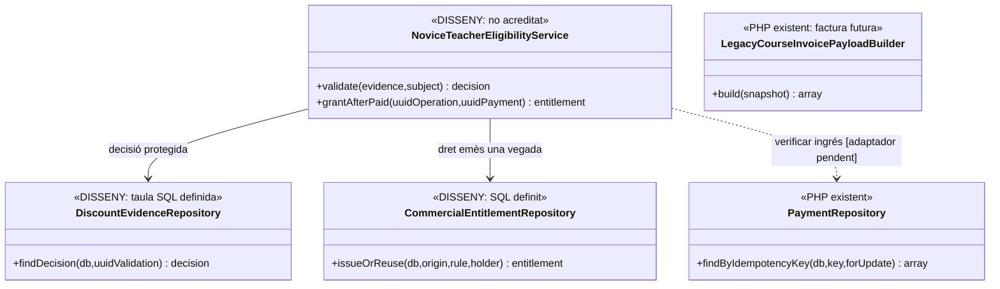
```mermaid
classDiagram
class NoviceTeacherEligibilityService {
 <<DISSENY: no acreditat>>
 +validate(evidence,subject) decision
 +grantAfterPaid(uuidOperation,uuidPayment) entitlement
}
class DiscountEvidenceRepository {
 <<DISSENY: taula SQL definida>>
 +findDecision(db,uuidValidation) decision
}
class CommercialEntitlementRepository {
 <<DISSENY: SQL definit>>
 +issueOrReuse(db,origin,rule,holder) entitlement
}
class PaymentRepository {
 <<PHP existent>>
 +findByIdempotencyKey(db,key,forUpdate) array
}
class LegacyCourseInvoicePayloadBuilder {
 <<PHP existent: factura futura>>
 +build(snapshot) array
}
NoviceTeacherEligibilityService --> DiscountEvidenceRepository : decisió protegida
NoviceTeacherEligibilityService --> CommercialEntitlementRepository : dret emès una vegada
NoviceTeacherEligibilityService ..> PaymentRepository : verificar ingrés [adaptador pendent]
```

## 4. Seqüència objectiu — prova, pagament i dret independent

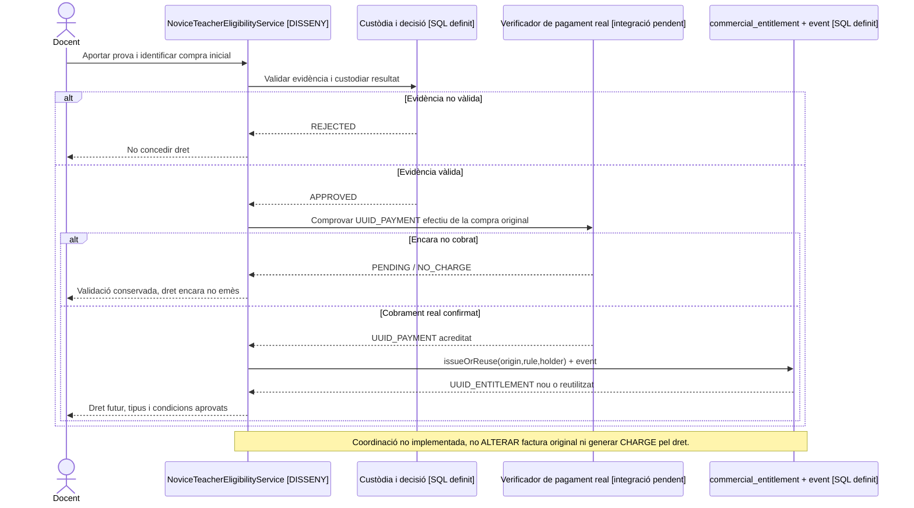
```mermaid
sequenceDiagram
actor D as Docent
participant V as NoviceTeacherEligibilityService [DISSENY]
participant E as Custòdia i decisió [SQL definit]
participant P as Verificador de pagament real [integració pendent]
participant R as commercial_entitlement + event [SQL definit]
D->>V: Aportar prova i identificar compra inicial
V->>E: Validar evidència i custodiar resultat
alt Evidència no vàlida
 E-->>V: REJECTED
 V-->>D: No concedir dret
else Evidència vàlida
 E-->>V: APPROVED
 V->>P: Comprovar UUID_PAYMENT efectiu de la compra original
 alt Encara no cobrat
  P-->>V: PENDING / NO_CHARGE
  V-->>D: Validació conservada, dret encara no emès
 else Cobrament real confirmat
  P-->>V: UUID_PAYMENT acreditat
  V->>R: issueOrReuse(origin,rule,holder) + event
  R-->>V: UUID_ENTITLEMENT nou o reutilitzat
  V-->>D: Dret futur, tipus i condicions aprovats
 end
end
Note over V,R: Coordinació no implementada, no ALTERAR factura original ni generar CHARGE pel dret.
```

## 5. Traçabilitat

[UC-111 original](../06-fitxes-funcionals/uc-111.md) · [UC-117 drets](uc-117-cicle-vida-codi-dret-futur.md) · [UC-116 evidències original](../06-fitxes-funcionals/uc-116.md) · [UC-20d cupó](uc-020d-aplicar-codi-promocional.md) · [UC-02 cobrament](uc-002-registrar-cobrament-factura.md) · [Migració dret/evidència](../../sif/database/migrations/2026_09_16_000005_add_operation_lifecycle_tables.sql) · [CreditBalanceService: diferent d'un cupó](../../sif/src/Service/CreditBalanceService.php) · [Traçabilitat monetària](00-revisio-moviments-inscripcions.md).

### Contrast addicional: cobrament, generació del codi i termini

Vegeu [l'auditoria dirigida del circuit de cobrament i promoció novell](00-auditoria-circuit-cobrament-promocio-novell-2026-09-22.md), que distingeix els fragments llegats observats, els controls Redsys presents al SIF i les tasques de migració. **La creació efectiva i idempotent del dret encara NO està acreditada.** El fragment llegat prepara un missatge però no s'ha d'utilitzar com a servei de concessió nou.

**Component PHP nou, sense integració funcional:** [NoviceEvidenceDeadlineCalculator](../../sif/src/Domain/NoviceEvidenceDeadlineCalculator.php) calcula 48 hores de dates feineres amb festius/ús horari injectats; [tests unitaris específics](../../sif/tests/Unit/NoviceEvidenceDeadlineCalculatorTest.php). Encara no existeix la connexió de la classe amb l'enviament real de secretaria, calendari de festius operatiu, estats d'acreditació, bloqueig de cobrament, concessió ni saldo. Cap diagrama final prova que aquests circuits ja s'executin.
## 5 bis. Decisions de negoci confirmades i preguntes encara obertes

**CONFIRMAT — negoci 22/09/2026:** només la inscripció a JASOM permet demanar promoció novell. El títol ha d'haver estat expedit fa menys d'un any a la data d'inici de JASOM i secretaria comprova manualment el títol, la data i el titular. La inscripció es crea abans de la revisió i **només després de l'aprovació/denegació** es faciliten opcions de pagament. L'acreditació incorrecta provoca requeriment manual, fins a 48 hores **comptades en dies feiners des de l'enviament del missatge de secretaria, excloent caps de setmana i festius**, per esmenar i denegació quan secretaria prem No, sense cancel·lar la matrícula. **Un únic benefici:** es paga i es gaudeix de JASOM al seu preu comercial aplicable; si està acreditat i JASOM queda COMPLETAMENT PAGAT, s'emet automàticament un codi promocional **pel valor efectivament pagat** per aplicar en qualsevol curs posterior, dins d'un any des de l'emissió i combinable amb altres descomptes. Amb un dret de 90 € i compra de 70 €, el llegat genera un nou codi de 20 €; al SIF s'ha ACORDAT mantenir un únic saldo PROMOCIONAL disponible de 20 € dins el mateix dret, sense codi residual nou. En un curs de 120 €, el client abona la diferència de 30 €. Una devolució de JASOM provoca anul·lació MANUAL del codi i, si ja s'ha gastat, reclamació del valor aplicat. El romanent conserva la caducitat ORIGINAL del dret i els altres descomptes s'apliquen ABANS de consumir saldo. En cas de retorn de JASOM, un apartat intern ha de permetre cancel·lar el saldo disponible sense esborrar els consums i reclamar el valor utilitzat. La classificació comptable/fiscal del dret i la configuració de quin calendari festiu s'aplica encara requereixen treball tècnic; ja està confirmat que el dret promocional novell es concedeix UNA SOLA VEGADA PER PERSONA, i el canvi o baixa del curs de destinació segueix el procés ordinari, amb trasllat al nou curs si es canvia i amb rectificativa més saldo nou d'un any si es dona de baixa. Resten per concretar els imports efectivament recuperables en una baixa segons condicions i el tractament fiscal/comptable de cada tram.

**Correcció de font:** el cos del mètode de validació, el mapa SQL i el constructor de l'apartat s'han aportat al xat posteriorment al lot 02. Les notes anteriors de «mètode no recuperat» són HISTÒRIQUES. El SQL confirma que actualitza recent_titulat.VALIDAT (1/2); no deduir que s'hagi comprovat ingrés ni emès cap promoció.
## 6. Diagrames d'activitat del cas UC-111

**Els diagrames següents representen subfluxos comprovables o proposats del cas UC-111, incloses les dues branques de la vista de pagament; no substitueixen l'auditoria de TOTS els apartats de les pàgines compartides.** El mètode d'Intranet ha estat aportat i el diagrama ACTUAL de validació reflecteix la seva escriptura a `recent_titulat.VALIDAT`; el codi de cobrament i generació del benefici futur no s'ha acreditat aquí. Els fluxos FINALS són contractes objectiu, no programació acabada. Per a l'auditoria de les pàgines i apartats sencers continua oberta RM-037; no donar per acabada la documentació només per l'existència d'aquests diagrames.
**Abast:** subfluxos de la pàgina d'inscripció i de l'apartat «recent titulat» de la pàgina de validació; **NO** diagrama complet de totes les accions de les dues pàgines. Marcar els estats del servidor llegat que no s'han pogut recuperar com a NO VERIFICATS.

### 4.1. Inscripció web — subflux actual observable

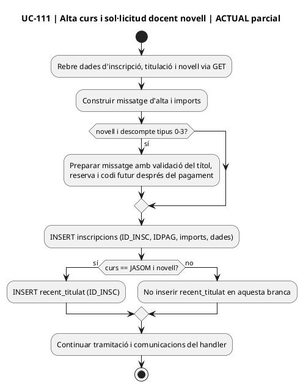
```plantuml
@startuml
title UC-111 | Alta curs i sol·licitud docent novell | ACTUAL parcial
start
:Rebre dades d'inscripció, titulació i novell via GET;
:Construir missatge d'alta i imports;
if (novell i descompte tipus 0-3?) then (sí)
 :Preparar missatge amb validació del títol,
 reserva i codi futur després del pagament;
endif
:INSERT inscripcions (ID_INSC, IDPAG, imports, dades);
if (curs == JASOM i novell?) then (sí)
 :INSERT recent_titulat (ID_INSC);
else (no)
 :No inserir recent_titulat en aquesta branca;
endif
:Continuar tramitació i comunicacions del handler;
stop
@enduml
```

### 4.2. JASOM, acreditació, cobrament i concessió — diagrama FINAL objectiu

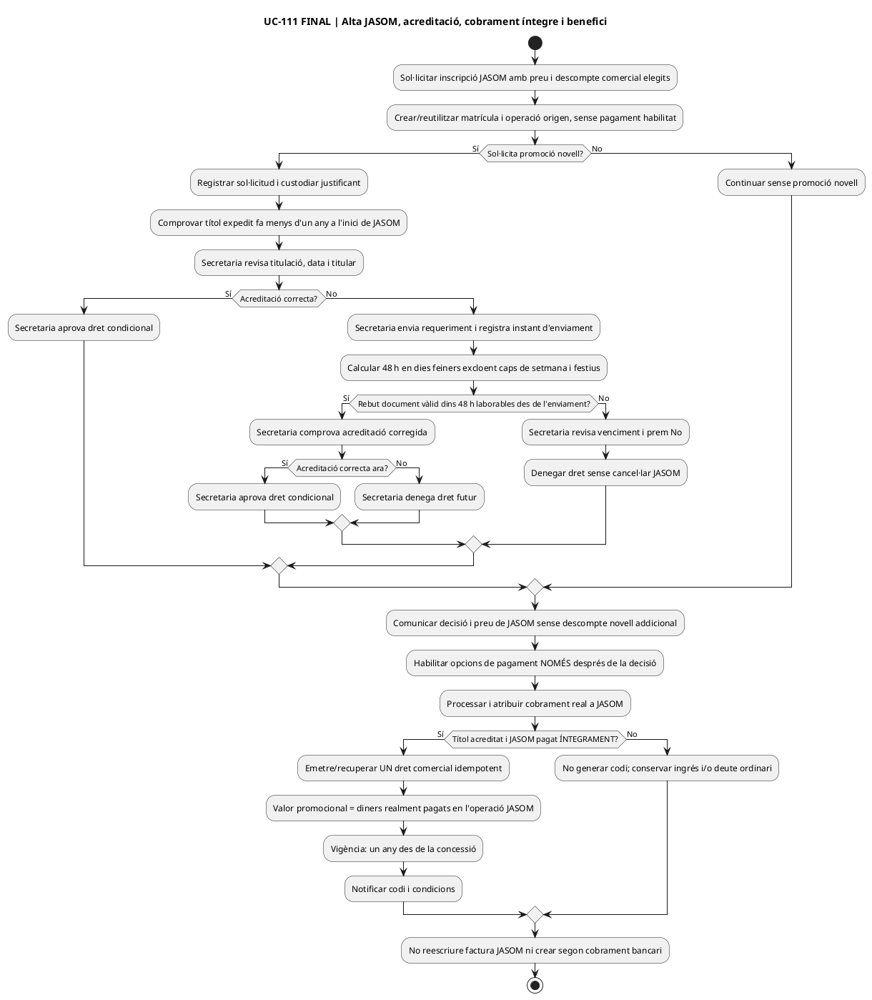
```plantuml
@startuml
title UC-111 FINAL | Alta JASOM, acreditació, cobrament íntegre i benefici
start
:Sol·licitar inscripció JASOM amb preu i descompte comercial elegits;
:Crear/reutilitzar matrícula i operació origen, sense pagament habilitat;
if (Sol·licita promoció novell?) then (Sí)
 :Registrar sol·licitud i custodiar justificant;
 :Comprovar títol expedit fa menys d'un any a l'inici de JASOM;
 :Secretaria revisa titulació, data i titular;
 if (Acreditació correcta?) then (Sí)
  :Secretaria aprova dret condicional;
 else (No)
  :Secretaria envia requeriment i registra instant d'enviament;
  :Calcular 48 h en dies feiners excloent caps de setmana i festius;
  if (Rebut document vàlid dins 48 h laborables des de l'enviament?) then (Sí)
   :Secretaria comprova acreditació corregida;
   if (Acreditació correcta ara?) then (Sí)
    :Secretaria aprova dret condicional;
   else (No)
    :Secretaria denega dret futur;
   endif
  else (No)
   :Secretaria revisa venciment i prem No;
   :Denegar dret sense cancel·lar JASOM;
  endif
 endif
else (No)
 :Continuar sense promoció novell;
endif
:Comunicar decisió i preu de JASOM sense descompte novell addicional;
:Habilitar opcions de pagament NOMÉS després de la decisió;
:Processar i atribuir cobrament real a JASOM;
if (Títol acreditat i JASOM pagat ÍNTEGRAMENT?) then (Sí)
 :Emetre/recuperar UN dret comercial idempotent;
 :Valor promocional = diners realment pagats en l'operació JASOM;
 :Vigència: un any des de la concessió;
 :Notificar codi i condicions;
else (No)
 :No generar codi; conservar ingrés i/o deute ordinari;
endif
:No reescriure factura JASOM ni crear segon cobrament bancari;
stop
@enduml
```

**Límits oberts:** concreció del calendari de 48 h laborables, classificació fiscal/comptable del descompte promocional, valor elegible en pagaments sobrant/excedent i retorns, regla de recurrència de JASOM i generador PHP actual pendent d'identificar. FINAL no equival a implementat.
### 4.3. Intranet · Validar descomptes · apartat docent novell — subflux ACTUAL contrastat amb extractes aportats

**Font complementària privada:** el mètode de construcció de la pàgina, el router, les consultes SQL i el mètode PHP de validació aportats al xat, a més del [JS versionat](../../codi-drive/intranet-actual/js/alumnes-validar-descomptes.js#L42-L117) i l'[endpoint](../../codi-drive/intranet-actual/ajax/alumnes/sendMsgValidatProfessorNovell.php). No copiar justificants ni destinataris de prova.

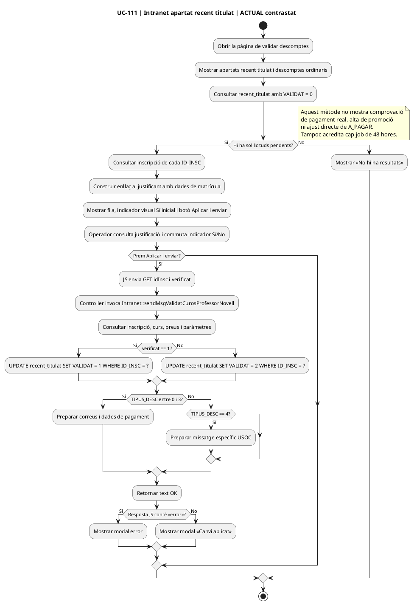
```plantuml
@startuml
title UC-111 | Intranet apartat recent titulat | ACTUAL contrastat
start
:Obrir la pàgina de validar descomptes;
:Mostrar apartats recent titulat i descomptes ordinaris;
:Consultar recent_titulat amb VALIDAT = 0;
if (Hi ha sol·licituds pendents?) then (Sí)
 :Consultar inscripció de cada ID_INSC;
 :Construir enllaç al justificant amb dades de matrícula;
 :Mostrar fila, indicador visual Sí inicial i botó Aplicar i enviar;
 :Operador consulta justificació i commuta indicador Sí/No;
 if (Prem Aplicar i enviar?) then (Sí)
  :JS envia GET idInsc i verificat;
  :Controller invoca Intranet::sendMsgValidatCurosProfessorNovell;
  :Consultar inscripció, curs, preus i paràmetres;
  if (verificat == 1?) then (Sí)
   :UPDATE recent_titulat SET VALIDAT = 1 WHERE ID_INSC = ?;
  else (No)
   :UPDATE recent_titulat SET VALIDAT = 2 WHERE ID_INSC = ?;
  endif
  if (TIPUS_DESC entre 0 i 3?) then (Sí)
   :Preparar correus i dades de pagament;
  else (No)
   if (TIPUS_DESC == 4?) then (Sí)
    :Preparar missatge específic USOC;
   endif
  endif
  :Retornar text OK;
  if (Resposta JS conté «error»?) then (Sí)
   :Mostrar modal error;
  else (No)
   :Mostrar modal «Canvi aplicat»;
  endif
 endif
else (No)
 :Mostrar «No hi ha resultats»;
endif
note right
 Aquest mètode no mostra comprovació
 de pagament real, alta de promoció
 ni ajust directe de A_PAGAR.
 Tampoc acredita cap job de 48 hores.
end note
stop
@enduml
```

**Límit:** el SQL real és UPDATE recent_titulat.VALIDAT per ID_INSC; les consultes de canvi d'inscripcions.VALID_DESC / A_PAGAR són separades i no les executa directament el mètode aportat. L'emissió del codi futur i la comprovació de cobrament resten per rastrejar a altres rutes.
### 4.3 bis. Codi futur: consum i romanent — ACTUAL de negoci i FINAL acordat

**ACTUAL de negoci confirmat per l'usuària, però generador automàtic PHP no identificat en aquesta lectura del repositori:** si es gasta una part d'un codi, es concedeix un altre codi pel romanent; si el curs costa més, es paga la diferència. No deduir d'aquesta explicació que les escriptures, l'ordre de càlcul o els reintents del servidor estiguin acreditats.

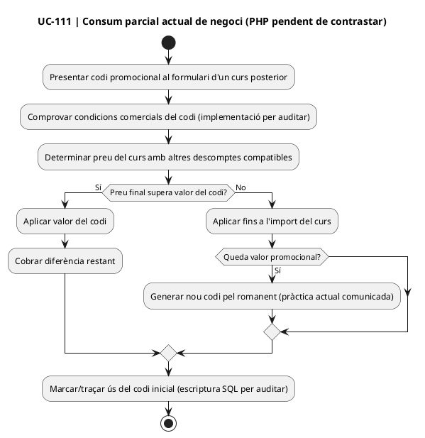
```plantuml
@startuml
title UC-111 | Consum parcial actual de negoci (PHP pendent de contrastar)
start
:Presentar codi promocional al formulari d'un curs posterior;
:Comprovar condicions comercials del codi (implementació per auditar);
:Determinar preu del curs amb altres descomptes compatibles;
if (Preu final supera valor del codi?) then (Sí)
 :Aplicar valor del codi;
 :Cobrar diferència restant;
else (No)
 :Aplicar fins a l'import del curs;
 if (Queda valor promocional?) then (Sí)
  :Generar nou codi pel romanent (pràctica actual comunicada);
 endif
endif
:Marcar/traçar ús del codi inicial (escriptura SQL per auditar);
stop
@enduml
```

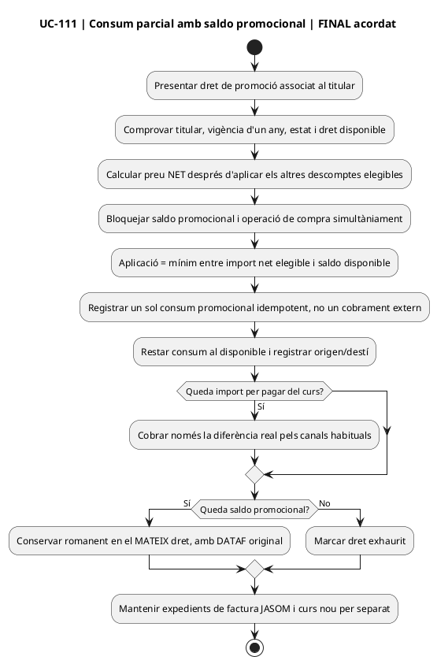
```plantuml
@startuml
title UC-111 | Consum parcial amb saldo promocional | FINAL acordat
start
:Presentar dret de promoció associat al titular;
:Comprovar titular, vigència d'un any, estat i dret disponible;
:Calcular preu NET després d'aplicar els altres descomptes elegibles;
:Bloquejar saldo promocional i operació de compra simultàniament;
:Aplicació = mínim entre import net elegible i saldo disponible;
:Registrar un sol consum promocional idempotent, no un cobrament extern;
:Restar consum al disponible i registrar origen/destí;
if (Queda import per pagar del curs?) then (Sí)
 :Cobrar només la diferència real pels canals habituals;
endif
if (Queda saldo promocional?) then (Sí)
 :Conservar romanent en el MATEIX dret, amb DATAF original;
else (No)
 :Marcar dret exhaurit;
endif
:Mantenir expedients de factura JASOM i curs nou per separat;
stop
@enduml
```

**Nota:** saldo promocional concedit addicionalment a JASOM pagat ≠ saldo monetari prepagat pendent de consumir; no invocar directament el ledger de compensació monetària existent com si fos el mateix tipus de valor. Valorar emmagatzematge del saldo comercial i events de consum amb traça de factura i import sense duplicar CHARGE.
### 4.3 ter. Pàgina de pagament JASOM — dues branques ACTUALS discrepants i porta FINAL

**Font:** [PagamentCursAutomatic.php::mostrar() L274–305](../../codi-drive/web-actual/PagamentCursAutomatic.php#L274-L305) i [L339–379](../../codi-drive/web-actual/PagamentCursAutomatic.php#L339-L379). Ambdues consulten l'existència de recent_titulat pel mateix ID_INSC, però **no en llegeixen VALIDAT**; en una branca l'existència fa mostrar targeta i en una altra la fa ocultar. El mètode inclou `$recentTitulat == 0;` (comparació, no inicialització). **Diagrames de UI, no prova de que l'endpoint accepti/cobri una petició abans de validar.**

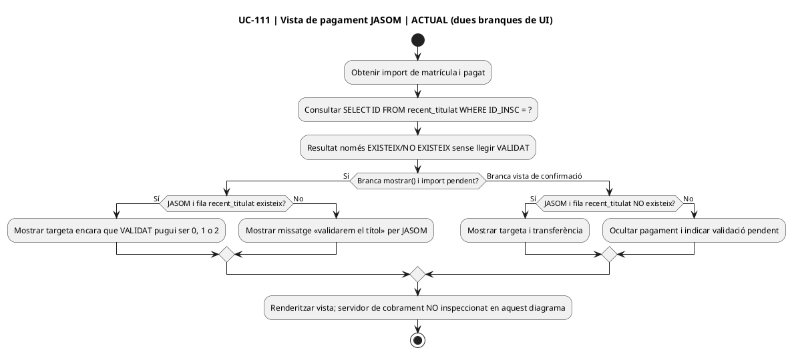
```plantuml
@startuml
title UC-111 | Vista de pagament JASOM | ACTUAL (dues branques de UI)
start
:Obtenir import de matrícula i pagat;
:Consultar SELECT ID FROM recent_titulat WHERE ID_INSC = ?;
:Resultat només EXISTEIX/NO EXISTEIX sense llegir VALIDAT;
if (Branca mostrar() i import pendent?) then (Sí)
 if (JASOM i fila recent_titulat existeix?) then (Sí)
  :Mostrar targeta encara que VALIDAT pugui ser 0, 1 o 2;
 else (No)
  :Mostrar missatge «validarem el títol» per JASOM;
 endif
else (Branca vista de confirmació)
 if (JASOM i fila recent_titulat NO existeix?) then (Sí)
  :Mostrar targeta i transferència;
 else (No)
  :Ocultar pagament i indicar validació pendent;
 endif
endif
:Renderitzar vista; servidor de cobrament NO inspeccionat en aquest diagrama;
stop
@enduml
```

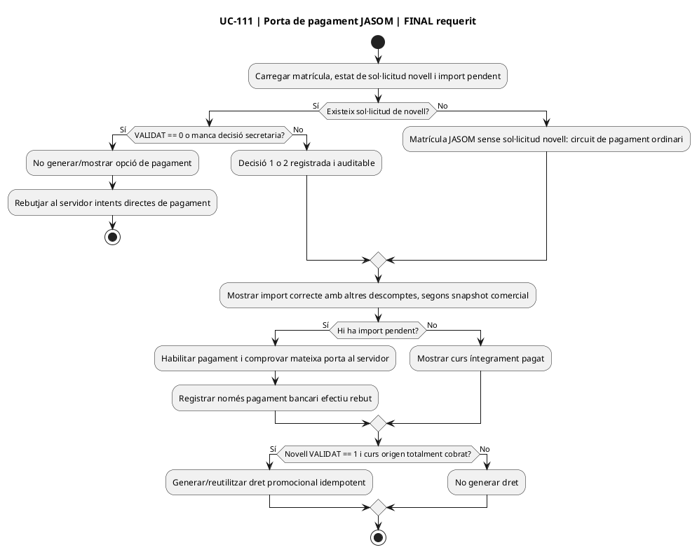
```plantuml
@startuml
title UC-111 | Porta de pagament JASOM | FINAL requerit
start
:Carregar matrícula, estat de sol·licitud novell i import pendent;
if (Existeix sol·licitud de novell?) then (Sí)
 if (VALIDAT == 0 o manca decisió secretaria?) then (Sí)
  :No generar/mostrar opció de pagament;
  :Rebutjar al servidor intents directes de pagament;
  stop
 else (No)
  :Decisió 1 o 2 registrada i auditable;
 endif
else (No)
 :Matrícula JASOM sense sol·licitud novell: circuit de pagament ordinari;
endif
:Mostrar import correcte amb altres descomptes, segons snapshot comercial;
if (Hi ha import pendent?) then (Sí)
 :Habilitar pagament i comprovar mateixa porta al servidor;
 :Registrar només pagament bancari efectiu rebut;
else (No)
 :Mostrar curs íntegrament pagat;
endif
if (Novell VALIDAT == 1 i curs origen totalment cobrat?) then (Sí)
 :Generar/reutilitzar dret promocional idempotent;
else (No)
 :No generar dret;
endif
stop
@enduml
```

**Proves bloquejants definides, NO EXECUTADES:** matrícula novell pendent amb URL de pagament directa; aprovada i denegada amb import pendent; sense sol·licitud novell; doble retorn Redsys; matrícula pagada parcialment; recàrrega de les dues vistes; variables inicialitzades i validació de l'estat també al servidor.
### 4.3 quater. Intranet SIF · Apartat de cancel·lació i reclamació de saldos — FINAL pendent d'implementar

**Regla CONFIRMADA:** si es retorna el pagament de JASOM origen, anul·lar manualment el saldo disponible i reclamar el valor que ja s'ha consumit, amb història auditable. Exemple: valor original 90 €, consumit 70 €, disponible 20 € → saldo disponible anul·lat 20 €, reclamació pendent 70 €; no es desfà retroactivament el consum de la destinació ni es declara falsament cobrat l'import reclamat.

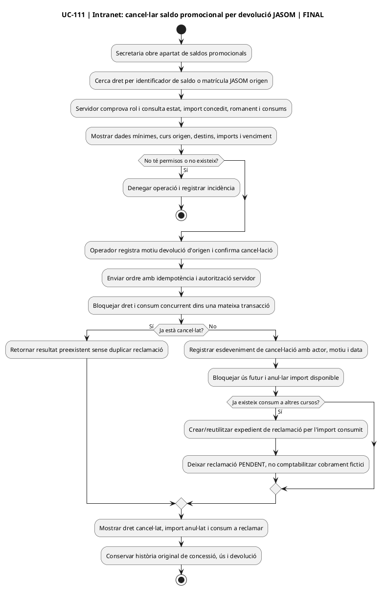
```plantuml
@startuml
title UC-111 | Intranet: cancel·lar saldo promocional per devolució JASOM | FINAL
start
:Secretaria obre apartat de saldos promocionals;
:Cerca dret per identificador de saldo o matrícula JASOM origen;
:Servidor comprova rol i consulta estat, import concedit, romanent i consums;
:Mostrar dades mínimes, curs origen, destins, imports i venciment;
if (No té permisos o no existeix?) then (Sí)
 :Denegar operació i registrar incidència;
 stop
endif
:Operador registra motiu devolució d'origen i confirma cancel·lació;
:Enviar ordre amb idempotència i autorització servidor;
:Bloquejar dret i consum concurrent dins una mateixa transacció;
if (Ja està cancel·lat?) then (Sí)
 :Retornar resultat preexistent sense duplicar reclamació;
else (No)
 :Registrar esdeveniment de cancel·lació amb actor, motiu i data;
 :Bloquejar ús futur i anul·lar import disponible;
 if (Ja existeix consum a altres cursos?) then (Sí)
  :Crear/reutilitzar expedient de reclamació per l'import consumit;
  :Deixar reclamació PENDENT, no comptabilitzar cobrament fictici;
 endif
endif
:Mostrar dret cancel·lat, import anul·lat i consum a reclamar;
:Conservar història original de concessió, ús i devolució;
stop
@enduml
```

**Control pendent de concretar:** rol concret de cancel·lació, missatges i plantilla de reclamació, devolució parcial, regularització fiscal i propagació de l'anul·lació a saldos derivats d'una baixa del curs de destinació. El canvi/baixa del destí té ara una regla funcional confirmada, representada a l'apartat següent. El requeriment de la pàgina i de l'auditoria està confirmat; el codi, els tests i el desplegament NO.
### 4.3 quinquies. Canvi o baixa del curs de destinació — FINAL acordat

**Decisió funcional:** només una concessió inicial de promoció novell per persona. Una vegada aplicada a una matrícula posterior, la matrícula destí segueix el mateix circuit de canvi/baixa que una inscripció ordinària. En un canvi, la promoció ja consumida es **traspassa a la nova matrícula** i es tramita la rectificativa corresponent, sense consumir dos cops el saldo novell. En una baixa, la rectificativa dona lloc —segons condicions de baixa i imports elegibles— a un **nou saldo derivat de baixa, amb un any de vigència propi**. Aquest no prolonga la caducitat del romanent original, que conserva l'aniversari de la concessió de JASOM. Els imports promocionals i els cobraments externs es mantenen separats i rastrejables.

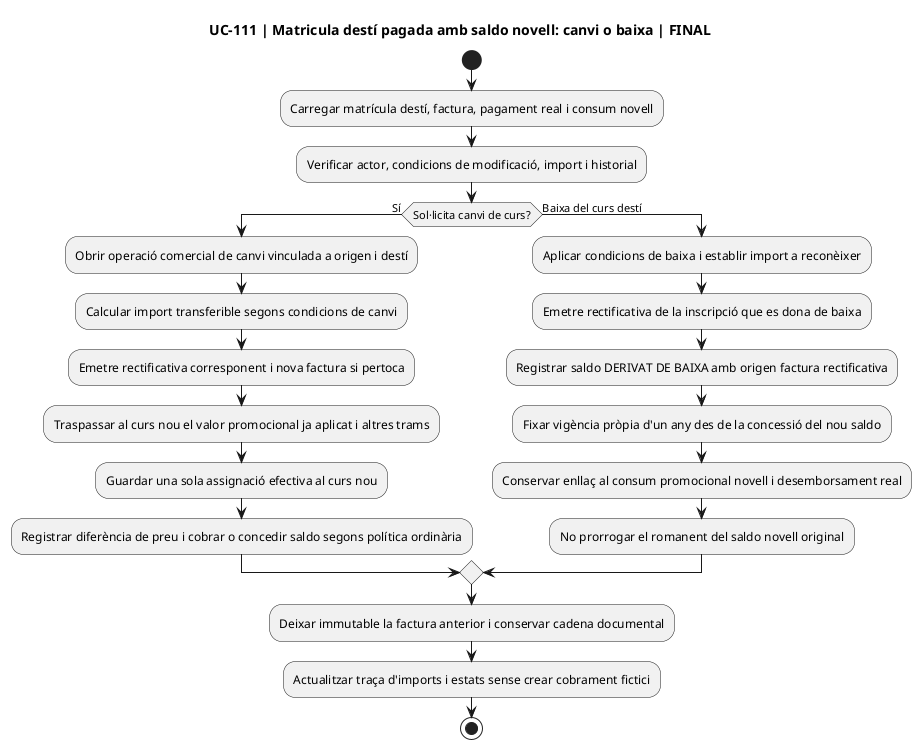
```plantuml
@startuml
title UC-111 | Matricula destí pagada amb saldo novell: canvi o baixa | FINAL
start
:Carregar matrícula destí, factura, pagament real i consum novell;
:Verificar actor, condicions de modificació, import i historial;
if (Sol·licita canvi de curs?) then (Sí)
 :Obrir operació comercial de canvi vinculada a origen i destí;
 :Calcular import transferible segons condicions de canvi;
 :Emetre rectificativa corresponent i nova factura si pertoca;
 :Traspassar al curs nou el valor promocional ja aplicat i altres trams;
 :Guardar una sola assignació efectiva al curs nou;
 :Registrar diferència de preu i cobrar o concedir saldo segons política ordinària;
else (Baixa del curs destí)
 :Aplicar condicions de baixa i establir import a reconèixer;
 :Emetre rectificativa de la inscripció que es dona de baixa;
 :Registrar saldo DERIVAT DE BAIXA amb origen factura rectificativa;
 :Fixar vigència pròpia d'un any des de la concessió del nou saldo;
 :Conservar enllaç al consum promocional novell i desemborsament real;
 :No prorrogar el romanent del saldo novell original;
endif
:Deixar immutable la factura anterior i conservar cadena documental;
:Actualitzar traça d'imports i estats sense crear cobrament fictici;
stop
@enduml
```

**Selecció fiscal verificada (no fixar R2):** R2 identifica concurs de creditors (art. 80.Tres LIVA); S és modalitat per substitució i I, per diferències, independents del motiu R1/R2/R3/R4/R5. La resolució d'operacions i alteracions de preu de l'art. 80.Dos LIVA són causes de R1 si aquest és el motiu real; R4 inclou errors no monetaris i altres supòsits; per rectificar factura simplificada considerar R5. El SIF classificarà cada rectificativa segons causa, factura original i imports, no per la paraula «canvi de curs». [AEAT, procediments de facturació (FAQ 21/07/2026)](https://sede.agenciatributaria.gob.es/Sede/ca_es/iva/sistemas-informaticos-facturacion-verifactu/preguntas-frecuentes/procedimientos-facturacion.html) · [RD 1619/2012, art. 15](https://www.boe.es/buscar/act.php?id=BOE-A-2012-14696#a15).

**Proves proposades, NO EXECUTADES:** segon JASOM d'una persona ja beneficiària (sense segon dret), canvi de destí amb preu igual/superior/inferior, baixa de destí amb saldo novell gastat parcialment, nova vigència d'un any sense modificar l'original, devolució posterior de JASOM amb saldo derivat encara disponible, doble click/reintent i canvi concurrent amb consum del saldo.
### 4.3 sexies. Devolució encadenada: baixa destí i retorn posterior de JASOM — FINAL acordat

**Decisió CONFIRMADA (22/09/2026):** quan un consum promocional ha passat a ser un SALDO DERIVAT de baixa del curs de destinació, un retorn posterior del pagament de JASOM no genera reclamació duplicada pel consum anterior. Cal bloquejar el valor disponible del saldo derivat i reclamar **només** la seva part reutilitzada. Exemple: saldo novell inicial 90 €, aplicació 90 € a un curs, baixa amb rectificativa i nou saldo de baixa 90 €, nova aplicació 40 € i disponible 50 €: retornar JASOM implica cancel·lar 50 € i reclamar 40 €, **no** reclamar simultàniament els primers 90 €. Si hi ha romanent de la promoció novell original també s'anul·la sense solapar trams.

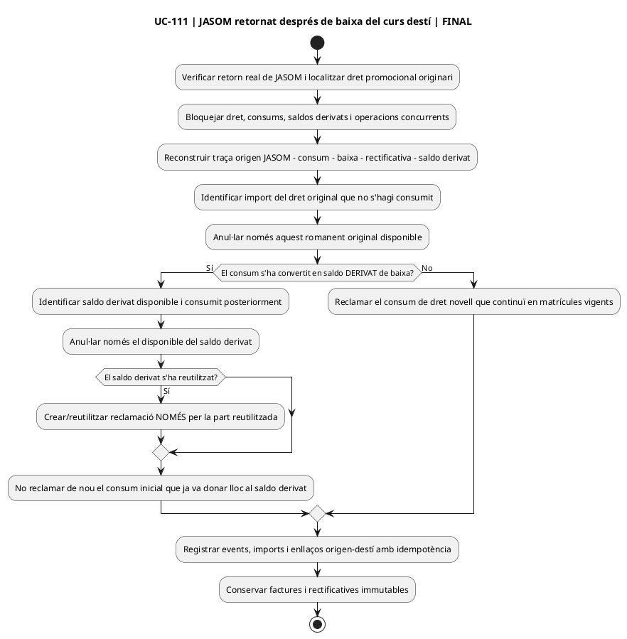
```plantuml
@startuml
title UC-111 | JASOM retornat després de baixa del curs destí | FINAL
start
:Verificar retorn real de JASOM i localitzar dret promocional originari;
:Bloquejar dret, consums, saldos derivats i operacions concurrents;
:Reconstruir traça origen JASOM - consum - baixa - rectificativa - saldo derivat;
:Identificar import del dret original que no s'hagi consumit;
:Anul·lar només aquest romanent original disponible;
if (El consum s'ha convertit en saldo DERIVAT de baixa?) then (Sí)
 :Identificar saldo derivat disponible i consumit posteriorment;
 :Anul·lar només el disponible del saldo derivat;
 if (El saldo derivat s'ha reutilitzat?) then (Sí)
  :Crear/reutilitzar reclamació NOMÉS per la part reutilitzada;
 endif
 :No reclamar de nou el consum inicial que ja va donar lloc al saldo derivat;
else (No)
 :Reclamar el consum de dret novell que continuï en matrícules vigents;
endif
:Registrar events, imports i enllaços origen-destí amb idempotència;
:Conservar factures i rectificatives immutables;
stop
@enduml
```

**Límit del diagrama:** un import retornat només es pot anul·lar o reclamar una vegada. Si el saldo derivat també s'ha reutilitzat en un curs posterior, cal traçar qualsevol canvi/baixa addicional abans de determinar l'import net pendent. El calendari de festius del còmput documental s'ha de concretar per configuració, no queda definit com a festius d'una localitat determinada en la resposta de negoci.
### 4.3 septies. SIF desenvolupat en branca: preparar expedient, projectar decisió, conciliar fraccions i concedir

**ESTAT REAL D'AQUEST DIAGRAMA:** `NovicePromotionEnrollmentStager` i `NovicePromotionSecretaryDecisionProjector` són classes PHP internes preparades, però **encara no s'invoquen des del formulari d'inscripció ni des de l'acció autenticada real de secretaria**; tampoc no està connectada la porta del servidor que ha d'impedir obrir la intenció de Redsys quan `VALIDAT=0`. L'enllaç `NovicePromotionInvoiceLinkService` i la concessió sí estan cablejats al handler/worker de factura del canal CURS en la branca, després del commit d'`InvoiceService`, però **NO hi ha proves MySQL/TPV executades ni desplegament**. `NOT_STAGED` no significa absència de sol·licitud novell: cal distingir la matrícula sense sol·licitud de la manca de projecció abans de marcar cap circuit com a acabat.

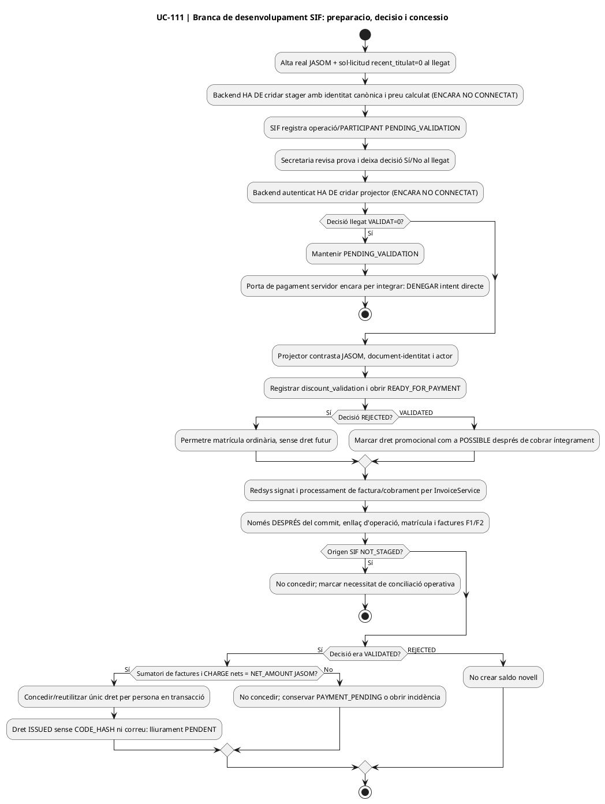
```plantuml
@startuml
title UC-111 | Branca de desenvolupament SIF: preparacio, decisio i concessio
start
:Alta real JASOM + sol·licitud recent_titulat=0 al llegat;
:Backend HA DE cridar stager amb identitat canònica i preu calculat (ENCARA NO CONNECTAT);
:SIF registra operació/PARTICIPANT PENDING_VALIDATION;
:Secretaria revisa prova i deixa decisió Sí/No al llegat;
:Backend autenticat HA DE cridar projector (ENCARA NO CONNECTAT);
if (Decisió llegat VALIDAT=0?) then (Sí)
 :Mantenir PENDING_VALIDATION;
 :Porta de pagament servidor encara per integrar: DENEGAR intent directe;
 stop
endif
:Projector contrasta JASOM, document-identitat i actor;
:Registrar discount_validation i obrir READY_FOR_PAYMENT;
if (Decisió REJECTED?) then (Sí)
 :Permetre matrícula ordinària, sense dret futur;
else (VALIDATED)
 :Marcar dret promocional com a POSSIBLE després de cobrar íntegrament;
endif
:Redsys signat i processament de factura/cobrament per InvoiceService;
:Només DESPRÉS del commit, enllaç d'operació, matrícula i factures F1/F2;
if (Origen SIF NOT_STAGED?) then (Sí)
 :No concedir; marcar necessitat de conciliació operativa;
 stop
endif
if (Decisió era VALIDATED?) then (Sí)
 if (Sumatori de factures i CHARGE nets = NET_AMOUNT JASOM?) then (Sí)
  :Concedir/reutilitzar únic dret per persona en transacció;
  :Dret ISSUED sense CODE_HASH ni correu: lliurament PENDENT;
 else (No)
  :No concedir; conservar PAYMENT_PENDING o obrir incidència;
 endif
else (REJECTED)
 :No crear saldo novell;
endif
stop
@enduml
```

**Camps i enllaços:** `commercial_operation.SOURCE_ID=inscripcions.ID`; `commercial_operation_party.PARTY_KEY` identifica de manera canònica una persona; `discount_validation` desa decisió de secretaria; `fact_rels` vincula **totes** les factures d'origen de la matrícula sense sumar duplicadament la mateixa factura; `commercial_operation.UUID_FACTURA` manté la primera factura d'origen com a referència; `novice_promotion_grant.UUID_FACTURA` n'és una referència principal i `commercial_entitlement.RULE_SNAPSHOT_JSON.origin_invoice_refs` permet reconstruir el conjunt immutable del moment de la concessió. No duplicar CHARGE ni modificar les factures originals.

**Talls encara bloquejants:** resolutor d'identitat estable per garantir «una vegada per persona»; connexió dels serveis d'alta i secretaria amb accions autenticades; porta prèvia a Redsys; política fiscal global de factures per fracció; credencials i documents personals del llegat públic; conciliació de casos `NOT_STAGED`; codi bescanviable/notificació amb reintents; consum/cancel·lació i saldos derivats. [Auditoria detallada i proves preparades](00-auditoria-circuit-cobrament-promocio-novell-2026-09-22.md).
### 4.3 octies. Preparació del codi, reserva de lliurament i recuperació d'intents — BRANCA, NO DESPLEGAT

**ESTAT:** [NovicePromotionCodePreparationService](../../sif/src/Service/NovicePromotionCodePreparationService.php) registra un únic codi xifrat i hash de bescanvi; [NovicePromotionDeliveryAttemptService](../../sif/src/Service/NovicePromotionDeliveryAttemptService.php) registra només les reclamacions d'intent. **No existeix encara el mailer, l'acreditació real del control de l'adreça, el formulari de bescanvi ni el consum del saldo; cap codi real no ha estat enviat.**

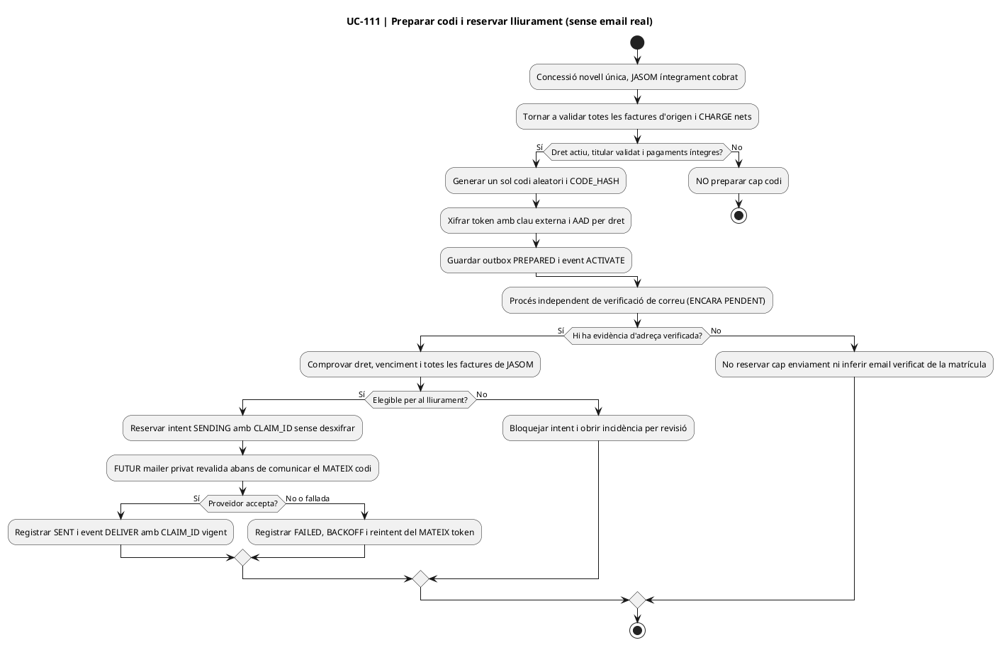
```plantuml
@startuml
title UC-111 | Preparar codi i reservar lliurament (sense email real)
start
:Concessió novell única, JASOM íntegrament cobrat;
:Tornar a validar totes les factures d'origen i CHARGE nets;
if (Dret actiu, titular validat i pagaments íntegres?) then (Sí)
 :Generar un sol codi aleatori i CODE_HASH;
 :Xifrar token amb clau externa i AAD per dret;
 :Guardar outbox PREPARED i event ACTIVATE;
else (No)
 :NO preparar cap codi;
 stop
endif
:Procés independent de verificació de correu (ENCARA PENDENT);
if (Hi ha evidència d'adreça verificada?) then (Sí)
 :Comprovar dret, venciment i totes les factures de JASOM;
 if (Elegible per al lliurament?) then (Sí)
  :Reservar intent SENDING amb CLAIM_ID sense desxifrar;
  :FUTUR mailer privat revalida abans de comunicar el MATEIX codi;
  if (Proveïdor accepta?) then (Sí)
   :Registrar SENT i event DELIVER amb CLAIM_ID vigent;
  else (No o fallada)
   :Registrar FAILED, BACKOFF i reintent del MATEIX token;
  endif
 else (No)
  :Bloquejar intent i obrir incidència per revisió;
 endif
else (No)
 :No reservar cap enviament ni inferir email verificat de la matrícula;
endif
stop
@enduml
```

**Límit de la traça:** `SENT` significa acceptació del proveïdor, no lliurament efectiu a l'alumne. Una caiguda després d'una acceptació però abans de registrar-la pot comportar un segon correu amb el **mateix codi**, però no una segona concessió; les reclamacions obsoletes no poden registrar un resultat nou. Després d'una cancel·lació o devolució caldrà també impedir la redempció, encara que un missatge ja hagi sortit. La comprovació immediata prèvia al MAILER i a cada CONSUM està pendent.
### 4.3 nonies. Confirmació de la bústia i worker privat de correu — SISÈ TALL, NO CONNECTAT

**Estat d'implementació:** serveis PHP interns `NovicePromotionEmailVerificationService`, `NovicePromotionDeliveryAttemptService` (reserva i recuperació de l'intent), `NovicePromotionSealedCodeDecoder` i `NovicePromotionPrivateMailWorker` programats en branca. Només hi ha **interfícies**, no adaptadors SMTP, endpoints de sessió, configuració de claus, ni execució programada del worker. Cap mail promocional s'ha enviat. Les proves MySQL estan ajornades expressament.

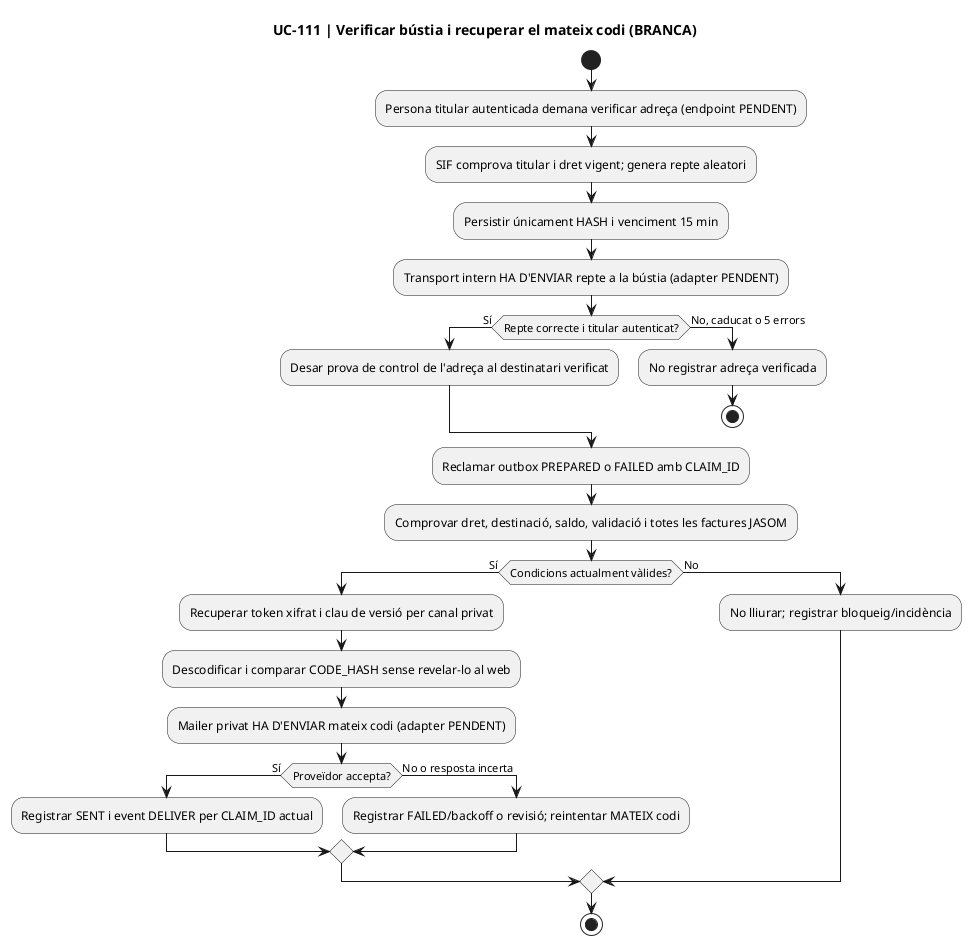
```plantuml
@startuml
title UC-111 | Verificar bústia i recuperar el mateix codi (BRANCA)
start
:Persona titular autenticada demana verificar adreça (endpoint PENDENT);
:SIF comprova titular i dret vigent; genera repte aleatori;
:Persistir únicament HASH i venciment 15 min;
:Transport intern HA D'ENVIAR repte a la bústia (adapter PENDENT);
if (Repte correcte i titular autenticat?) then (Sí)
 :Desar prova de control de l'adreça al destinatari verificat;
else (No, caducat o 5 errors)
 :No registrar adreça verificada;
 stop
endif
:Reclamar outbox PREPARED o FAILED amb CLAIM_ID;
:Comprovar dret, destinació, saldo, validació i totes les factures JASOM;
if (Condicions actualment vàlides?) then (Sí)
 :Recuperar token xifrat i clau de versió per canal privat;
 :Descodificar i comparar CODE_HASH sense revelar-lo al web;
 :Mailer privat HA D'ENVIAR mateix codi (adapter PENDENT);
 if (Proveïdor accepta?) then (Sí)
  :Registrar SENT i event DELIVER per CLAIM_ID actual;
 else (No o resposta incerta)
  :Registrar FAILED/backoff o revisió; reintentar MATEIX codi;
 endif
else (No)
 :No lliurar; registrar bloqueig/incidència;
endif
stop
@enduml
```

**Límit de coherència:** el dret cancel·lat/retornat ha de ser rebutjat també al moment de cada bescanvi; el bloqueig previ a l'enviament no resol una devolució posterior. `SENT` és acceptació del proveïdor, no recepció ni lectura. Un reintent pot repetir un correu sense recrear el token ni el saldo. [Auditoria del sisè tall](00-auditoria-circuit-cobrament-promocio-novell-2026-09-22.md).
### 4.3 decies. Consum parcial d'un únic saldo promocional — codi intern preparat, connector checkout PENDENT

**Estat real:** [migració 000012 · aplicació per matrícula](../../sif/database/migrations/2026_09_25_000012_add_novice_promotion_application.sql), [NovicePromotionRedemptionService](../../sif/src/Service/NovicePromotionRedemptionService.php) i [NovicePromotionAmountPolicy](../../sif/src/Domain/NovicePromotionAmountPolicy.php) implementats EN BRANCA. No hi ha encara connexió al formulari del curs de DESTINACIÓ, a l'acció autenticada de bescanvi, al motor de preus final ni a l'emissor de factures; cap consum real acreditat. Els estats i fluxos descriuen comportament del codi escrit que cal integrar, no un circuit desplegat. Proves MySQL ajornades expressament.

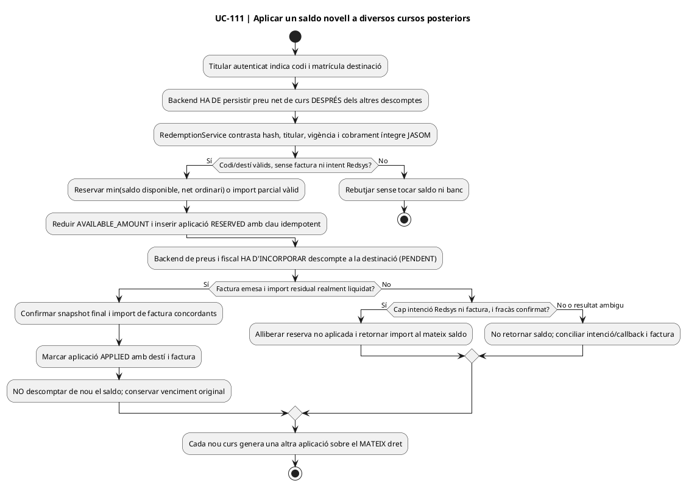
```plantuml
@startuml
title UC-111 | Aplicar un saldo novell a diversos cursos posteriors
start
:Titular autenticat indica codi i matrícula destinació;
:Backend HA DE persistir preu net de curs DESPRÉS dels altres descomptes;
:RedemptionService contrasta hash, titular, vigència i cobrament íntegre JASOM;
if (Codi/destí vàlids, sense factura ni intent Redsys?) then (Sí)
 :Reservar min(saldo disponible, net ordinari) o import parcial vàlid;
 :Reduir AVAILABLE_AMOUNT i inserir aplicació RESERVED amb clau idempotent;
else (No)
 :Rebutjar sense tocar saldo ni banc;
 stop
endif
:Backend de preus i fiscal HA D'INCORPORAR descompte a la destinació (PENDENT);
if (Factura emesa i import residual realment liquidat?) then (Sí)
 :Confirmar snapshot final i import de factura concordants;
 :Marcar aplicació APPLIED amb destí i factura;
 :NO descomptar de nou el saldo; conservar venciment original;
else (No)
 if (Cap intenció Redsys ni factura, i fracàs confirmat?) then (Sí)
  :Alliberar reserva no aplicada i retornar import al mateix saldo;
 else (No o resultat ambigu)
  :No retornar saldo; conciliar intenció/callback i factura;
 endif
endif
:Cada nou curs genera una altra aplicació sobre el MATEIX dret;
stop
@enduml
```

**Límit especial de curs totalment cobert:** el registre de consum admet saldo que redueixi el net final a zero NOMÉS si el sistema fiscal emet una factura final vàlida de total zero i l'operació es considera liquidada sense crear un `CHARGE` bancari fictici. **Aquest emissor i la seva política fiscal encara no estan integrats ni acreditats.** El canvi/baixa de DESTINACIÓ no és `release` si existeix factura: cal traça fiscal i, quan pertoqui, saldo de baixa DERIVAT amb el seu propi venciment i rastreig de procedència, sense reobrir el dret inicial com si el consum no hagués existit. [Fitxa UC-111](../06-fitxes-funcionals/uc-111.md) · [UC-117](uc-117-cicle-vida-codi-dret-futur.md).
### 4.3 undecies. Canvi de destí, baixa amb saldo derivat i devolució posterior de JASOM — MODEL EN BRANCA

**Estat:** [migració 000013](../../sif/database/migrations/2026_09_25_000013_add_novice_promotion_lineage.sql), [NovicePromotionDestinationAdjustmentPolicy](../../sif/src/Domain/NovicePromotionDestinationAdjustmentPolicy.php) i [NovicePromotionLineagePolicy](../../sif/src/Domain/NovicePromotionLineagePolicy.php) programades. Les polítiques són CÀLCULS PURS; NO hi ha gestor fiscal de baixa/canvi, servei de concessió/consum derivat, mutació econòmica ni cancel·lació real del dret. Els registres pendents de revisió fiscal NO s'han de tractar com a codis gastables; les proves MySQL estan ajornades.

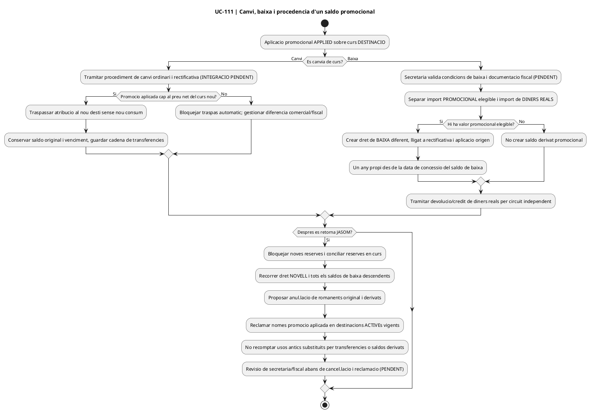
```plantuml
@startuml
title UC-111 | Canvi, baixa i procedencia d'un saldo promocional
start
:Aplicacio promocional APPLIED sobre curs DESTINACIO;
if (Es canvia de curs?) then (Canvi)
 :Tramitar procediment de canvi ordinari i rectificativa (INTEGRACIO PENDENT);
 if (Promocio aplicada cap al preu net del curs nou?) then (Si)
  :Traspassar atribucio al nou desti sense nou consum;
  :Conservar saldo original i venciment, guardar cadena de transferencies;
 else (No)
  :Bloquejar traspas automatic; gestionar diferencia comercial/fiscal;
 endif
else (Baixa)
 :Secretaria valida condicions de baixa i documentacio fiscal (PENDENT);
 :Separar import PROMOCIONAL elegible i import de DINERS REALS;
 if (Hi ha valor promocional elegible?) then (Si)
  :Crear dret de BAIXA diferent, lligat a rectificativa i aplicacio origen;
  :Un any propi des de la data de concessio del saldo de baixa;
 else (No)
  :No crear saldo derivat promocional;
 endif
 :Tramitar devolucio/credit de diners reals per circuit independent;
endif
if (Despres es retorna JASOM?) then (Si)
 :Bloquejar noves reserves i conciliar reserves en curs;
 :Recorrer dret NOVELL i tots els saldos de baixa descendents;
 :Proposar anul.lacio de romanents original i derivats;
 :Reclamar nomes promocio aplicada en destinacions ACTIVEs vigents;
 :No recomptar usos antics substituits per transferencies o saldos derivats;
 :Revisio de secretaria/fiscal abans de cancel.lacio i reclamacio (PENDENT);
endif
stop
@enduml
```

**Exemple DEC-23:** promoció JASOM 90 € → consum inicial 90 € → baixa rectificada del destí i dret derivat 90 € → nou consum 40 € i romanent derivat 50 € → si es retorna JASOM, proposar cancel·lar 50 € i recuperar 40 €; el consum inicial 90 € ja és antecedent del dret derivat, NO un segon import exigible. [Tretze tests unitaris purs](../../sif/tests/Unit/NovicePromotionLineagePolicyTest.php) i [set de política de baixa](../../sif/tests/Unit/NovicePromotionDestinationAdjustmentPolicyTest.php) només escrits. Les classes no construeixen factures rectificatives, no ordenen reintegraments bancaris i no executen plans de recuperació.
### 4.4. Intranet · Validar descomptes · apartat docent novell — subflux final pendent

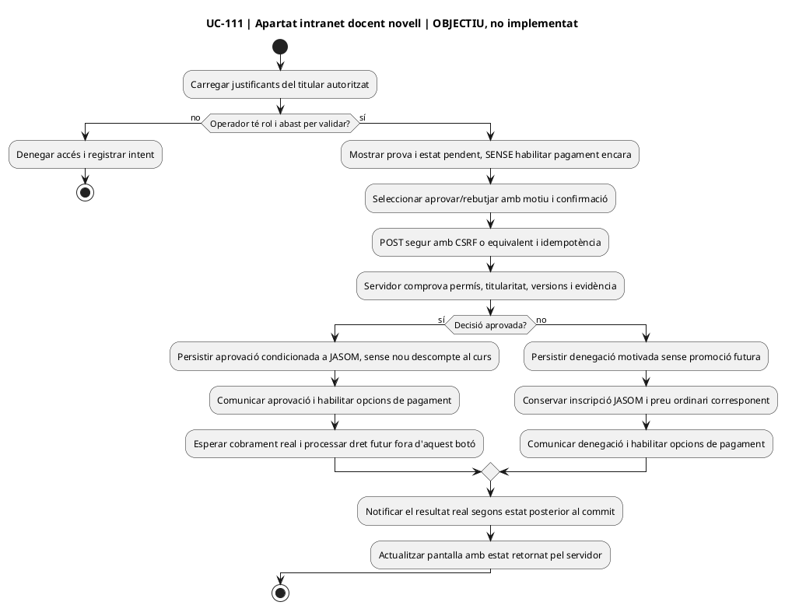
```plantuml
@startuml
title UC-111 | Apartat intranet docent novell | OBJECTIU, no implementat
start
:Carregar justificants del titular autoritzat;
if (Operador té rol i abast per validar?) then (no)
 :Denegar accés i registrar intent;
 stop
else (sí)
 :Mostrar prova i estat pendent, SENSE habilitar pagament encara;
 :Seleccionar aprovar/rebutjar amb motiu i confirmació;
 :POST segur amb CSRF o equivalent i idempotència;
 :Servidor comprova permís, titularitat, versions i evidència;
 if (Decisió aprovada?) then (sí)
  :Persistir aprovació condicionada a JASOM, sense nou descompte al curs;
  :Comunicar aprovació i habilitar opcions de pagament;
  :Esperar cobrament real i processar dret futur fora d'aquest botó;
 else (no)
  :Persistir denegació motivada sense promoció futura;
  :Conservar inscripció JASOM i preu ordinari corresponent;
  :Comunicar denegació i habilitar opcions de pagament;
 endif
 :Notificar el resultat real segons estat posterior al commit;
 :Actualitzar pantalla amb estat retornat pel servidor;
endif
stop
@enduml
```
