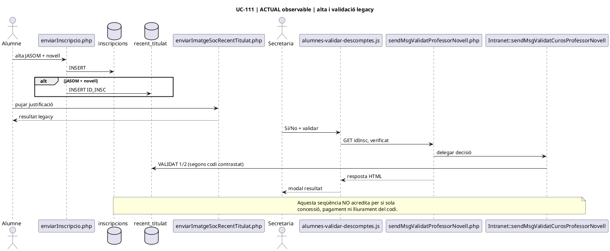
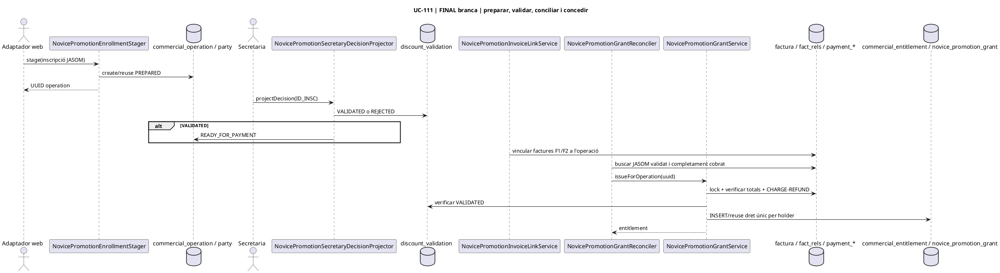
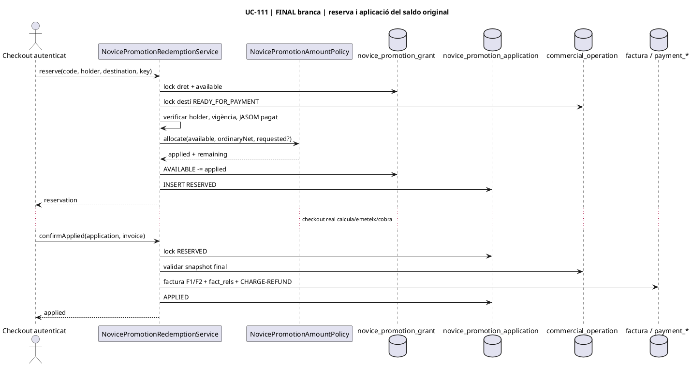
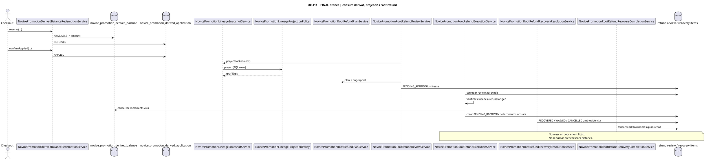

# UC-111 · Diagrames de seqüència ACTUAL / FINAL

**Objectiu:** representar l'ordre de missatges i persistència dels subfluxos UC-111 sense confondre el codi legacy amb els serveis SIF desenvolupats a la branca.

## 1. ACTUAL · alta web i decisió intranet observable



## 2. FINAL/branca · expedient, decisió, cobrament i concessió



## 3. FINAL/branca · preparar i lliurar codi

```plantuml
@startuml
title UC-111 | FINAL branca | codi xifrat, destinatari verificat i worker privat
participant NovicePromotionCodePreparationService as Prepare
database "commercial_entitlement / grant" as Right
database novice_promotion_code_outbox as Outbox
participant NovicePromotionEmailVerificationService as Verify
database novice_promotion_verified_recipient as Recipient
participant NovicePromotionDeliveryAttemptService as Delivery
participant NovicePromotionPrivateMailWorker as Worker
interface NovicePromotionMailTransportInterface as Mail

Prepare -> Right : lock i revalidar origen/JASOM
Prepare -> Prepare : generar NOV-* aleatori
Prepare -> Right : CODE_HASH + ACTIVE
Prepare -> Outbox : token xifrat + PREPARED
Verify -> Recipient : registrar email verificat
Worker -> Delivery : claim(entitlement)
Delivery -> Right : revalidar dret/origen
Delivery -> Outbox : SENDING + claim_id
Worker -> Delivery : loadClaimForPrivateMailer
Delivery --> Worker : token desxifrat només al worker
Worker -> Mail : send(token)
Mail --> Worker : accepted / failed
Worker -> Delivery : recordResult
Delivery -> Outbox : SENT o FAILED/backoff
note over Worker,Mail
  Transport real i autenticació de la
  verificació continuen pendents d'integració.
end note
@enduml
```

## 4. FINAL/branca · consum parcial del dret original



## 5. FINAL/branca · canvi/baixa i dret derivat

```plantuml
@startuml
title UC-111 | FINAL branca | canvi, baixa i saldo derivat
actor Secretaria
participant NovicePromotionCourseTransferReviewService as TransferReview
participant NovicePromotionFirstTransferConfirmationService as TransferConfirm
participant NovicePromotionSuccessiveTransferReviewService as NextReview
participant NovicePromotionSuccessiveTransferConfirmationService as NextConfirm
participant NovicePromotionDestinationCancellationReviewService as CancelReview
participant NovicePromotionTransferredDestinationCancellationReviewService as TransferCancelReview
participant NovicePromotionDerivedBalanceActivationService as Activate
participant NovicePromotionTransferredCancellationActivationService as TransferActivate
interface NovicePromotionAdjustmentApprovalSourceInterface as Approval
database novice_promotion_application_transfer as Transfer
database novice_promotion_derived_balance as Derived

alt Canvi primer destí
  Secretaria -> TransferReview : stage
  TransferReview -> Transfer : PENDING_FISCAL_REVIEW
  TransferConfirm -> Approval : approvedFirstTransfer
  Approval --> TransferConfirm : final APPROVED
  TransferConfirm -> Transfer : CONFIRMED
else Canvi successiu
  Secretaria -> NextReview : stageFromDerivedApplication / stageFromConfirmedTransfer
  NextReview -> Transfer : PENDING_FISCAL_REVIEW
  NextConfirm -> Approval : decisió successiva
  NextConfirm -> Transfer : CONFIRMED
else Baixa destí original
  Secretaria -> CancelReview : stageOriginalApplicationReview
  CancelReview -> Derived : PENDING_FISCAL_REVIEW
  Activate -> Approval : approvedCancellation
  Activate -> Derived : ACTIVE + nou venciment
else Baixa curs traspassat
  Secretaria -> TransferCancelReview : stageFirstTransferredDestinationReview
  TransferCancelReview -> Derived : PENDING amb SOURCE_UUID_TRANSFER
  TransferActivate -> Approval : approvedTransferredCancellation
  TransferActivate -> Transfer : CANCELLED / CONVERTED_TO_DERIVED
  TransferActivate -> Derived : ACTIVE + nou venciment
end
@enduml
```

## 6. FINAL/branca · consum derivat i devolució JASOM



## 7. Punts de tall transaccionals

| Seqüència | Punt de commit que no s'ha de travessar parcialment |
| --- | --- |
| concessió | validació de factures/cash + concessió única |
| preparació codi | hash al dret + outbox xifrat |
| reserva original/derivada | dèbit de saldo + fila RESERVED |
| confirmació aplicació | factura/cash final verificats + APPLIED |
| traspàs | tancar atribució anterior + confirmar nova atribució |
| baixa | tancar predecessor + activar dret derivat |
| root refund | freeze/review abans de conseqüències comercials; després recovery items auditables |

## 8. Estat

Aquestes seqüències reflecteixen el codi actual de la branca i el llegat contrastat, però **no impliquen execució de MySQL ni desplegament**. Els connectors de sessió, secretaria, pricing, emissió fiscal, transport de correu i evidències externes continuen sent portes d'integració.

[Classes](uc-111-classes-actual-final.md) · [Activitats](uc-111-activitats-actual-final.md) · [Traçabilitat](uc-111-tracabilitat-implementacio.md)
