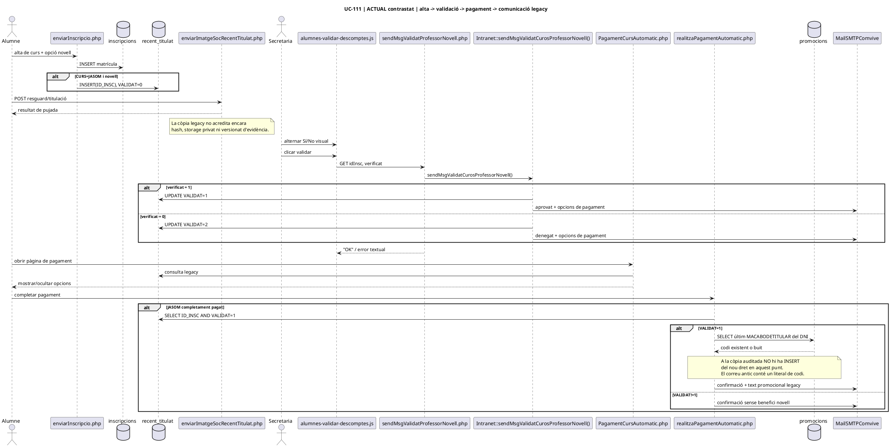
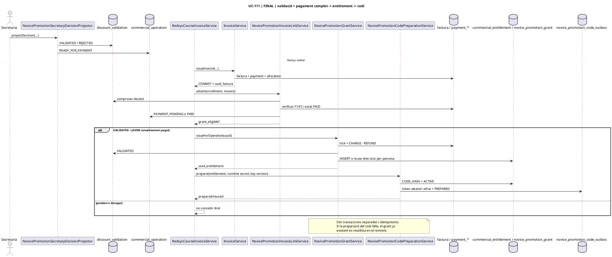
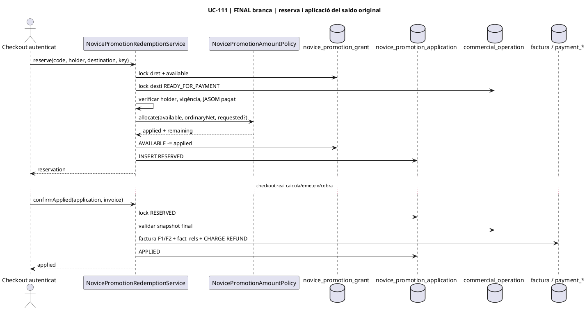

# UC-111 · Diagrames de seqüència ACTUAL / FINAL

**Objectiu:** representar l'ordre de missatges i persistència dels subfluxos UC-111 sense confondre el codi legacy amb els serveis SIF desenvolupats a la branca.

## 1. ACTUAL · seqüència completa contrastada



**Punt de fallada ACTUAL:** el lloc funcional correcte és el final del cobrament complet, després d'haver validat recent_titulat.VALIDAT=1; però el PHP legacy auditat només consulta promocions i no demostra una concessió nova idempotent.

## 2. FINAL implementat a la branca · pagament committed -> dret -> codi preparat



## 3. FINAL/branca · preparar i lliurar codi

```plantuml
@startuml
title UC-111 | FINAL branca | codi xifrat, destinatari verificat i worker privat
participant NovicePromotionCodePreparationService as Prepare
database "commercial_entitlement / grant" as Right
database novice_promotion_code_outbox as Outbox
participant NovicePromotionEmailVerificationService as Verify
database novice_promotion_verified_recipient as Recipient
participant NovicePromotionDeliveryAttemptService as Delivery
participant NovicePromotionPrivateMailWorker as Worker
interface NovicePromotionMailTransportInterface as Mail

Prepare -> Right : lock i revalidar origen/JASOM
Prepare -> Prepare : generar NOV-* aleatori
Prepare -> Right : CODE_HASH + ACTIVE
Prepare -> Outbox : token xifrat + PREPARED
Verify -> Recipient : registrar email verificat
Worker -> Delivery : claim(entitlement)
Delivery -> Right : revalidar dret/origen
Delivery -> Outbox : SENDING + claim_id
Worker -> Delivery : loadClaimForPrivateMailer
Delivery --> Worker : token desxifrat només al worker
Worker -> Mail : send(token)
Mail --> Worker : accepted / failed
Worker -> Delivery : recordResult
Delivery -> Outbox : SENT o FAILED/backoff
note over Worker,Mail
  Transport real i autenticació de la
  verificació continuen pendents d'integració.
end note
@enduml
```

## 4. FINAL/branca · consum parcial del dret original



## 5. FINAL/branca · canvi/baixa i dret derivat

```plantuml
@startuml
title UC-111 | FINAL branca | canvi, baixa i saldo derivat
actor Secretaria
participant NovicePromotionCourseTransferReviewService as TransferReview
participant NovicePromotionFirstTransferConfirmationService as TransferConfirm
participant NovicePromotionSuccessiveTransferReviewService as NextReview
participant NovicePromotionSuccessiveTransferConfirmationService as NextConfirm
participant NovicePromotionDestinationCancellationReviewService as CancelReview
participant NovicePromotionTransferredDestinationCancellationReviewService as TransferCancelReview
participant NovicePromotionDerivedApplicationCancellationReviewService as DerivedCancelReview
participant NovicePromotionDerivedBalanceActivationService as Activate
participant NovicePromotionTransferredCancellationActivationService as TransferActivate
participant NovicePromotionDerivedApplicationCancellationActivationService as DerivedActivate
interface NovicePromotionAdjustmentApprovalSourceInterface as Approval
database novice_promotion_application_transfer as Transfer
database novice_promotion_derived_balance as Derived
database novice_promotion_derived_application as DerivedApp

alt Canvi primer destí
  Secretaria -> TransferReview : stage
  TransferReview -> Transfer : PENDING_FISCAL_REVIEW
  TransferConfirm -> Approval : approvedFirstTransfer
  Approval --> TransferConfirm : final APPROVED
  TransferConfirm -> Transfer : CONFIRMED
else Canvi successiu
  Secretaria -> NextReview : stageFromDerivedApplication / stageFromConfirmedTransfer
  NextReview -> Transfer : PENDING_FISCAL_REVIEW
  NextConfirm -> Approval : approvedSuccessiveTransfer
  Approval --> NextConfirm : final APPROVED
  NextConfirm -> Transfer : predecessor històric + successor CONFIRMED
else Baixa destí original
  Secretaria -> CancelReview : stageOriginalApplicationReview
  CancelReview -> Derived : PENDING_FISCAL_REVIEW
  Activate -> Approval : approvedCancellation
  Approval --> Activate : final APPROVED
  Activate -> Derived : ACTIVE + nou venciment
else Baixa curs traspassat
  Secretaria -> TransferCancelReview : stageCurrentTransferredDestinationReview
  TransferCancelReview -> Derived : PENDING amb SOURCE_UUID_TRANSFER
  TransferActivate -> Approval : approvedTransferredCancellation
  Approval --> TransferActivate : final APPROVED
  TransferActivate -> Transfer : CANCELLED / CONVERTED_TO_DERIVED
  TransferActivate -> Derived : ACTIVE + nou venciment
else Baixa curs pagat amb saldo derivat
  Secretaria -> DerivedCancelReview : stageDerivedApplicationReview
  DerivedCancelReview -> Derived : child PENDING amb parent/source dapp
  DerivedActivate -> Approval : approvedDerivedApplicationCancellation
  Approval --> DerivedActivate : final APPROVED
  DerivedActivate -> DerivedApp : CONVERTED_TO_DERIVED
  DerivedActivate -> Derived : child ACTIVE + nou venciment
end
@enduml
```

**Tall actual:** primer canvi, canvis successius i baixes amb origen aplicació original, `derived_application.APPLIED` o **qualsevol últim transfer confirmat sense successor** tenen servei de branca. En la baixa del transfer, la cadena es recorre fins identificar el dret promocional real que s'estava movent i es conserva com a parent si era derivat.
## 6. FINAL/branca · consum derivat i devolució JASOM

```plantuml
@startuml
title UC-111 | FINAL branca | consum derivat, projecció i root refund
actor Checkout
participant NovicePromotionDerivedBalanceRedemptionService as DerivedSpend
database novice_promotion_derived_balance as Balance
database novice_promotion_derived_application as DApp
participant NovicePromotionLineageSnapshotService as Snapshot
participant NovicePromotionLineageProjectionPolicy as Projection
participant NovicePromotionRootRefundPlanService as Plan
participant NovicePromotionRootRefundReviewService as Review
participant NovicePromotionRootRefundExecutionService as Execute
participant NovicePromotionRootRefundRecoveryResolutionService as Resolve
participant NovicePromotionRootRefundRecoveryCompletionService as Complete
interface NovicePromotionAdjustmentApprovalSourceInterface as Approval
interface NovicePromotionOriginRefundEvidenceSourceInterface as RefundEvidence
interface NovicePromotionRecoveryResolutionSourceInterface as RecoveryEvidence
database "refund review / recovery items" as Recovery

Checkout -> DerivedSpend : reserve(...)
DerivedSpend -> Balance : AVAILABLE -= amount
DerivedSpend -> DApp : RESERVED
alt factura/residual final correctes
  Checkout -> DerivedSpend : confirmApplied(...)
  DerivedSpend -> DApp : APPLIED
else fracàs segur abans d'intent/factura
  Checkout -> DerivedSpend : release(...)
  DerivedSpend -> Balance : restaurar import
  DerivedSpend -> DApp : RELEASED
end

Review -> Snapshot : projectLocked(root)
Snapshot -> Projection : project(SQL rows)
Projection --> Snapshot : graf lògic
Review -> Plan : plan + fingerprint
Review -> Recovery : PENDING_APPROVAL + freeze

Execute -> Approval : approvedRootRefund(review)
Approval --> Execute : final APPROVED
Execute -> RefundEvidence : confirmedOriginRefund(review)
RefundEvidence --> Execute : refund JASOM real acreditat
Execute -> Recovery : revalidar plan/fingerprint
Execute -> Balance : cancel·lar romanents vius
Execute -> Recovery : EXECUTED + PENDING_RECOVERY pels usos actuals

Resolve -> RecoveryEvidence : evidència recovery / waiver / cancel·lació
RecoveryEvidence --> Resolve : resolució verificada
Resolve -> Recovery : RECOVERED / WAIVED / CANCELLED
Complete -> Recovery : RECOVERY_RESOLVED quan tots estan tancats
note over Execute,Recovery
  No crear un cobrament fictici.
  No reclamar predecessors històrics.
  El model final (000027) admet també
  APPROVED_WAITING_REFUND com a handoff,
  però el servei actual executa directament
  PENDING_APPROVAL -> EXECUTED quan ja té
  aprovació i refund d'origen confirmat.
end note
@enduml
```

## 7. Punts de tall transaccionals

| Seqüència | Punt de commit que no s'ha de travessar parcialment |
| --- | --- |
| concessió | validació de factures/cash + concessió única |
| preparació codi | hash al dret + outbox xifrat |
| reserva original/derivada | dèbit de saldo + fila RESERVED |
| confirmació aplicació | factura/cash final verificats + APPLIED |
| traspàs | tancar atribució anterior + confirmar nova atribució |
| baixa | tancar predecessor + activar dret derivat |
| root refund | freeze/review abans de conseqüències comercials; després recovery items auditables |

## 8. Estat

Aquestes seqüències reflecteixen el codi actual de la branca i el llegat contrastat, però **no impliquen execució de MySQL ni desplegament**. Els connectors de sessió, secretaria, pricing, emissió fiscal, transport de correu i evidències externes continuen sent portes d'integració.

[Classes](uc-111-classes-actual-final.md) · [Activitats](uc-111-activitats-actual-final.md) · [Dades i estats](uc-111-dades-estats-actual-final.md) · [Traçabilitat](uc-111-tracabilitat-implementacio.md)
