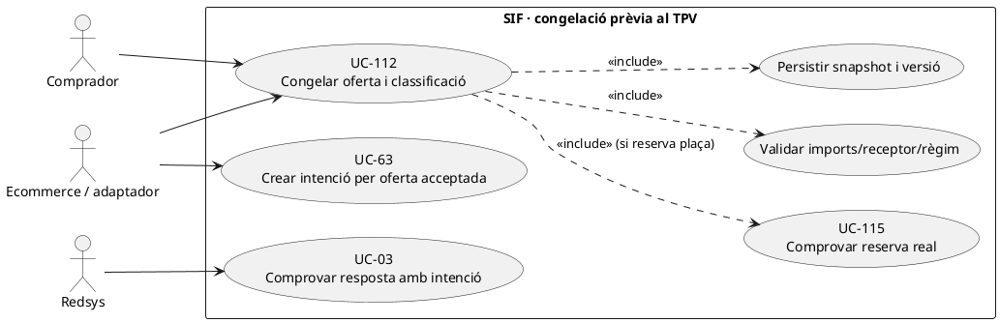
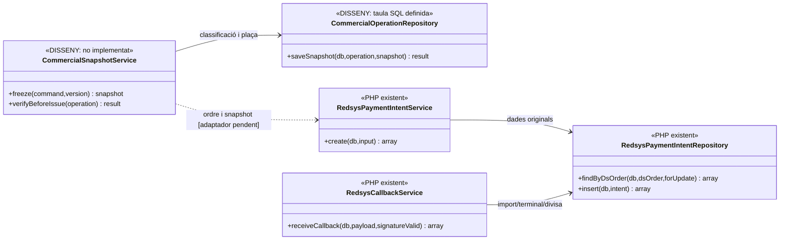

# UC-112 · Congelar preu, descompte, places i classificació fiscal abans del TPV

**Objectiu canònic:** abans de crear una intenció Redsys s'ha de persistir un snapshot **versionat** de producte, edició, places, import, descompte, pagador, receptor i tractament fiscal; el callback no recalcula dades vives. La fitxa base deixa pendent **quan es bloquegen plaça i preu, quant dura el snapshot i quina divergència obre incidència**.

**Codi comprovat:** `RedsysPaymentIntentService::create()` requereix un array `snapshot` no buit i serialitzable, desa `SNAPSHOT_JSON` amb `DS_ORDER`, `EXPECTED_AMOUNT`, `CURRENCY`, `TERMINAL`, `SOURCE_TYPE/ID`, `CREATED_BY` i `EXPIRES_AT`. Si es rep una altra petició amb **el mateix `DS_ORDER`**, compara import, origen, snapshot JSON canònic i altres dades i rebutja contradiccions. `RedsysCallbackService::assertMatchesIntent()` verifica **import, divisa i terminal** del callback, però **no comprova per si sol plaça, preu base, descompte ni classificació fiscal**. `commercial_operation` defineix `PRICE_SNAPSHOT_JSON`, `CAPACITY_SNAPSHOT_JSON` i `TAX_SNAPSHOT_JSON`; el writer comercial i la revisió integral del snapshot continuen pendents.

## 1. Fitxa específica

| Element | Contracte i límit |
| --- | --- |
| Actors | Canal de venda, comprador/pagador, responsable tècnica de classificació i worker de callback. Les dades fiscals provisionals del receptor no s'han de confondre amb les definitives per emetre. |
| Entrada congelada objectiu | `UUID_OPERATION`, producte/edició, participants, reserva/places, base/descompte/total amb regla i versió, pagador, receptor fiscal, tractament impositiu revisat, moneda, terminal i data/expiració de vigència de l'oferta. |
| Persistència real de la intenció | `redsys_payment_intent.SNAPSHOT_JSON`, `DS_ORDER`, `EXPECTED_AMOUNT`, `CURRENCY`, `TERMINAL`, origen i venciment opcional. `RedsysPaymentIntentService` **no imposa schema complet** del JSON per producte/places/descompte/receptor/impostos. |
| Persistència comercial definida, no executada | `commercial_operation.PRICE_SNAPSHOT_JSON`, `CAPACITY_SNAPSHOT_JSON`, `TAX_SNAPSHOT_JSON`, imports i `UUID_INTENT`. No afirmar que cada checkout escriu aquestes taules perquè existeixin les columnes. |
| Idempotència de la intenció | Mateix `DS_ORDER` amb snapshot/total/origen/terminal/venciment equivalents → reús; diferència → `SifException::conflict`. **No evita** per si sola dues vendes del mateix inscrit amb dues ordres diferents (UC-107). |
| Resposta de Redsys | `RedsysCallbackService` exigeix signatura validada, intenció existent i coincidència exacta d'import, divisa i terminal; només després desarà notificació i encuarà feina autoritzada. **No** reserva plaça ni comprova fiscalitat comercial en aquesta funció. |
| Efecte fiscal/econòmic | Congelar snapshot i crear intenció **no** equival a facturar, cobrar o inscriure. Només el registre de la resposta real/worker ha de generar el moviment monetari i la factura que corresponguin, segons classificació aprovada. |

### 1.1. Flux objectiu amb nucli TPV existent

1. El canal reuneix dades del producte/edició, titular de la plaça, quantitat, disponibilitat UC-115, receptor/pagador i règim fiscal que correspon. El servei de congelació **pendent** valida coherència de preu, descompte, impostos i dret de plaça a l'instant acceptat; no assumeix que el frontend sigui font autoritzada del total.
2. Desa el snapshot i la seva versió/hash en l'operació comercial, amb `UUID_OPERATION` i idempotència, i vincula qualsevol `UUID_CAPACITY_RESERVATION` realment confirmat. La migració admet aquests camps, però aquesta orquestració no està acreditada al PHP.
3. Un cop hi ha una oferta comercial validada, construeix l'entrada a `RedsysPaymentIntentService::create()` amb `DS_ORDER`, `SOURCE_TYPE/ID`, `EXPECTED_AMOUNT` i `SNAPSHOT_JSON`. El servei existent **sí** valida presència/serialització del snapshot, import positiu, moneda de tres caràcters i terminal.
4. Si es reutilitza la mateixa ordre, el servei compara snapshot canònic i la resta de dades; si són diferents, rebutja. Si s'ha modificat el preu comercial, el canal ha de decidir una **nova oferta/ordre autoritzada**, no reescriure la intenció anterior.
5. Redsys confirma o denega; `RedsysCallbackService` comprova import/divisa/terminal de la notificació signada contra la intenció i desa resultat/worker, sense recalcular els imports de l'edició viva.
6. El worker utilitza el snapshot congelat amb la política fiscal aprovada i el builder específic del tipus de producte. Si detecta manca de dades fiscals o plaça que no es pot confirmar, **no** ha d'inventar receptor, import o inscripció per «fer quadrar» un pagament real: incidència i reconciliació.
7. Una vegada confirmats factura i `UUID_PAYMENT`, l'import d'entrada real queda relacionat a `ID_INSC` via el ledger individual proposat, independentment dels imports de descompte que constin al snapshot.

### 1.2. Alternatives i riscos

| Cas | Efecte |
| --- | --- |
| Preu del curs canvia després de crear intenció | Conservació de l'oferta acceptada segons termini/regla; no reconstruir la factura amb el preu nou al callback. |
| Mateix `DS_ORDER` amb snapshot diferent | **Rebuig actual del PHP** a `RedsysPaymentIntentService`, no un reintent equivalent. |
| Dos `DS_ORDER` sobre la mateixa reserva | UC-107/115 ha d'evitar cobrament/inscripció dobles; comparar ordres no substitueix clau de negoci per alumne/edició. |
| Callback d'import/terminal/divisa diferent | `RedsysCallbackService` rebutja, sense considerar la notificació com a cobrament coincident. |
| Callback amb import coincident però receptor/places comercialment inconsistents | **Buit:** la comprovació de callback no revisa aquests camps; el worker/classificador i reserva han de detectar-ho. |
| Snapshot vençut i cobrament confirmat | No destruir l'ingrés real ni concedir plaça fictícia; reconciliar temporalitat, dret acadèmic i eventual devolució o nova oferta. |
| Un pagament de grup amb N inscripcions | Snapshot conté participants/quantitats explícits i un únic cobrament extern; els N imports interns no són N `CHARGE`. |

**Proves pendents:** schema de snapshot per canal/producte, versió i hashes, venciment, fiscalitat incompleta, reserva caducada, dos intents diferents, callback contradictori, preu canviat abans/després i correlació de fons per inscripció. No s'han executat proves en aquesta revisió.

### 1.3. Contingut comercial del snapshot i límit exacte del callback

**El JSON obligatori no té un esquema comercial obligatori.** `RedsysPaymentIntentService::create()` rebutja un `snapshot` buit/no serialitzable, però **no obliga** a incloure-hi `ID_INSC` de tots els participants, producte/edició, regla de descompte, versió del preu, `UUID_CAPACITY_RESERVATION`, receptor fiscal confirmat o classificació tributària. La validació de negoci ha d'efectuar-se **abans** de crear `DS_ORDER`: la comparació posterior de JSON canònic només prova que no s'ha substituït aquella fotografia per una altra, **no** que la primera fotografia fos completa o correcta.

**Canals amb composició diferent.** A `/alumnes/genera-factura-abans-pagar/`, el llegat permet escollir **diversos `ID_INSC`** del mateix curs/edició i una entitat receptora. En pack i grup, una mateixa intenció pot representar diverses línies/inscrits, amb descomptes o preus individuals; conservar-ne l'ordre i els imports acordats i evitar un `snapshot` reduït al primer `IDPAG`. Si ja existeix factura emesa abans de cobrar, el snapshot ha d'enllaçar-ne el `UUID_FACTURA` i el procés posterior ha de registrar **el cobrament**, sense tornar a emetre per recomputar línies a partir de dades vives.

**Comprovació real del callback.** `RedsysCallbackService::receiveAuthorizedCallback()` localitza la intenció per `DS_ORDER` i `assertMatchesIntent()` compara **EXPECTED_AMOUNT, CURRENCY i TERMINAL**; després registra la notificació i, si `VALIDATED`, encola el job. No compara en aquesta funció **data `EXPIRES_AT`**, estat de la reserva de plaça, versió de producte o receptor fiscal. Una notificació bancària signada i d'import correcte **no és una aprovació acadèmica ni comercial**: el worker/coordinador pendent ha de preservar el cobrament real i revisar disponibilitat/contracte, sobretot si l'edició s'ha cancel·lat o la reserva s'ha alliberat.

**Canvi de preu després de l'oferta.** El servei compara `EXPIRES_AT`, `SNAPSHOT_JSON`, import, origen i terminal per al **mateix `DS_ORDER`** i rebutja una variació. Això impedeix mutar una ordre, però **no impedeix** que el frontend n'obri una segona amb preu nou per la mateixa inscripció. UC-107/115/121 han de resoldre duplicat, dret de plaça i nova acceptació; no donar per caducada l'ordre primera només perquè existeixi la segona.

### 1.4. Proves de completesa i límits del callback (no executades)

| ID | Escenari | Resultat exigible |
| --- | --- | --- |
| SN-112-01 | JSON no buit que només conté un IDPAG però representa un grup | Validació comercial el rebutja fins identificar participants, imports i receptor; no acceptar la mera serialització. |
| SN-112-02 | Factura prèvia d'empresa amb `UUID_FACTURA` i intenció de pagament | Callback assignat a factura existent, no segon `issueInvoice()`. |
| SN-112-03 | Callback signat correcte per import però plaça alliberada | Conservar l'ingrés extern i obrir revisió de plaça, no donar matrícula per confirmada. |
| SN-112-04 | Mateix `DS_ORDER` amb preu/snapshot nou | Conflicte actual del servei d'intencions; no modificar la fotografia original. |
| SN-112-05 | Dos `DS_ORDER` amb la mateixa inscripció i versions de preu diferents | Detector funcional i decisió de vigència, no assumir deduplicació per la intenció. |

## 2. UML de casos d'ús



## 3. Classes — límit de la validació real i contracte pendent



## 4. Seqüència — snapshot immutable de venda i validació de resposta

```mermaid
sequenceDiagram
autonumber
actor A as Comprador
participant UI as Ecommerce [pendent]
participant S as CommercialSnapshotService [DISSENY]
participant O as commercial_operation [SQL]
participant Intent as RedsysPaymentIntentService [PHP]
participant R as RedsysPaymentIntentRepository [PHP]
participant Bank as Redsys
participant C as RedsysCallbackService [PHP]
A->>UI: Confirmar edició, places, receptor i preu final
UI->>S: freeze(producte,edició,imports,descomptes,règim)
S->>O: Guardar snapshots versionats i reserva [writer pendent]
S-->>UI: Oferta congelada i termini
UI->>Intent: create(DS_ORDER,EXPECTED_AMOUNT,SNAPSHOT_JSON,...)
Intent->>R: findByDsOrder(DS_ORDER)
alt Ordre existent amb snapshot o import diferent
 R-->>Intent: Intenció contradictòria
 Intent-->>UI: Conflicte; no reescriure l'original
else Nova ordre o reintent equivalent
 Intent->>R: insert(...) només si no existeix
 Intent-->>UI: UUID_INTENT PENDING/reutilitzada
 UI->>Bank: Redirigir al TPV
 Bank->>C: Resposta signada per DS_ORDER
 C->>R: findByDsOrder(...,FOR UPDATE)
 C->>C: Comparar import, divisa i terminal
 C-->>UI: VALIDATED + job / ERROR o rebuig
end
Note over S,C: La coincidència del callback no valida plaça/receptor/impostos del snapshot comercial.
```

## 5. Traçabilitat

[UC-112 original](../06-fitxes-funcionals/uc-112.md) · [UC-106 reserva](uc-106-crear-reserva-abans-pagament.md) · [UC-107 duplicat](uc-107-detectar-inscripcio-duplicada.md) · [UC-63 intenció](uc-063-crear-intencio-redsys.md) · [RedsysPaymentIntentService](../../sif/src/Service/RedsysPaymentIntentService.php) · [RedsysCallbackService](../../sif/src/Service/RedsysCallbackService.php) · [Migració operació/snapshots](../../sif/database/migrations/2026_09_16_000004_add_commercial_operation_and_fiscal_fields.sql).
