# UC-113 — Diagrames d'activitat d'alta manual i importador existent de matrícules en lot

**Revisió:** 22/09/2026; font PHP de `main` a `e71958b3026549bde09fb4b25f2ec3ba370937ec`; decisions de negoci confirmades a [fitxa UC-113](../06-fitxes-funcionals/uc-113.md). **No confondre:** importar matrícules en lot (existeix, codi concret pendent de mapar), crear una alta web, generar CSV per Moodle, importar el CSV al campus i canviar un curs a la intranet. Els diagrames de la web mostren les seccions funcionalment rellevants d'UC-113: no pretenen substituir els diagrames de totes les altres ofertes/variants del catàleg RM-037.

**Estats de font:** ACTUAL = comportament observat al PHP o confirmat per negoci; **L'IMPORTADOR EN LOT ESTÀ A LA INTRANET** segons negoci; la pàgina `cursos-inici-cursos-pujar-alumnes.php` i `Intranet::pujar_Inscripcions()` constitueixen components localitzats de la preparació de lots CSV, però encara cal verificar la correspondència completa amb l'importador de matrícules esmentat. ACTUAL — INTERIOR NO ACREDITAT = existeix el procés a la intranet segons negoci però no podem explicar-ne honestament totes les branques internes; FINAL OBJECTIU = especificació per adaptar i provar, **no** codi desplegat. No afirmar que l'importador funciona d'una manera no aportada per les fonts. Tots els diagrames separen el resultat acadèmic d'ingrés i factura.

## Índex de pàgines, apartats i frontera

| ID | Àmbit real | Apartats/activitats | Estat de traça |
| --- | --- | --- | --- |
| P113-01 | Web, inscripció curs / alta manual secretaria | Accés i curs, dades/preus excepcionals, alta i resultat | Alta web acreditada; mecanisme d'excepcions secretaria CONFIRMAT PER NEGOCI, codi específic no mapat. |
| P113-02 | Web, inscripció de grup | Responsables, participants i resultat per participant | Existència confirmada; diferenciar handlers de grup ordinari, amics i pack en el catàleg corresponent. |
| P113-03 | **Intranet: importador de matrícules en lot EXISTENT** | Entrada/execució i errors/repeticions; [pantalla de pujada d'alumnes](../../codi-drive/intranet-actual/cursos-inici-cursos-pujar-alumnes.php) i [mètode de generació de fila CSV](../../codi-drive/intranet-actual/Intranet.php#L4151-L4201) identificats per al recorregut de pujada. | Canal intranet confirmat; correspondència exacta de l'importador amb la preparació CSV i la seva càrrega final pendent d'acreditar: no inventar el parser. |
| P113-04 | Intranet, «Mostrar la informació de l'alumne > Canvi de curs» | Derivació a UC-026, **fora** del cas UC-113 | Acció confirmada; diagrames complets del canvi corresponden a UC-026. |

## Pàgines i apartats — activitats actuals i finals

### P113-01.A · Accés i tria de curs/edició a la web

**Fonts:** [`InscripcioCurs.php`](../../codi-drive/web-actual/InscripcioCurs.php), [`enviarInscripcio.php`](../../codi-drive/web-actual/ajax/enviarInscripcio.php), decisió de negoci sobre secretaria.

**ACTUAL**

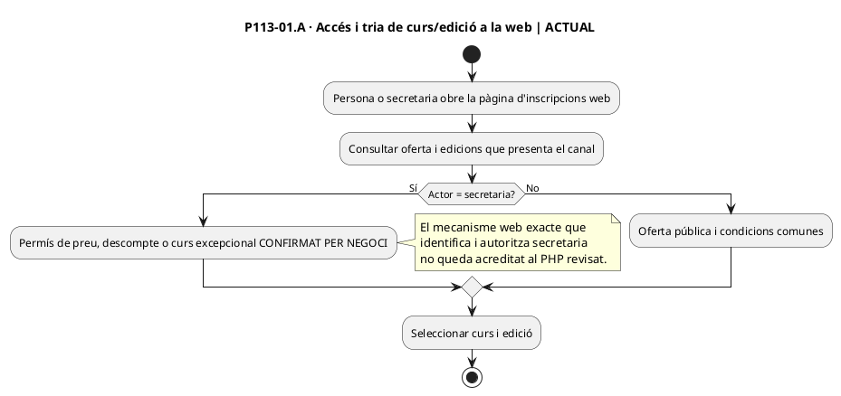

**FINAL / contracte d'adaptació**

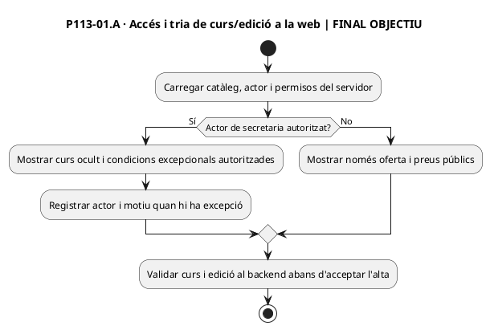

### P113-01.B · Formulari i condicions comercials

**Fonts:** [`InscripcioCurs.php`](../../codi-drive/web-actual/InscripcioCurs.php), [`enviarInscripcio.php`](../../codi-drive/web-actual/ajax/enviarInscripcio.php), decisió de negoci sobre secretaria.

**ACTUAL**

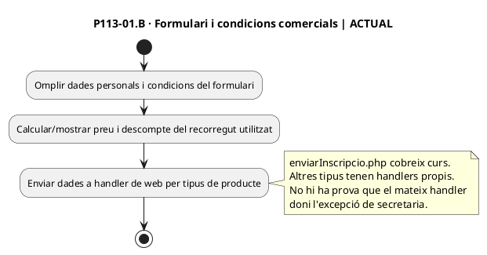

**FINAL / contracte d'adaptació**

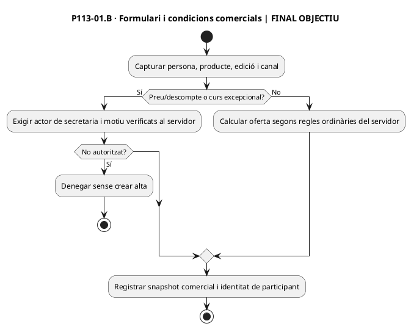

### P113-01.C · Enviament, persistència i resultat

**Fonts:** [`InscripcioCurs.php`](../../codi-drive/web-actual/InscripcioCurs.php), [`enviarInscripcio.php`](../../codi-drive/web-actual/ajax/enviarInscripcio.php), decisió de negoci sobre secretaria.

**ACTUAL**

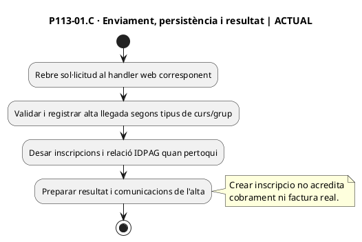

**FINAL / contracte d'adaptació**

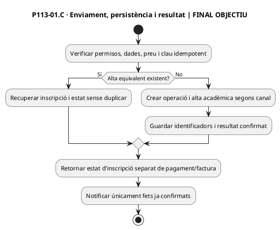

### P113-02.A · Inscripció de grup a la web

**Fonts:** [`mostrar_formulari_inscripcions_grup.php`](../../codi-drive/web-actual/ajax/mostrar_formulari_inscripcions_grup.php), [`DescompteAmic.php`](../../codi-drive/web-actual/DescompteAmic.php) únicament com a variant comprovable.

**ACTUAL**

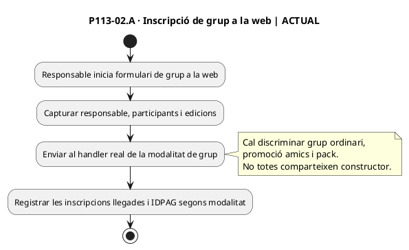

**FINAL / contracte d'adaptació**

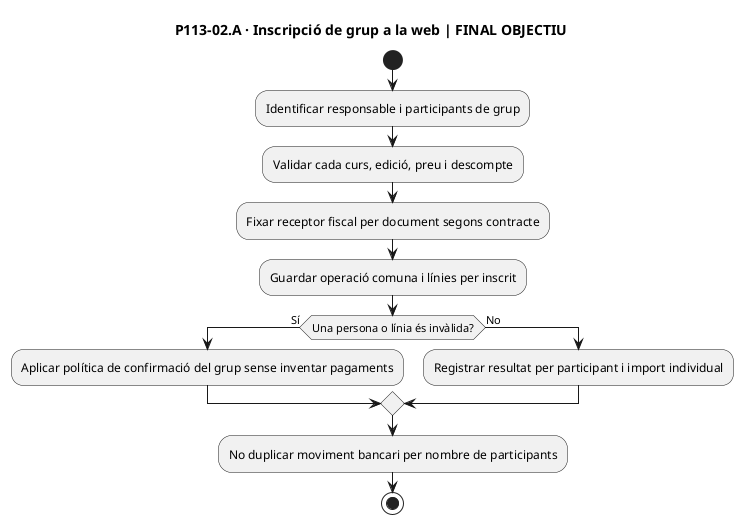

### P113-03.A · Importador existent: entrada i execució

**Fonts:** Confirmació de negoci que l'importador en lot existeix; implementació no identificada inequívocament en les fonts consultades.

**ACTUAL**

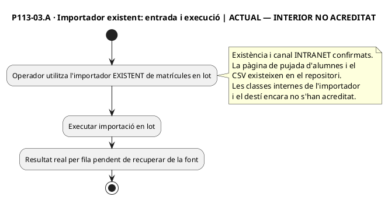

**FINAL / contracte d'adaptació**

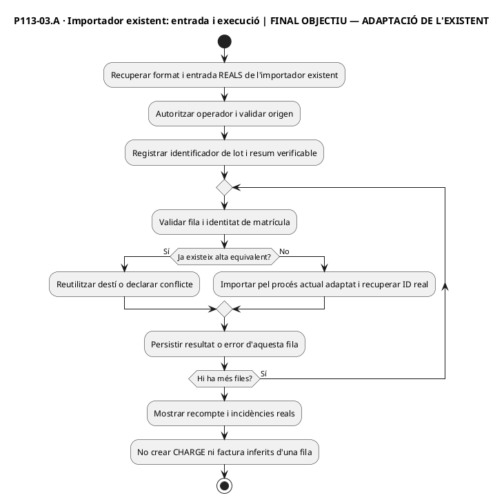

### P113-03.B · Lot repetit, error i represa

**Fonts:** Confirmació de negoci que l'importador en lot existeix; implementació no identificada inequívocament en les fonts consultades.

**ACTUAL**

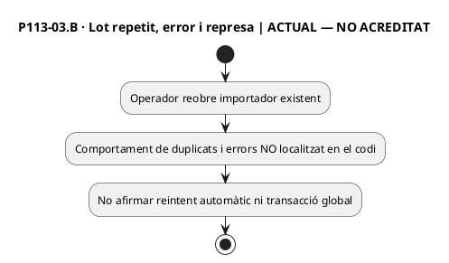

**FINAL / contracte d'adaptació**

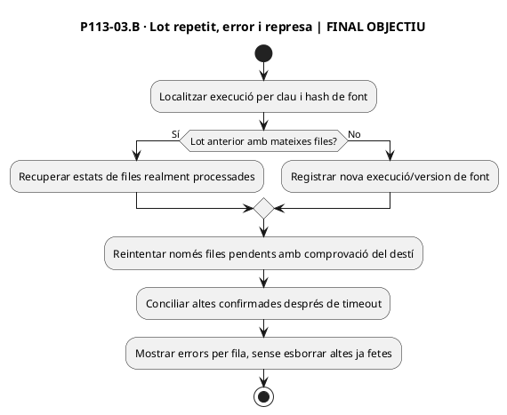

### P113-04.A · Canvi de curs / regularització DESVINCULADA d'UC-113

**Fonts:** [UC-026](uc-026-canviar-de-curs.md) i [`Intranet.php`](../../codi-drive/intranet-actual/Intranet.php), ubicació funcional confirmada per negoci.

**ACTUAL**

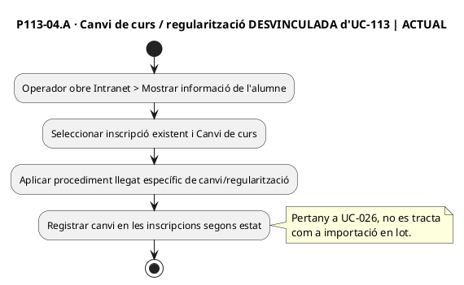

**FINAL / contracte d'adaptació**

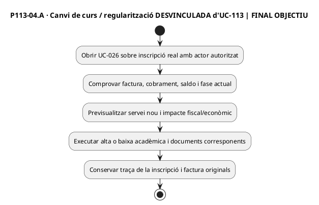

## Matriu de tancament documental i de proves

| Traça | Evidència per acceptar-ne el tancament |
| --- | --- |
| P113-01 | Ruta i permisos reals de secretaria, oferta extraordinària i validació servidor; captura completa de cada pantalla real del formulari. |
| P113-02 | Desglossar grup ordinari vs amics/pack i les seves pantalles reals; comprovar cada receptor, participant i import. |
| P113-03 | Localitzar i llegir codi/procediment real de l'importador EXISTENT, mostrar format de dades anonimitzat i flux intern actual per cada apartat abans de substituir el seu diagrama de frontera per un diagrama complet. |
| P113-04 | Remetre a diagrames propis d'UC-026; no sumar-lo erròniament a importació. |
| Tot el cas | Tests [113-AT-01–10](../06-fitxes-funcionals/uc-113.md#9-proves-dacceptació-per-executar-no-resultats), autoritzacions i absència de cobraments/factures inventats. **NO EXECUTATS**. |

**Resultat honest:** el contracte funcional de la part confirmada està escrit. **No és possible certificar un diagrama d'activitat ACTUAL complet de l'importador només a partir de la seva existència:** cal verificar-ne l'artefacte executable o un procediment que descrigui les branques internes. Això és una feina de recuperació de codi/traça, no una nova pregunta genèrica a la usuària.
