# UC-113 — Diagrames d'activitat d'alta manual i importador existent de matrícules en lot

**Revisió:** 22/09/2026, codi `main` a `e71958b3026549bde09fb4b25f2ec3ba370937ec`; decisions de [fitxa UC-113](../06-fitxes-funcionals/uc-113.md). **Identificació resolta:** Meriem ha aportat la URL exacta de l'«importador de matrícules en lot», https://intranet.prisma.cat/cursos/inici-cursos/generar-fitxer-pujada-alumnes/ . El codi d'aquesta pantalla de la intranet genera el CSV de pujada d'**inscripcions ja existents a PrisMa**; no es tracta d'una caixa negra ni demostra cap parser separat que creï altes noves a la BD web. Per decisió de negoci, les activitats de la URL es detallen com a **cas propi** [amb diagrames de pàgina completa i de tots els apartats ACTUAL/FINAL](uc-moodle-pujada-alumnes-fitxa-activitats.md); l'alta web d'UC-113 i el canvi de curs UC-026 es mantenen com a accions diferents. La càrrega real posterior a Moodle no és observable en el PHP d'aquesta URL.

## Índex de pàgines, apartats i frontera

| ID | Àmbit real | Apartats/activitats | Estat de traça |
| --- | --- | --- | --- |
| P113-01 | Web, inscripció curs / alta manual secretaria | Accés i curs, dades/preus excepcionals, alta i resultat | Alta web acreditada; mecanisme d'excepcions secretaria CONFIRMAT PER NEGOCI, codi específic no mapat. |
| P113-02 | Web, inscripció de grup | Responsables, participants i resultat per participant | Existència confirmada; diferenciar handlers de grup ordinari, amics i pack en el catàleg corresponent. |
| P113-03 | [Intranet: URL exacta «Generar fitxer pujada alumnes»](uc-moodle-pujada-alumnes-fitxa-activitats.md) | Preparar CSV en lot de matrícules prèvies i modificar INSC CURS/GRUP; NO crear una inscripció nova. | URL, PHP/JS i endpoints acreditats. Cas d'ús de pujada **separat** d'UC-113 i del d'aula oberta; 2 diagrames de pàgina completa i 12 d'apartats al seu document. |
| P113-04 | Intranet, «Mostrar la informació de l'alumne > Canvi de curs» | Derivació a UC-026, **fora** del cas UC-113 | Acció confirmada; diagrames complets del canvi corresponden a UC-026. |

## Pàgines i apartats — activitats actuals i finals

### P113-01.A · Accés i tria de curs/edició a la web

**Fonts:** [`InscripcioCurs.php`](../../codi-drive/web-actual/InscripcioCurs.php), [`enviarInscripcio.php`](../../codi-drive/web-actual/ajax/enviarInscripcio.php), decisió de negoci sobre secretaria.

**ACTUAL**

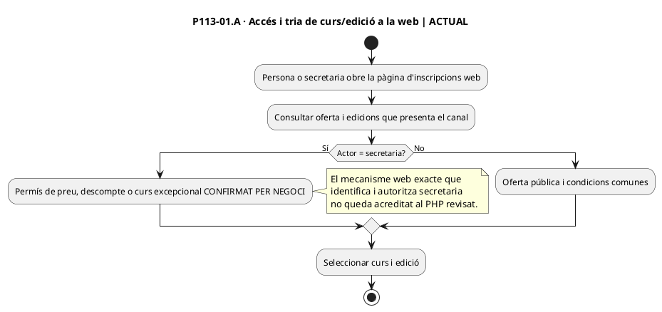

**FINAL / contracte d'adaptació**

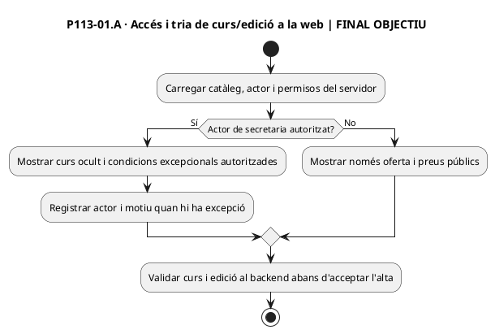

### P113-01.B · Formulari i condicions comercials

**Fonts:** [`InscripcioCurs.php`](../../codi-drive/web-actual/InscripcioCurs.php), [`enviarInscripcio.php`](../../codi-drive/web-actual/ajax/enviarInscripcio.php), decisió de negoci sobre secretaria.

**ACTUAL**

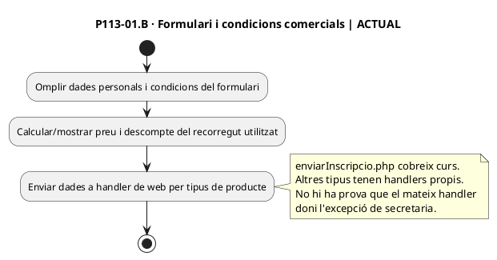

**FINAL / contracte d'adaptació**

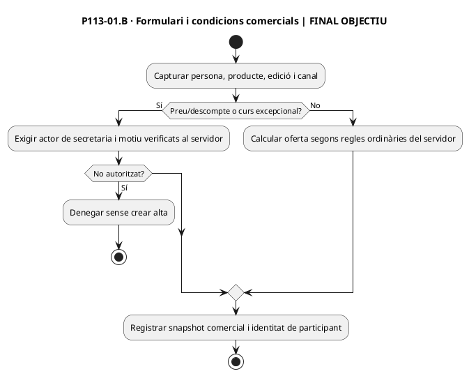

### P113-01.C · Enviament, persistència i resultat

**Fonts:** [`InscripcioCurs.php`](../../codi-drive/web-actual/InscripcioCurs.php), [`enviarInscripcio.php`](../../codi-drive/web-actual/ajax/enviarInscripcio.php), decisió de negoci sobre secretaria.

**ACTUAL**

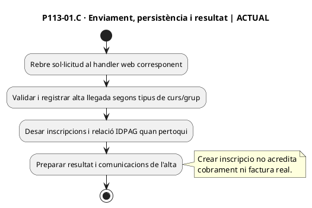

**FINAL / contracte d'adaptació**

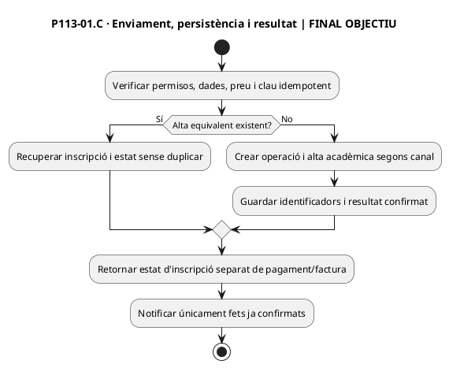

### P113-02.A · Inscripció de grup a la web

**Fonts:** [`mostrar_formulari_inscripcions_grup.php`](../../codi-drive/web-actual/ajax/mostrar_formulari_inscripcions_grup.php), [`DescompteAmic.php`](../../codi-drive/web-actual/DescompteAmic.php) únicament com a variant comprovable.

**ACTUAL**

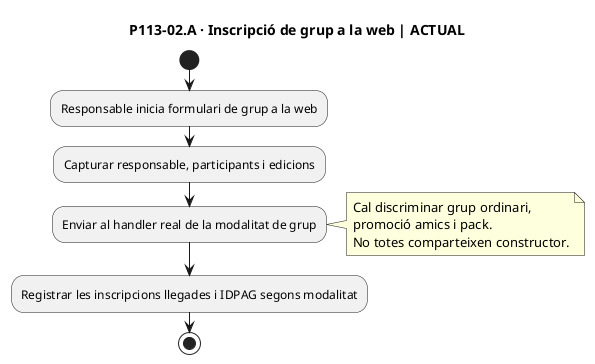

**FINAL / contracte d'adaptació**

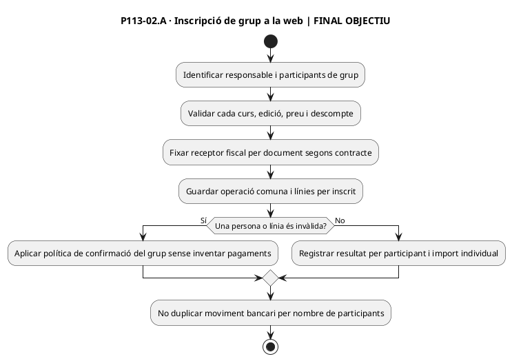

### P113-03.A · URL REAL del lot: generar fitxer de pujada d'alumnes — FRONTERA DE CAS PROPI

**URL exacta confirmada per negoci:** https://intranet.prisma.cat/cursos/inici-cursos/generar-fitxer-pujada-alumnes/ . **Font del flux ACTUAL:** [pantalla de la intranet](../../codi-drive/intranet-actual/cursos-inici-cursos-pujar-alumnes.php), [JS](../../codi-drive/intranet-actual/js/cursos-inici-cursos-pujar-alumnes.js), [`__mostrarPage_Cursos_Pujada_Inscripcions`](../../codi-drive/intranet-actual/Intranet.php#L3619-L3832), [`crearFitxerPujadaInscripcions`](../../codi-drive/intranet-actual/Intranet.php#L4124-L4149) i [`pujar_Inscripcions`](../../codi-drive/intranet-actual/Intranet.php#L4158-L4201). **No resta cap altra pàgina d'importador en lot de PrisMa per localitzar sobre la base d'aquest requeriment.**

El procés és el que Meriem anomena **«importador de matrícules en lot» a la intranet**. En el PHP revisat es preparen **alumnes que ja són a `inscripcions`** i es crea un CSV per a Moodle. No s'importa cap fitxer d'entrada que faci INSERT d'altes noves a PrisMa. Per l'acord de separar els casos, l'activitat següent és un **enllaç de frontera d'UC-113 al cas específic de pujada**, no una segona manera de crear l'alta web.

**ACTUAL — diagrama de frontera amb els passos verificats (el [diagrama de pàgina COMPLETA i els 12 dels apartats estan al cas propi](uc-moodle-pujada-alumnes-fitxa-activitats.md))**

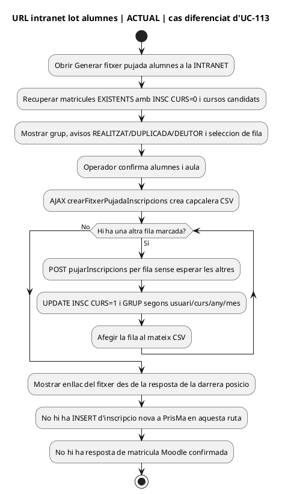

**FINAL — contracte del cas específic de generació/pujada de lot**

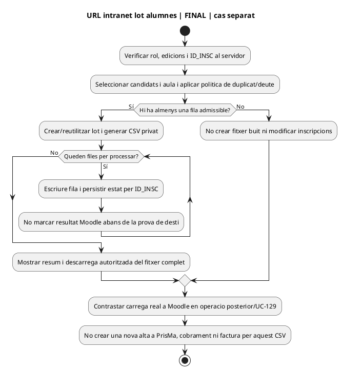

### P113-03.B · Error, lot repetit i resultat Moodle — no són un parser desconegut a PrisMa

**Actual verificat:** el JS crea el CSV abans de comprovar si hi ha cap alumne marcat, envia peticions AJAX de fila de manera concurrent i afegeix l'enllaç quan respon l'última posició del bucle. [`pujar_Inscripcions`](../../codi-drive/intranet-actual/Intranet.php#L4158-L4201) fa l'UPDATE **abans** del `fwrite`; si falla l'escriptura, la inscripció pot quedar marcada sense una fila correcta al fitxer. **Ni la descàrrega ni l'UPDATE acrediten que la matrícula ja s'hagi carregat a Moodle.**

**ACTUAL**

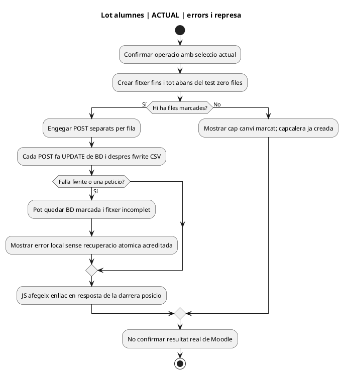

**FINAL PROPOSAT**

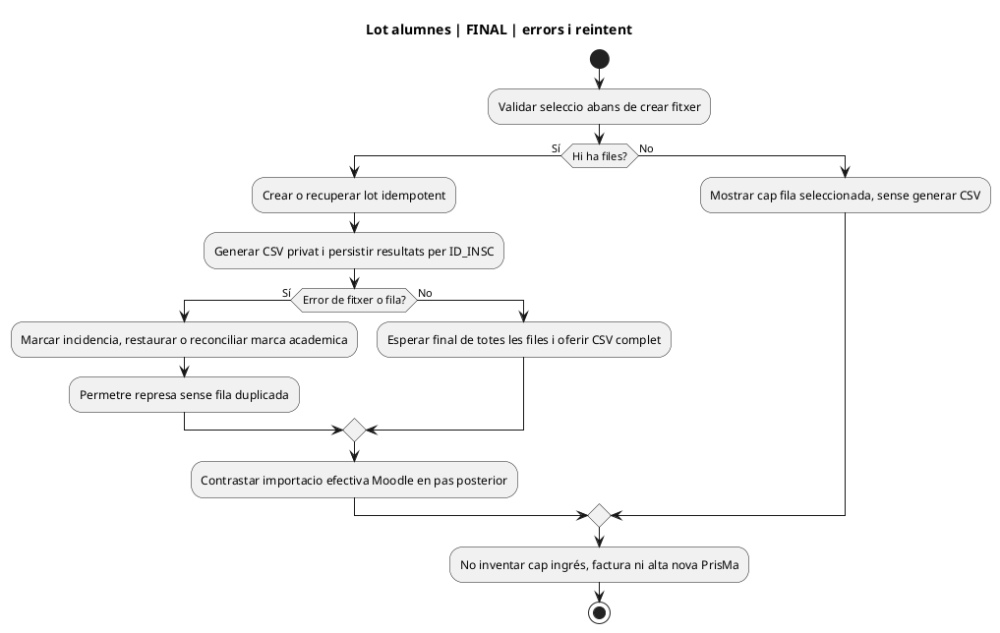

### P113-04.A · Canvi de curs / regularització DESVINCULADA d'UC-113

**Fonts:** [UC-026](uc-026-canviar-de-curs.md) i [`Intranet.php`](../../codi-drive/intranet-actual/Intranet.php), ubicació funcional confirmada per negoci.

**ACTUAL**

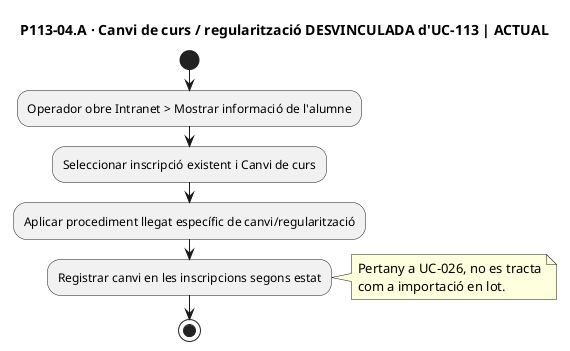

**FINAL / contracte d'adaptació**

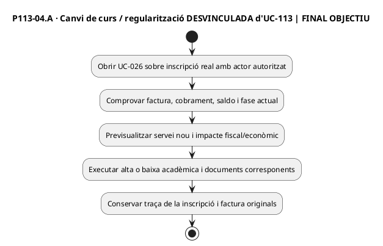

## Matriu de tancament documental i de proves

| Traça | Estat verificat / pendent |
| --- | --- |
| P113-01 | Alta web documentada amb codi de formulari/handler. La ruta i autorització tècnica de l'excepció de secretaria queden per acreditar; no crear cap nova pantalla d'intranet per aquest motiu. |
| P113-02 | Separar grup ordinari, amics i pack segons la ruta efectiva, sense inferir-ne el mateix handler. |
| P113-03 | **RESOLT:** URL real intranet «Generar fitxer pujada alumnes», PHP, JS, dos endpoints, SQL UPDATE i format CSV localitzats. [Fitxa específica i diagrames ACTUAL/FINAL de pàgina completa i apartats](uc-moodle-pujada-alumnes-fitxa-activitats.md). **No queda pendent buscar l'executable d'un segon importador d'altes a PrisMa.** |
| P113-04 | Procediment de canvi/regularització pertany a UC-026; conservar historial d'edició i estat fiscal. |
| Proves i operació | Resta validar comportament desplegat, permisos de servidor, errors concurrents, integritat BD/CSV i resultat real de càrrega a Moodle. Les proves no s'han executat; això no invalida que la pàgina estigui identificada. |

**Conclusió:** documentada la ruta real de la funcionalitat anomenada «importador de matrícules en lot» i separada conceptualment de l'alta inicial i del flux d'aules obertes. **No afirmar que s'han executat proves ni que aquesta pàgina sola matricula automàticament a Moodle.**
