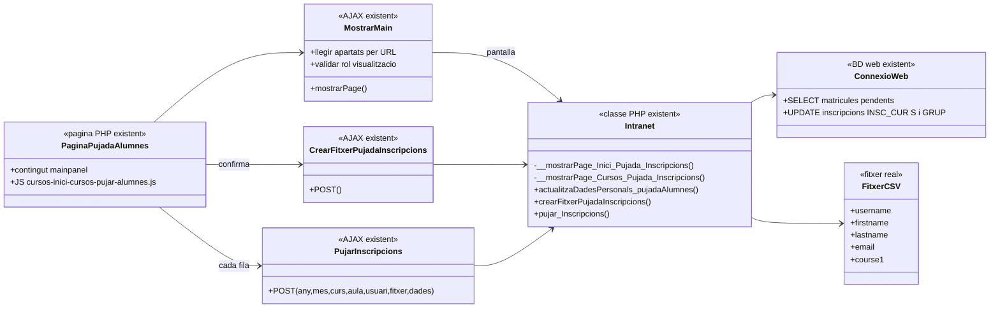
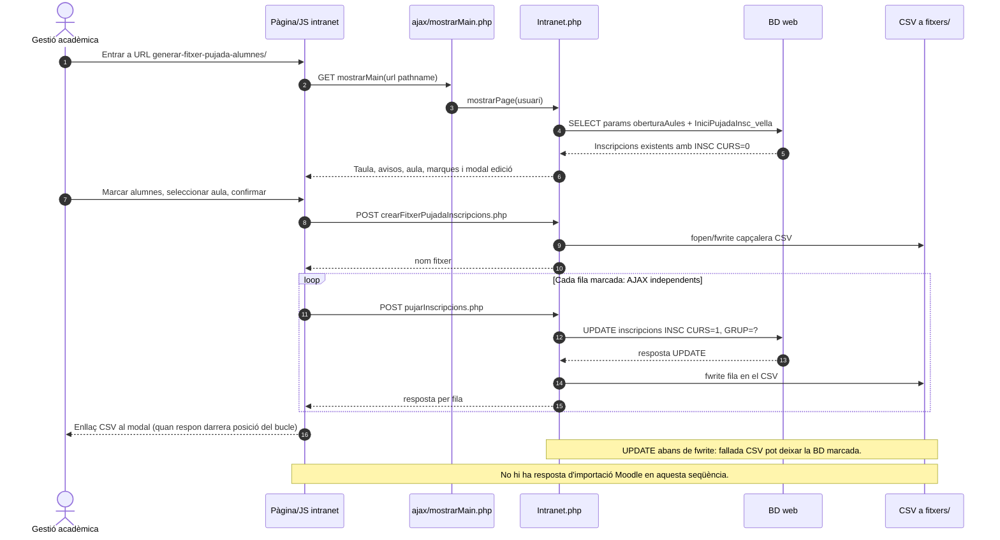
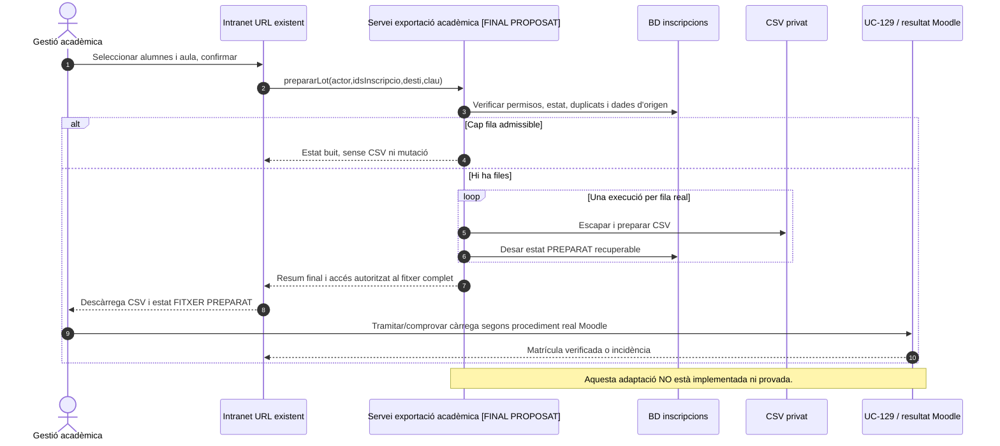

# UC-113 · Alta manual a PrisMa i cas separat de l'importador de matrícules en lot de la intranet

**Correcció de traçabilitat 22/09/2026.** L'«importador de matrícules en lot» a què es refereix Meriem **ÉS la pantalla REAL** https://intranet.prisma.cat/cursos/inici-cursos/generar-fitxer-pujada-alumnes/ . La pàgina PHP, JS, endpoints i mètodes de generació CSV ja estan identificats. **No hi ha cap segon «importador existent amb executable desconegut» deduït d'aquest requisit.** La denominació operativa «importador» es conserva, però el PHP d'aquesta URL genera un fitxer de destinació Moodle a partir de matrícules **ja existents a PrisMa**; no conté un parser d'entrada de fitxers ni un INSERT de noves inscripcions a la BD web en aquest recorregut. La càrrega final a Moodle no està acreditada pel codi d'aquesta pàgina.

**Separació de casos decidida per negoci:** UC-113 cobreix l'alta manual/ordinària de curs o grup des de la web; **generar el fitxer de pujada d'alumnes a la intranet** té una [fitxa funcional pròpia amb diagrames d'activitat ACTUAL/FINAL de la pàgina completa i dels seus apartats](uc-moodle-pujada-alumnes-fitxa-activitats.md). La **pujada d'aules obertes** és un [tercer cas independent](uc-moodle-aules-obertes-fitxa-activitats.md). El canvi de curs/regularització des de «Mostrar la informació de l'alumne > Canvi de curs» és UC-026. La numeració definitiva de casos candidats del campus encara s'ha de comprovar contra els 142 UC originals; no fusionar-los per omplir UC-113.

**Font tècnica:** `main` a `e71958b3026549bde09fb4b25f2ec3ba370937ec`. Estat de treball: **funcionalitat i pàgina reals identificades; proves/producció no verificades**. No inferir operacions fiscals d'una marca acadèmica.

## 1. Matriu de les funcionalitats sense solapaments

| Procediment | Canal/pàgina | Efecte real o confirmat | UC o fitxa |
| --- | --- | --- | --- |
| Inscripció ordinària / grup | Web `pagina_inscripcions.php`, formularis de curs i de grup, handlers segons modalitat | Alta d'una inscripció a PrisMa. | UC-113, UC-016/110/118 segons modalitat. |
| Alta manual de secretaria, preu/descompte especial o curs no públic | Web, segons confirmació de negoci; ruta d'excepció i permís tècnic per contrastar | Alta web amb excepció de condicions comercials segons actor, no una pantalla d'alta manual nova a la intranet. | UC-113 i política d'autorització. |
| Canvi de curs o regularització anterior | Intranet > Mostrar la informació de l'alumne > Canvi de curs | Gestió sobre una inscripció ja existent, amb efectes comercials/fiscals propis. | UC-026 i UC fiscals dependents. |
| **Importador en lot indicat per Meriem: Generar fitxer pujada alumnes** | **URL exacta de la intranet aportada per negoci**; [PHP real](../../codi-drive/intranet-actual/cursos-inici-cursos-pujar-alumnes.php) | Consulta inscripcions existents, permet triar alumnes/aula, actualitza `INSC CURS` i `GRUP` i genera fitxer CSV per Moodle. **No insereix alta nova a PrisMa.** | [Cas de pujada d'alumnes, fitxa i activitats completes](uc-moodle-pujada-alumnes-fitxa-activitats.md). |
| Pujada d'aules obertes | Intranet `cursos-fi-cursos-pujar-aules-obertes.php` | CSV separat, efecte sobre `PERENNE`. | [Cas independent aules obertes](uc-moodle-aules-obertes-fitxa-activitats.md). |
| Comprovar matrícula efectiva a Moodle | Pas posterior al fitxer preparat; no observat al PHP d'aquesta URL | Confirmació/conciliació amb campus o incidència real, no deduïda de `INSC CURS=1`. | UC-129. |

## 2. UML de casos d'ús — actor i fronteres

```plantuml
@startuml
left to right direction
actor "Persona / responsable de grup" as WEB
actor "Secretaria" as SEC
actor "Gestió acadèmica" as GA
rectangle "PrisMa - alta acadèmica" {
  usecase "UC-113
Alta web de curs/grup" as U113
  usecase "Autoritzar preu/descompte
excepcional de secretaria" as EXC
  usecase "UC-026
Canvi de curs / regularització" as U26
}
rectangle "Intranet - inici de cursos" {
  usecase "Generar fitxer pujada alumnes
EN LOT des de matrícula existent" as LOT
  usecase "Editar dades i seleccionar aula" as EDIT
}
rectangle "Intranet - fi de cursos" {
  usecase "Generar fitxer aules obertes" as AO
}
rectangle "Campus i conciliació" {
  usecase "UC-129 Verificar matrícula efectiva
al destí Moodle" as REC
}
WEB --> U113
SEC --> U113
SEC --> EXC
EXC ..> U113 : condiciona
SEC --> U26
GA --> LOT
GA --> AO
LOT ..> EDIT : opcional
LOT ..> REC : posterior, NO automatic comprovat
AO ..> REC : posterior, NO automatic comprovat
@enduml
```

## 3. UML de classes/mètodes ACTUALS del lot de la URL

Les classes/mètodes d'aquest esquema són **els verificats en el PHP/JS versionat**; els fitxers AJAX fan de punts d'entrada. `mostrarMain.php` resol l'URL amb el registre d'`apartats` de la BD intranet; l'associació entre URL real i pàgina l'ha aportat Meriem i el fitxer PHP té el títol literal «Generar fitxer pujada alumnes».



**Nota de precisió:** el nom de classe `PaginaPujadaAlumnes`, `MostrarMain`, `CrearFitxerPujadaInscripcions`, `PujarInscripcions`, `FitxerCSV` del diagrama són etiquetes conceptuals dels fitxers/punts d'entrada, **no classes PHP addicionals acreditades**. `Intranet` i `ConnexioWeb` sí que són classes del codi. La classe `EnrollmentImportService` i les taules `enrollment_import_run/item` són DISSENY SIF; **no representen un segon importador desplegat ni substitueixen la pàgina identificada**.

## 4. UML de seqüència — generació de fitxer ACTUAL



## 5. Contracte FINAL propi del lot, sense inventar un parser d'altes

**Conservar la URL i el procediment existent.** Corregir a servidor els permisos i l'abast per edició; operar per `ID_INSC` per no afectar altres files del mateix usuari/any/mes/curs; validar alumnat, duplicats/deute i aula; generar fitxer privat íntegre abans de confirmar exportació acadèmica; esperar que totes les files acabin, registrar resultat per fila i permetre represa sense duplicats; restringir la descàrrega amb dades personals. Quan es carregui el CSV a Moodle, **només una verificació del destí** pot elevar-ne l'estat a «matriculat». No crear factures, pagaments o comunicacions AEAT per un fitxer acadèmic.



## 6. Diagrames d'activitat i traçabilitat

- [Pàgina COMPLETA «Generar fitxer pujada alumnes» — 2 activitats ACTUAL/FINAL + 12 activitats dels apartats i fitxa funcional](uc-moodle-pujada-alumnes-fitxa-activitats.md).
- [UC-113 — diagrames d'alta web/manual i frontera correcta del lot](uc-113-activitats-alta-manual-i-importador-lot.md).
- [Pujada d'aules obertes — fitxa/10 activitats independents](uc-moodle-aules-obertes-fitxa-activitats.md).
- [Fitxa funcional UC-113 (21 apartats, casos relacionats i proves)](../06-fitxes-funcionals/uc-113.md).

**Estat:** URL, codi de la pantalla, selectors/edificació, generació del CSV i UPDATE llegat **localitzats**. La configuració real del desplegament, el procés de càrrega efectiva a Moodle i les proves de recuperació **no s'han verificat**. No mantenir una tasca genèrica de «trobar l'importador existent» perquè aquesta URL ja l'identifica.
