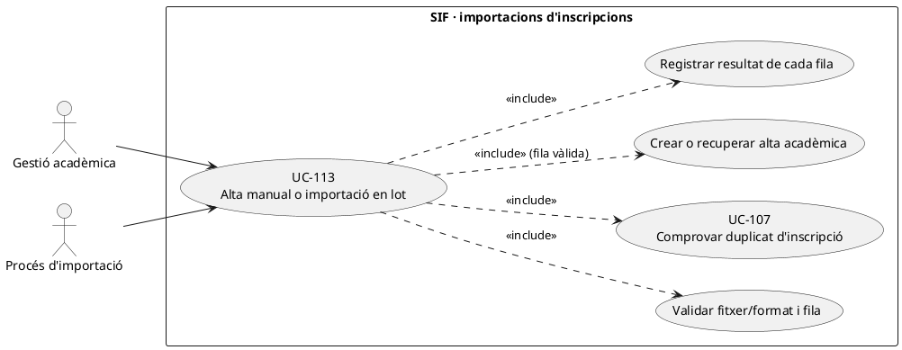
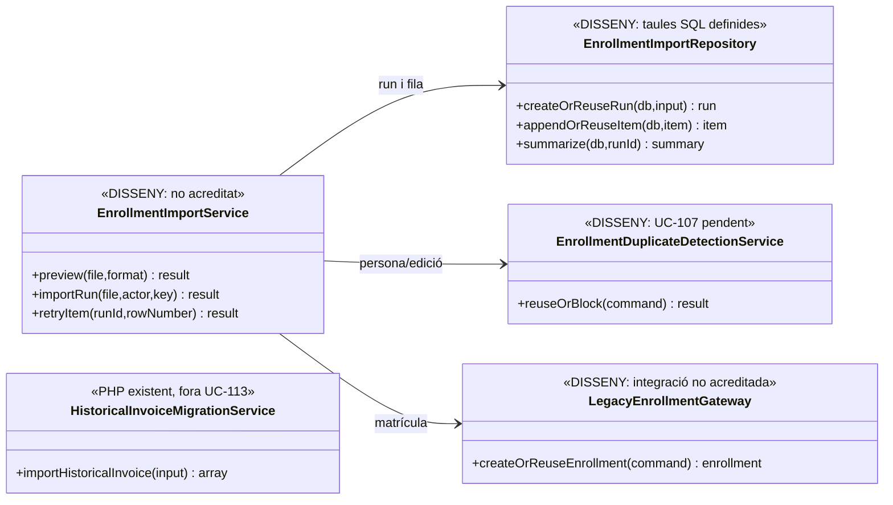
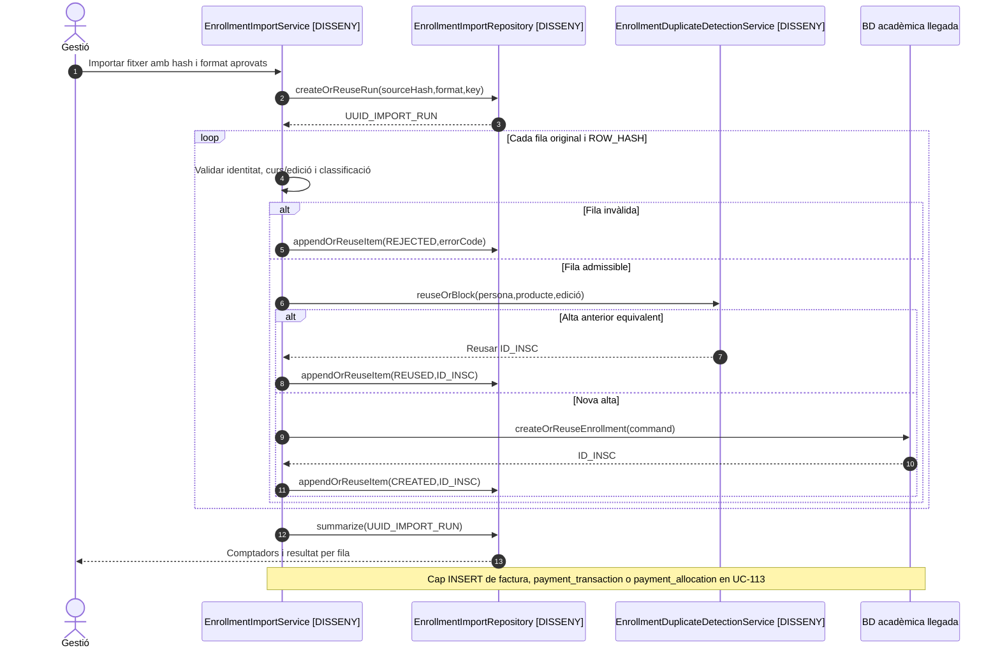

# UC-113 · Crear o importar inscripcions manualment o en lot sense inventar un cobrament

**Objectiu canònic:** cada execució i **cada fila** de l'alta manual/importació conserva origen, validació, resultat i operació creada o reutilitzada. La inscripció acadèmica **no crea factura, pagament ni import fictici**. La fitxa original deixa com a bloquejants formats, camps, permisos, política de duplicats i responsable de resoldre files rebutjades.

**Estat verificat:** la migració defineix `enrollment_import_run` i `enrollment_import_item` amb hash d'origen, versió de format, estats, comptadors, hash de fila, snapshots, fila original i identificador final; també defineix `commercial_operation`. **No s'ha acreditat** a `sif/src` un parser/importador de fitxers d'inscripcions o un servei que ompli aquestes taules, ni s'ha acreditat la creació de matrícules al llegat des d'aquestes classes. `HistoricalInvoiceMigrationService` importa **factures històriques**, no matrícules: no reutilitzar-lo per UC-113.

## 1. Fitxa funcional específica

| Element | Contracte |
| --- | --- |
| Actors | Operador autoritzat i gestió acadèmica; una importació automàtica queda identificada amb procés/actor tècnic. |
| Entrada de lot | Fitxer o ordre manual, referència segura i `SOURCE_HASH`, `FORMAT_VERSION`, origen/canal, actor, `UUID_IMPORT_RUN`, clau idempotent, data, **una fila original per inscripció**. No s'han aprovat encara formats o columnes obligatoris. |
| Entrada per fila | `ROW_NUMBER`, `ROW_HASH`, identitat/participant, producte/edició, `SOURCE_ENROLLMENT_ID`, estat acadèmic i classificació econòmica; origen i motiu, sense assumir receptor/pagador a partir d'un camp de preu. |
| Esquema definit | `enrollment_import_run` inclou `TOTAL_ROWS`, `ACCEPTED_ROWS`, `REUSED_ROWS` i `REJECTED_ROWS`; `enrollment_import_item` desa `ROW_NUMBER`, `ROW_HASH`, `STATUS`, `ERROR_CODE/MESSAGE`, `UUID_OPERATION`, `RESULT_ENROLLMENT_ID` i snapshots d'entrada/resultat. **Cap writer executable acreditat.** |
| Idempotència | Clau única del lot i, dins del lot, `UNIQUE(UUID_IMPORT_RUN,ROW_NUMBER)` i `UNIQUE(UUID_IMPORT_RUN,ROW_HASH)` al SQL. **La unicitat entre lots** del mateix inscrit/edició requereix UC-107, no està garantida només amb la restricció de fila. |
| Sortida | Estat per fila `CREATED`/`REUSED`/`REJECTED` **com a resultats objectiu, no enum comprovat**, identificador de matrícula real, operació comercial quan existeixi i motiu d'error. |
| Efecte fiscal/monetari | **Cap** `payment_transaction`, `payment_allocation`, factura o enllaç de pagament pel fet d'importar una fila. Una dada llegada `PAGAMENT=1`, `A_PAGAR` o una columna «pagat» **no és prova bancària** i no autoritza crear un `CHARGE`. |

### 1.1. Flux objectiu

1. L'operador selecciona format aprovat i previsualitza lot: hash, tipus d'origen, files, persona, edició i classificació prevista. Si el fitxer és desconegut o no supera validació, no mutar la BD llegada ni obrir factures.
2. El servei **pendent** crea o reutilitza `enrollment_import_run` per clau de lot i hash d'origen, registra estat i recompte. Un hash igual amb format o significat incompatible s'ha de classificar com a conflicte, no assumir equivalència.
3. Per cada fila, normalitza dades i crida UC-107 per evitar duplicats de persona/producte/edició **entre lots i al llegat**, no només dins del fitxer. Els errors de fila queden a `enrollment_import_item` amb codi i dades segures.
4. Si la fila és admissible, crea/reutilitza operació comercial amb classificació concreta i demana alta acadèmica **idempotent** al llegat; una matrícula provisional no es converteix en pagada a causa del valor numèric importat.
5. Confirma resultat per fila amb `ID_INSC` real, `UUID_OPERATION` quan correspongui i evidència abans/després. Una fallada d'una fila no transforma les altres en pagades ni duplica les ja creades; cal recuperar per fila sense perdre historial.
6. Recalcula comptadors del lot d'acord amb les files persistides i presenta resultats a la gestió. Una fila que requereix emissió o conciliació financera és una **nova acció autoritzada** UC-01/02/56, no un side effect de la importació.

### 1.2. Alternatives i proves

| Cas | Resposta |
| --- | --- |
| Mateix fitxer carregat dues vegades | Reutilitzar `UUID_IMPORT_RUN` o presentar execució ja tractada, sense dues matrícules. |
| Mateix alumne/edició en dos fitxers diferents | Detectar duplicat per identitat comercial UC-107; `ROW_HASH` del lot no ho garanteix. |
| Lot amb 20 files i una invàlida | 19 resultats independents i una incidència/rebuig; els comptadors han de concordar amb files i reintents, sense completar silenciosament la fila fallida. |
| Fila amb pagament llegat marcat però sense prova d'ingrés SIF | Crear/reutilitzar inscripció acadèmica i derivar la conciliació UC-25/53, **no crear cobrament real inferit**. |
| Inscripció ja té factura històrica | Enllaçar referències/conciliar sense tornar a emetre o importar la factura per duplicat en UC-113. |
| Falla el llegat després del registre SIF | Estat de fila pendent/reconciliació, reintent idempotent; no fingir transacció distribuïda ni una alta acadèmica confirmada. |

**Pendents:** formats reals, política de permisos, identificació de persones, normalització i error per fila, writer del lot, alta acadèmica llegada, proves de recuperació i integració amb UC-107.

### 1.3. Files de naturalesa diferent i punts de comparació del llegat

**El handler d'alta ordinària no és l'importador de lots.** El document `33-casos-us-sif.md` identifica `web-actual/ajax/enviarInscripcio.php` com el handler que crea **una inscripció abans de pagar**, diferencia `tipusCurs == 'S'`, descomptes pendents i el cas `recent_titulat`; `enviarInscripcioTastet.php` crea **una alta a `inscripcions_reptes`**, sense cobrament. Són **punts de negoci llegats**, no un `EnrollmentImportService` executable. El processador per lots objectiu ha de classificar cada fila **abans** d'invocar cap alta: curs ordinari pendent de pagament, subvencionat UC-109, tastet UC-108, inscripció ja existent o fila que requereix revisió de descompte/identitat. No derivar automàticament tots els registres a `issueInvoice()` o a `registerPayment()` perquè el fitxer porti una columna d'import.

**Identificadors i destins diferents per fila.** Conservar `SOURCE_SYSTEM`, tipus de registre d'origen, `SOURCE_ENROLLMENT_ID` quan existeix, `ID_INSC` o identificador de `inscripcions_reptes` **segons el destí real**, persona, `ANY/MES/CURS`, estat i resultat de validació. `IDPAG` pot referenciar grups o intents, **no identifica universalment una persona**; la comprovació UC-107 de persona/producte/edició i el control de permís s'han de fer encara que hi hagi una clau de fila única. Dues files amb el mateix correu poden ser dues persones diferents; un mateix participant en dues edicions pot ser dues inscripcions legítimes.

**Dada postal i mailing en la importació.** El document identifica escriptors de matrícula que incorporen parelles desconegudes a `poblacions_validar`; importar una fila amb CP/població pendents de revisió **no les converteix en una adreça fiscal normalitzada**. Registrar la discrepància UC-128 per origen i receptor fiscal que correspongui, sense alterar les factures ja emeses. Si la fila inclou una casella de mailing o un correu de contacte, no interpretar-la com una confirmació comercial històrica: UC-125 exigeix prova de titular, text/finalitat/canal i resultat abans de transmetre una subscripció. Les dades acadèmiques de la fila es poden tramitar segons la seva política **sense fabricar aquella prova**.

**Reprocessar un lot parcial sense inventar efectes.** Si les primeres files ja han creat `ID_INSC` reals i el parser falla a la següent, reprendre pel mateix origen/ID i comprovar el destí abans de l'alta; una clau de lot o `ROW_HASH` igual és control tècnic, no equivalència comercial quan el contingut/format real ha canviat. Una fila «pagada» provinent del llegat exigeix evidència de TPV/banc/UUID econòmic; no convertir `PAGAMENT` o `A_PAGAR=0` en un `CHARGE` de migració. El resultat per fila ha de separar alta acadèmica, classificació fiscal pendent, dada postal i opció de mailing en comptes de tancar totes les dimensions per haver inserit una fila.

### 1.4. Proves de lot mixt (no executades)

| ID | Escenari | Resultat exigible |
| --- | --- | --- |
| IL-113-01 | Lot amb curs ordinari, `tipusCurs=S` i tastet gratuït | Classificació per fila; el tastet no crea factura i la subvenció resta pendent de decisió fiscal. |
| IL-113-02 | Fila de tastet apunta a `inscripcions_reptes`, no a `inscripcions` | Guardar l'identificador i tipus de destí real, no inventar `ID_INSC` ordinari. |
| IL-113-03 | Dues persones comparteixen `CORREU` dins del fitxer | No fusionar altes ni consentiments sense identitat acreditada. |
| IL-113-04 | CP/població de la fila entra a `poblacions_validar` | Revisió postal pendent, cap normalització fiscal automàtica. |
| IL-113-05 | Fila inclou «mailing = sí» sense text ni prova de confirmació | No subscripció confirmada inferida; alta acadèmica independent. |
| IL-113-06 | Retry després de crear cinc matrícules i fallar a la sisena | Recuperar els cinc destins reals i només reprendre les files pendents, sense factures/cobraments duplicats. |

## 2. UML de casos d'ús

## 3. UML de classes — esquema definit i importador pendent

**No** hi ha fletxa de l'importador a `HistoricalInvoiceMigrationService` perquè importar matrícules no significa importar factures.

## 4. UML de seqüència — lot mixt amb fila duplicada (DISSENY)

## 5. Traçabilitat

[UC-113 original](../06-fitxes-funcionals/uc-113.md) · [UC-107 duplicats](uc-107-detectar-inscripcio-duplicada.md) · [UC-106 reserva](uc-106-crear-reserva-abans-pagament.md) · [UC-11 factura històrica](uc-011-importar-factura-historica.md) · [Migració enrollment_import_run/item](../../sif/database/migrations/2026_09_16_000005_add_operation_lifecycle_tables.sql) · [Model d'inscripció i diners](00-revisio-moviments-inscripcions.md).
