# UC-114 · Versionar canvis de producte o edició amb operacions obertes

**Objectiu de la fitxa original:** versionar **nom, dates, hores, preu, fiscalitat i regles**, mantenint els snapshots acceptats d'operacions obertes o obrint-ne un canvi explícit; mai substituir silenciosament les dades que un pagador ja va acceptar. **Decisions de negoci confirmades el 22/09/2026:** els canvis de data, horari, modalitat, hores i acreditació es notifiquen sense exigir acceptació prèvia; si a l'alumne no li van bé, se li ofereix canvi d'edició. La mateixa persona de l'equip amb accés a la intranet decideix el canvi, sense segona aprovació interna. Els termes econòmics d'ofertes ja acceptades es preserven; si es proposa canviar-los, es genera una oferta nova. La cancel·lació d'edició segueix UC-127, amb regla pròpia.

**Evidència del repositori:** `master_data_change_request` està definida amb `ENTITY_TYPE/KEY`, `BASE_VERSION`, `PROPOSED_VERSION`, `CHANGESET_JSON`, `AFFECTED_OPEN_OPERATIONS_JSON`, motiu, decisió, actor i correlació. El SQL imposa unicitat de `ENTITY_TYPE+ENTITY_KEY+PROPOSED_VERSION`. `commercial_operation_line` preserva `PRICE_RULE_VERSION` i `SNAPSHOT_JSON`; `RedsysPaymentIntentService::create()` rebutja reutilitzar el mateix `DS_ORDER` amb un snapshot/import/venciment canviats. **No s'ha acreditat** un `MasterDataChangeService` PHP que executi impact analysis, autorització i propagació al llegat.

## 1. Fitxa funcional específica

| Aspecte | Regla |
| --- | --- |
| Actors | Persona de l'equip amb accés a intranet que efectua i decideix el canvi sense segona aprovació interna (identificació i autorització en servidor), persones inscrites destinatàries de l'avís i, només si canvien termes econòmics acceptats, pagador destinatari d'una nova oferta. Si una correcció fiscal específica requereix tractament especial, es tramita pel seu UC, no es pressuposa una segona aprovació per editar l'edició. |
| Entrada | Producte/curs/edició, versió antiga i proposada, camps canviats (nom, dates, hores, preu, descomptes, aforament, fiscalitat), causa, `EFFECTIVE_AT` i instant de publicació; identitats d'operacions obertes afectades. |
| Versió de canvi | `master_data_change_request` conserva el changeset i la llista d'operacions obertes **com a JSON**. Són camps de proposta, no garantia d'identificar totes les operacions si no hi ha consulta/lock real. |
| Operacions ja acceptades | El snapshot històric, el preu pactat i la factura existent no es reescriuen. Els canvis excepcionals de data/horari/modalitat/hores/acreditació **es notifiquen, sense exigir acceptació prèvia**; si no van bé, s'ofereix canvi d'edició. Si es pretén substituir les condicions **econòmiques** acceptades, cal una nova oferta/ordre quan pertoqui (UC-112/121); separar la comunicació de l'eventual tractament individual fiscal o acadèmic. |
| Factures emeses | `InvoiceService` persisteix factura fiscal; UC-114 **no és permís** per actualitzar `factura_linia`, data/import o hash després d'emetre. Un servei efectivament modificat deriva a UC-71/74/72 segons l'operació real. |
| Diners i places | Canviar catàleg no és `CHARGE`, `REFUND` ni confirmació de capacitat. Si una reserva queda incompatible amb la nova edició, UC-115/121 classifica disponibilitat i oferta; pagaments reals anteriors es concilien per separat. |

### Flux objectiu

1. L'operador prepara una proposta `BASE_VERSION→PROPOSED_VERSION` i calcula una vista prèvia dels canvis de nom, dates/hores, preus, aforament i fiscalitat.
2. Un coordinador **pendent** busca operacions en curs, reserves, intents TPV i factures que referencien el producte/edició, i desa exactament quines ofertes/participants estan afectats. No identificar impacte només per les inscripcions que encara no s'han cobrat: pot haver-hi callback pendent o factura anterior.
3. Distingeix: (a) modificació informativa de data/horari/modalitat/hores/acreditació, que es **notifica** i ofereix canvi d'edició si no va bé, sense demanar consentiment previ; (b) modificació de condicions **econòmiques** d'una oferta ja acceptada, que no substitueix l'oferta històrica i requereix proposta nova UC-112/121; (c) anul·lació de l'edició, que segueix UC-127. Les autoritzacions de servidor i el tractament per operació encara s'han d'implementar/verificar.
4. La mateixa persona de l'equip amb accés a intranet decideix i publica la versió, **sense segona aprovació interna**; s'enregistra actor, data i resultat de propagació a la BD llegada, i, si falla, queda incidència/reconciliació sense afirmar que totes les operacions s'han actualitzat.
5. Les noves compres usen la versió publicada. Les existents preserven el snapshot històric; els canvis notificables no requereixen acceptació expressa abans de comunicar i aplicar l'edició modificada. **Un canvi dels termes econòmics ja acceptats** no s'incorpora silenciosament: cal una nova oferta acceptada, i una nova ordre quan pertoqui; `RedsysPaymentIntentService` rebutja canviar dades d'un mateix `DS_ORDER`.
6. Si ja s'havia emès factura, una modificació real de prestació/import segueix la classificació fiscal i els moviments per inscripció corresponents; el canvi del catàleg no edita l'original.

### Alternatives i proves

| Escenari | Control |
| --- | --- |
| Canvi de títol intern sense impacte en l'oferta | Registrar versió i política de presentació; no reescriure títol fiscal emès. |
| Canvi de data d'un taller amb reserves acceptades | Notificar les persones afectades; si el canvi no els va bé, oferir canvi d'edició. Preservar la història de l'oferta i classificar qualsevol afectació econòmica/fiscal per separat, **sense exigir acceptació prèvia de la nova data**. |
| Pujada de preu mentre existeix `DS_ORDER` pendent | No reutilitzar mateixa ordre amb total nou; nova acceptació i oferta separada quan sigui aplicable. |
| Callback vell després de publicar nova versió | Processar el fet bancari real i reconciliar oferta antiga/plaça, en lloc d'emetre automàticament al preu nou. |
| Dos operadors publiquen la mateixa `PROPOSED_VERSION` | La unicitat SQL evita dues files amb aquesta clau, però **no** garanteix la gestió de conflictes del catàleg llegat: lock/versionat aplicatiu pendent. |

**Pendents tècnics/documentals:** contrastar permisos al backend, ruta del canvi de preu, missatges reals, comparació entre esquemes, publicació i recuperació de dades mestres, totes les accions per pàgina, proves concurrents i callbacks d'ofertes antigues. **No estan pendents de decisió la regla de notificació ni l'absència de segona aprovació interna.** Sense proves PHP executades.

### 1.3. Edició modificada des de la intranet amb reserves, ofertes i factures obertes

**Punt real de canvi d'edició.** El document d'estat final identifica `Intranet::desarCanvisEstatEnviarMsg_PreviIniciCursos()`: passa curs/edició entre pendent, actiu i anul·lat, dona de baixa alumnes, consulta factura i forma de pagament, cerca edicions futures i envia avisos. És un **flux múltiple**, no una simple edició de la data o el preu d'una fitxa mestra. Aquesta dada contrasta amb `master_data_change_request`, que registra capçalera i operacions afectades en SQL però **no acredita** que el mètode llegat consulti, bloquegi o actualitzi aquesta taula.

**Operacions afectades abans i després del cobrament.** En previsualitzar el canvi de producte/edició, inventariar per `ID_INSC` i `UUID_OPERATION` les reserves i `DS_ORDER` pendents, factures reals ja emeses abans de cobrar, cobraments confirmats, packs/grups amb persones d'altres edicions i accessos Moodle. Una oferta congelada pot tenir data/preu anteriors a l'edició viva, i una factura real no es pot «actualitzar» amb el nou títol per correspondre amb la web. Si es canvia el servei contractat, el tractament individual és UC-71/74/127, no la substitució massiva del concepte en `factura_linia`.

**Avisos i callbacks en curs.** El mètode llegat pot enviar comunicacions quan canvia l'estat: el nou circuit ha de notificar **la decisió i el resultat real per inscrit**, no afirmar una baixa Moodle o una devolució no confirmades. Una intenció signada abans del canvi conserva el seu `SNAPSHOT_JSON`; el callback actual valida import/divisa/terminal, però **no rellegeix l'estat d'edició** en `assertMatchesIntent()`. Qualsevol ingrés tardà es reconcilia amb aquella oferta i reserva, no es factura silenciosament amb el preu de l'edició nova.

### 1.4. Proves de canvi d'edició amb operacions obertes (no executades)

| ID | Escenari | Resultat exigible |
| --- | --- | --- |
| VE-114-01 | Edició anul·lada mentre hi ha una factura real pendent de transferència | Document existent preservat; decisió econòmica i fiscal individual, no baixa automàtica de deute. |
| VE-114-02 | Canvi de preu després de signar `DS_ORDER` | Snapshot original intacte; nova oferta/ordre només si correspon i s'accepta. |
| VE-114-03 | Pack amb un curs afectat i un altre curs vigent | Inventari i decisió per línia/participant, no anul·lació indiscriminada de tot el pack. |
| VE-114-04 | El llegat comunica «baixa efectuada» però Moodle encara no la registra | Avís d'estat parcial i incidència UC-129, no confirmació fictícia. |
| VE-114-05 | Callback de l'edició antiga arriba després de publicar la versió nova | Conservar ingrés real i revisar oferta/plaça antiga, sense nova factura automàtica. |

## 2. UML de casos d'ús

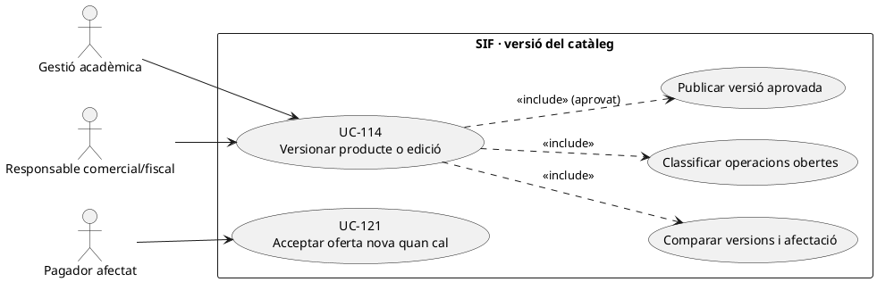

## 3. Diagrama de classes: SQL present, orquestració pendent

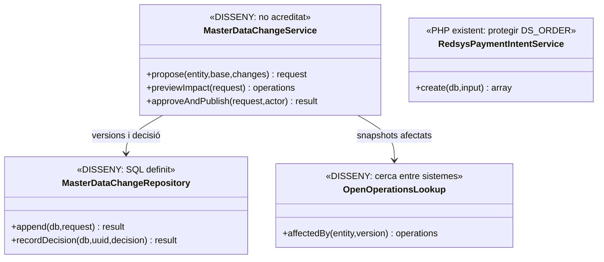

## 4. Seqüència — canvi de data/preu amb ofertes obertes (DISSENY)

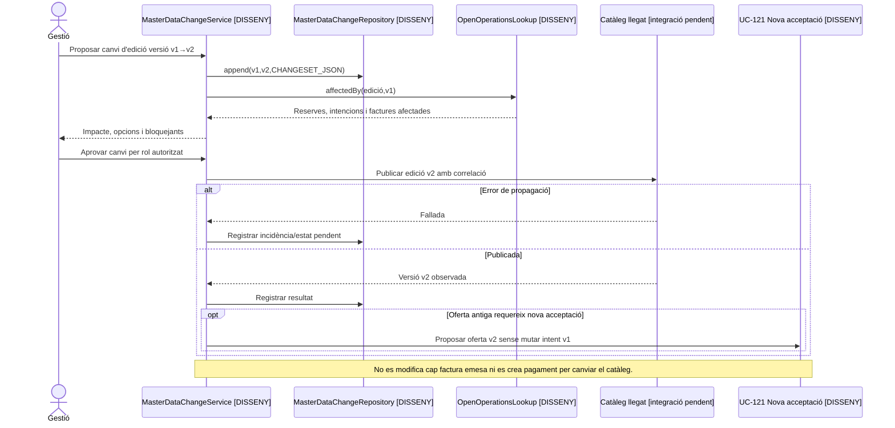

## 5. Traçabilitat

[UC-114 original](../06-fitxes-funcionals/uc-114.md) · [UC-112 snapshot](uc-112-congelar-snapshot-abans-tpv.md) · [UC-121 renovar oferta](uc-121-repreuar-renovar-reserva-caducada.md) · [UC-115 capacitat](uc-115-reservar-alliberar-places.md) · [RedsysPaymentIntentService](../../sif/src/Service/RedsysPaymentIntentService.php) · [Migració master_data_change_request](../../sif/database/migrations/2026_09_16_000005_add_operation_lifecycle_tables.sql).

## 6. Auditoria dirigida dels punts d'entrada reals — 22/09/2026

**Font:** `main` al commit `e71958b3026549bde09fb4b25f2ec3ba370937ec`. [Auditoria detallada del lot 03, amb 4 accions, diagrames d'activitat parcials i proves proposades](00-auditoria-casos-pendents-lot-03-uc-114-2026-09-22.md). Aquest annex actualitza la traçabilitat **del codi consultable**; no implica que s'hagi executat la versió desplegada ni llegit el cos complet dels mètodes d'`Intranet.php`.

| Acció distingida | Punt d'entrada verificat | Implicació per al cas d'ús |
| --- | --- | --- |
| Desar dades d'edició | [`ajax/cursos/desarCanvisDadesEdicio.php`](../../codi-drive/intranet-actual/ajax/cursos/desarCanvisDadesEdicio.php#L16-L32) rep `idCurs`, nom, dates, hores, curs escolar, GTAF/FISS i altres dades; delega a `Intranet::desarCanvisDadesEdicio()`. **Aquest wrapper no rep `idPreu`.** | Cal recuperar el cos del mètode i localitzar el circuit de canvi del preu; no donar per fet que el formulari documentat canvia tots els camps inclosos a l'objectiu general. Matriu camp × operacions afectades × decisió. |
| Desar dades d'aula | [`desarCanvisDadesAulaEdicio.php`](../../codi-drive/intranet-actual/ajax/cursos/desarCanvisDadesAulaEdicio.php#L16-L24) rep aula, ID d'aula, dates de revisió/informe i observacions i delega a un altre mètode. | Separar modificació administrativa de modificació de prestació, ubicació o capacitat segons el comportament real del mètode. |
| Canviar estat | [`desarCanvisEstatEnviarMsg.php`](../../codi-drive/intranet-actual/ajax/cursos/desarCanvisEstatEnviarMsg.php#L15-L27) rep curs/edició/estat antic/nou per **GET**, malgrat un comentari que indica canviar a POST, i invoca `desarCanvisEstatEnviarMsg_PreviIniciCursos()`. | Inventariar codis i transicions d'estat reals, efectes de matrícula, avisos, factures, saldo i baixes separadament; verificar permisos i mètodes interns abans de concloure si tenen protecció. |
| Importar/crear edicions CSV | [`cursos-afegir-modificar-edicions.js`](../../codi-drive/intranet-actual/js/cursos-afegir-modificar-edicions.js#L210-L310) llança una petició `inserirCurs.php` per fila seleccionada i una altra per al número de tràmit; [el wrapper d'inserció](../../codi-drive/intranet-actual/ajax/cursos/inserirCurs.php#L16-L33) rep també `idPreu` i `public`. | Distingir crear una edició nova de versionar-ne una d'existent; definir idempotència, resultat per fila, error parcial i publicació controlada. Al JS inspeccionat no s'espera la resolució de totes les insercions abans d'enviar el tràmit; comprovar transaccions internes del servidor abans d'inferir resultat persistent. |

**Contracte de dades:** `master_data_change_request` ja existeix a [la migració 000005](../../sif/database/migrations/2026_09_16_000005_add_operation_lifecycle_tables.sql#L196-L217) i `commercial_operation_line` defineix `PRICE_RULE_VERSION` i `SNAPSHOT_JSON`. L'esquema no acredita un writer/orquestrador PHP ni que la migració s'hagi aplicat. [`RedsysPaymentIntentService::create()`](../../sif/src/Service/RedsysPaymentIntentService.php#L19-L65) protegeix el mateix `DS_ORDER` davant un snapshot diferent, però no fa una anàlisi general d'impacte per edició.

**Proves:** V114-01–V114-08 al [lot 03](00-auditoria-casos-pendents-lot-03-uc-114-2026-09-22.md#6-proves-dacceptació-proposades--no-executades) són casos d'acceptació **definits, no executats**. Els diagrames d'activitat d'edició i CSV del lot són **parcials**; els de totes les pàgines/apartats i els circuits d'estat i d'aula continuen oberts a RM-037.

**Estat de la fitxa:** contrast parcial actual→objectiu; **no tancada funcionalment**. El cos dels mètodes llegats, els permisos interns, les escriptures concretes de BD, la ruta de preus i el desplegament continuen pendents de comprovació. UC-111 i UC-113 no s'han inclòs en aquesta auditoria.

### Regles operatives verificades amb la responsable de negoci · 22/09/2026

El preu habitual d'un curs es determina per les hores mitjançant `ID_PREU` i `preus`; excepcionalment es pot canviar des de la base de dades assignant un altre `ID_PREU`. No atribuir un selector de preus al formulari `desarCanvisDadesEdicio.php`, que no el rep. Els canvis d'edició són excepcionals, i la mateixa persona de l'equip amb accés a la intranet pot decidir-los sense una segona validació interna; distingir-ho del control d'autenticació, rol i traça a servidor.

**Canvi informatiu:** notificar el canvi de data (inclòs ajornar dos dies), hora, modalitat, hores o acreditació; si no agrada, oferir canvi d'edició. **No requerir acceptació prèvia** d'aquest canvi. **Canvi de preu ja acceptat:** conservar l'oferta econòmica acceptada i, si es pretén modificar-ne el contingut econòmic, presentar-ne una de nova. **Anul·lació de l'edició:** seguir [UC-127](uc-127-canvi-estat-edicio-operacions-afectades.md), no importar-ne la pauta al simple ajornament.

Aquesta decisió corregeix les formulacions anteriors que exigien «consentiment» o «nova acceptació expressa» indiscriminadament per canvis de data/horari; els diagrames de seqüència i d'activitat han de seguir aquesta distinció en revisar-los. [Fitxa funcional UC-114](../06-fitxes-funcionals/uc-114.md).

## 7. Diagrames d'activitat contrastats per acció de la pantalla

**Inventari de pàgina de consulta d'edicions:** `cursos-consultar-edicions-curs.php` → `ajax/mostrarMain.php` (comprova rol per al contingut dinàmic) → `Intranet::mostrarInformacioCurs_Cursos()` → apartats `dades-estat-inscripcio`, `dades-edicio`, `dades-aula` i modal d'alumnat [Intranet.php L17014–17038](../../codi-drive/intranet-actual/Intranet.php#L17014-L17038). Les dades d'edició comparen `cursos` amb `curs` i mostren divergències; les dades d'aula inclouen visibilitat Moodle i consulta d'alumnat. **Aquest inventari és de PHP generat, no substitueix encara la captura i verificació dels handlers JS de cada botó.** Els mètodes de desament i importació **sí que s'han llegit complets** [fitxa funcional contrastada](../06-fitxes-funcionals/uc-114.md#23-fitxa-funcional-de-les-accions-reals-dedició--contrast-del-codi-complet-22092026).

### A114-00 · Consulta d'edició/aules — ACTUAL

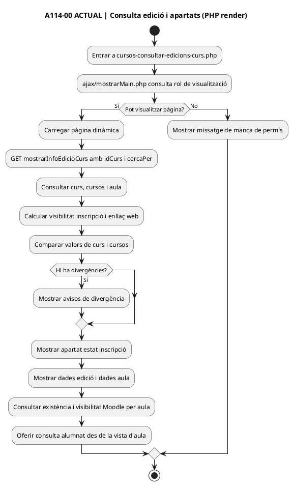

**Font:** [`mostrarMain.php`](../../codi-drive/intranet-actual/ajax/mostrarMain.php), [`Intranet.php` L17014–17038](../../codi-drive/intranet-actual/Intranet.php#L17014-L17038), [L17252–17325](../../codi-drive/intranet-actual/Intranet.php#L17252-L17325) i [L17960–18116](../../codi-drive/intranet-actual/Intranet.php#L17960-L18116). La comprovació de permís de la pàgina no demostra el control de recursos de cada endpoint AJAX.

### A114-00 · Consulta d'edició/aules — FINAL

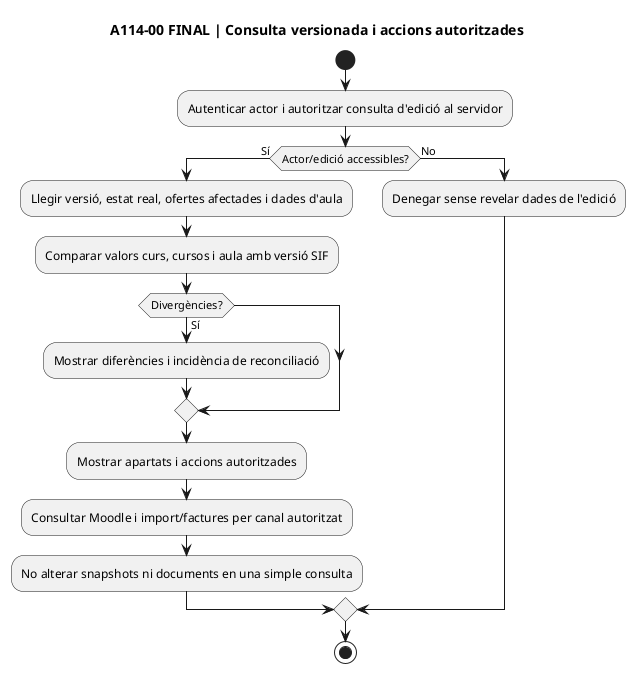

### A114-01 · Desar dades d'edició — ACTUAL, mètode complet

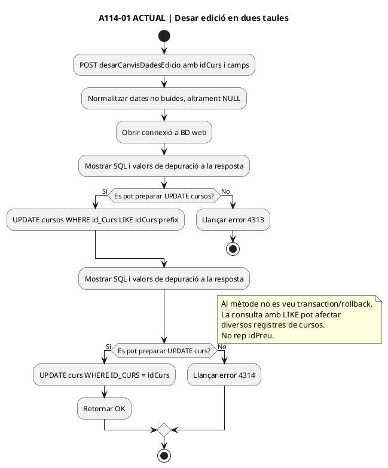

**Font:** [`Intranet.php` L18238–18324](../../codi-drive/intranet-actual/Intranet.php#L18238-L18324), SQL dels dos UPDATE [L1108–1113](../../codi-drive/intranet-actual/Intranet.php#L1108-L1113). No atribuir a la consulta `LIKE` canvis de files no comprovats en BD: el risc és potencial i cal test amb dues aules.

### A114-01 · Desar dades d'edició — FINAL, regla negoci incorporada

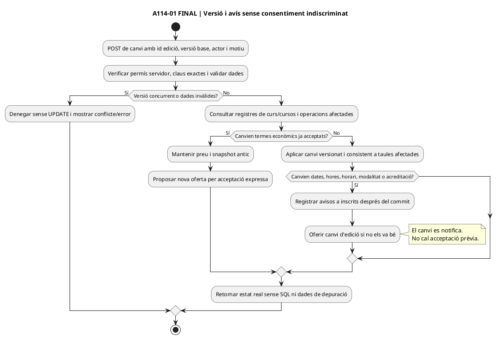

### A114-02 · Desar dades d'aula — ACTUAL, error parcial acreditat al codi

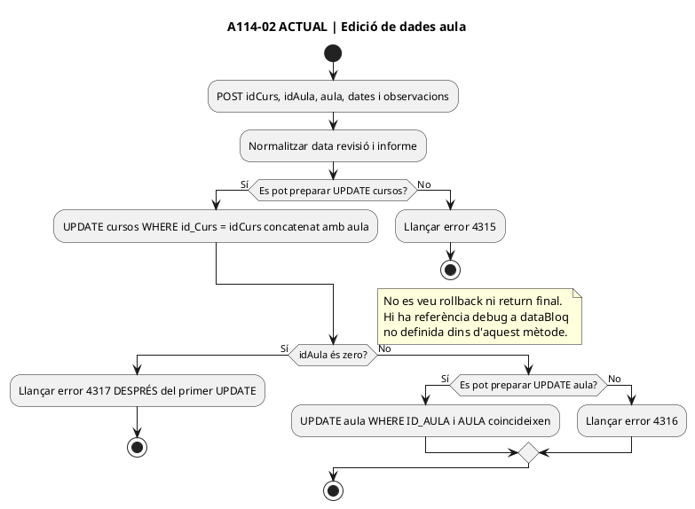

**Font:** [`Intranet.php` L18334–18385](../../codi-drive/intranet-actual/Intranet.php#L18334-L18385) i SQL [L1114–1115](../../codi-drive/intranet-actual/Intranet.php#L1114-L1115). Una excepció no acredita automàticament rollback d'un `UPDATE` previ.

### A114-02 · Desar dades d'aula — FINAL

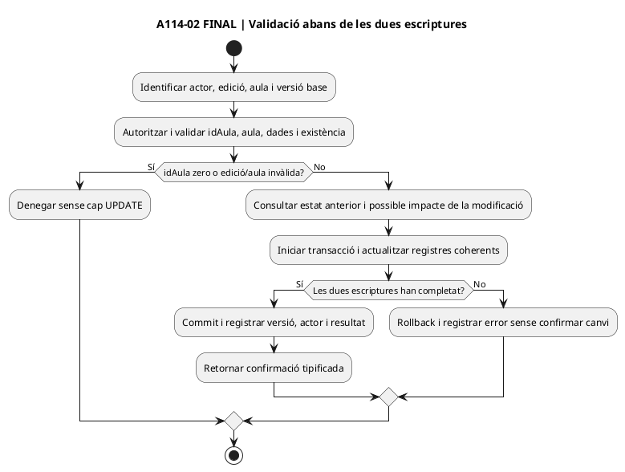

### A114-04 · Importació CSV — ACTUAL, tres escriptures per fila

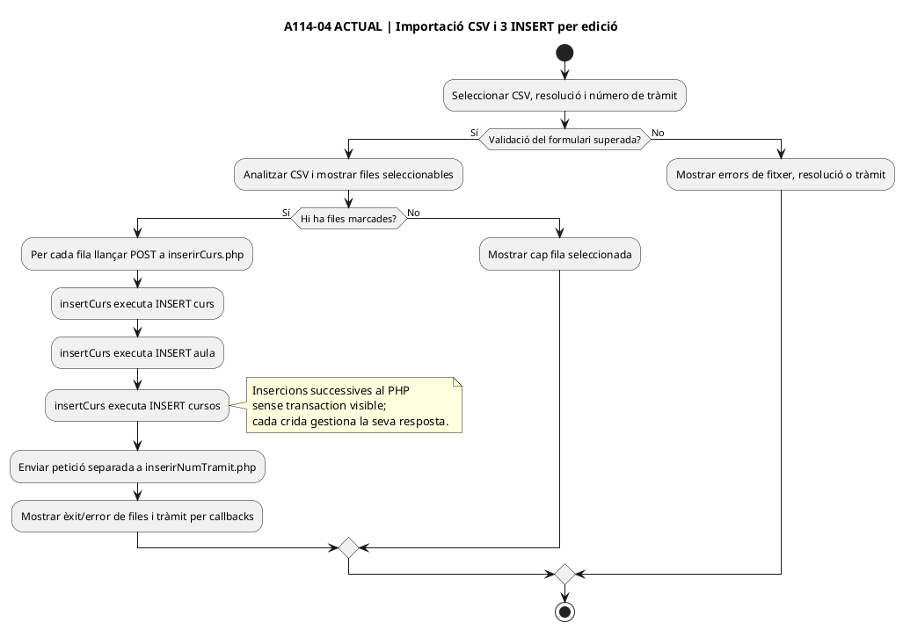

**Font:** [JS L50–115 i L210–310](../../codi-drive/intranet-actual/js/cursos-afegir-modificar-edicions.js#L210-L310), [`insertCurs()` L18855–18900](../../codi-drive/intranet-actual/Intranet.php#L18855-L18900) i [`inserirNumTramit()` L18907–18923](../../codi-drive/intranet-actual/Intranet.php#L18907-L18923). Una fila fallida pot haver executat INSERT previs; verificar en BD de proves la consistència de cada cas.

### A114-04 · Importació CSV — FINAL

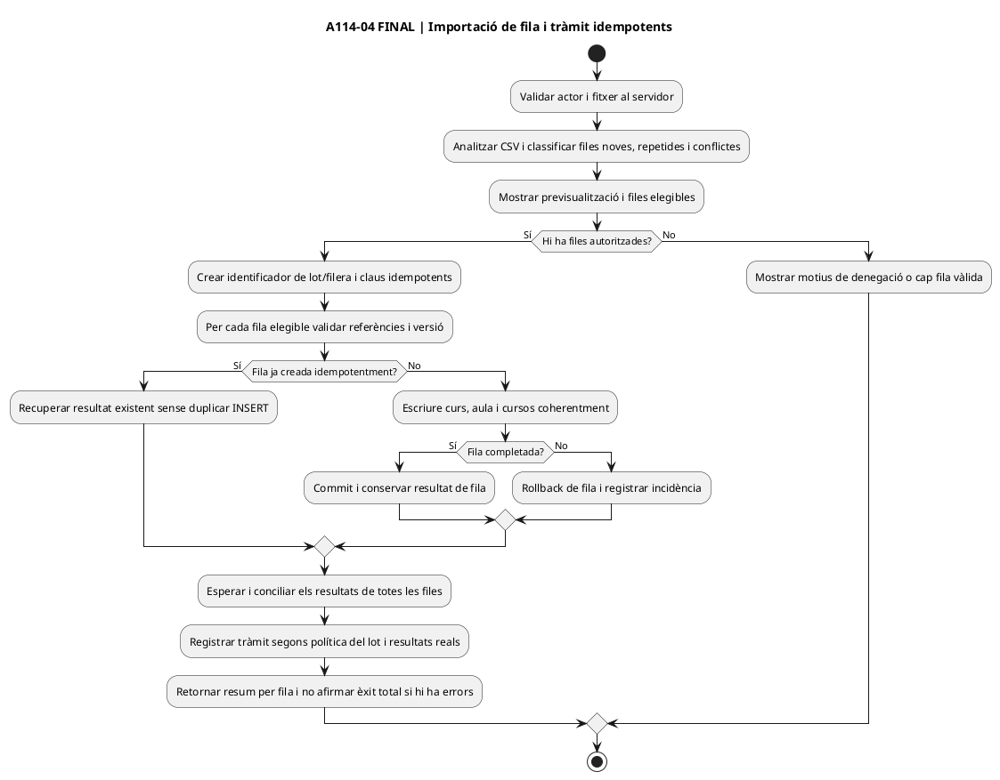

**Criteri de revisió i proves:** [fitxa funcional UC-114, secció 23](../06-fitxes-funcionals/uc-114.md) fixa orígens, resultats, alternatives i P114-01–06. Els diagrames ACTUALS reprodueixen codi observable, inclosos errors; els FINALS són contracte objectiu i no impliquen implementació ni proves executades. Encara cal connectar tots els controladors JS, controls/accions dels modals i captures reals de la pàgina a RM-037.
