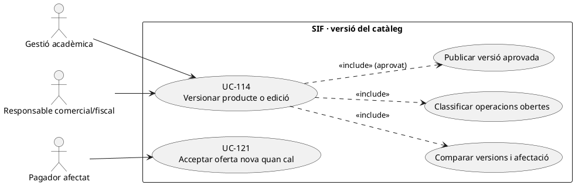
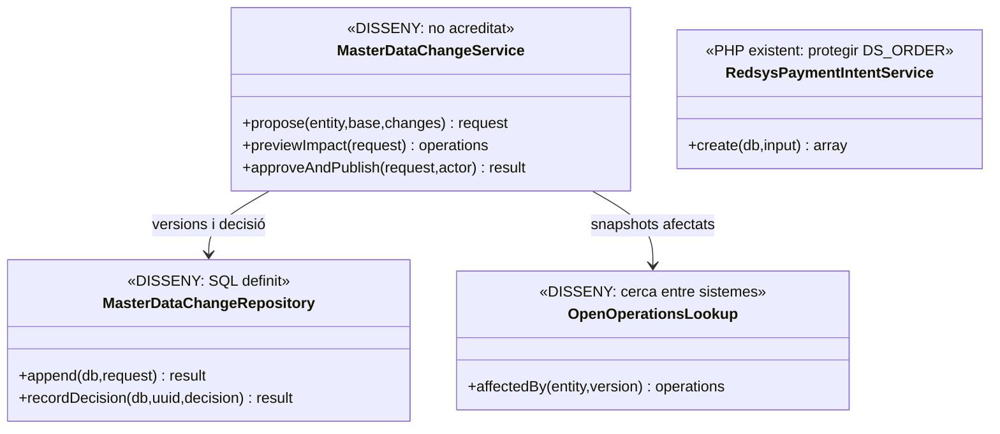
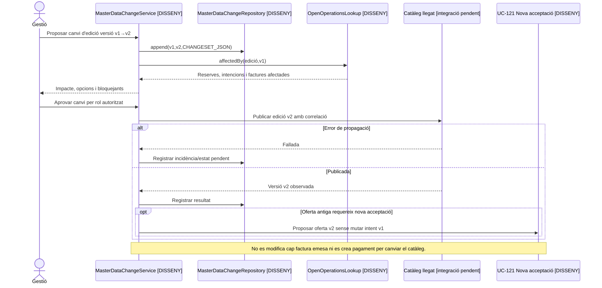

# UC-114 · Versionar canvis de producte o edició amb operacions obertes

**Objectiu de la fitxa original:** versionar **nom, dates, hores, preu, fiscalitat i regles**, mantenint els snapshots acceptats d'operacions obertes o obrint-ne un canvi explícit; mai substituir silenciosament les dades que un pagador ja va acceptar. **Decisions pendents:** quins canvis mantenen l'oferta, quins exigeixen consentiment nou i qui pot modificar/cancel·lar una edició amb reserves.

**Evidència del repositori:** `master_data_change_request` està definida amb `ENTITY_TYPE/KEY`, `BASE_VERSION`, `PROPOSED_VERSION`, `CHANGESET_JSON`, `AFFECTED_OPEN_OPERATIONS_JSON`, motiu, decisió, actor i correlació. El SQL imposa unicitat de `ENTITY_TYPE+ENTITY_KEY+PROPOSED_VERSION`. `commercial_operation_line` preserva `PRICE_RULE_VERSION` i `SNAPSHOT_JSON`; `RedsysPaymentIntentService::create()` rebutja reutilitzar el mateix `DS_ORDER` amb un snapshot/import/venciment canviats. **No s'ha acreditat** un `MasterDataChangeService` PHP que executi impact analysis, autorització i propagació al llegat.

## 1. Fitxa funcional específica

| Aspecte | Regla |
| --- | --- |
| Actors | Gestió que proposa el canvi, responsable acadèmic/comercial i assessorament fiscal quan canvia la classificació fiscal; comprador afectat quan cal acceptar una nova oferta. |
| Entrada | Producte/curs/edició, versió antiga i proposada, camps canviats (nom, dates, hores, preu, descomptes, aforament, fiscalitat), causa, `EFFECTIVE_AT` i instant de publicació; identitats d'operacions obertes afectades. |
| Versió de canvi | `master_data_change_request` conserva el changeset i la llista d'operacions obertes **com a JSON**. Són camps de proposta, no garantia d'identificar totes les operacions si no hi ha consulta/lock real. |
| Operacions ja acceptades | Preu, dates, plaça i règim fiscal del snapshot antic es mantenen com a història de l'oferta; en canvis materials cal política d'acceptació i una **nova versió** UC-112/121, no overwrite de `SNAPSHOT_JSON`. |
| Factures emeses | `InvoiceService` persisteix factura fiscal; UC-114 **no és permís** per actualitzar `factura_linia`, data/import o hash després d'emetre. Un servei efectivament modificat deriva a UC-71/74/72 segons l'operació real. |
| Diners i places | Canviar catàleg no és `CHARGE`, `REFUND` ni confirmació de capacitat. Si una reserva queda incompatible amb la nova edició, UC-115/121 classifica disponibilitat i oferta; pagaments reals anteriors es concilien per separat. |

### Flux objectiu

1. L'operador prepara una proposta `BASE_VERSION→PROPOSED_VERSION` i calcula una vista prèvia dels canvis de nom, dates/hores, preus, aforament i fiscalitat.
2. Un coordinador **pendent** busca operacions en curs, reserves, intents TPV i factures que referencien el producte/edició, i desa exactament quines ofertes/participants estan afectats. No identificar impacte només per les inscripcions que encara no s'han cobrat: pot haver-hi callback pendent o factura anterior.
3. Decideix per cada categoria d'operació si conserva oferta anterior, envia nova proposta d'acceptació UC-121, allibera/reassigna plaça UC-115 o obre incidència/correcció. La política concreta i els permisos són **bloquejants no definits pel DDL**.
4. Després d'aprovació, publica nova versió de catàleg i enregistra actor, data i resultat de propagació a la BD llegada; si la propagació falla, deixa incidència/reconciliació, no marca totes les operacions com actualitzades.
5. Les noves compres usen la versió nova; les existents mantenen el snapshot anterior **fins a nova acceptació expressa**. `RedsysPaymentIntentService` rebutja canviar les dades d'una mateixa ordre, per la qual cosa un nou snapshot necessita nova oferta/ordre quan pertoqui.
6. Si ja s'havia emès factura, una modificació real de prestació/import segueix la classificació fiscal i els moviments per inscripció corresponents; el canvi del catàleg no edita l'original.

### Alternatives i proves

| Escenari | Control |
| --- | --- |
| Canvi de títol intern sense impacte en l'oferta | Registrar versió i política de presentació; no reescriure títol fiscal emès. |
| Canvi de data d'un taller amb reserves acceptades | Identificar persones afectades, gestionar consentiment/alternativa i dret de plaça; no actualitzar silenciosament l'edició del snapshot. |
| Pujada de preu mentre existeix `DS_ORDER` pendent | No reutilitzar mateixa ordre amb total nou; nova acceptació i oferta separada quan sigui aplicable. |
| Callback vell després de publicar nova versió | Processar el fet bancari real i reconciliar oferta antiga/plaça, en lloc d'emetre automàticament al preu nou. |
| Dos operadors publiquen la mateixa `PROPOSED_VERSION` | La unicitat SQL evita dues files amb aquesta clau, però **no** garanteix la gestió de conflictes del catàleg llegat: lock/versionat aplicatiu pendent. |

**Pendents:** política d'impacte, aprovacions i consentiment, comparació entre esquemes de les BDs, publicació i rollback de dades mestres, proves concurrents i callbacks de snapshots antics. Sense proves PHP executades.

### 1.3. Edició modificada des de la intranet amb reserves, ofertes i factures obertes

**Punt real de canvi d'edició.** El document d'estat final identifica `Intranet::desarCanvisEstatEnviarMsg_PreviIniciCursos()`: passa curs/edició entre pendent, actiu i anul·lat, dona de baixa alumnes, consulta factura i forma de pagament, cerca edicions futures i envia avisos. És un **flux múltiple**, no una simple edició de la data o el preu d'una fitxa mestra. Aquesta dada contrasta amb `master_data_change_request`, que registra capçalera i operacions afectades en SQL però **no acredita** que el mètode llegat consulti, bloquegi o actualitzi aquesta taula.

**Operacions afectades abans i després del cobrament.** En previsualitzar el canvi de producte/edició, inventariar per `ID_INSC` i `UUID_OPERATION` les reserves i `DS_ORDER` pendents, factures reals ja emeses abans de cobrar, cobraments confirmats, packs/grups amb persones d'altres edicions i accessos Moodle. Una oferta congelada pot tenir data/preu anteriors a l'edició viva, i una factura real no es pot «actualitzar» amb el nou títol per correspondre amb la web. Si es canvia el servei contractat, el tractament individual és UC-71/74/127, no la substitució massiva del concepte en `factura_linia`.

**Avisos i callbacks en curs.** El mètode llegat pot enviar comunicacions quan canvia l'estat: el nou circuit ha de notificar **la decisió i el resultat real per inscrit**, no afirmar una baixa Moodle o una devolució no confirmades. Una intenció signada abans del canvi conserva el seu `SNAPSHOT_JSON`; el callback actual valida import/divisa/terminal, però **no rellegeix l'estat d'edició** en `assertMatchesIntent()`. Qualsevol ingrés tardà es reconcilia amb aquella oferta i reserva, no es factura silenciosament amb el preu de l'edició nova.

### 1.4. Proves de canvi d'edició amb operacions obertes (no executades)

| ID | Escenari | Resultat exigible |
| --- | --- | --- |
| VE-114-01 | Edició anul·lada mentre hi ha una factura real pendent de transferència | Document existent preservat; decisió econòmica i fiscal individual, no baixa automàtica de deute. |
| VE-114-02 | Canvi de preu després de signar `DS_ORDER` | Snapshot original intacte; nova oferta/ordre només si correspon i s'accepta. |
| VE-114-03 | Pack amb un curs afectat i un altre curs vigent | Inventari i decisió per línia/participant, no anul·lació indiscriminada de tot el pack. |
| VE-114-04 | El llegat comunica «baixa efectuada» però Moodle encara no la registra | Avís d'estat parcial i incidència UC-129, no confirmació fictícia. |
| VE-114-05 | Callback de l'edició antiga arriba després de publicar la versió nova | Conservar ingrés real i revisar oferta/plaça antiga, sense nova factura automàtica. |

## 2. UML de casos d'ús

## 3. Diagrama de classes: SQL present, orquestració pendent

## 4. Seqüència — canvi de data/preu amb ofertes obertes (DISSENY)

## 5. Traçabilitat

[UC-114 original](../06-fitxes-funcionals/uc-114.md) · [UC-112 snapshot](uc-112-congelar-snapshot-abans-tpv.md) · [UC-121 renovar oferta](uc-121-repreuar-renovar-reserva-caducada.md) · [UC-115 capacitat](uc-115-reservar-alliberar-places.md) · [RedsysPaymentIntentService](../../sif/src/Service/RedsysPaymentIntentService.php) · [Migració master_data_change_request](../../sif/database/migrations/2026_09_16_000005_add_operation_lifecycle_tables.sql).
