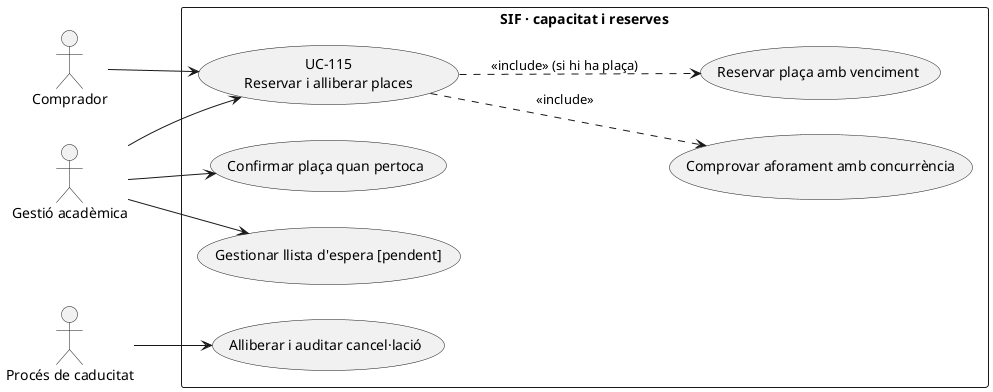
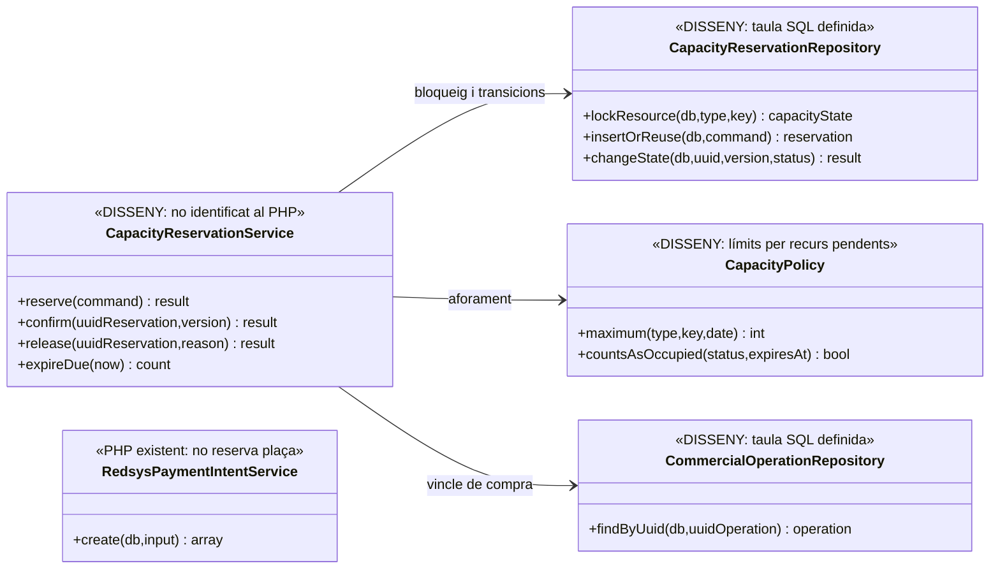
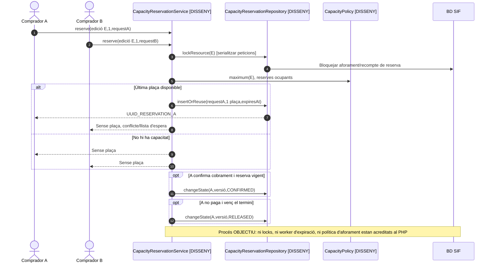

# UC-115 · Reservar i alliberar places amb aforament, caducitat i concurrència

**Objectiu canònic:** cada plaça/reserva té titular, quantitat, estat, venciment i control de concurrència; cancel·lació, expiració i eventual llista d'espera són transicions registrades. **Decisions pendents:** si la capacitat es calcula per curs o aula/sessió, durada de la reserva, llista d'espera, sobreaforament autoritzat i ordre d'alliberament.

**Estat del repositori:** la migració `2026_09_16_000005_add_operation_lifecycle_tables.sql` defineix `capacity_reservation` amb `RESOURCE_TYPE/KEY`, `QUANTITY`, `STATUS`, `WAITLIST_POSITION`, `EXPIRES_AT`, `LOCK_VERSION` i clau idempotent. **No s'ha acreditat un `CapacityReservationService` PHP, un límit màxim de places amb verificació transaccional o un worker de caducitat.** La taula, per si mateixa, **no impedeix la sobrevenda**, ja que no s'ha localitzat una regla executable sobre capacitat màxima i suma de reserves actives.

## 1. Fitxa específica

| Element | Contracte |
| --- | --- |
| Actors | Alumne/comprador, ecommerce/gestió acadèmica i procés autoritzat de caducitat/alliberament. Redsys només confirma el pagament, **no reserva la plaça**. |
| Unitat de capacitat | `RESOURCE_TYPE` i `RESOURCE_KEY` han d'identificar **l'aforament real** de la sessió/aula/edició acordada; no barrejar una plaça d'un curs amb una d'una altra edició o sessió. |
| Entrada | `UUID_OPERATION`, `UUID_LINE` opcional, persona/inscripció, recurs, quantitat positiva, termini/estat, request ID i idempotència. La durada exacta i els estats autoritzats **no estan fixats en la migració**. |
| Dades SQL definides | `UUID_CAPACITY_RESERVATION`, `UUID_OPERATION`, `UUID_LINE`, `RESOURCE_TYPE`, `RESOURCE_KEY`, `QUANTITY`, `STATUS`, `WAITLIST_POSITION`, `EXPIRES_AT`, `CONFIRMED_AT`, `RELEASED_AT`, `RELEASE_REASON`, `LOCK_VERSION`, `IDEMPOTENCY_KEY`. |
| Integritat requerida | La suma de reserves que **consumeixen plaça** més places confirmades ha de ser ≤ capacitat aprovada del recurs, amb lock/versió o mecanisme equivalent. El SQL conté `LOCK_VERSION`, però **no** acredita que es faci un `SELECT ... FOR UPDATE` o una restricció agregada efectiva. |
| Resultat | Reserva identificable i vinculada a UC-106; confirmació només quan la inscripció existeix i la política permet mantenir plaça; alliberament amb actor/motiu i opció de llista d'espera aprovada. |
| Efecte fiscal/econòmic | Reservar, expirar o alliberar una plaça **no implica per si sol** `factura`, `CHARGE`, `REFUND` o saldo. Si el client **ja ha pagat**, la baixa/alliberament acadèmic exigeix gestió de l'ingrés i possible canvi, devolució o incidència separada. |

### 1.1. Flux objectiu de reserva i confirmació

1. UC-106/checkout determina recurs i quantitat i consulta la política d'aforament (edició/sessió/aula, places reservades/confirmades, bloquejos i llista d'espera). El recurs i les places disponibles **no** es dedueixen del total de pagaments.
2. El servei **pendent** bloqueja o serialitza la decisió sobre el recurs, calcula disponibilitat sense incloure reserves caducades que ja no consumeixen plaça i identifica peticions equivalents per clau idempotent.
3. Quan hi ha plaça, crea una fila `capacity_reservation` vinculada a `UUID_OPERATION`, amb `STATUS` inicial definit per negoci, quantitat, `EXPIRES_AT` i `LOCK_VERSION`. Quan no n'hi ha, rebutja o entra a llista d'espera **només segons regla aprovada**.
4. UC-112 congela l'edició, plaça i import abans de la intenció TPV; `RedsysPaymentIntentService::create()` només registra la intenció, **no** modifica `capacity_reservation` en el codi revisat.
5. Amb cobrament confirmat, el coordinador **pendent** revalida la mateixa reserva i la seva vigència i confirma plaça/inscripció **una vegada**. Si el pagament és real però la plaça s'ha alliberat, no fingir que Redsys ha garantit aforament; obrir incidència i decidir nova plaça, canvi o retorn sobre l'ingrés real.
6. En cancel·lació, expiració o baixa, el servei de capacitat marca l'estat amb `RELEASED_AT`, `RELEASE_REASON` i correlació/actor via event operatiu; no esborra la reserva i no genera un `REFUND` sense sortida bancària.
7. La promoció d'una persona de llista d'espera (si existeix) es fa després de liberar capacitat **amb nova comprovació d'elegibilitat, preu i termini**; no emet factura ni captura targeta automàticament només perquè s'ha alliberat una plaça.

### 1.2. Alternatives i proves crítiques

| Cas | Resultat |
| --- | --- |
| Queda 1 plaça; arriben 2 peticions simultànies | **Una** reserva consumidora de plaça; l'altra es rebutja/espera segons política. `LOCK_VERSION` sense servei transaccional no garanteix això. |
| Retry de la mateixa operació després de timeout | Reutilitzar `UUID_CAPACITY_RESERVATION`; no reservar dues places per la mateixa petició. |
| Reserva venç, pagament encara pendent | Alliberar segons regla; cap reemborsament de diners inexistents. |
| Callback arriba després que la reserva s'hagi alliberat | No concedir plaça fictícia ni descartar pagament confirmat; investigar i classificar el tractament econòmic/fiscal separadament. |
| Sessió amb places disponibles però aula plena | La política de `RESOURCE_TYPE/KEY` ha de definir quin límit és determinant; el SQL no ho decideix. |
| Empresa compra N places de jornada | Reservar `QUANTITY=N` o N reserves de línia segons acord, amb N participants explícits i **una entrada de diners real** quan es paga. |
| Canvi de curs o baixa d'inscrit ja pagat | Alliberar plaça vella, intentar plaça nova i tractar els fons de la inscripció per UC-71/72/105; no registrar `REFUND` només per canviar `STATUS`. |
| Alliberament i reserva simultanis | Transicions monotòniques/auditades amb versionat i conciliació; impedir que un venciment tardà alliberi una plaça ja confirmada. |

**Pendents de tancament:** capacitat per recurs/edició/sessió i font d'aforament, política de venciment i llista d'espera, writer SQL amb locks i proves simultànies, efecte de TPV tardà, coordinació amb inscripcions llegades i traça econòmica.

## 2. Diagrama UML de casos d'ús

## 3. Classes — esquema SQL definit, servei no acreditat

`RedsysPaymentIntentService` **no depèn de `CapacityReservationService`** al PHP revisat: el checkout ha de coordinar-los en un adaptador explícit quan existeixi.

## 4. Seqüència — última plaça i confirmació/expiració (DISSENY)

## 5. Traçabilitat

[UC-115 original](../06-fitxes-funcionals/uc-115.md) · [UC-106 reserva](uc-106-crear-reserva-abans-pagament.md) · [UC-107 duplicat](uc-107-detectar-inscripcio-duplicada.md) · [UC-112 congelació](uc-112-congelar-snapshot-abans-tpv.md) · [UC-63 intenció](uc-063-crear-intencio-redsys.md) · [Migració capacity_reservation](../../sif/database/migrations/2026_09_16_000005_add_operation_lifecycle_tables.sql) · [Revisió transversal de fons](00-revisio-moviments-inscripcions.md).
