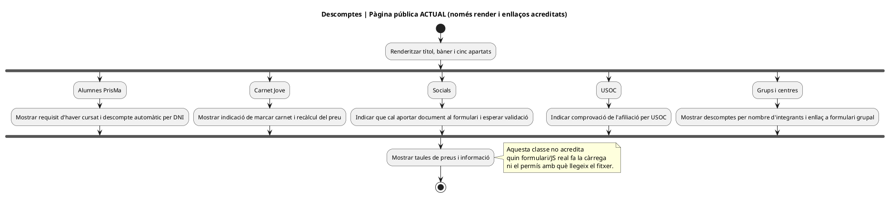
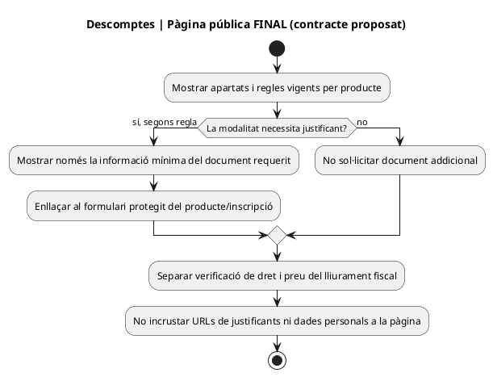
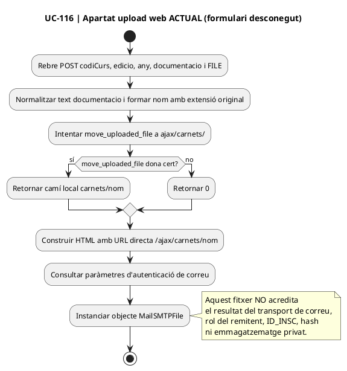
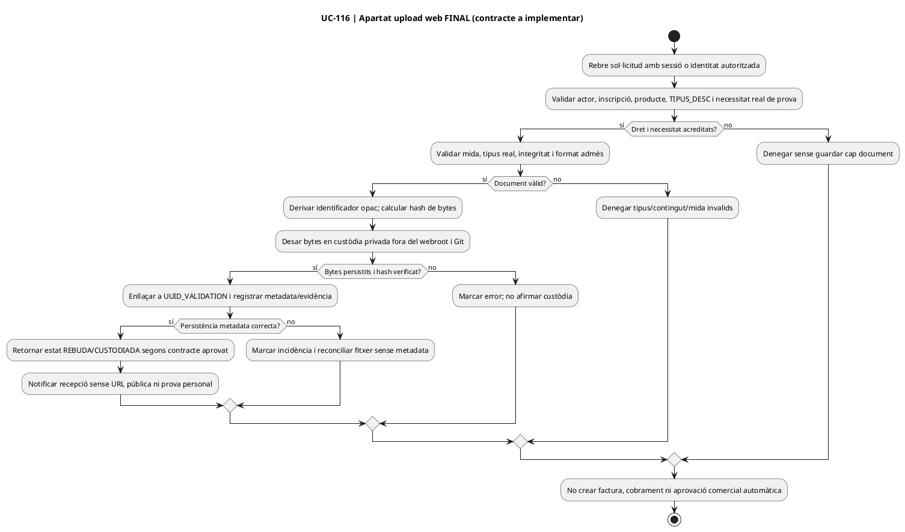
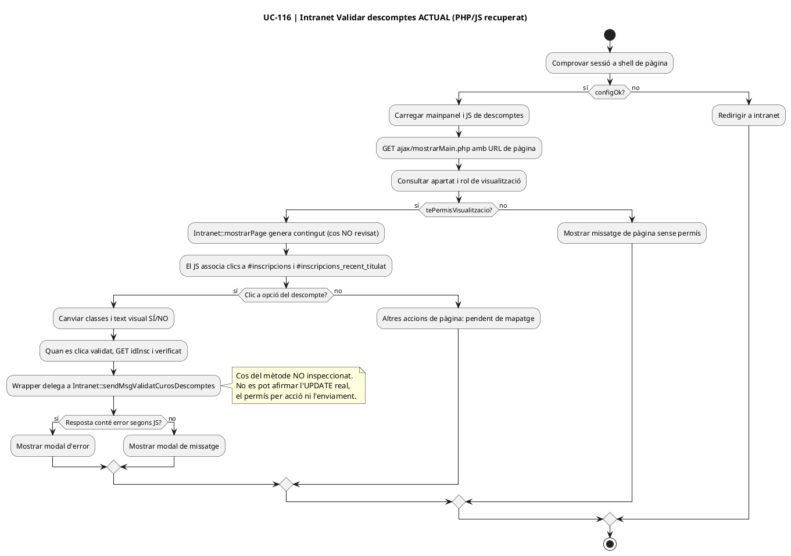
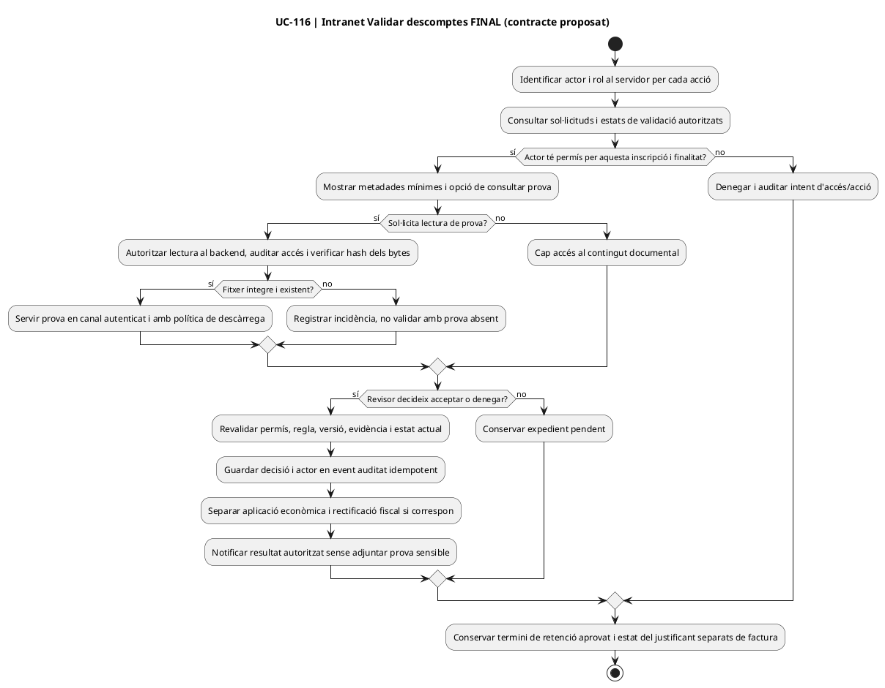

# UC-116 — diagrames d'activitat per pàgina i apartat (RM-037)

**Versió del codi observat:** main @ e71958b3026549bde09fb4b25f2ec3ba370937ec (22/09/2026). **Estat:** diagrames delimitats per les fonts visibles; la pàgina/formulari que crida l'upload no s'ha identificat, ni el cos de `Intranet::mostrarPage` / `sendMsgValidatCurosDescomptes`; per tant, aquests punts es marquen **PENDENT DE CONTRAST**. No és una representació completa de totes les pàgines de la web o de la intranet. [Auditoria i matriu d'accions](00-auditoria-casos-pendents-lot-05-uc-116-2026-09-22.md).

## 1. Pàgina pública «Descomptes» — cinc apartats visibles

**Font:** [Descomptes.php](../../codi-drive/web-actual/Descomptes.php#L185-L257) mostra les seccions «Alumnes PrisMa», «Carnet Jove», «Socials», «USOC» i «Grups i centres» i consulta preus per la taula. Només l'apartat «Socials» indica explícitament aportar prova i esperar validació. La classe és un renderitzador de contingut: NO acredita la URL de formulari, una descàrrega ni l'execució del procés de validació.

### ACTUAL — pàgina informativa

### FINAL — informació i vies segons evidència realment necessària (DISSENY)

**Pendents:** URL/pàgina real de cadascun dels formularis, variants i tipus de preu vigents, condicions de grup i si la comprovació USOC comporta o no càrrega documental. Aquests apartats corresponen també als UC comercials respectius; no reinterpretar-los tots com a UC-116.

## 2. Apartat de formulari web «Aportar document» — ruta AJAX contrastada

**Font:** [enviarImatgeCarnetInscripcio.php](../../codi-drive/web-actual/ajax/enviarImatgeCarnetInscripcio.php). **Origen de pàgina i controls del navegador no identificats**: només se'n dibuixa el subflux servidor i se'n marca l'entrada desconeguda.

### ACTUAL — endpoint de pujada i preparació d'avís

### FINAL — endpoint de recepció i custòdia (DISSENY)

**Pendents:** identificar la pàgina/URL d'origen i els controls del navegador, verificació al servidor productiu, política per tipus de descompte, protocol d'accés, retenció i gestió de fitxer prèviament compartit amb una URL directa.

## 3. Pàgina intranet «Validar descomptes» — dos apartats amb accions diferents

**Fonts:** [alumnes-validar-descomptes.php](../../codi-drive/intranet-actual/alumnes-validar-descomptes.php), [JS](../../codi-drive/intranet-actual/js/alumnes-validar-descomptes.js), [mostrarMain.php](../../codi-drive/intranet-actual/ajax/mostrarMain.php) i [wrapper de decisió](../../codi-drive/intranet-actual/ajax/alumnes/sendMsgValidatCurosDescomptes.php). La pàgina inclou els selectors `#inscripcions` (descompte) i `#inscripcions_recent_titulat` (resguard); el segon apartat té funcionalitat pròpia, però **no es revisa el seu UC** en aquest lot.

### ACTUAL — càrrega de pàgina i acció de descompte

### FINAL — revisió i decisió amb permisos/traça (DISSENY)

**Pendents per completar RM-037:** estructura exacta d'apartats generada per `Intranet::mostrarPage`, accions de la taula i el mètode de persistència; ampliar diagrames de la pàgina completa quan estiguin acreditades les fonts. Els subfluxos del resguard novell **no s'auditen ni es donen per completats** en UC-116.
