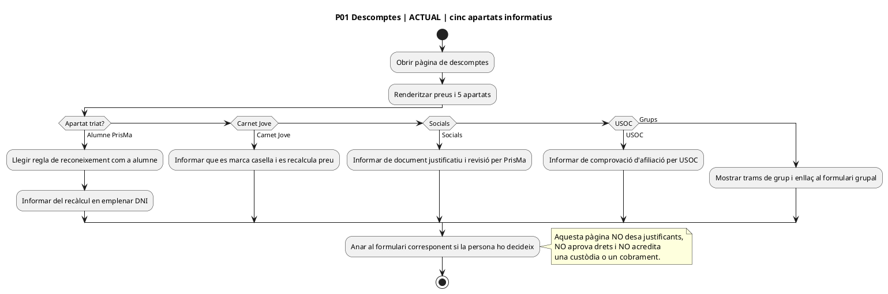
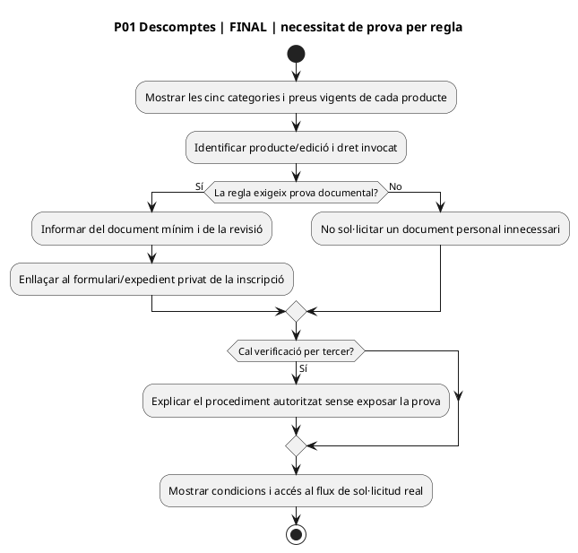
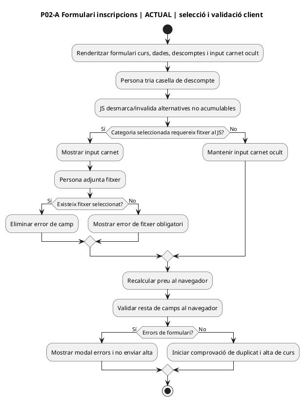
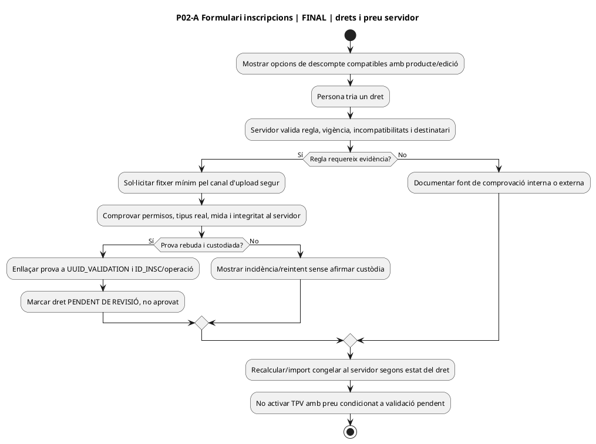
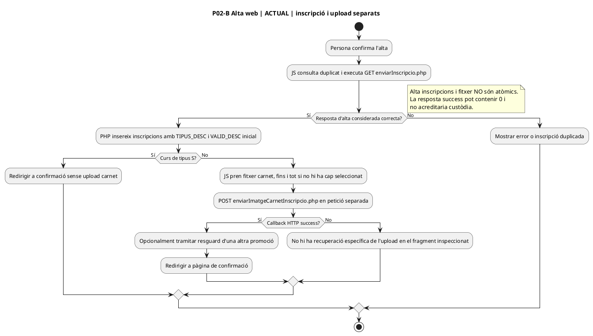
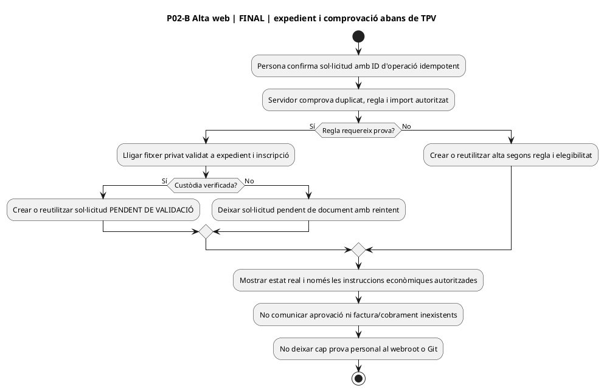
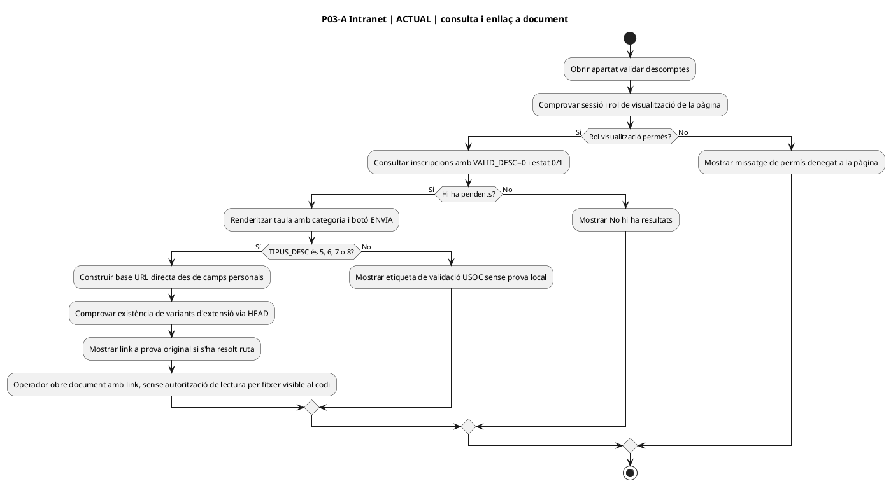
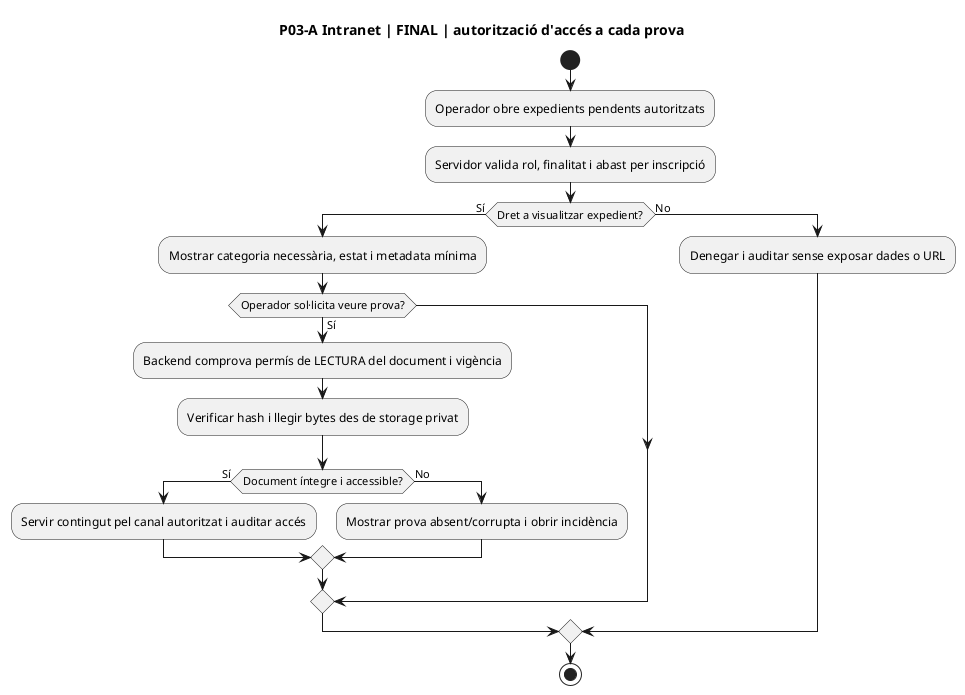
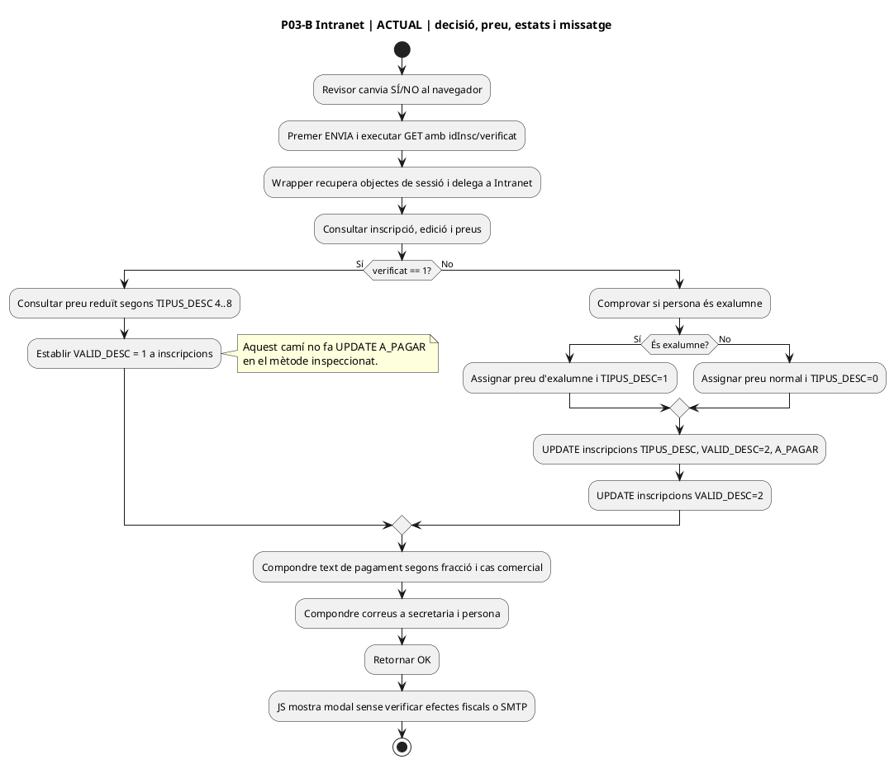
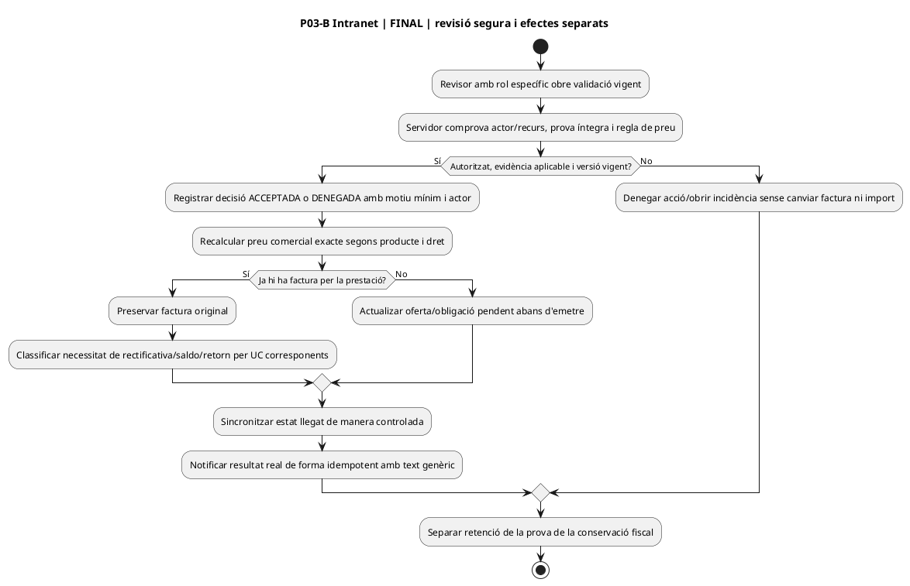

# UC-116 — diagrames d'activitat ACTUAL i FINAL per pàgina i apartat

**Revisió de contingut:** 22/09/2026. **Font PHP/JS:** main @ e71958b3026549bde09fb4b25f2ec3ba370937ec. **Cobertura del UC-116:** pàgina informativa de descomptes, formulari públic de curs normal (selecció i aportació de justificant), pantalla de confirmació derivada, pàgina de validació intranet (consulta/decisió). L'apartat de resguard de recent titulació de la mateixa pàgina és una acció DIFERENT: enllaç al seu UC; no reinterpretar-la com si fos UC-116. **Etiqueta ACTUAL:** observació estàtica del repo, no prova de desplegament. **Etiqueta FINAL:** contracte proposat, no implementat. [Fitxa UC-116](../06-fitxes-funcionals/uc-116.md#22-especificacio-consolidada-uc-116--codi-actual-i-contracte-final) · [auditoria](00-auditoria-casos-pendents-lot-05-uc-116-2026-09-22.md).

## P01 · Pàgina pública de descomptes — cinc apartats

**Fonts:** [pàgina](../../codi-drive/web-actual/pagina_descomptes.php), [endpoint de render](../../codi-drive/web-actual/ajax/mostrar_pagina_descomptes.php), [classe Descomptes.php](../../codi-drive/web-actual/Descomptes.php#L185-L265). Mapa d'apartats: 1 exalumne PrisMa (identificació interna), 2 Carnet Jove (marcar casella i càlcul), 3 socials (document + validació posterior), 4 USOC (comprovació externa de l'afiliació), 5 grups/centres (tarifes per nombre i enllaç a inscripció grupal). No totes les famílies exigeixen l'upload UC-116.

### P01 — ACTUAL

### P01 — FINAL

## P02 · Pàgina pública d'inscripció a un curs — apartat «Descomptes a aplicar»

**Fonts:** [shell pagina_inscripcions.php](../../codi-drive/web-actual/pagina_inscripcions.php) carrega [mostrarInscripcions.min.js](../../codi-drive/web-actual/js1619773569/mostrarInscripcions.min.js); [ajax/mostrar_inscripcio.php](../../codi-drive/web-actual/ajax/mostrar_inscripcio.php) crea [InscripcioCurs.php](../../codi-drive/web-actual/InscripcioCurs.php#L487-L585). La vista mostra caselles exclusives de descompte i un input ocult `#carnet`; el JS el fa visible per discapacitat, família nombrosa, monoparental i una altra categoria sensible representada per `TIPUS_DESC=8`. Per USOC no mostra aquest input en el camí inspeccionat. Exalumne/Carnet Jove són altres comprovacions comercials. `validarFileCarnet()` exigeix que hi hagi un fitxer quan una de les quatre caselles el requereix: **és validació JS de presència, no validació servidor del document**.

### P02-A — ACTUAL · seleccionar descompte i fitxer

### P02-A — FINAL · tria de dret i evidència mínima

## P02-B · Apartat «Confirmar inscripció» i càrrega asíncrona del justificant

**Fonts:** [JS línies 2113–2126 i 2198–2309](../../codi-drive/web-actual/js1619773569/mostrarInscripcions.min.js#L2113-L2309), [enviarInscripcio.php](../../codi-drive/web-actual/ajax/enviarInscripcio.php#L585-L604), [endpoint de prova](../../codi-drive/web-actual/ajax/enviarImatgeCarnetInscripcio.php#L12-L75) i [pàgina de confirmació](../../codi-drive/web-actual/pagina_confirmacio_inscripcio.php). `enviarInscripcio.php` estableix `VALID_DESC=0` quan `TIPUS_DESC` és 4–8; l'alta llegat és prèvia a l'upload. La crida a l'upload es fa després de rebre resposta d'alta per a qualsevol `tipusCurs != 'S'`, amb `$('#carnet')[0].files[0]` encara que no s'hagi seleccionat fitxer. El JS té callback `success`, però **no comprova que la resposta indiqui custòdia** i no s'ha identificat `fail` específic d'aquell upload en el fragment. El confirmatori també pot dependre de l'upload separat de resguard recent titulat, que correspon a un UC diferent.

### P02-B — ACTUAL · dos commits independents

### P02-B — FINAL · alta comercial amb obligació documental traçable

## P03 · Intranet /alumnes/validar-descomptes/ — apartat de lectura del justificant

**Fonts:** [shell](../../codi-drive/intranet-actual/alumnes-validar-descomptes.php), [mostrarMain.php](../../codi-drive/intranet-actual/ajax/mostrarMain.php), [Intranet.php, mostrarPage i __mostrarPage_Alumnes_ValidarDescomptes](../../codi-drive/intranet-actual/Intranet.php#L1401-L1404) i [JS de pàgina](../../codi-drive/intranet-actual/js/alumnes-validar-descomptes.js). `mostrarPage` construeix dos apartats independents en aquesta ruta: **recent titulació** i **validació de descomptes**. La consulta `cnsAlumnDescNoValidat` filtra inscripcions `VALID_DESC=0` i estats d'inscripció 0/1. El render mostra nom, cognoms, identificador personal, correu, categoria, un marcador SÍ/NO i botó ENVIA. Per TIPUS_DESC 5–8 prova extensions sobre una URL derivada d'edició+curs+documentació personal amb `url_exists` i mostra un enllaç al fitxer; per 4 mostra etiqueta USOC sense aquest enllaç. Per 8, el render utilitza per error la mateixa etiqueta gràfica que 7: corregir al canal final, però NO inventar que la prova està absent.

### P03-A — ACTUAL · consulta de documents per URL directa

### P03-A — FINAL · lectura privada auditada

## P03-B · Intranet, apartat «Validar descomptes» — decisió i comunicació

**Fonts:** [JS línies 28–94](../../codi-drive/intranet-actual/js/alumnes-validar-descomptes.js#L28-L94), [wrapper AJAX](../../codi-drive/intranet-actual/ajax/alumnes/sendMsgValidatCurosDescomptes.php) i [Intranet::sendMsgValidatCurosDescomptes línies 15530–16090](../../codi-drive/intranet-actual/Intranet.php#L15530-L16090). El JS commuta SÍ/NO i, en prémer ENVIA, envia GET `idInsc/verificat`. El mètode actual: consulta dades d'inscripció i preus; si s'accepta, calcula preu descomptat per TIPUS_DESC 4–8 i estableix `VALID_DESC=1`; **en aquesta branca no es veu UPDATE d'`A_PAGAR`**. Si es denega, compara amb elegibilitat d'exalumne; escriu `TIPUS_DESC`, `VALID_DESC=2`, `A_PAGAR` segons el preu alternatiu; encara després hi ha un segon UPDATE de `VALID_DESC=2`. Calcula textos per fraccionament i una variant especial USOC i construeix correus a secretaria i a la persona. La creació d'objectes de correu no prova el resultat SMTP. No es veu control de rol específic per acció, condició d'estat/versió d'operació ni comprovació de factura emesa en aquest mètode.

### P03-B — ACTUAL · aprovació/denegació

### P03-B — FINAL · decisió versionada i aplicació comercial/fiscal condicionada

## Matriu d'accions i límits

| Pàgina / apartat | Control → punt d'entrada → classe/taula | UC principal i connexions | Estat documental |
| --- | --- | --- | --- |
| P01 / Descomptes (5 seccions) | pagina_descomptes.php → Descomptes::mostrarPagina → preus/catàleg | UC-116 només secció que requereix document; UC de preus/descomptes i grups | Contrastat al PHP de main. |
| P02 / Selecció i prova | pagina_inscripcions.php → JS → ajax/mostrar_inscripcio.php → InscripcioCurs.php; JS `validarFileCarnet` | UC-116, UC-20b i UC-107 quan duplicitat | Contrastat al PHP i JS de main. |
| P02 / Alta, upload, confirmació | JS → enviarInscripcio.php → inscripcions; després JS → enviarImatgeCarnetInscripcio.php → webroot; després confirmació | UC-116 per prova; UC alta/validació/preu/fiscal separats | Contrastat al PHP/JS; resultat runtime del correu/storage no provat. |
| P03 / Consulta de proves | shell intranet → mostrarMain → Intranet::mostrarPage / __mostrarPage_Alumnes_ValidarDescomptes; links per TIPUS_DESC 5..8 | UC-116, accés i decisió UC de validació de descomptes | Contrastat fins a render PHP inclòs. |
| P03 / Decisió | JS `.validat` → wrapper AJAX → Intranet::sendMsgValidatCurosDescomptes → inscripcions.VALID_DESC, TIPUS_DESC/A_PAGAR (segons branca), correus | UC-116 vincula prova; modificació econòmica i notificació als UC corresponents | Contrastat el cos PHP; no prova de deployed/SMTP/BD. |
| P03 / recent titulat | `#inscripcions_recent_titulat` → `validatResguard`, endpoint diferent | **Fora de l'abast UC-116**; consultar UC propi, no duplicar | Identificat com a apartat diferent; no reauditat aquí. |

**Tancament RM-037 en l'abast UC-116:** els apartats actuals visibles a les fonts inspeccionades tenen diagrama ACTUAL/FINAL, incloent la frontera amb els altres UC. **No s'afirma:** haver inspeccionat totes les altres pantalles i rutes del repositori, ni el desplegament, ni executat PlantUML contra un renderitzador, ni verificada l'aplicació d'aquest disseny.
