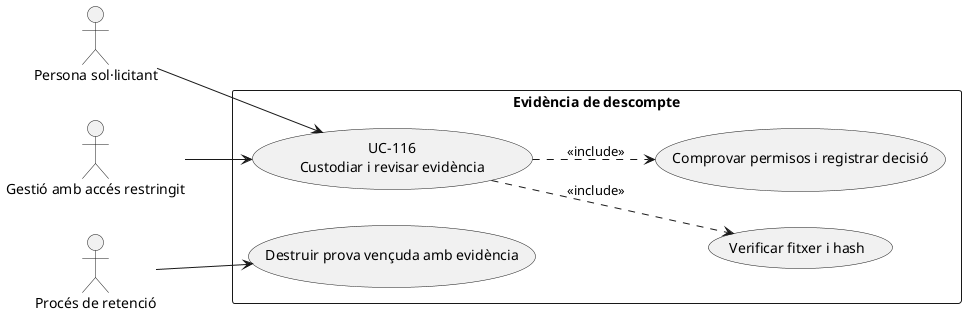
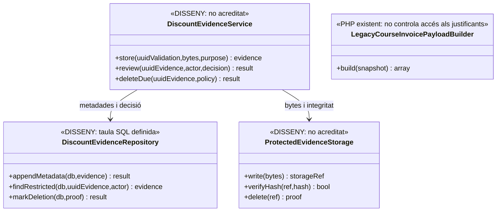
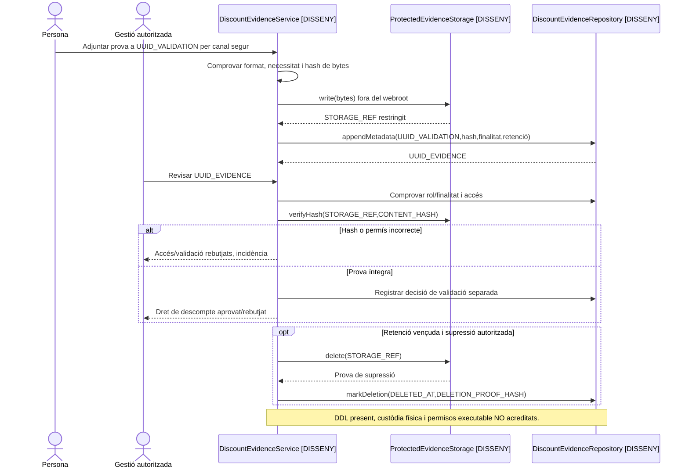

# UC-116 · Custodiar i revisar evidències sensibles de descompte

**Objectiu canònic de la fitxa original:** cada justificant té hash, custòdia protegida, finalitat, controls d'accés, decisió i termini de retenció; no queda exposat al webroot ni reduït a un correu. **Bloquejant:** determinar per `TIPUS_DESC` quina evidència es demana, la base jurídica/necessitat de custòdia, rols habilitats, ubicació i termini de supressió amb negoci i protecció de dades.

**Evidència d'esquema:** `discount_evidence` conté `UUID_VALIDATION` (FK a `discount_validation`), `STORAGE_REF`, `CONTENT_HASH`, `MIME_TYPE`, `SIZE_BYTES`, `ACCESS_CLASSIFICATION=RESTRICTED` per defecte, `PURPOSE_CODE`, `RETENTION_POLICY_CODE`, `DELETE_AFTER`, `DELETED_AT` i `DELETION_PROOF_HASH`. `UNIQUE(UUID_VALIDATION,CONTENT_HASH)` només deduplica fitxers dins una validació. **No s'ha acreditat** un servei PHP que encripti/carregui/verifiqui bytes, protegeixi descàrregues, controli accessos o n'executi la supressió. `DocumentRepository` tracta documents de factura, **no prova la custòdia dels justificants**.

## 1. Fitxa específica

| Pas | Contracte i risc |
| --- | --- |
| Sol·licitud | Relacionar subjecte, `ID_INSC`, dret de descompte, norma comercial, verificació que cal fer, actor i finalitat. No incloure diagnòstic o dades innecessàries al concepte de factura ni al log de Redsys. |
| Recepció | Validar format, extensió/MIME real, mida i integritat i transportar per canal restringit. Generar hash dels **bytes**, no només d'una ruta o nom de fitxer, i guardar `STORAGE_REF` opac fora del webroot. |
| Custòdia | Permisos de lectura per finalitat i rol; l'existència de `ACCESS_CLASSIFICATION` a la BD **no és autorització executable**. No exposar `STORAGE_REF` com a URL directa pública. |
| Revisió | Enllaçar justificant a `UUID_VALIDATION`, decisió, validador i instant. Guardar informació mínima de motiu intern; preparar text visible de descompte **diferent** i genèric per a la factura (UC-20b). |
| Retenció/supressió | Definir termini real i política de legal hold quan correspongui; en venciment, comprovar autoritzacions i eliminar bytes/metadades segons política amb prova, no marcar només `DELETED_AT` sense verificació. |
| Economia/fiscalitat | Validar una evidència **no és** `CHARGE`, `REFUND`, factura ni moviment de fons. Si s'aprova després d'emetre, una rectificació/ajust requereix UC-90 i classificació fiscal separada; no fer `UPDATE` sobre línia original. |

### 1.1. Flux objectiu

1. La persona/gestió inicia validació de descompte amb tipus, regla, finalitat i rol legitimats; un controlador de dades **pendent** especifica quina evidència concreta és necessària, sense sol·licitar-ne més.
2. El servei de custòdia **pendent** valida bytes, calcula `CONTENT_HASH`, els emmagatzema en ubicació protegida i només després escriu la metadata `discount_evidence` associada a `UUID_VALIDATION`; si un dels dos passos falla, deixa incidència recuperable i no declara el fitxer custodiat.
3. Un operador amb rol adequat accedeix a la prova mitjançant una acció auditada, registra decisió i versió de la regla, i restringeix qualsevol descàrrega a la finalitat aprovada.
4. La capa comercial passa **només la decisió/valor de descompte** al snapshot fiscal. `LegacyCourseInvoicePayloadBuilder` pot transportar motiu intern i text de visualització, però **no garanteix** que el document PDF exclogui el motiu intern.
5. En caducar el termini s'aplica la política aprovada, incloent dependències/revisions, destrucció real i prova, sense esborrar un registre fiscal immutable com a «neteja» del justificant.

### 1.2. Alternatives i proves

| Cas | Resultat |
| --- | --- |
| Dos uploads idèntics a la mateixa validació | Reús/metadada única per la restricció `UNIQUE(UUID_VALIDATION,CONTENT_HASH)`; no saltar validació de permisos per coincidència de hash. |
| Document malmès o hash no coincideix | Bloquejar revisió automàtica i obrir incidència; no aprovar descompte només per `STORAGE_REF`. |
| Operador sense rol de justificants | Denegar la lectura **i auditar l'intent**; el rol no deriva de disposar de l'UUID. |
| Factura a empresa amb persona beneficiària | Text genèric i import quan pertoca; no lliurar al pagador el justificant personal per defecte. |
| Prova ja no necessària però factura conservada | Aplicar retenció diferenciada: el document fiscal històric i el justificant intern **no són el mateix objecte**. |

**Proves pendents:** upload/download restringit, hash de bytes, documents maliciosos, fuites al PDF/exportacions/log, retenció i prova d'eliminació, recuperació tras fallada de storage, control d'accés i reintents. Cap prova d'aquest servei ha estat executada.

### 1.3. Del justificant enviat pel llegat a una prova custodiada

La documentació del sistema identifica `sendMsgValidatCurosDescomptes()` com una rutina que valida documentació, recalcula l'import i pot generar enllaços de pagament, i `enviarImatgeCarnetInscripcio.php` entre les vies del cicle de descomptes. **Això només acredita l'existència d'operatives llegades de recepció i tramitació**, no que el justificant es desi al `discount_evidence` del SIF, que existeixi un hash verificat dels bytes, ni que es disposi de control d'accés, retenció i prova d'esborrat. No marcar `UUID_VALIDATION` com a «prova custodiada» per haver rebut una imatge o un correu al circuit antic.

**Condició de l'evidència per etapa.** Distingir `REBUDA` (aportació del document al canal), `PENDENT_REVISIO`, `VALIDADA/DENEGADA` (decisió sobre el dret) i `CUSTODIADA` (bytes emmagatzemats, hash i controls d'accés comprovats); són **estats funcionals proposats**, no enums implementats en les taules. Una validació manual pot ser una decisió real encara que no s'hagi migrat el fitxer, però no s'ha d'afirmar que les dues fites són equivalents. Conservar referència a la inscripció i regla comercial; limitar l'atribució de decisió a l'operador que realment l'ha pres.

**Dades en trànsit i sortides.** El justificant personal no s'inclou en `redsys_payment_intent.SNAPSHOT_JSON` ni en `factura_linia.DESC_MOTIU_INTERN` com a document complet. La factura i els correus al pagador han de contenir només l'import i el text públic necessari; no enviar la imatge personal al receptor d'una factura de grup/empresa per defecte. Qualsevol descàrrega d'evidència ha de validar autorització al servidor, registrar l'accés i recuperar els bytes per una referència interna protegida, no per un `filename` aportat lliurement pel navegador.

**Manteniment i supressió.** El termini de retenció d'un justificant **no es dedueix** del nombre d'anys de conservació de la factura ni del venciment del codi promocional; la regla real queda pendent d'aprovació. Si s'elimina la prova segons política, conservar l'event mínim i les dades fiscals històriques que pertoquin **sense deixar una URL pública al fitxer original**; marcar `DELETED_AT` no prova que s'hagin destruït els bytes ni les còpies temporals.

### 1.4. Proves específiques de migració i accés (no executades)

| ID | Escenari | Resultat esperat |
| --- | --- | --- |
| EV-01 | El canal antic rep una imatge de carnet | Estat de recepció diferent de validació i de custòdia segura. |
| EV-02 | Dret validat manualment però fitxer no migrat al SIF | Decisió identificable, evidència/custòdia no acreditada fins a verificació real. |
| EV-03 | Hash o bytes absents malgrat metadades `discount_evidence` | Incidència; no donar per custodiat el document. |
| EV-04 | Responsable de grup o alumne d'una altra inscripció consulta justificant | Accés denegat i auditat al servidor. |
| EV-05 | Correu/PDF de pagament amb descompte | Només import/text públic, sense imatge o motiu intern personal. |
| EV-06 | Termini de retenció esgotat amb fitxer temporal encara present | Eliminar segons política aprovada i registrar prova sobre totes les còpies controlades. |

## 2. UML de casos d'ús

## 3. Diagrama de classes

## 4. Seqüència — custòdia, revisió i retenció (DISSENY)

## 5. Traçabilitat

[UC-116 original](../06-fitxes-funcionals/uc-116.md) · [UC-20b descompte sensible](uc-020b-aplicar-descompte-sensible.md) · [UC-111 docent novell](uc-111-docent-novell-dret-futur.md) · [UC-36 document fiscal](uc-036-generar-consultar-documents.md) · [Migració discount_evidence](../../sif/database/migrations/2026_09_16_000005_add_operation_lifecycle_tables.sql) · [Builder de factura](../../sif/src/Service/LegacyCourseInvoicePayloadBuilder.php).
