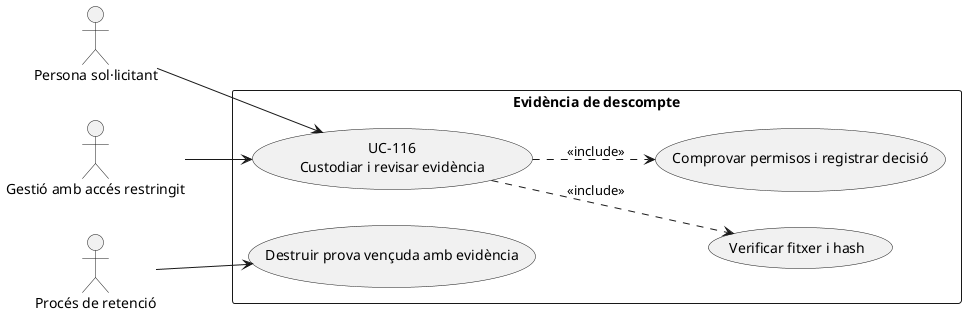
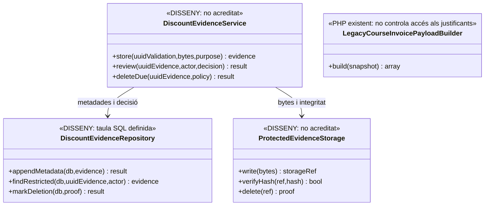

# UC-116 · Custodiar i revisar evidències sensibles de descompte

**Objectiu canònic de la fitxa original:** cada justificant té hash, custòdia protegida, finalitat, controls d'accés, decisió i termini de retenció; no queda exposat al webroot ni reduït a un correu. **Decisions acordades el 23/09/2026:** revisió MANUAL de secretaria, pagament BLOQUEJAT mentre pendent, inscripció CONSERVADA i nova oferta de pagament després de denegació, retenció durant termini definit amb posterior supressió i permisos diferenciats per persona/rol. **Encara per concretar:** evidència exacta per `TIPUS_DESC`, TRES MESOS des de la resolució manual; rols Secretaria, Gestió i Facturació. La política jurídica/ubicació i les autoritzacions exactes de Gestió/Facturació encara requereixen validació amb negoci i protecció de dades.

**Evidència d'esquema:** `discount_evidence` conté `UUID_VALIDATION` (FK a `discount_validation`), `STORAGE_REF`, `CONTENT_HASH`, `MIME_TYPE`, `SIZE_BYTES`, `ACCESS_CLASSIFICATION=RESTRICTED` per defecte, `PURPOSE_CODE`, `RETENTION_POLICY_CODE`, `DELETE_AFTER`, `DELETED_AT` i `DELETION_PROOF_HASH`. `UNIQUE(UUID_VALIDATION,CONTENT_HASH)` només deduplica fitxers dins una validació. **No s'ha acreditat** un servei PHP que encripti/carregui/verifiqui bytes, protegeixi descàrregues, controli accessos o n'executi la supressió. `DocumentRepository` tracta documents de factura, **no prova la custòdia dels justificants**.

## 1. Fitxa específica

| Pas | Contracte i risc |
| --- | --- |
| Sol·licitud | Relacionar subjecte, `ID_INSC`, dret de descompte, norma comercial, verificació que cal fer, actor i finalitat. No incloure diagnòstic o dades innecessàries al concepte de factura ni al log de Redsys. |
| Recepció | Validar format, extensió/MIME real, mida i integritat i transportar per canal restringit. Generar hash dels **bytes**, no només d'una ruta o nom de fitxer, i guardar `STORAGE_REF` opac fora del webroot. |
| Custòdia | Permisos de lectura per finalitat i rol; l'existència de `ACCESS_CLASSIFICATION` a la BD **no és autorització executable**. No exposar `STORAGE_REF` com a URL directa pública. |
| Revisió | Secretaria revisa MANUALMENT i registra actor/rol autoritzat, instant, evidència i ACCEPTACIÓ/DENEGACIÓ. Permisos de veure expedient, llegir bytes i decidir són diferenciats. No habilitar pagament mentre la revisió és pendent; amb denegació, mantenir inscripció i oferir pagar el nou import. Text públic genèric per a factura (UC-20b). |
| Retenció/supressió | ACORDAT conservar durant un termini DEFINIT i després eliminar. TRES MESOS comptats des de la resolució manual de la revisió; excepcions documentades de conservació i tractament d'expedients sense decisió requeriran política aprovada; al venciment eliminar bytes/còpies amb prova, no només `DELETED_AT`. |
| Economia/fiscalitat | Validar una evidència **no és** `CHARGE`, `REFUND`, factura ni moviment de fons. Si s'aprova després d'emetre, una rectificació/ajust requereix UC-90 i classificació fiscal separada; no fer `UPDATE` sobre línia original. |

### 1.1. Flux objectiu

1. La persona/gestió inicia validació de descompte amb tipus, regla, finalitat i rol legitimats; un controlador de dades **pendent** especifica quina evidència concreta és necessària, sense sol·licitar-ne més.
2. El servei de custòdia **pendent** valida bytes, calcula `CONTENT_HASH`, els emmagatzema en ubicació protegida i només després escriu la metadata `discount_evidence` associada a `UUID_VALIDATION`; si un dels dos passos falla, deixa incidència recuperable i no declara el fitxer custodiat.
3. Secretaria, amb permís diferenciat de LECTURA i de DECISIÓ per persona/rol (rols d'intranet implicats: Secretaria, Gestió i Facturació), revisa MANUALMENT i registra resultat; mentre PENDENT, el sistema NO permet pagar aquesta operació.
4. Si ACCEPTAT: fixar import autoritzat i obrir opció de pagament. Si DENEGAT: MANTENIR inscripció i oferir el pagament de l'import que correspongui, sense càrrec automàtic ni anul·lació. La capa comercial passa **només la decisió/valor de descompte** al snapshot fiscal. `LegacyCourseInvoicePayloadBuilder` pot transportar motiu intern i text de visualització, però **no garanteix** que el document PDF exclogui el motiu intern.
5. En caducar el termini s'aplica la política aprovada, incloent dependències/revisions, destrucció real i prova, sense esborrar un registre fiscal immutable com a «neteja» del justificant.

### 1.2. Alternatives i proves

| Cas | Resultat |
| --- | --- |
| Dos uploads idèntics a la mateixa validació | Reús/metadada única per la restricció `UNIQUE(UUID_VALIDATION,CONTENT_HASH)`; no saltar validació de permisos per coincidència de hash. |
| Document malmès o hash no coincideix | Bloquejar revisió automàtica i obrir incidència; no aprovar descompte només per `STORAGE_REF`. |
| Operador sense rol de justificants | Denegar la lectura **i auditar l'intent**; el rol no deriva de disposar de l'UUID. |
| Factura a empresa amb persona beneficiària | Text genèric i import quan pertoca; no lliurar al pagador el justificant personal per defecte. |
| Prova ja no necessària però factura conservada | Aplicar retenció diferenciada: el document fiscal històric i el justificant intern **no són el mateix objecte**. |

**Proves pendents:** upload/download restringit, hash de bytes, documents maliciosos, fuites al PDF/exportacions/log, retenció i prova d'eliminació, recuperació tras fallada de storage, control d'accés i reintents. Cap prova d'aquest servei ha estat executada.

### 1.3. Del justificant enviat pel llegat a una prova custodiada

**Contrast directe amb main (22/09/2026; ampliat a la secció 6):** [`enviarImatgeCarnetInscripcio.php`](../../codi-drive/web-actual/ajax/enviarImatgeCarnetInscripcio.php) rep POST i fitxer, forma el nom amb paràmetres i l'extensió original, desa via `move_uploaded_file()` sota `carnets/` i construeix una URL web directa al justificant en un HTML d'avís. No es veu en aquest fitxer una comprovació explícita de sessió/rol, MIME real/mida, hash dels bytes, vinculació amb `ID_INSC/UUID_VALIDATION`, custòdia fora de webroot o autorització de descàrrega. **La instanciació de `MailSMTPFile` no acredita el lliurament del correu.** A la intranet, [`sendMsgValidatCurosDescomptes.php`](../../codi-drive/intranet-actual/ajax/alumnes/sendMsgValidatCurosDescomptes.php) rep `idInsc/verificat` i delega a `Intranet::sendMsgValidatCurosDescomptes()`, però **el cos d'aquest mètode no s'ha pogut recuperar**: no és correcte afirmar ni descartar el càlcul, l'UPDATE, els permisos interns o l'enviament efectiu. El [JS de la pàgina](../../codi-drive/intranet-actual/js/alumnes-validar-descomptes.js) només acredita la commutació visual i la crida GET. Tot això no acredita la custòdia `discount_evidence`, hash, rol per acció, retenció o esborrat del nou SIF. No marcar `UUID_VALIDATION` com a «prova custodiada» per haver rebut una imatge o un correu al circuit antic.

**Condició de l'evidència per etapa.** Distingir `REBUDA` (aportació del document al canal), `PENDENT_REVISIO`, `VALIDADA/DENEGADA` (decisió sobre el dret) i `CUSTODIADA` (bytes emmagatzemats, hash i controls d'accés comprovats); són **estats funcionals proposats**, no enums implementats en les taules. Una validació manual pot ser una decisió real encara que no s'hagi migrat el fitxer, però no s'ha d'afirmar que les dues fites són equivalents. Conservar referència a la inscripció i regla comercial; limitar l'atribució de decisió a l'operador que realment l'ha pres.

**Dades en trànsit i sortides.** El justificant personal no s'inclou en `redsys_payment_intent.SNAPSHOT_JSON` ni en `factura_linia.DESC_MOTIU_INTERN` com a document complet. La factura i els correus al pagador han de contenir només l'import i el text públic necessari; no enviar la imatge personal al receptor d'una factura de grup/empresa per defecte. Qualsevol descàrrega d'evidència ha de validar autorització al servidor, registrar l'accés i recuperar els bytes per una referència interna protegida, no per un `filename` aportat lliurement pel navegador.

**Manteniment i supressió.** El termini de retenció d'un justificant **no es dedueix** del nombre d'anys de conservació de la factura ni del venciment del codi promocional; la regla real queda pendent d'aprovació. Si s'elimina la prova segons política, conservar l'event mínim i les dades fiscals històriques que pertoquin **sense deixar una URL pública al fitxer original**; marcar `DELETED_AT` no prova que s'hagin destruït els bytes ni les còpies temporals.

### 1.4. Proves específiques de migració i accés (no executades)

| ID | Escenari | Resultat esperat |
| --- | --- | --- |
| EV-01 | El canal antic rep una imatge de carnet | Estat de recepció diferent de validació i de custòdia segura. |
| EV-02 | Dret validat manualment però fitxer no migrat al SIF | Decisió identificable, evidència/custòdia no acreditada fins a verificació real. |
| EV-03 | Hash o bytes absents malgrat metadades `discount_evidence` | Incidència; no donar per custodiat el document. |
| EV-04 | Responsable de grup o alumne d'una altra inscripció consulta justificant | Accés denegat i auditat al servidor. |
| EV-05 | Correu/PDF de pagament amb descompte | Només import/text públic, sense imatge o motiu intern personal. |
| EV-06 | Termini de retenció esgotat amb fitxer temporal encara present | Eliminar segons política aprovada i registrar prova sobre totes les còpies controlades. |

## 2. UML de casos d'ús



## 3. Diagrama de classes



## 4. Seqüència — custòdia, revisió, pagament i retenció (DISSENY; DECISIONS ACORDADES)

```mermaid
sequenceDiagram
actor P as Persona
actor G as Secretaria autoritzada
participant S as DiscountEvidenceService [DISSENY]
participant Store as ProtectedEvidenceStorage [DISSENY]
participant R as DiscountEvidenceRepository [DISSENY]
participant C as Servei comercial i pagament [DISSENY]
P->>S: Adjuntar prova a UUID_VALIDATION per canal segur
S->>S: Comprovar necessitat, format i hash de bytes
S->>Store: write(bytes) fora del webroot
Store-->>S: STORAGE_REF restringit
S->>R: appendMetadata(UUID_VALIDATION, hash, finalitat i retenció)
R-->>S: UUID_EVIDENCE
S->>C: Estat descompte PENDENT; pagament BLOQUEJAT
G->>S: Revisió MANUAL de la prova
S->>R: Comprovar permís específic LECTURA i DECISIÓ per persona/rol
S->>Store: verifyHash(STORAGE_REF, CONTENT_HASH)
alt Permís o integritat incorrectes
 S-->>G: Accés/decisió rebutjats, obrir incidència
 Note over S,C: Mantenir pagament bloquejat mentre revisió pendent
else Prova íntegra i actor autoritzat
 alt ACCEPTACIÓ manual
  S->>R: Registrar ACCEPTACIÓ, actor i instant
  S->>C: Fixar import autoritzat i resoldre pendent
  C-->>P: Oferir pagament del preu autoritzat
 else DENEGACIÓ manual
  S->>R: Registrar DENEGACIÓ, actor i instant
  S->>C: Conservar ID_INSC i consultar dret d'exalumne per curs/edició
  alt Exalumne elegible
   C->>C: TIPUS_DESC=1; A_PAGAR=descomptes.PREU vigent tipus 1
  else No exalumne
   C->>C: TIPUS_DESC=0; A_PAGAR=preu.IMPORT ordinari vigent
  end
  C-->>P: Oferir pagament del nou import sense càrrec automàtic
 end
end
opt Han passat TRES MESOS des de decisió manual, supressió autoritzada
 S->>Store: delete(STORAGE_REF i còpies sota control)
 Store-->>S: Prova de supressió
 S->>R: markDeletion(DELETED_AT, DELETION_PROOF_HASH)
end
Note over S,R: DDL definit; serveis/retenció no acreditats com a PHP existent
Note over G,C: Rols Secretaria, Gestió i Facturació; permisos exactes de Gestió/Facturació per ratificar; cap pagament pendent
```

## 5. Traçabilitat

[UC-116 original](../06-fitxes-funcionals/uc-116.md) · [UC-20b descompte sensible](uc-020b-aplicar-descompte-sensible.md) · [UC-111 docent novell](uc-111-docent-novell-dret-futur.md) · [UC-36 document fiscal](uc-036-generar-consultar-documents.md) · [Migració discount_evidence](../../sif/database/migrations/2026_09_16_000005_add_operation_lifecycle_tables.sql) · [Builder de factura](../../sif/src/Service/LegacyCourseInvoicePayloadBuilder.php).

## 6. Contrast funcional actual/final i diagrames d'activitat — fitxa consolidada UC-116

[Fitxa funcional de 21 apartats](../06-fitxes-funcionals/uc-116.md) · [diagrames actuals i finals P01/P02/P02-B/P03/P03-B](uc-116-activitats-pagines-justificants-actual-final.md) · [auditoria detallada i incidència de dades](00-auditoria-casos-pendents-lot-05-uc-116-2026-09-22.md).

**Correcció dels límits inicials:** la pàgina i el JS que criden la pujada **sí que s'han identificat per al curs normal**: `InscripcioCurs.php` renderitza el camp `#carnet`, `js1619773569/mostrarInscripcions.min.js` mostra el camp per TIPUS 5–8, valida que hi hagi fitxer, registra la inscripció i DESPRÉS invoca `ajax/enviarImatgeCarnetInscripcio.php`. El document pujat no forma part de la transacció d'alta; el JS no comprova que el resultat de l'upload sigui diferent de `0` abans de redirigir. `enviarInscripcio.php` desa `TIPUS_DESC` i `VALID_DESC=0` per 4–8. Fonts: [formulari](../../codi-drive/web-actual/InscripcioCurs.php#L503-L607), [selecció](../../codi-drive/web-actual/js1619773569/mostrarInscripcions.min.js#L350-L425), [alta + upload](../../codi-drive/web-actual/js1619773569/mostrarInscripcions.min.js#L2188-L2362) i [persistència](../../codi-drive/web-actual/ajax/enviarInscripcio.php#L583-L610).

**Permisos i descripció de decisió de la intranet:** la shell i el wrapper PHP sí s'han inspectat directament; el [dossier d'activitats P03](uc-116-activitats-pagines-justificants-actual-final.md#p03--intranet-alumnesvalidar-descomptes--apartat-de-lectura-del-justificant) inclou una traça preexistent de `Intranet::mostrarPage` i `Intranet::sendMsgValidatCurosDescomptes`. En aquesta revisió el connector ha retornat buit el cos del fitxer `Intranet.php` per la mida, de manera que aquests detalls es mantenen **com a traça documental de P03 no verificada independentment ara**, no com a prova d'execució o desplegament. Ni la visualització de pàgina ni canviar un indicador SÍ/NO acrediten accés restringit al fitxer o aprovació fiscal/comercial automàtica.

**Domini i components:** `discount_validation` (SQL 000004) i `discount_evidence` (SQL 000005) són DDL definit, no una custòdia física comprovada. `DiscountEvidenceService`, repositori, permisos de lectura i storage privat continuen **DISSENY**. `EvidenceStore` del directori AEAT no és el servei d'aquest cas.

### 6.1. Traçabilitat de les activitats de pàgina a UC-116

| Diagrama ACTUAL/FINAL | Acció del cas | Codi/taula principal | Resultat a distingir |
| --- | --- | --- | --- |
| [P01](uc-116-activitats-pagines-justificants-actual-final.md#p01--pagina-publica-de-descomptes--cinc-apartats) | Llegir condicions de prova quan pertoqui | `Descomptes.php` | Informació comercial, cap prova rebuda. |
| [P02-A](uc-116-activitats-pagines-justificants-actual-final.md#p02--pagina-publica-dinscripcio-a-un-curs--apartat-descomptes-a-aplicar) | Seleccionar categoria; adjuntar si TIPUS 5–8 | `InscripcioCurs.php`, JS, `calcularPreu.php` | Fitxer seleccionat ≠ prova vàlida; import mostrat ≠ dret verificat. |
| [P02-B](uc-116-activitats-pagines-justificants-actual-final.md#p02-b--apartat-confirmar-inscripcio-i-carrega-asincrona-del-justificant) | Inscripció→upload→confirmació | `enviarInscripcio.php`, `enviarImatgeCarnetInscripcio.php`, `inscripcions` | `VALID_DESC=0` / alta registrada ≠ document custodit; HTTP success amb cos `0` ≠ upload reeixit. |
| [P03-A](uc-116-activitats-pagines-justificants-actual-final.md#p03--intranet-alumnesvalidar-descomptes--apartat-de-lectura-del-justificant) | Consultar proves pendents | shell, `mostrarMain`, render de `Intranet` documentat a P03 | Permís visualització ≠ autorització de baixar el document. |
| [P03-B](uc-116-activitats-pagines-justificants-actual-final.md#p03-b--intranet-apartat-validar-descomptes--decisio-i-comunicacio) | Acceptar/denegar dret, informar persona | JS, wrapper AJAX i mètode `Intranet` documentat a P03 | Decisió ≠ custòdia / reemborsament / edició de factura; verificar estat real i SMTP. |

### 6.2. Estat independent de la fitxa

**DOC:** contracte actual/final de les pàgines i apartats UC-116 identificats consolidat amb variants 0–8, matriu d'accions i criteris de prova; la traça interna de `Intranet.php` depèn de comprovació directa pendent de font gran, i les regles DEC116-01–05 requereixen responsable de negoci/dades. **IMP:** cap adaptació efectuada; **TEST:** cap prova executada; **SEGURETAT:** la publicació de documents del llegat en Git/webroot exigeix contenció separada, no acreditada. No confondre la conclusió DOC amb «SIF UC-116 acabat».

**Límit d'abast:** JASOM/recents titulats (UC-111), importació d'alumnes (UC-113), edicions (UC-114), packs i canals propis no queden revisats aquí, encara que algun comparteixi tipus de dada o pantalla.

### 6.3. Decisions confirmades per l'usuària — FINAL, NO ACTUAL

La [fitxa funcional 2.1](../06-fitxes-funcionals/uc-116.md#decisions-uc-116-fixades-expressament-el-23092026) fixa: **(1)** secretaria revisa manualment els justificants exigibles; **(2)** no es pot pagar mentre el descompte és pendent; **(3)** la denegació conserva la inscripció i ofereix pagar l'import pertinent; **(4)** conservar durant TRES MESOS des de la resolució manual i després eliminar; **(5)** permisos diferenciats entre els rols Secretaria, Gestió i Facturació. Els [diagrames P02-A/P02-B/P03-A/P03-B FINAL](uc-116-activitats-pagines-justificants-actual-final.md#decisions-incorporades-als-diagrames-finals-23092026) reflecteixen les cinc regles.

**Concretat:** durada de tres mesos des de la decisió, rols Secretaria/Gestió/Facturació i regla d'import alternativa que ja existeix al llegat: exalumne elegible → `descomptes.PREU` tipus 1; en cas contrari → `preu.IMPORT` ordinari, ambdós vigents per curs/edició. **Pendents de ratificació:** assignació concreta de permisos de Gestió/Facturació, prova exacta per modalitat i excepcions justificades de retenció. **ACTUAL:** no s'ha modificat PHP ni s'ha acreditat la implantació de les regles. **DOC de decisions: ACORDAT; IMP/TEST: PENDENT/NO EXECUTAT.**

### 6.4. Regla econòmica després de denegació i matriu de rols

El [diagrama P03-B ACTUAL](uc-116-activitats-pagines-justificants-actual-final.md#p03-b--intranet-apartat-validar-descomptes--decisio-i-comunicacio) ja descriu **dret d'exalumne → preu d'exalumne i `TIPUS_DESC=1`; en cas contrari → preu ordinari i `TIPUS_DESC=0`**, actualitzant `inscripcions.A_PAGAR` i `VALID_DESC=2`. [`calcularPreu.php`](../../codi-drive/web-actual/ajax/calcularPreu.php#L24-L39) llegeix `preu.IMPORT` i `descomptes.PREU` actius per tarifa/edició, i [L131–155](../../codi-drive/web-actual/ajax/calcularPreu.php#L131-L155) reconeix l'exalumne. **FINAL acordat:** conservar aquesta bifurcació, validar al servidor l'elegibilitat i la tarifa aplicable del curs/edició, mantenir la inscripció i oferir pagar només després de la decisió manual, sense càrrec automàtic. No inventar import numèric fix.

**Rols indicats per l'usuària:** **Secretaria, Gestió i Facturació**. La revisió manual i la decisió són de **Secretaria**; l'accés al document no és equivalent a consultar l'import. La [matriu operativa proposada a la fitxa funcional, §17.1](../06-fitxes-funcionals/uc-116.md#171-matriu-dels-tres-rols-dades-confirmades-i-assignacio-operativa-proposada) aplica mínim privilegi fins que es ratifiquin els permisos concrets de Gestió i Facturació. Cap d'aquests permisos és garantia executable pel sol fet de tenir un UML.

**Retenció:** `DELETE_AFTER` es fixa a **tres mesos des de la resolució manual** del document, i després s'eliminen bytes/còpies amb prova de supressió. Per a expedients sense decisió i excepcions aprovades cal una política diferent; no traslladar la retenció de carnets a les factures fiscals.
