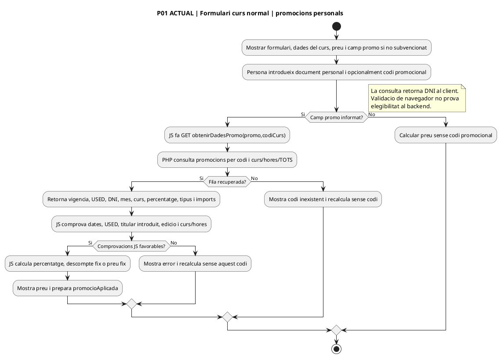
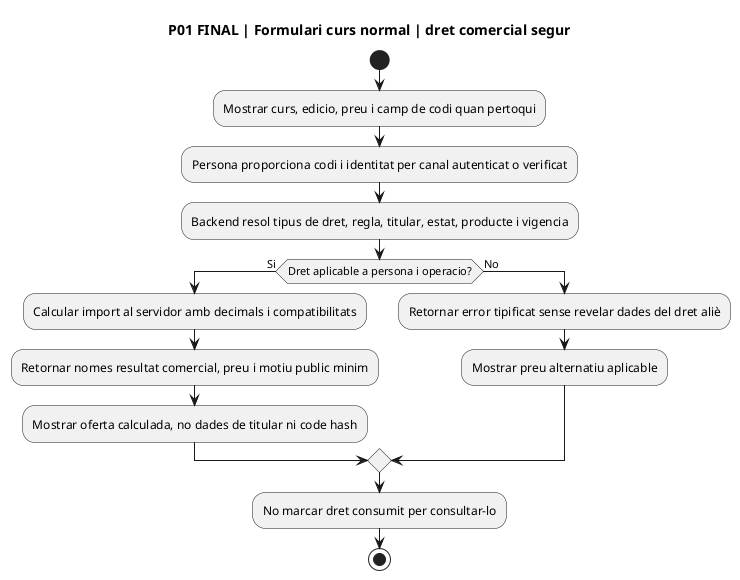
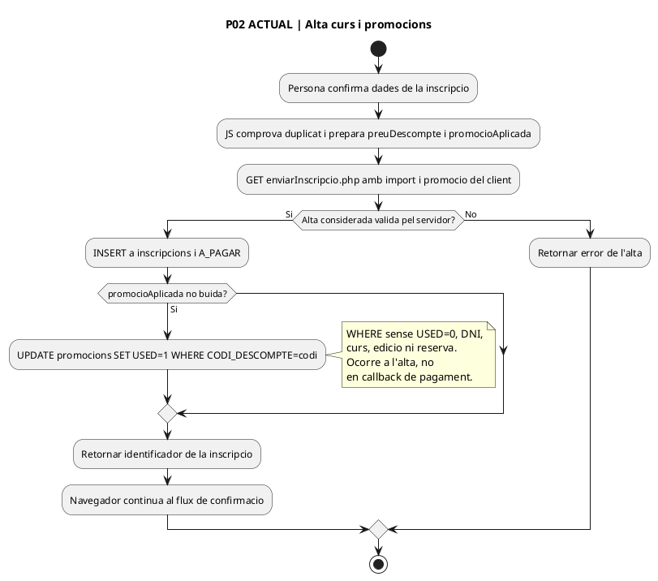
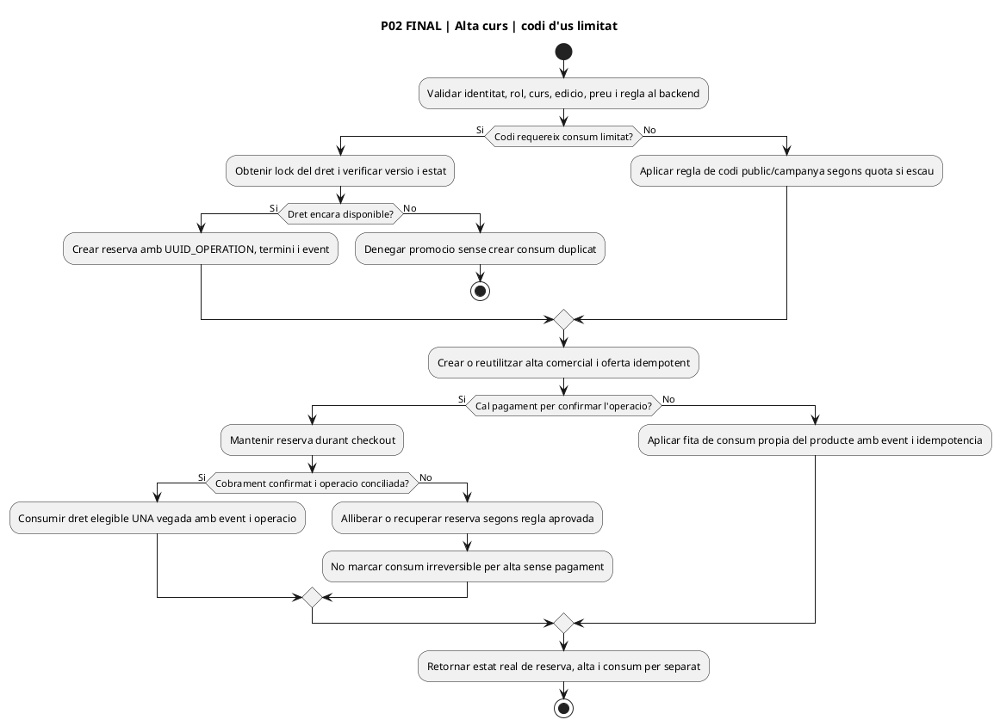
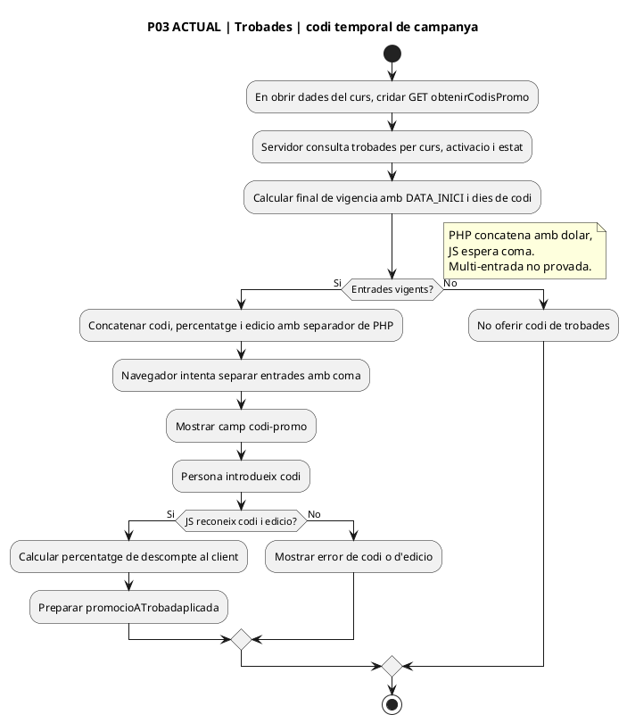
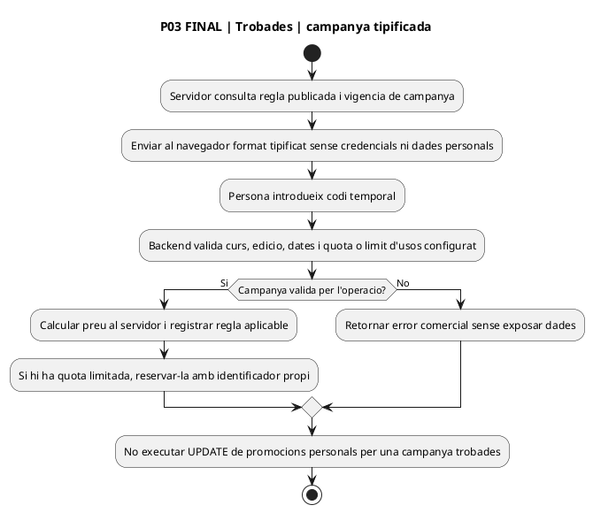
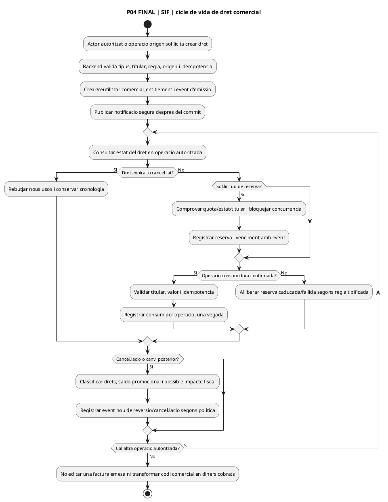

# UC-117 — diagrames d'activitat per pàgina, apartat i estat ACTUAL/FINAL

**Revisió documental:** 25/09/2026 · **Codi base de contrast:** `main` de la revisió del repositori, `e71958b3026549bde09fb4b25f2ec3ba370937ec`. **ACTUAL:** codi observat a l'arbre, no desplegament ni prova d'execució. **FINAL:** contracte proposat de gestió de drets, no implementat. No atribuir un panell SIF actual si només hi ha DDL. [Fitxa funcional](../06-fitxes-funcionals/uc-117.md) · [Auditoria del lot 06](00-auditoria-casos-pendents-lot-06-uc-117-2026-09-25.md).

## P01 · Formulari d'inscripció curs normal — apartat de codi promocional

**Fonts:** [`InscripcioCurs.php` L558–607](../../codi-drive/web-actual/InscripcioCurs.php#L558-L607); [JS L1033–1207](../../codi-drive/web-actual/js1619773569/mostrarInscripcions.min.js#L1033-L1207) i [L1208–1261](../../codi-drive/web-actual/js1619773569/mostrarInscripcions.min.js#L1208-L1261); [`obtenirDadesPromo.php`](../../codi-drive/web-actual/ajax/obtenirDadesPromo.php). **Frontera:** la pàgina de curs té dades personals, curriculars, edició i pagament; només es desglossa aquí el subflux que pertany a UC-117 i UC-020d, sense assumir que totes les altres accions són d'aquest UC.

### P01 — ACTUAL: camp, consulta i càlcul al navegador

### P01 — FINAL: consulta minimitzada i validació al servidor

## P02 · Confirmar inscripció i marcar codi

**Fonts:** [JS L2188–2258](../../codi-drive/web-actual/js1619773569/mostrarInscripcions.min.js#L2188-L2258); [`enviarInscripcio.php` L75–85, 575–610, 670–681](../../codi-drive/web-actual/ajax/enviarInscripcio.php#L670-L681). La confirmació visible de la inscripció és diferent de la confirmació del cobrament per TPV.

### P02 — ACTUAL: INSERT d'alta seguit d'UPDATE d'ús

### P02 — FINAL: alta idempotent, reserva i consum segons resultat

## P03 · Descompte temporal de `trobades`

**Fonts:** [`obtenirCodisPromo.php`](../../codi-drive/web-actual/ajax/obtenirCodisPromo.php); [JS L929–1027](../../codi-drive/web-actual/js1619773569/mostrarInscripcions.min.js#L929-L1027). El PHP agrega les entrades amb `$`; el JS usa `split(",")`; és una discrepància de format observada estàticament que requereix prova amb més d'una promoció.

### P03 — ACTUAL: codi de trobades diferenciat de la taula promocions

### P03 — FINAL: campanya temporal validada al servidor

## P04 · Cicle de vida del dret SIF (DISSENY, sense pàgina actual de gestió acreditada)

**Font d'esquema:** [migració 000005, `commercial_entitlement` i `commercial_entitlement_event`](../../sif/database/migrations/2026_09_16_000005_add_operation_lifecycle_tables.sql#L96-L155); [UML UC117](uc-117-cicle-vida-codi-dret-futur.md). No s'ha acreditat una pantalla ACTUAL amb botons «Emetre/Reservar/Consumir/Revertir» en el SIF. **No generar un diagrama ACTUAL fictici per a un panell que no s'ha trobat.** Si es dissenya una pantalla futura, cada apartat i permís requerirà revisió quan s'implementi.

### P04 — FINAL: emissió, consulta, reserva, consum, venciment i reversió

## Matriu de traçabilitat i estat

| Pàgina/apartat | Traça de codi o DDL | ACTUAL | FINAL |
| --- | --- | --- | --- |
| P01 curs normal / codi personal | `InscripcioCurs.php` → JS → `obtenirDadesPromo.php` → `promocions` | Consulta/client/preu documentats; dades personals a resposta | Validació backend, resposta minimitzada i regla tipificada. |
| P02 curs normal / confirmar | JS → `enviarInscripcio.php` → `inscripcions` + `promocions.USED` | UPDATE després alta, no després cobrament | Reserva/consum per fita real, lock i idempotència. |
| P03 curs normal / trobades | JS → `obtenirCodisPromo.php` → `trobades` | Campanya de vigència, format delimitador inconsistent | Regla server-side, format tipificat i quotes pròpies. |
| P04 SIF / cicle del dret | SQL 000005, UML i fitxa funcional | Pantalla PHP actual no acreditada | Disseny de drets/events i permisos; implementació/producció no acreditades. |

**Limitació expressa:** no s'han inspeccionat tots els productes/canals ni el cos de mètodes grans d'`Intranet.php`; no aplicar els diagrames P01–P03 a packs, regals o qualsevol altre canal sense contrastar-ne el PHP/JS. Els fluxos d'UC-111, UC-113 i UC-114 no s'han reauditat.
