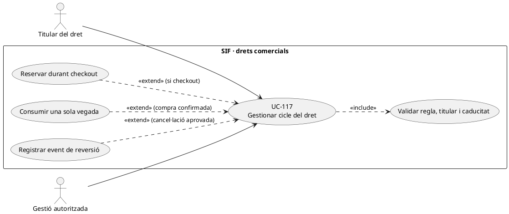
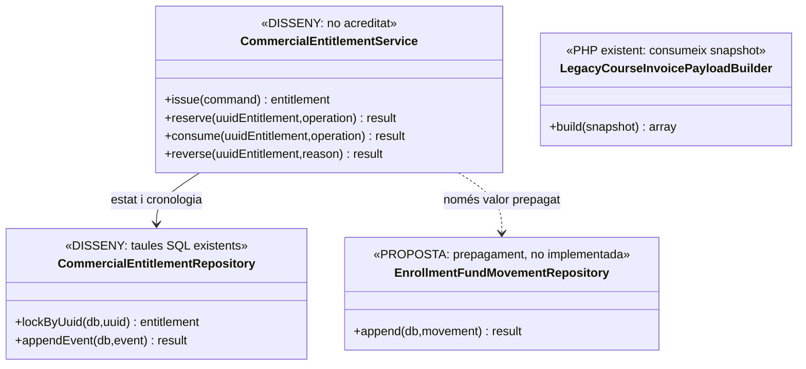
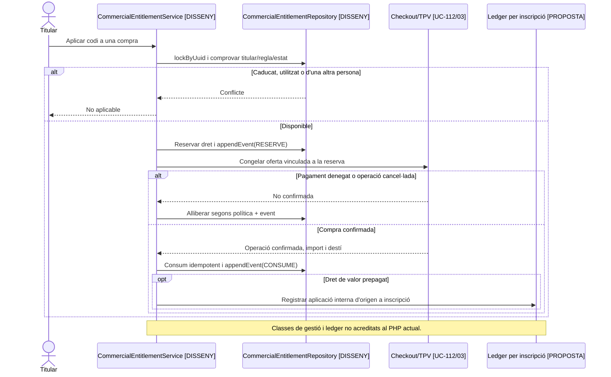
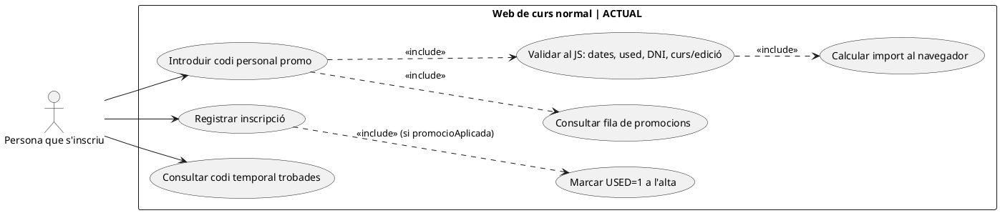
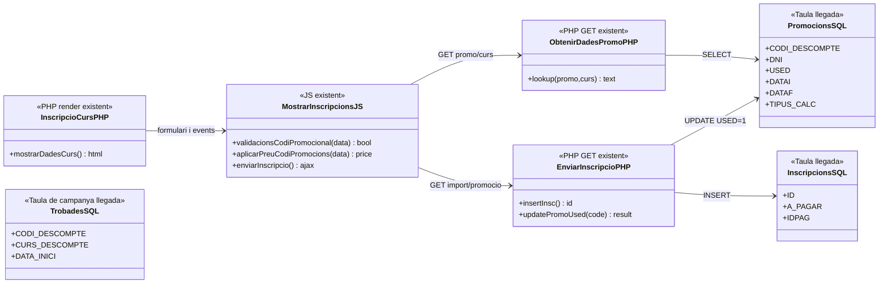
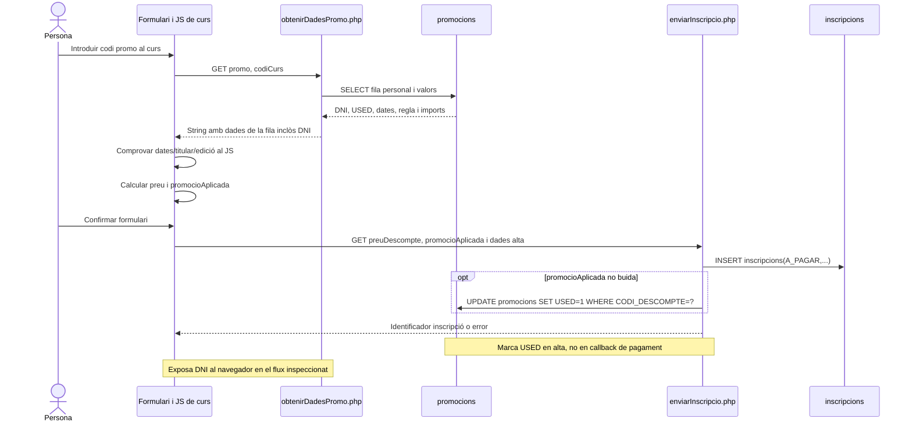

# UC-117 · Cicle de vida d'un codi promocional o dret futur

**Abast de la fitxa original:** emissió, titular, regla, caducitat, reserva, consum, anul·lació i reversió, amb idempotència i història. **Ampliació de contrast 25/09/2026:** els apartats 1–5 preserven el disseny original; els apartats 6–9 incorporen la traça del PHP/JS/SQL real de curs normal i els diagrames ACTUAL. No interpretar la seqüència de disseny de l'apartat 4 com a codi ja implementat. **Bloquejant de negoci:** tipus de dret, transferibilitat, acumulació, caducitat, reserva i reversió després de cancel·lació. Un codi de descompte **no és** per definició saldo de diners ja cobrats, i un regal prepagat no s'ha de convertir silenciosament en descompte comercial.

**Evidència:** la migració defineix `commercial_entitlement` (UUID, `ENTITLEMENT_TYPE`, `CODE_HASH`, `HOLDER_PARTY_KEY`, `ORIGIN_UUID_OPERATION`, `CONSUMED_UUID_OPERATION`, `RULE_VERSION/SNAPSHOT_JSON`, `FACE_VALUE`, `DISCOUNT_PERCENT`, `STATUS`, dates, `IDEMPOTENCY_KEY`) i `commercial_entitlement_event` amb origen/destí d'estat i correlació. **No s'ha identificat un gestor PHP del cicle de drets** a `sif/src/Service`. `LegacyCourseInvoicePayloadBuilder` pot portar codi/import al snapshot fiscal, però no valida ni consumeix el dret.

## 1. Fitxa funcional

| Moment | Dades, validació i resultat |
| --- | --- |
| Emissió | Identificar regla, versió, titular, operació d'origen, productes/edicions admissibles, valor o percentatge **segons tipus**, caducitat i clau idempotent. No afirmar que `FACE_VALUE` és un ingrés bancari. |
| Reserva | Comprovar estat i propietari, bloquejar el dret durant una oferta UC-112 amb identificador d'operació i termini definit per negoci. **La taula té `RESERVED_AT`, però no un camp propi `RESERVED_UUID_OPERATION` ni `RESERVATION_EXPIRES_AT`**: la vinculació/expiració s'ha de dissenyar, no deduir de la data sola. |
| Consum | Després de confirmar l'operació pertinent, passar a consum una sola vegada amb `CONSUMED_UUID_OPERATION`, event i idempotència; verificar que el tipus de dret determina **descompte** o **aplicació de valor prepagat**, que tenen efectes econòmics diferents. |
| Anul·lació/reversió | Registrar event nou amb motiu i situació original; no esborrar event antic ni reescriure factura emesa. Determinar si el dret torna a ser utilitzable i si existeix una devolució monetària **real**. |
| Accés | No revelar `CODE_HASH`, dades del titular ni justificants a tercers. Guardar només la informació necessària a la línia fiscal i als documents visibles. |
| Estats | La columna `STATUS` existeix però **el DDL no imposa enum ni graella de transicions**; `ISSUED/RESERVED/CONSUMED/CANCELLED/EXPIRED` són denominacions funcionals orientatives fins que es tanqui el diccionari executable. |

### Flux i variants

1. Crear o recuperar dret per clau d'emissió i operació d'origen; validar titular, regla i tipus concret.
2. Reservar-lo amb exclusió de compres competidores: dues intencions TPV no poden gastar el mateix dret d'ús únic.
3. En callback denegat/caducitat, alliberar reserva **si** la política ho permet, amb event; no transformar-lo en `CONSUMED`.
4. En compra confirmada, aplicar l'import/percentatge coherent amb el dret, consumir-lo amb referència a la nova operació i registrar event terminal. Si el dret és promocional, el descompte no crea `CHARGE`; si és valor prepagat, la transferència interna ha d'enllaçar el moviment extern **de la compra original** i la inscripció de destinació.
5. Un retry consulta el dret i l'operació de consum anterior; si import, destinació o titular difereixen, conflicte, no reús cec.
6. Una baixa posterior exigeix decisió de reversió/retorn i classificació fiscal separada, sense modificar la factura original.

**Proves pendents:** carrera de dues compres amb el mateix codi, caducitat durant TPV, reintents, titular no coincident, codi multiús (un `CONSUMED_UUID_OPERATION` no representa N consums), descompte vs prepagament i anul·lació després d'emetre.

### 1.1. Pont amb la taula `promocions` del llegat

El circuit real documentat de codis personals conserva `CODI_DESCOMPTE`, `DNI`, `MES`, `CURS`, `PERCENTATGE`, `USED`, `DATAI` i `DATAF` a `promocions`. `cnsSiTePromocioDispo` comprova patró, titular, disponibilitat i vigència, i `updDataFPromocio` pot tancar la promoció en un canvi de curs. El patró `MACABODETITULAR#...` es descriu com a personal, intransferible i d'un sol ús; això no converteix tots els codis en drets d'un sol ús.

La migració a `commercial_entitlement` ha de preservar correspondència amb la fila d'origen, titular, regla, vigència i usos previs. Un codi `USED=1` no pot esdevenir un dret nou disponible només perquè la importació li assigna un UUID nou. Per a un codi de consum limitat cal distingir reserva abans de pagar i consum després de la compra confirmada; la consulta llegada `USED=0` no resol per si sola dues compres simultànies. Aquest coordinador continua com a **disseny pendent**.

Si el codi s'ha tancat durant un canvi de curs, la reversió d'aquest canvi ha de determinar expressament si el dret es recupera i registrar un event nou; no restaurar-lo automàticament amb un UPDATE de dates o d'USED. Un codi de descompte no és un saldo bancari ni un regal prepagat, encara que tots puguin tenir una cadena de bescanvi.

### 1.2. Proves específiques de migració i reversió (no executades)

| ID | Escenari | Resultat |
| --- | --- | --- |
| CE-01 | Migrar codi personal del llegat ja USED=1 | Conservar consum i titular; no reemetre'l com a disponible. |
| CE-02 | Dues compres simultànies sobre el mateix codi d'un ús | Reserva/consum únics; segon intent conflictual sense duplicar descompte. |
| CE-03 | Callback denegat abans de consum | Reserva recuperable només segons política i traça, cap dret consumit fictici. |
| CE-04 | Canvi de curs tanca DATAF i després es desfà | Revisió de dret i nou event, sense reobertura automàtica. |
| CE-05 | Codi públic multiús | Model d'usos individuals, no un sol CONSUMED_UUID_OPERATION per totes les compres. |

## 2. UML de casos d'ús

## 3. Diagrama de classes — model SQL i PHP diferenciats

## 4. Seqüència — reserva i consum (DISSENY)

## 5. Traçabilitat

[UC-117 original](../06-fitxes-funcionals/uc-117.md) · [UC-20d codi promocional](uc-020d-aplicar-codi-promocional.md) · [UC-111 origen docent novell](../06-fitxes-funcionals/uc-111.md) · [UC-119 regal prepagat](uc-119-cicle-complet-regal.md) · [Esquema de drets i events](../../sif/database/migrations/2026_09_16_000005_add_operation_lifecycle_tables.sql) · [Builder fiscal](../../sif/src/Service/LegacyCourseInvoicePayloadBuilder.php) · [Fons per inscripció](00-revisio-moviments-inscripcions.md).

## 6. Contrast directe del circuit ACTUAL de promoció personal i campanya temporal

[Fitxa funcional específica v2.0](../06-fitxes-funcionals/uc-117.md) · [auditoria del lot 06](00-auditoria-casos-pendents-lot-06-uc-117-2026-09-25.md) · [7 activitats ACTUAL/FINAL de P01–P04](uc-117-activitats-codis-actual-final.md).

| Superfície ACTUAL | Codi/SQL observats | Fet acreditat / límit |
| --- | --- | --- |
| P01, formulari de curs | [`InscripcioCurs.php` L558–608](../../codi-drive/web-actual/InscripcioCurs.php#L558-L608), [JS L1033–1261](../../codi-drive/web-actual/js1619773569/mostrarInscripcions.min.js#L1033-L1261) | Codi `#promo`, GET de dades del codi personal, comprovacions al JS i preu calculat al navegador. |
| Consulta de codi personal | [`obtenirDadesPromo.php`](../../codi-drive/web-actual/ajax/obtenirDadesPromo.php) | Consulta `promocions` i retorna `DNI`, `USED`, vigència i imports al client; en aquest endpoint no es veu autorització de consulta per titular. |
| P02, confirmar alta | [`enviarInscripcio.php` L75–85, 575–609, 670–681](../../codi-drive/web-actual/ajax/enviarInscripcio.php#L670-L681) | INSERT de `inscripcions` i després `UPDATE promocions SET USED=1 WHERE CODI_DESCOMPTE=?`; WHERE sense comprovació de titular, vigència, estat o bloqueig de consum. Passa a alta, no callback de cobrament. |
| P03, codi temporal | [`obtenirCodisPromo.php`](../../codi-drive/web-actual/ajax/obtenirCodisPromo.php), [JS L929–1027](../../codi-drive/web-actual/js1619773569/mostrarInscripcions.min.js#L929-L1027) | Codis de `trobades` i regla d'edició diferents de promoció personal; separadors PHP `$` / JS `,` no coincideixen per diverses entrades. |
| Gestor unificat FINAL | [DDL 000005](../../sif/database/migrations/2026_09_16_000005_add_operation_lifecycle_tables.sql#L96-L155) | Model `commercial_entitlement` + events definit, però no acredita reserva, consum ni pantalla/servei SIF executats. |

**INCIDÈNCIES:** el GET de codi personal retorna el DNI del titular i el JS conté `console.log(dadesPromo)`, amb risc de divulgació si es coneix el codi; l'alta accepta el codi/import aportats pel client en el tram inspeccionat i marca `USED=1` sense WHERE condicional. Aquests són **riscos detectats en el codi versionat**, no atacs realitzats o comportament productiu certificat. La regió de promoció general `trobades` no prova que aquests codis siguin consumits pel mateix `UPDATE` que els personals.

## 7. UML de casos d'ús — ACTUAL delimitat al curs normal

**Nota:** aquest UML ACTUAL és una representació d'accions PHP/JS identificades, no una afirmació que el client estigui autoritzat a llegir el DNI del titular, que el càlcul sigui segur ni que s'hagi cobrat. El diagrama de cas d'ús de l'apartat 2 descriu el cicle FINAL, no els botons de cap pàgina existent.

## 8. Diagrama de classes i seqüència — ACTUAL versus FINAL

### 8.1. Classes/rutes/taules ACTUALS (mapa de dependències observades)

**P03 campanya:** `obtenirCodisPromo.php` consulta `trobades` i el mateix JS aplica percentatge. `commercial_entitlement` **no apareix** a les crides PHP d'aquesta seqüència actual inspeccionada.

### 8.2. Seqüència ACTUAL (ordre real del recorregut personal a curs normal)

### 8.3. Contracte FINAL i límits de model

La seqüència de l'apartat 4 és **DISSENY**: comprovar titular/regla/import **al servidor**, reservar només codis limitats amb `UUID_OPERATION` i un venciment real, consumir després de fita de compra apropiada, i afegir events idempotents. `CODE_HASH UNIQUE` i `CONSUMED_UUID_OPERATION` són apropiats per un dret singular, però **no** proven un ledger multiús; `RESERVED_AT` no és identificador de reserva. Dissenyar model de `reservation owner`, TTL i consums múltiples si el tipus ho exigeix. Un dret futur promocional no és saldo de diner prepagat, encara que hi hagi `FACE_VALUE` en la taula. Si s'emet factura després de consumir, l'original roman immutable fins i tot en una reversió.

## 9. Traçabilitat de variants, proves i estat independent

| Variant / subflux | ACTUAL comprovat | FINAL / test pendent |
| --- | --- | --- |
| Codi personal amb DNI i USED | `obtenirDadesPromo`, JS i `enviarInscripcio` | Backend titularitat i disponibilitat, T01/T02/T03/T10. |
| Campanya trobades | Consulta `trobades` i percentatge al JS | No confondre amb `promocions`, fixar format multi-entrada, T06. |
| Dret futur | Tipus/estats representats al DDL, servei no acreditat | Emissió idempotent i activació segons regla/origen; T08/T11. |
| Reserva/consum/reversió | Actual UPDATE `USED` d'alta, sense reserva acreditada | Lock, event, TTL i alliberament per regla, T03/T04/T09. |
| Codi públic multiús | No modelat per un sol `CONSUMED_UUID_OPERATION` | Comptador/events per ús i límits propis, T07/T12. |
| Regal prepagat | Codi/UX diferent, no reauditat | UC-018/119, no descompte comercial fictici. |

**DOC revisada:** fitxa funcional 2.0, 7 diagrames d'activitat P01–P04, casos/classes/seqüència ACTUAL + disseny original etiquetat FINAL. **NO s'afirma:** que s'hagi revisat exhaustivament tota la intranet, el canal packs/regals/grups, que el PHP/DDL ja hagin canviat, que s'hagin executat T01–T12, o que la promoció s'hagi conciliat en producció.
