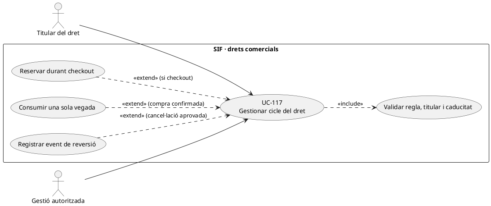
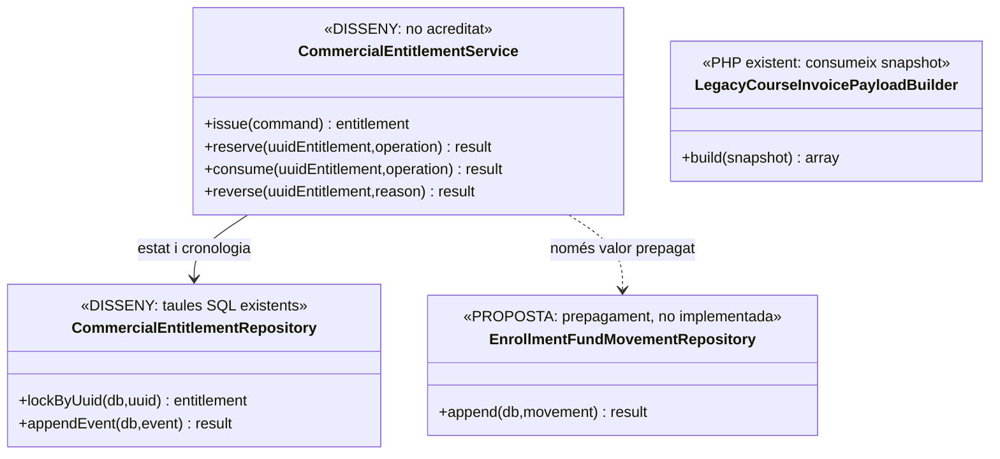
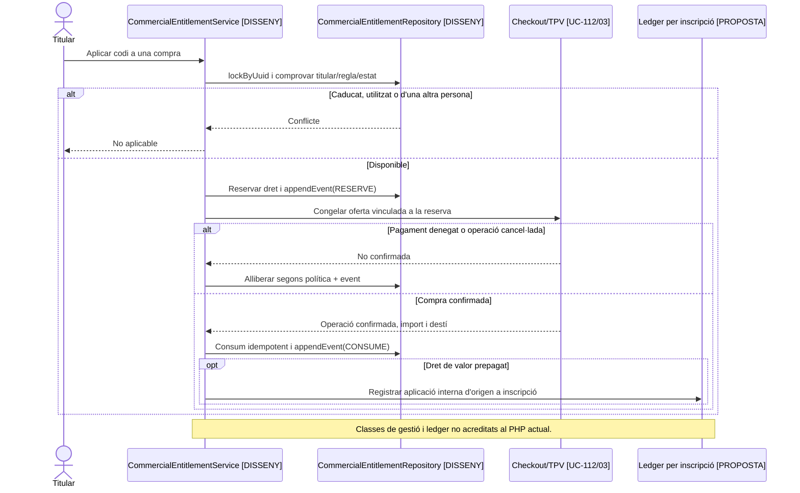

# UC-117 · Cicle de vida d'un codi promocional o dret futur

**Abast de la fitxa original:** emissió, titular, regla, caducitat, reserva, consum, anul·lació i reversió, amb idempotència i història. **Bloquejant de negoci:** tipus de dret, transferibilitat, acumulació, caducitat, reserva i reversió després de cancel·lació. Un codi de descompte **no és** per definició saldo de diners ja cobrats, i un regal prepagat no s'ha de convertir silenciosament en descompte comercial.

**Evidència:** la migració defineix `commercial_entitlement` (UUID, `ENTITLEMENT_TYPE`, `CODE_HASH`, `HOLDER_PARTY_KEY`, `ORIGIN_UUID_OPERATION`, `CONSUMED_UUID_OPERATION`, `RULE_VERSION/SNAPSHOT_JSON`, `FACE_VALUE`, `DISCOUNT_PERCENT`, `STATUS`, dates, `IDEMPOTENCY_KEY`) i `commercial_entitlement_event` amb origen/destí d'estat i correlació. **No hi ha encara un gestor PHP GENÈRIC de tots els tipus de dret** (reserva, consums, reversió, activació i lliurament) a `sif/src/Service`. **Peces específiques de UC-111 preparades EN BRANCA:** [NovicePromotionGrantService](../../sif/src/Service/NovicePromotionGrantService.php) concedeix el saldo novell després d'una JASOM validada i cobrada, [NovicePromotionCodePreparationService](../../sif/src/Service/NovicePromotionCodePreparationService.php) prepara un codi xifrat, i [NovicePromotionRedemptionService](../../sif/src/Service/NovicePromotionRedemptionService.php) modela reserva per matrícula, confirmació postfactura i alliberament de reserva sense moviment bancari fictici. No són un gestor genèric ni acrediten que el checkout, els correus, els consums o les factures ja s'executin a producció. `LegacyCourseInvoicePayloadBuilder` pot portar codi/import al snapshot fiscal, però no valida ni consumeix el dret.

## 1. Fitxa funcional

| Moment | Dades, validació i resultat |
| --- | --- |
| Emissió | Identificar regla, versió, titular, operació d'origen, productes/edicions admissibles, valor o percentatge **segons tipus**, caducitat i clau idempotent. No afirmar que `FACE_VALUE` és un ingrés bancari. |
| Reserva | Comprovar estat i propietari, bloquejar el dret durant una oferta UC-112 amb identificador d'operació i termini definit per negoci. **La taula té `RESERVED_AT`, però no un camp propi `RESERVED_UUID_OPERATION` ni `RESERVATION_EXPIRES_AT`**: la vinculació/expiració s'ha de dissenyar, no deduir de la data sola. |
| Consum | Després de confirmar l'operació pertinent, passar a consum una sola vegada amb `CONSUMED_UUID_OPERATION`, event i idempotència; verificar que el tipus de dret determina **descompte** o **aplicació de valor prepagat**, que tenen efectes econòmics diferents. |
| Anul·lació/reversió | Registrar event nou amb motiu i situació original; no esborrar event antic ni reescriure factura emesa. Determinar si el dret torna a ser utilitzable i si existeix una devolució monetària **real**. |
| Accés | No revelar `CODE_HASH`, dades del titular ni justificants a tercers. Guardar només la informació necessària a la línia fiscal i als documents visibles. |
| Estats | La columna `STATUS` existeix però **el DDL no imposa enum ni graella de transicions**; `ISSUED/RESERVED/CONSUMED/CANCELLED/EXPIRED` són denominacions funcionals orientatives fins que es tanqui el diccionari executable. |

### Flux i variants

1. Crear o recuperar dret per clau d'emissió i operació d'origen; validar titular, regla i tipus concret.
2. Reservar-lo amb exclusió de compres competidores: dues intencions TPV no poden gastar el mateix dret d'ús únic.
3. En callback denegat/caducitat, alliberar reserva **si** la política ho permet, amb event; no transformar-lo en `CONSUMED`.
4. En compra confirmada, aplicar l'import/percentatge coherent amb el dret, consumir-lo amb referència a la nova operació i registrar event terminal. Si el dret és promocional, el descompte no crea `CHARGE`; si és valor prepagat, la transferència interna ha d'enllaçar el moviment extern **de la compra original** i la inscripció de destinació.
5. Un retry consulta el dret i l'operació de consum anterior; si import, destinació o titular difereixen, conflicte, no reús cec.
6. Una baixa posterior exigeix decisió de reversió/retorn i classificació fiscal separada, sense modificar la factura original.

**Proves pendents:** carrera de dues compres amb el mateix codi, caducitat durant TPV, reintents, titular no coincident, codi multiús (un `CONSUMED_UUID_OPERATION` no representa N consums), descompte vs prepagament i anul·lació després d'emetre.

### 1.1. Pont amb la taula `promocions` del llegat

El circuit real documentat de codis personals conserva `CODI_DESCOMPTE`, `DNI`, `MES`, `CURS`, `PERCENTATGE`, `USED`, `DATAI` i `DATAF` a `promocions`. `cnsSiTePromocioDispo` comprova patró, titular, disponibilitat i vigència, i `updDataFPromocio` pot tancar la promoció en un canvi de curs. El patró `MACABODETITULAR#...` es descriu com a personal, intransferible i d'un sol ús; això no converteix tots els codis en drets d'un sol ús.

La migració a `commercial_entitlement` ha de preservar correspondència amb la fila d'origen, titular, regla, vigència i usos previs. Un codi `USED=1` no pot esdevenir un dret nou disponible només perquè la importació li assigna un UUID nou. Per a un codi de consum limitat cal distingir reserva abans de pagar i consum després de la compra confirmada; la consulta llegada `USED=0` no resol per si sola dues compres simultànies. Aquest coordinador continua com a **disseny pendent**.

Si el codi s'ha tancat durant un canvi de curs, la reversió d'aquest canvi ha de determinar expressament si el dret es recupera i registrar un event nou; no restaurar-lo automàticament amb un UPDATE de dates o d'USED. Un codi de descompte no és un saldo bancari ni un regal prepagat, encara que tots puguin tenir una cadena de bescanvi.

### 1.2. Proves específiques de migració i reversió (no executades)

| ID | Escenari | Resultat |
| --- | --- | --- |
| CE-01 | Migrar codi personal del llegat ja USED=1 | Conservar consum i titular; no reemetre'l com a disponible. |
| CE-02 | Dues compres simultànies sobre el mateix codi d'un ús | Reserva/consum únics; segon intent conflictual sense duplicar descompte. |
| CE-03 | Callback denegat abans de consum | Reserva recuperable només segons política i traça, cap dret consumit fictici. |
| CE-04 | Canvi de curs tanca DATAF i després es desfà | Revisió de dret i nou event, sense reobertura automàtica. |
| CE-05 | Codi públic multiús | Model d'usos individuals, no un sol CONSUMED_UUID_OPERATION per totes les compres. |

### Relació amb UC-111 — concessió aïllada, consum/correu no integrats

La [migració `novice_promotion_grant`](../../sif/database/migrations/2026_09_22_000008_add_novice_promotion_grant.sql) imposa una concessió de **saldo promocional** per persona amb valor original i disponible. `commercial_entitlement.CONSUMED_UUID_OPERATION` és singular i NO representa N consums; la [migració 000012](../../sif/database/migrations/2026_09_25_000012_add_novice_promotion_application.sql) i el [servei UC-111](../../sif/src/Service/NovicePromotionRedemptionService.php) preparen la reserva, l'aplicació i l'alliberament PER MATRÍCULA de destinació, amb import, estat, UUID i idempotència independents. Encara no estan connectats al motor de preus, factura ni cobraments reals de la nova inscripció. La concessió crea inicialment `CODE_HASH=NULL`, però ja existeix una peça interna de preparació xifrada del codi i un worker privat SENSE transport/cron desplegat. No confondre saldo promocional nou amb `credit_balance` de diners ja pagats ni transformar cap aplicació en `payment_transaction`.
### 1.3. UC-111: múltiples aplicacions en un únic dret — tall de desenvolupament 25/09/2026

La [política pura d'import](../../sif/src/Domain/NovicePromotionAmountPolicy.php) descompta DESPRÉS dels altres descomptes ordinaris i conserva el romanent dins del mateix dret i la seva caducitat original. La [taula d'aplicacions](../../sif/database/migrations/2026_09_25_000012_add_novice_promotion_application.sql) té `RESERVED/APPLIED/RELEASED/REVERSED`; **REVERSED és estat del model sense servei de reversió implementat encara**, ja que el canvi/baixa requereix regles i documents fiscals propis. [NovicePromotionRedemptionService](../../sif/src/Service/NovicePromotionRedemptionService.php) pot reservar/descomptar provisionalment en una transacció i confirmar només si la factura FINAL ja emesa i pagada acredita EXACTAMENT el descompte en el snapshot i totals, o retornar saldo únicament si no existeix encara cap intenció Redsys ni factura de destinació. No genera ni rectifica factures.

**Pendents de UC-20d/117:** enllaçar controlador autenticat, adaptador de càlcul de preus, reserves/confirmació amb operació de pagament signada, cas de curs totalment cobert (factura de net zero), destinació amb facturació fraccionada, caducitat de reserves i conciliació de callbacks tardans, baixa/canvi i cadena de saldo derivat. No donar per comprovats concurrència ni integritat referencial: la fase de proves MySQL s'ha ajornat a petició expressa. Les [sis proves UNITÀRIES pures del càlcul](../../sif/tests/Unit/NovicePromotionAmountPolicyTest.php) només estan escrites.
### 1.4. Línia de procedència UC-111 després d'una baixa o canvi de curs (tall 25/09/2026)

[NovicePromotionDestinationAdjustmentPolicy](../../sif/src/Domain/NovicePromotionDestinationAdjustmentPolicy.php) és una peça PURA que separa part promocional i diners reals elegibles per a una baixa, i calcula el traspàs al curs nou sense atorgar un segon dret. [NovicePromotionLineagePolicy](../../sif/src/Domain/NovicePromotionLineagePolicy.php) proposa cancel·lació/reclamació en retornar JASOM llegint una fotografia CONSISTENT de drets originals, derivats i aplicacions; no identifica com a recuperable un consum històric ja substituït per un traspàs o un saldo de baixa. La [migració de procedència 000013](../../sif/database/migrations/2026_09_25_000013_add_novice_promotion_lineage.sql) prepara tres registres: saldos derivats amb `PARENT_UUID_DERIVED_BALANCE`, aplicacions per cadascun i transferències de curs encadenades amb `PREVIOUS_UUID_TRANSFER`, referències fiscals i idempotència. Un dret derivat roman `PENDING_FISCAL_REVIEW` fins a validar-ne la rectificativa i les condicions econòmiques. La baixa no reobre el romanent de JASOM ni n'allarga la vigència; el saldo derivat sí té el seu any propi quan es concedeix.

**Exemple normatiu funcional DEC-23, NO execució en BD:** valor JASOM 90 € → consum 90 € → baixa amb rectificativa crea un dret de baixa 90 € → nou curs utilitza 40 € i el dret de baixa conserva 50 € → en retornar JASOM, immobilitzar els 50 € i proposar recuperar NOMÉS 40 €, sense tornar a reclamar els 90 € històrics. Encara NO hi ha servei fiscal de canvi/baixa, concessions de saldo derivat `ACTIVE`, ús derivat ni endpoint de cancel·lació que executi aquest pla. Els [deu tests purs de procedència](../../sif/tests/Unit/NovicePromotionLineagePolicyTest.php) i [set de partició/traspàs](../../sif/tests/Unit/NovicePromotionDestinationAdjustmentPolicyTest.php) estan escrits, no executats amb MySQL (fase ajornada).
## 2. UML de casos d'ús

## 3. Diagrama de classes — model SQL i PHP diferenciats

## 4. Seqüència — reserva i consum (DISSENY)

## 5. Traçabilitat

[UC-117 original](../06-fitxes-funcionals/uc-117.md) · [UC-20d codi promocional](uc-020d-aplicar-codi-promocional.md) · [UC-111 origen docent novell](../06-fitxes-funcionals/uc-111.md) · [UC-119 regal prepagat](uc-119-cicle-complet-regal.md) · [Esquema de drets i events](../../sif/database/migrations/2026_09_16_000005_add_operation_lifecycle_tables.sql) · [Builder fiscal](../../sif/src/Service/LegacyCourseInvoicePayloadBuilder.php) · [Fons per inscripció](00-revisio-moviments-inscripcions.md).
