# UC-118 — activitats de la pàgina de grup, per pas/control, ACTUAL i FINAL

**Fonts:** `main` inspeccionat el 25/09/2026: [`DescompteGrup.php`](../../codi-drive/web-actual/DescompteGrup.php), [`mostrarDescompteGrup.min.js`](../../codi-drive/web-actual/js1619773569/mostrarDescompteGrup.min.js), wrappers [`ajax/`](../../codi-drive/web-actual/ajax/) i [lectors/constructors SIF de grup](../../sif/src/Repository/LegacyGroupSnapshotRepository.php). **ACTUAL** significa recorregut identificat al PHP/JS versionat, no prova de producció. **FINAL** és disseny a implementar; cap diagrama diu que el coordinador previ de grup estigui acabat. [Auditoria del lot 07](00-auditoria-casos-pendents-lot-07-uc-118-2026-09-25.md) · [fitxa funcional](../06-fitxes-funcionals/uc-118.md).

## P01 · Informació de descomptes per grup, taula de trams i botons d'hores/curs

**ACTUAL —** [`DescompteGrup::__obtenirContingutInici` L187–405](../../codi-drive/web-actual/DescompteGrup.php#L187-L405): textos de mínim 3, no acumulació i aula exclusiva 15+, trams `descomptes_grup`, opcions de curs/hores.

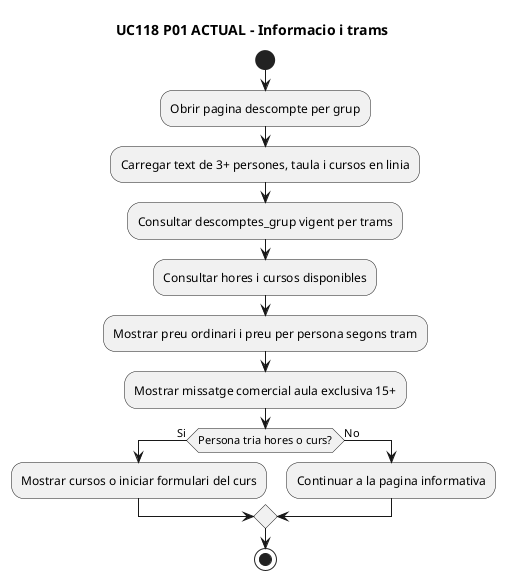

**FINAL —** mateix contingut informatiu, però el preu de taula no reserva places ni tanca oferta.

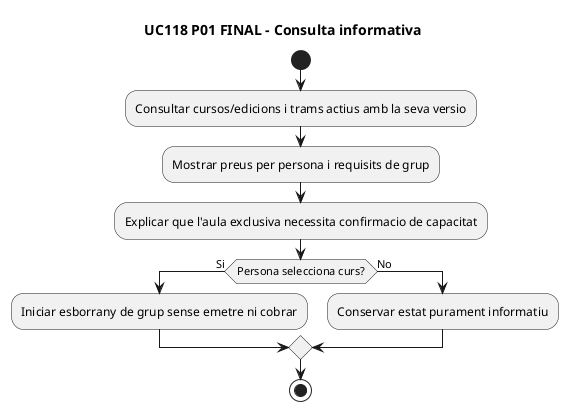

## P02 · «Formulari d'inscripció per a grups» — curs, tram i botons Grup / Centre escolar / Tornar / Inscripció grupal

**ACTUAL —** [PHP L457–694](../../codi-drive/web-actual/DescompteGrup.php#L457-L694) i [JS L249–342](../../codi-drive/web-actual/js1619773569/mostrarDescompteGrup.min.js#L249-L342). La pàgina del curs normal tria un curs per grup, mostra preus per trams i exigeix seleccionar modalitat només al JS.

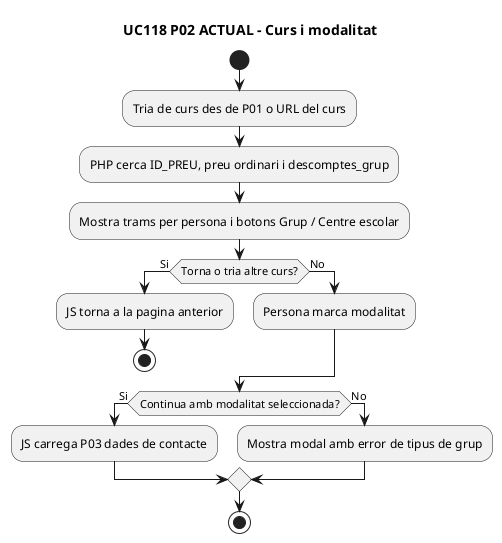

**FINAL —** crear identificador d'esborrany i validar la modalitat/curs al servidor.

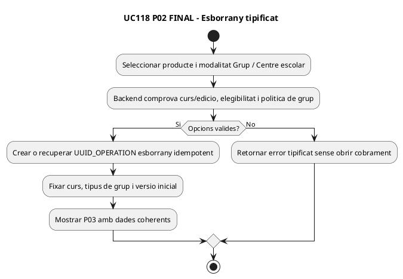

## P03 · «Dades de contacte» — centre, persona, document, correu, adreça i «Continua / Enrere»

**ACTUAL —** [PHP L695–890](../../codi-drive/web-actual/DescompteGrup.php#L695-L890); [JS L504–610](../../codi-drive/web-actual/js1619773569/mostrarDescompteGrup.min.js#L504-L610). Per al centre, el formulari demana nom del centre i CIF, però la persistència llegada posa les dades de contacte a `respGrups`.

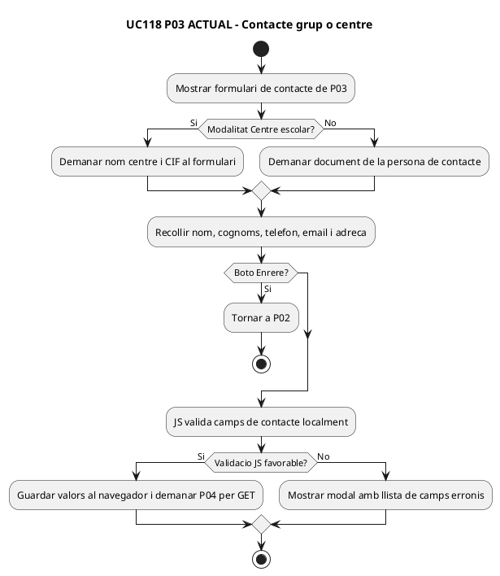

**FINAL —** responsable, contacte, pagador i receptor no són sinònims.

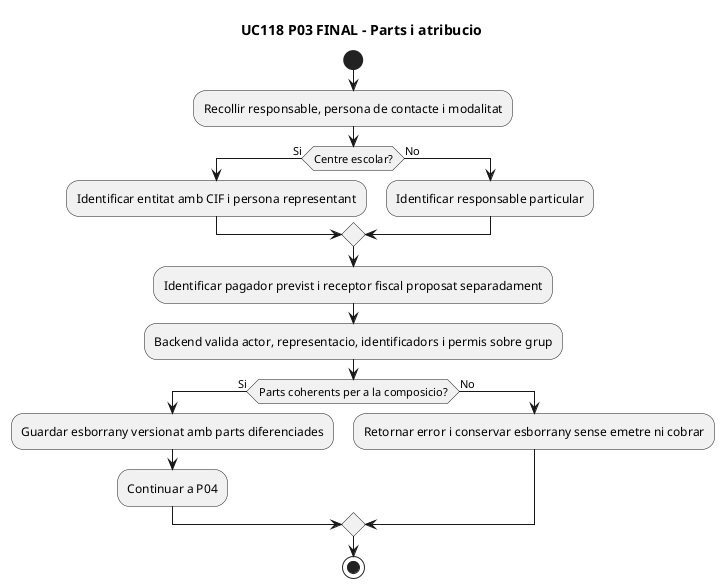

## P04 · «Dades del grup», edició, afegir participant, modal, tornar i continuar

**ACTUAL —** [PHP L900–904 i L1007–1115](../../codi-drive/web-actual/DescompteGrup.php#L1007-L1115); [JS L781–948](../../codi-drive/web-actual/js1619773569/mostrarDescompteGrup.min.js#L781-L948). El botó afegeix dades a l'objecte serialitzat de sessió. **No s'observa un botó de baixa individual al formulari d'aquest apartat**, ni que l'append de sessió reservi places; no inventar-ne els efectes.

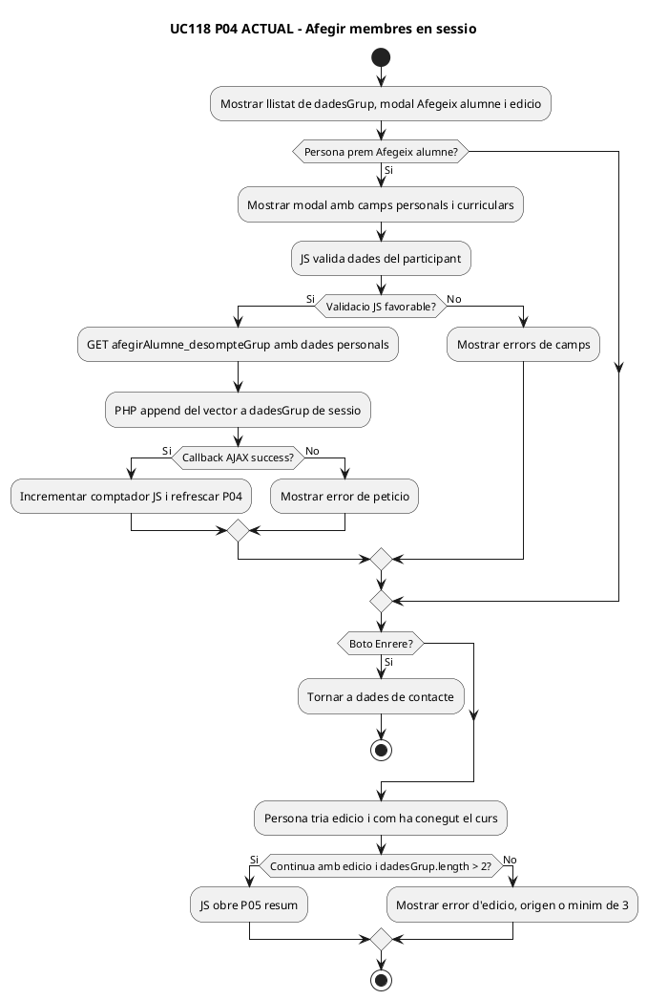

**FINAL —** afegir/treure només en estat obert amb versió, duplicats i places.

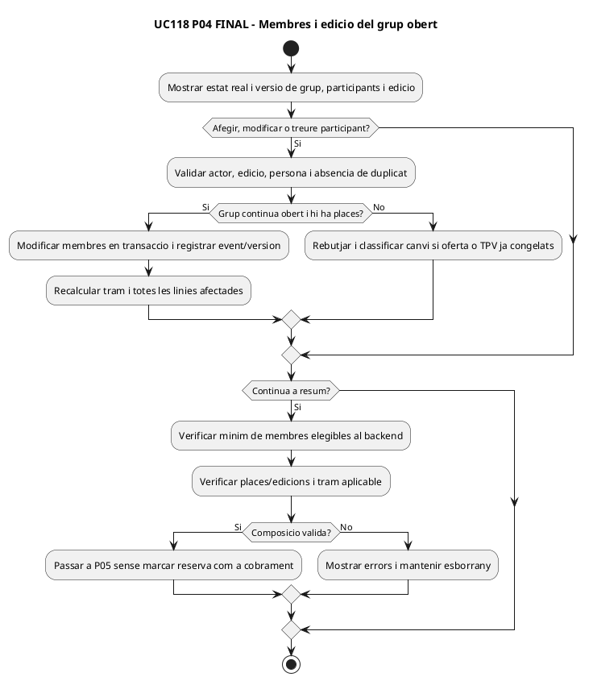

## P05 · «Resum de les dades introduïdes» — import total, responsable, participants, «Torna / Envia dades»

**ACTUAL —** [PHP L1201–1404](../../codi-drive/web-actual/DescompteGrup.php#L1201-L1404): compte efectiu `count(dadesGrup)`, busca el tram dins `$this->preus` de sessió, mostra total i contactes, permet comentaris. [JS L990–1027](../../codi-drive/web-actual/js1619773569/mostrarDescompteGrup.min.js#L990-L1027) envia per AJAX en confirmar.

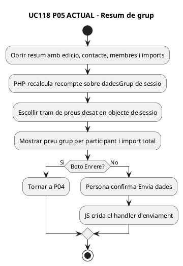

**FINAL —** no permetre presentar resum caducat com si fos import autoritzat.

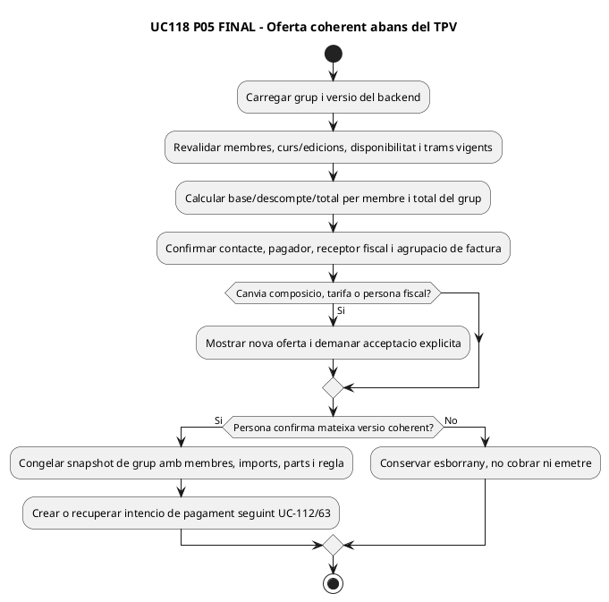

## P06 · «Envia dades» — crear contacte, inscripcions i enllaç de pagament

**ACTUAL —** [JS L1191–1232](../../codi-drive/web-actual/js1619773569/mostrarDescompteGrup.min.js#L1191-L1232) GET `enviaDades_DescompteGrup.php`; [PHP L1405–1430, 1569–1611, 1874–1955, 2090–2098](../../codi-drive/web-actual/DescompteGrup.php#L1405-L1430): calcula tram des del vector i recompte, incrementa `IDPAG` llegit per SELECT global, insereix `respGrups` i N `inscripcions`, prepara comunicacions i retorna token de confirmació. Aquest pas no és un callback bancari.

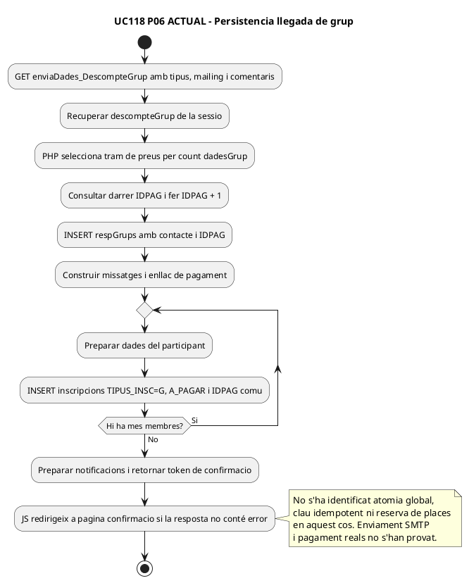

**FINAL —** persistir o recuperar el grup coherent i només comunicar resultat real.

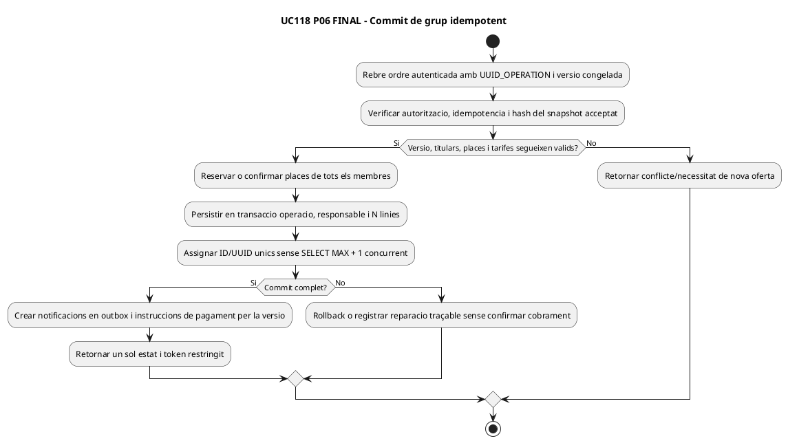

## P07 · Frontera UC-118 → pagament de grup i construcció fiscal

**ACTUAL observat:** [`PagamentGrupAutomatic.php`](../../codi-drive/web-actual/PagamentGrupAutomatic.php) usa l'IDPAG del grup; [`LegacyGroupSnapshotRepository.php`](../../sif/src/Repository/LegacyGroupSnapshotRepository.php) recupera `respGrups` i els inscrits de tipus G; [`LegacyGroupInvoicePayloadBuilder.php`](../../sif/src/Service/LegacyGroupInvoicePayloadBuilder.php) produeix N línies per membre i receptor a partir de `respGrups`. No és prova que UC-118 creï factura abans de completar el seu grup.

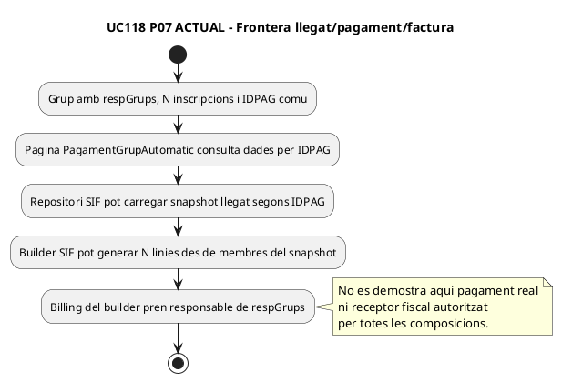

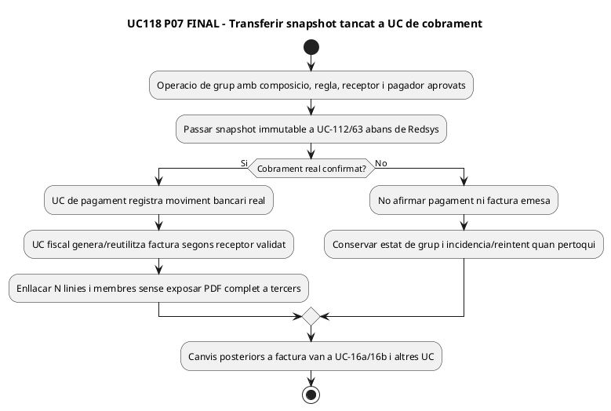

## Traçabilitat d'accions i límits

| Pàgina | Accions i transicions dins UC-118 | Evidència i estat |
| --- | --- | --- |
| P01/P02 | Consultar tram, triar curs, modalitat Grup/Centre escolar, tornar/continuar | PHP/JS ACTUAL documentats; política de composició multiproducte no acreditada en el formulari. |
| P03 | Contacte, CIF centre, validació, tornar/continuar | Dades personals via GET i relació contacte↔receptor no certificada. |
| P04 | Triar edició, afegir participant, modal, tornar/continuar, mínim 3 | Append de sessió actual, no reserva/alta real. Cap botó específic d'eliminar participant acreditat en el pas inspeccionat. |
| P05 | Veure resum, tram, total, tornar/enviar | Recompte de sessió però tarifa prèvia; no snapshot bloquejat actual. |
| P06 | Alta persistent contacte/membres, missatges i enllaç | IDPAG SELECT darrer+1, INSERT separats, no transacció/idempotència globals acreditades. |
| P07 | Pagament i receptor factura | Frontera amb UC-63, UC-16; builder real no substitueix gestor de grup ni decididor fiscal. |

**DOC:** 14 diagrames ACTUAL/FINAL per set passos/superfícies, amb PHP/JS llegat i disseny separats. **IMP/TEST:** no executats en aquesta auditoria. Altres variants de grup, gestió per intranet, alta/baixa postfactura i pagament bancari en viu no es declaren completats per aquests diagrames.
