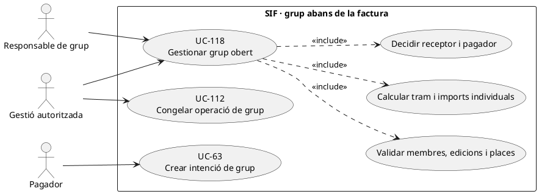
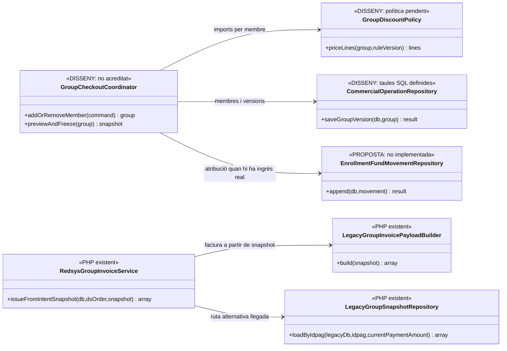
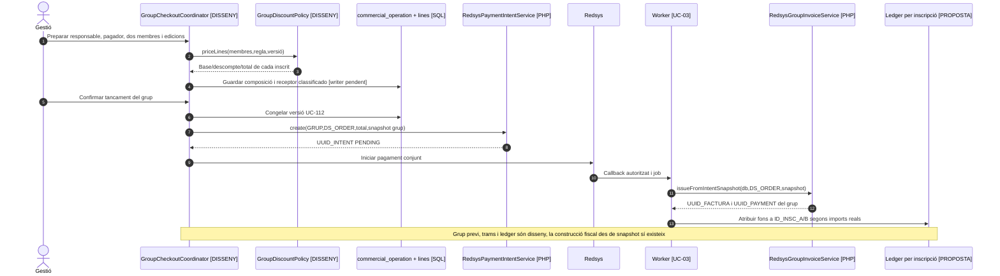
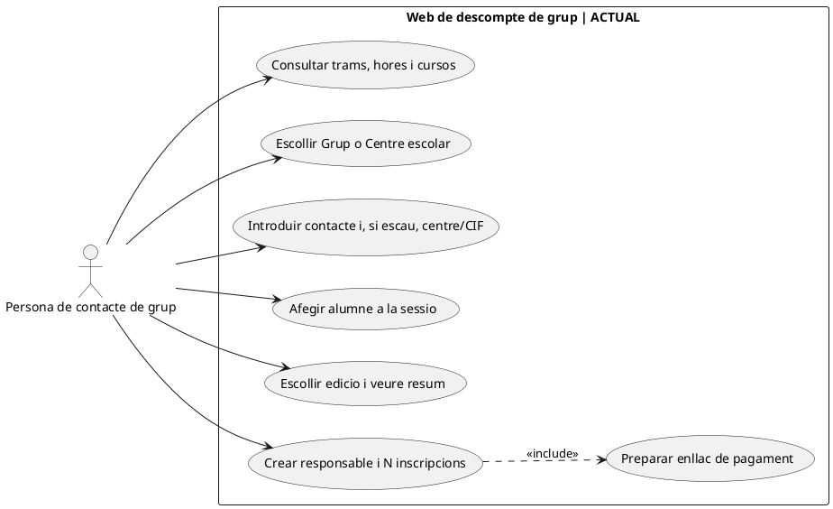
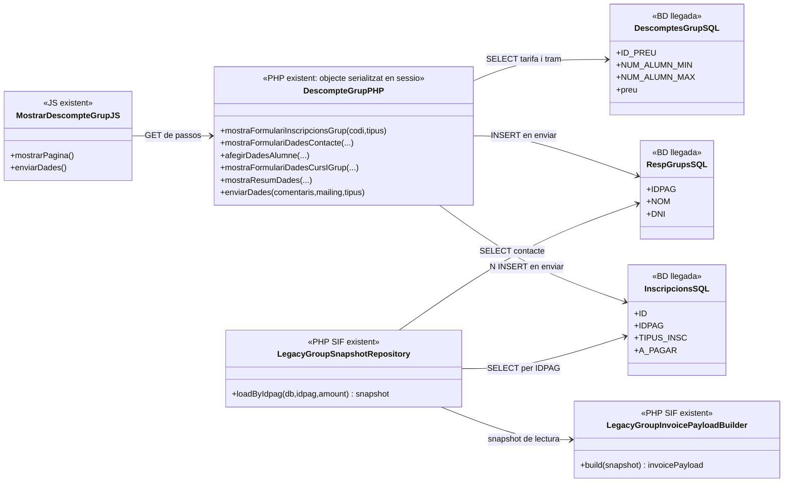
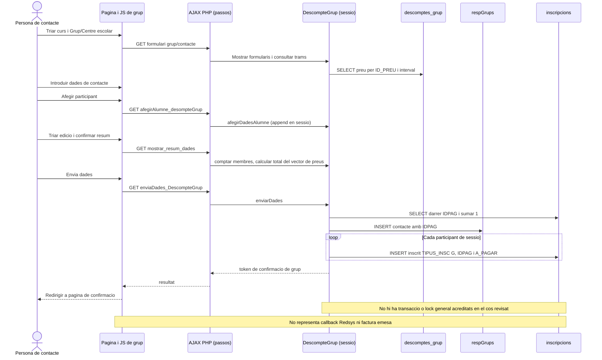

# UC-118 · Gestionar el grup abans d'emetre o cobrar

**Objectiu canònic:** preparar/validar responsable, participants, cursos, tram de descompte, pagador, receptor i línies, i **bloquejar el snapshot abans del TPV**. **Ampliació específica 25/09/2026:** el PHP/JS web de grup actual (un curs i edició per grup) s'ha contrastat i documentat a les seccions 6–9. Els apartats 1–5 són contracte original i disseny SIF, no una declaració que `GroupCheckoutCoordinator` existeixi. La fitxa original deixa pendents el moment de tancament del grup, recalcular trams i determinar factura/receptor per composició.

**Evidència de PHP existent:** `LegacyGroupSnapshotRepository::loadByIdpag()` busca inscripcions llegades `TIPUS_INSC='G'` amb un `IDPAG` compartit i el responsable a `respGrups`; `LegacyGroupInvoicePayloadBuilder::build()` exigeix responsable i almenys un participant, produeix **una línia `INSCRIPCIO` per membre** més les relacions de grup i cada inscrit, amb un receptor construït a partir de `responsible`. `RedsysGroupInvoiceService` pot facturar des del snapshot d'intenció validada o recuperar l'estat llegat després de la notificació. **Cap d'aquests components és un editor/orquestrador de grup previ** amb càlcul general de tram, control de places o decisió fiscal de receptor; `IDPAG` compartit **no acredita un sol titular econòmic legítim**.

## 1. Fitxa funcional específica

| Aspecte | Contracte |
| --- | --- |
| Actors | Responsable de grup, participants i operador/gestió; pagador i receptor de factura poden ser persones diferents del responsable acadèmic. |
| Entrada | `UUID_OPERATION` de grup, `IDPAG` quan hi és, `ID_INSC` per participant, producte/edició i places individuals, bases i descomptes per línia, regla/versió de tram, pagador, receptor, estat, `REQUEST_ID` i correlació. |
| Validació | Elegibilitat de cada membre, reserva/capacitat, existència d'un responsable real, compatibilitats de descompte i receptor/es fiscals; el nombre de membres **no** s'ha de deduir de `DS_ORDER` o d'un únic `IDPAG`. |
| Persistència SQL definida | `commercial_operation`, `commercial_operation_party`, `commercial_operation_line` i `capacity_reservation` preveuen una operació amb N participants i línies. **No s'ha acreditat** al PHP el writer que gestioni membres/trams i transicions. |
| Codi fiscal existent | El builder de grup pren les línies del snapshot, `lineAmounts()` parteix del camp `TOTAL`/`A_PAGAR` del participant i només reconstrueix descompte quan hi ha base explícita. **No calcula automàticament els trams comercials del grup**; aquest import llegat requereix verificació perquè `A_PAGAR` pot variar amb cobraments/ajustos. |
| Moment de bloqueig | UC-112 congela **participants, línies, imports, pagador, receptor i places** abans d'emetre/facturar; un membre afegit després requereix versió/decisió expressa, no un `UPDATE` de les línies emeses. |
| Economia | Grup de N participants pot tenir **un** cobrament bancari del pagador i N imports assignats internament a les inscripcions. `payment_allocation` per factura no substitueix un ledger individual; el descompte no és moviment bancari. |

### 1.1. Flux objectiu del grup obert

1. Gestió identifica responsable, pagador, receptor i participants reals, cadascun amb inscripció, curs/edició, disponibilitat i estat; UC-107 evita duplicitats per persona/edició, UC-115 gestiona places quan hi hagi reserva.
2. El servei **pendent** aplica el tram comercial aprovat al conjunt de membres **elegibles**, calcula base/descompte/total **per membre** i deixa constància de regla i versió. Una modificació dels participants abans del tancament revalida totes les línies afectades.
3. Consulta/decideix receptor fiscal, agrupació de documents i relacions de pagador: `respGrups` és una font llegada que el builder usa com a receptor, però **no substitueix la validació de la titularitat fiscal** en cada composició de grup.
4. Guarda versions de l'operació i un snapshot amb membres, imports i estat de places. **La migració SQL permet camps comercials, però no demostra un servei de bloqueig del grup.**
5. Quan els membres i la classificació estan acceptats, UC-112 congela la versió. El canal crea intenció `SOURCE_TYPE=GRUP` (UC-63) amb l'import total i el snapshot correcte, sense tornar a calcular-lo al callback.
6. Si el pagament real es confirma, el handler `RedsysGroupInvoiceService` existent pot construir la factura des del snapshot i vincular totes les relacions. **La integració amb el procés previ, l'atribució per inscrit i l'accés acadèmic final no estan acreditats.**
7. Si hi ha alta/baixa **després** d'emetre, derivar a UC-16a/16b i a les decisions fiscals/econòmiques corresponents; la factura original i `UUID_PAYMENT` es preserven.

### 1.2. Alternatives i proves

| Situació | Tractament |
| --- | --- |
| Membre afegit abans de congelar | Recalcular tram i imports segons regla comercial real; nova versió coherent del grup. |
| Membre afegit després d'iniciar TPV | Bloquejar snapshot anterior o cancel·lar/renovar oferta abans del cobrament; **no** canviar línies sota el mateix `DS_ORDER`, que compara snapshot. |
| Membre afegit després de factura | UC-16a: via fiscal adequada i cobrament addicional real si arriba, no editar factura original. |
| Membre de baixa després d'haver pagat | UC-16b: importar la quota real atribuïda a aquest inscrit, retorn/saldo al titular quan correspongui, altres membres intactes tret de correcció formal. |
| Responsable diferent del pagador | La dada llegada `respGrups` no decideix per si sola qui és receptor fiscal legítim; classificar-ho abans d'emetre. |
| `A_PAGAR` d'una inscripció amb pagament parcial | No confondre **saldo pendent** amb preu original de línia; comprovar snapshot abans de generar factura de grup. |
| Dos participants curs/edició diferents | Preservar dues línies `INSCRIPCIO` i títols/edicions corresponents; no duplicar el curs del primer membre. |

**Bloquejants:** política de trams, tancament i versions del grup, receptor per composició, locks de membres/places, origen dels imports del llegat i atribució individual del pagament. No s'han executat proves PHP del coordinador perquè no s'ha acreditat com a implementat.

### 1.3. Consultes llegades del grup i frontera entre responsable i receptor

**D'on surt realment cada dada del grup.** El procediment de «Passar pagaments» identifica `TIPUS_INSC='G'`, `IDPAG` compartit i `respGrups`; `buscarPersRespGrup2` cerca grup per DNI de responsable o participant, `buscarPersGrup` recupera membres, `buscarPagamentsGrup` agrega imports, fraccions i `FACTURA_RELACIONADA`, i `searchMembresGrup/searchMembresGrup2` recorren participants per actualitzar-los. El repositori `LegacyGroupSnapshotRepository` recupera els inscrits per `IDPAG` i una fila de `respGrups`. **La consulta no acredita per si mateixa un preu per membre vigent ni una representació fiscal de l'empresa**: el flux comercial atribueix el preu de participant a `descomptes_grup`, pendent de contrast amb el SQL final.

**Responsable acadèmic, pagador i receptor fiscal.** `LegacyGroupInvoicePayloadBuilder::billing()` transforma `respGrups.NOM/COGNOMS/DNI/ADRECA` en receptor de la factura. Això pot coincidir amb un responsable particular, però quan paga una escola o empresa cal carregar **la identitat fiscal de l'entitat real per ID intern**, no substituir-la pel DNI de la persona de contacte. El nombre de membres amb el mateix `IDPAG` no estableix qui suporta el deute. Congelar i autoritzar per separat responsable del grup, contacte, pagador i receptor abans d'emetre o crear la intenció TPV.

**Preu i identitat de cada participant.** El builder genera una línia per `ID_INSC` i usa `TOTAL` o, si falta, `A_PAGAR` del snapshot; no aplica per ell mateix una consulta al quadre `descomptes_grup`. Si `A_PAGAR` és un pendent modificat per fracció/ajust, no reutilitzar-lo com a **preu de prestació** en una factura nova. Comprovar base, tram, descompte i total **per persona**, així com `ANY/MES/CURS` de cada línia, abans de congelar oferta. El nom del participant pot aparèixer quan pertoqui per justificació; el DNI es conserva internament i la seva inclusió visible requereix una necessitat acreditada, no copiar indiscriminadament tots els identificadors al PDF.

**Canvi de composició del grup.** Abans de la factura, una incorporació pot modificar el tram de descompte dels membres existents i demana recalcular l'**oferta completa** i revalidar places. Si hi ha `DS_ORDER` anterior, no modificar-ne el snapshot signat; si ja hi ha una factura d'empresa real, l'alta o baixa va a UC-16a/16b i no a una reescriptura de línies. La factura d'empresa conserva una relació amb N inscrits, però els participants **no reben el PDF complet** només per figurar en `fact_rels`.

### 1.4. Proves de responsable, trams i grup real (no executades)

| ID | Escenari | Resultat exigible |
| --- | --- | --- |
| GR-118-01 | `respGrups` identifica un docent que gestiona un grup pagat per escola | Receptor fiscal de l'entitat acreditada, contacte gestor separat; no factura al DNI del docent per defecte. |
| GR-118-02 | Grup té membres amb `A_PAGAR` reduït per fracció anterior | Oferta/línies segons import de prestació congelat, no segons saldo pendent llegat. |
| GR-118-03 | Afegir membre fa canviar el tram de `descomptes_grup` abans del TPV | Revalidar import de tots els membres i nova acceptació/snapshot; no només la línia afegida. |
| GR-118-04 | Dos membres comparteixen `IDPAG` però diferents cursos/edicions | Dues línies amb el seu curs i plaça; un únic ingrés extern només si realment és conjunt. |
| GR-118-05 | Alumne demana factura del grup pagada per empresa | Mostrar només cobertura mínima autoritzada, no CIF/document complet de la resta del grup. |
| GR-118-06 | Factura real prèvia emesa per l'empresa i transferència posterior | `registerPayment()` contra UUID existent, no nova emissió per cada participant. |

## 2. UML de casos d'ús

## 3. UML de classes — gestió pendent i constructor fiscal real

El constructor de factura de grup existent **no** depèn del coordinador pendent; això requereix integrar i provar l'adaptador comercial.

## 4. Seqüència — grup obert, tancament i compra (DISSENY/PARCIAL)

## 5. Traçabilitat

[UC-118 original](../06-fitxes-funcionals/uc-118.md) · [UC-16 facturació de grup](uc-016-facturar-grup.md) · [UC-16a alta després d'emetre](uc-016a-afegir-participant-grup-emes.md) · [UC-16b baixa després d'emetre](uc-016b-treure-participant-grup-emes.md) · [UC-112 snapshot](uc-112-congelar-snapshot-abans-tpv.md) · [LegacyGroupSnapshotRepository](../../sif/src/Repository/LegacyGroupSnapshotRepository.php) · [LegacyGroupInvoicePayloadBuilder](../../sif/src/Service/LegacyGroupInvoicePayloadBuilder.php) · [RedsysGroupInvoiceService](../../sif/src/Service/RedsysGroupInvoiceService.php) · [Registre de fons individual](00-revisio-moviments-inscripcions.md).

## 6. Contrast de la pàgina web ACTUAL del grup (UC-118)

[Fitxa funcional UC-118 v2.0](../06-fitxes-funcionals/uc-118.md) · [auditoria lot 07](00-auditoria-casos-pendents-lot-07-uc-118-2026-09-25.md) · [14 diagrames P01–P07 ACTUAL/FINAL](uc-118-activitats-pagines-grup-actual-final.md).

| Pas | Acció i fonts PHP/JS observades | Límit funcional |
| --- | --- | --- |
| P01 informació/trams | [`DescompteGrup.php` L187–405](../../codi-drive/web-actual/DescompteGrup.php#L187-L405) consulta `descomptes_grup` i mostra import per tram/hores; text 3+ i aula exclusiva 15+. | Mostrar disponibilitat comercial no acredita reserva física/capacitat d'aula. |
| P02 selecció | [PHP L457–695](../../codi-drive/web-actual/DescompteGrup.php#L457-L695) i [JS L249–342](../../codi-drive/web-actual/js1619773569/mostrarDescompteGrup.min.js#L249-L342): un curs, botons Grup/Centre escolar, continuar/tornar. | El suport multiproducte del SIF és disseny, no el recorregut públic observat. |
| P03 contacte | [PHP L695–890](../../codi-drive/web-actual/DescompteGrup.php#L695-L890), [JS L504–610](../../codi-drive/web-actual/js1619773569/mostrarDescompteGrup.min.js#L504-L610): centre/CIF en modalitat escolar i persona de contacte. | Representant/centre/contacte/pagador/receptor no es poden suposar coincidents. |
| P04 edició/participants | [PHP L900–904, L1007–1115](../../codi-drive/web-actual/DescompteGrup.php#L1007-L1115), [JS L781–948](../../codi-drive/web-actual/js1619773569/mostrarDescompteGrup.min.js#L781-L948): «Afegeix alumne» transmet dades per GET i el PHP fa append a `dadesGrup[]` de sessió; JS exigeix 3+ i edició abans de resum. | No és alta `inscripcions`, reserva de plaça, lock ni comprovació de duplicats al cos d'append. |
| P05 resum | [PHP L1201–1404](../../codi-drive/web-actual/DescompteGrup.php#L1201-L1404) recompta membres i consulta vector de preus de l'objecte de sessió. | El recompte de sessió no revalida en el tram inspeccionat la vigència del `ID_PREU` just abans del commit. |
| P06 enviar/alta | [JS L1191–1232](../../codi-drive/web-actual/js1619773569/mostrarDescompteGrup.min.js#L1191-L1232) → [PHP L1405–1430, 1569–1611, 1874–1955, 2090–2098](../../codi-drive/web-actual/DescompteGrup.php#L1874-L2098): calcular tram, darrer `IDPAG+1`, INSERT `respGrups` i N `inscripcions`, confirmació token. | No s'ha identificat transacció/identificador concurrent segur ni reintent idempotent; alta NO és cobrament bancari ni factura emesa. |
| P07 frontera | [`LegacyGroupSnapshotRepository.php`](../../sif/src/Repository/LegacyGroupSnapshotRepository.php) i [`LegacyGroupInvoicePayloadBuilder.php`](../../sif/src/Service/LegacyGroupInvoicePayloadBuilder.php): membres G per IDPAG i receptor des de `respGrups`. | El builder existent no determina per si sol receptor fiscal legítim de centre/escola ni recalcula tram. |

## 7. UML de casos d'ús — ACTUAL delimitat a la web de grup

Aquest diagrama ACTUAL representa controls identificats en `mostrarDescompteGrup.min.js` i `DescompteGrup.php`. **No conté** fictíciament edició multi-curs en la mateixa alta, autorització fiscal completa, pressupost immutable, reserves de places o recepció efectiva d'un pagament.

## 8. Classes i seqüència ACTUALS separades del disseny original

### 8.1. Mapa de classes/taules ACTUALS observades

**Distingir:** les classes `GroupCheckoutCoordinator` i `GroupDiscountPolicy` de l'apartat 3 són **DISSENY**, no invocades per `DescompteGrup.php` en aquest circuit.

### 8.2. Seqüència ACTUAL — del modal de grup a l'enllaç de pagament

## 9. Traçabilitat de decisions i estats independents

| Regla/incident | ACTUAL documentat | FINAL pendent d'implementar/provar |
| --- | --- | --- |
| Tram per nombre | `descomptes_grup` i `count(dadesGrup)`, preu per participant; mínim 3 validat al JS. | Validació de mínim, tram vigent, places i preu per línia al servidor en confirmar. |
| Centre/contacte/receptor | Centre/CIF en formulari; `respGrups` i builder usen contacte com a receptor. | Pagador/receptor fiscal/representant separats abans de bloquejar oferta. |
| Identificador/transacció | SELECT últim IDPAG+1 i N inserts. | UUID/identificador atòmic, idempotència, commits coherents. |
| Grup pre-TPV | P05 mostra resum i P06 fa altes abans de cobrar. | Congelar composició, tarifa, receptor, pagador i places; snapshot UC-112/63. |
| Postfactura | Fora de les accions actuals d'aquesta pàgina. | UC-016a/016b; no editar factura emesa. |

**DOC revisada dins la pantalla/superfícies identificades; IMP del coordinador: PENDENT; TEST: NO EXECUTAT; producció NO VERIFICADA.** El conjunt original de grups amb diferents cursos/edicions resta una possibilitat de disseny, no una capacitat del recorregut públic inspeccionat.
