# UC-119 — activitats per pàgina i apartat: ACTUAL / FINAL

**Codi font:** `main`, consulta 25/09/2026. **ACTUAL** = traça de PHP/JS versionats, no resultat productiu executat. **FINAL** = contracte de nou SIF no implementat; ni factura de compra ni cobrament es confonen amb previsualització, targeta o alta de beneficiari. El flux de devolució, canvi/baixa i caducitat sense pantalla concreta acreditada es documenta en la fitxa/UML com a **disseny**, no s'inventa una pàgina actual. [Fitxa funcional](../06-fitxes-funcionals/uc-119.md) · [auditoria lot 08](00-auditoria-casos-pendents-lot-08-uc-119-2026-09-25.md).

## P01 — Comprar — informació, tria d'hores o curs

**Fonts ACTUAL:** [RegalCurs.php](../../codi-drive/web-actual/RegalCurs.php#L71-L315) · [mostrarRegal.min.js](../../codi-drive/web-actual/js1619773569/mostrarRegal.min.js#L161-L186). RegalCurs.php L71–315; mostrarRegal.min.js L161–186, L576–610. El diagrama FINAL no és una prova que aquests controls ja operin al backend.

### P01 ACTUAL

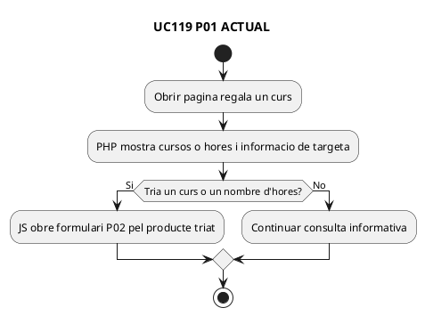

### P01 FINAL

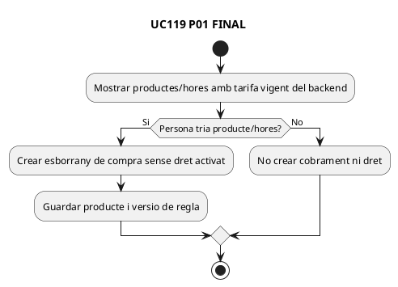

## P02 — Comprar — destinatari, origen, dedicatòria i preu

**Fonts ACTUAL:** [RegalCurs.php](../../codi-drive/web-actual/RegalCurs.php#L370-L650) · [mostrarRegal.min.js](../../codi-drive/web-actual/js1619773569/mostrarRegal.min.js#L187-L294). RegalCurs.php L370–490, L586–650; mostrarRegal.min.js L187–294. El diagrama FINAL no és una prova que aquests controls ja operin al backend.

### P02 ACTUAL

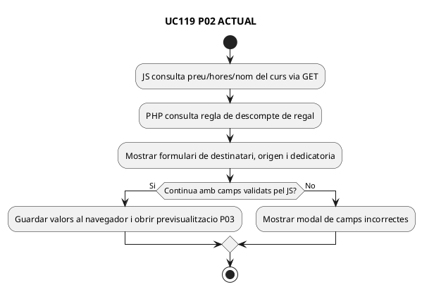

### P02 FINAL

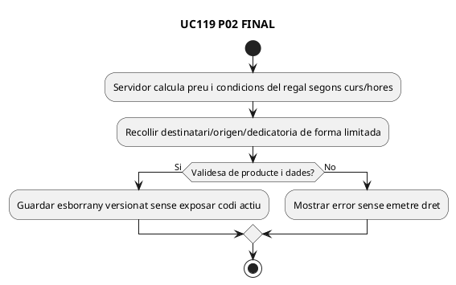

## P03 — Comprar — previsualització de la targeta i canvi d'estil

**Fonts ACTUAL:** [RegalCurs.php](../../codi-drive/web-actual/RegalCurs.php#L655-L750) · [mostrarRegal.min.js](../../codi-drive/web-actual/js1619773569/mostrarRegal.min.js#L297-L351). RegalCurs.php L655–750; mostrarRegal.min.js L297–351. El diagrama FINAL no és una prova que aquests controls ja operin al backend.

### P03 ACTUAL

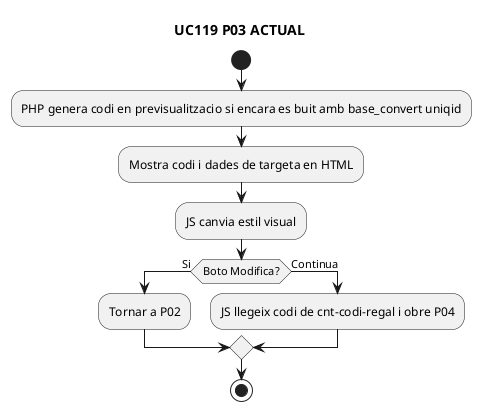

### P03 FINAL

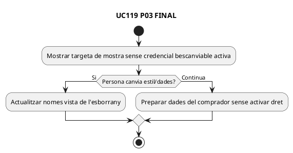

## P04 — Comprar — dades del comprador i crear comanda

**Fonts ACTUAL:** [enviarInscripcioRegal.php](../../codi-drive/web-actual/ajax/enviarInscripcioRegal.php) · [RegalCurs.php](../../codi-drive/web-actual/RegalCurs.php#L893-L1090). mostrarRegal.min.js L353–525/L664–715; ajax/enviarInscripcioRegal.php; RegalCurs.php L893–1090. El diagrama FINAL no és una prova que aquests controls ja operin al backend.

### P04 ACTUAL

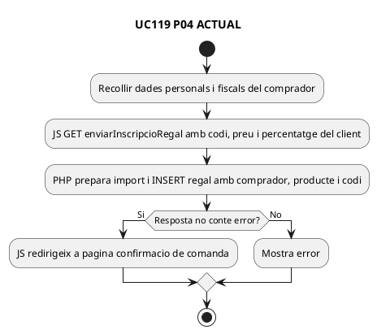

### P04 FINAL

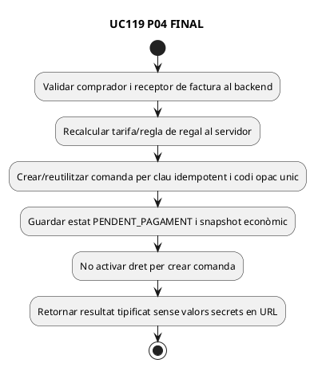

## P05 — Comprar — generar PDF de targeta i pas a pagament

**Fonts ACTUAL:** [RegalCurs.php](../../codi-drive/web-actual/RegalCurs.php#L1418-L1445) · [PagamentRegal.php](../../codi-drive/web-actual/PagamentRegal.php). RegalCurs.php L1418–1445; PagamentRegal.php/PagamentRegalAutomatic.php. El diagrama FINAL no és una prova que aquests controls ja operin al backend.

### P05 ACTUAL

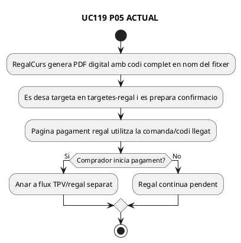

### P05 FINAL

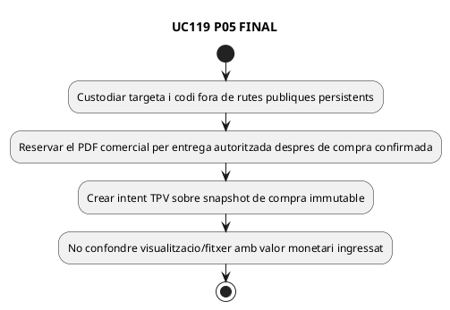

## P06 — Comprar — resultat de Redsys i factura de compra

**Fonts ACTUAL:** [respostaPagamentRegal.php](../../codi-drive/web-actual/respostaPagamentRegal.php#L121-L321) · [builder SIF](../../sif/src/Service/LegacyGiftInvoicePayloadBuilder.php). respostaPagamentRegal.php L121–321; LegacyGiftSnapshotRepository.php; LegacyGiftInvoicePayloadBuilder.php. El diagrama FINAL no és una prova que aquests controls ja operin al backend.

### P06 ACTUAL

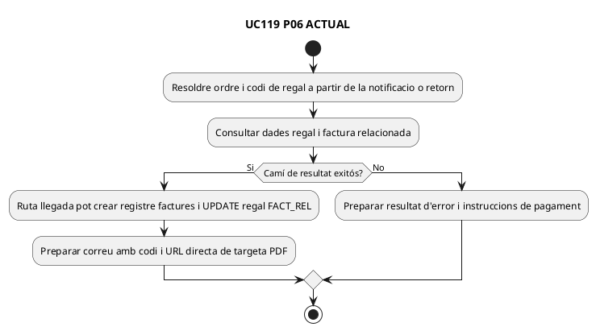

### P06 FINAL

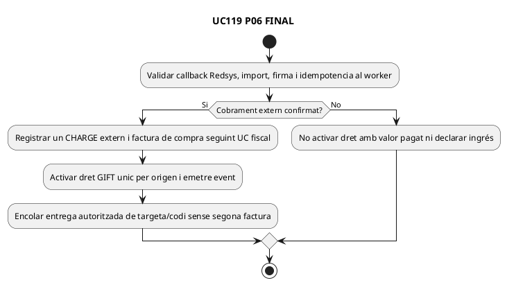

## P07 — Bescanviar — introduir codi i consultar l'estat

**Fonts ACTUAL:** [BescanviaRegal.php](../../codi-drive/web-actual/BescanviaRegal.php#L145-L245) · [JS](../../codi-drive/web-actual/js1619773569/mostrarBescanvia.min.js#L139-L215). BescanviaRegal.php L145–245; mostrarBescanvia.min.js L139–215; ajax/codiRegalValid.php. El diagrama FINAL no és una prova que aquests controls ja operin al backend.

### P07 ACTUAL

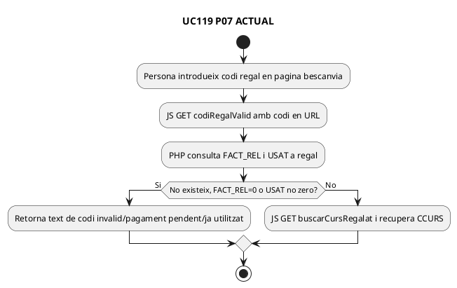

### P07 FINAL

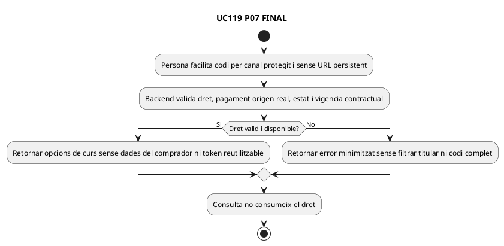

## P08 — Bescanviar — triar curs, edició i dades de la persona beneficiària

**Fonts ACTUAL:** [BescanviaRegal.php](../../codi-drive/web-actual/BescanviaRegal.php#L441-L787) · [JS](../../codi-drive/web-actual/js1619773569/mostrarBescanvia.min.js#L198-L230). mostrarBescanvia.min.js L198–230/L405–415/L775–820; BescanviaRegal.php L441–787. El diagrama FINAL no és una prova que aquests controls ja operin al backend.

### P08 ACTUAL

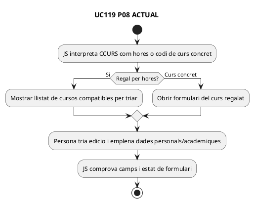

### P08 FINAL

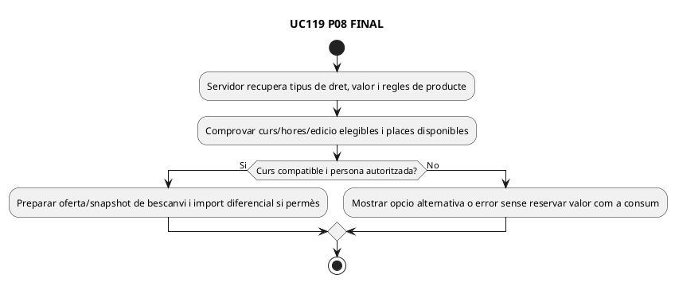

## P09 — Bescanviar — alta d'inscripció i marcar regal utilitzat

**Fonts ACTUAL:** [enviarInscripcioBescanvia.php](../../codi-drive/web-actual/ajax/enviarInscripcioBescanvia.php#L422-L608) · [JS](../../codi-drive/web-actual/js1619773569/mostrarBescanvia.min.js#L923-L996). mostrarBescanvia.min.js L923–996; enviarInscripcioBescanvia.php L422–508/L602–608. El diagrama FINAL no és una prova que aquests controls ja operin al backend.

### P09 ACTUAL

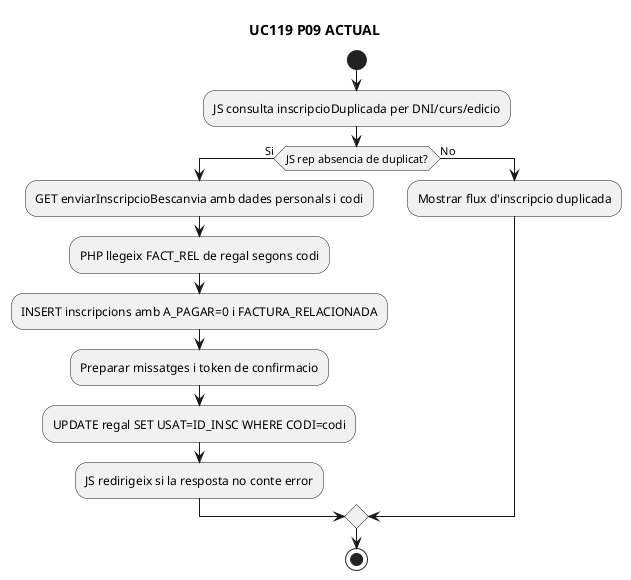

### P09 FINAL

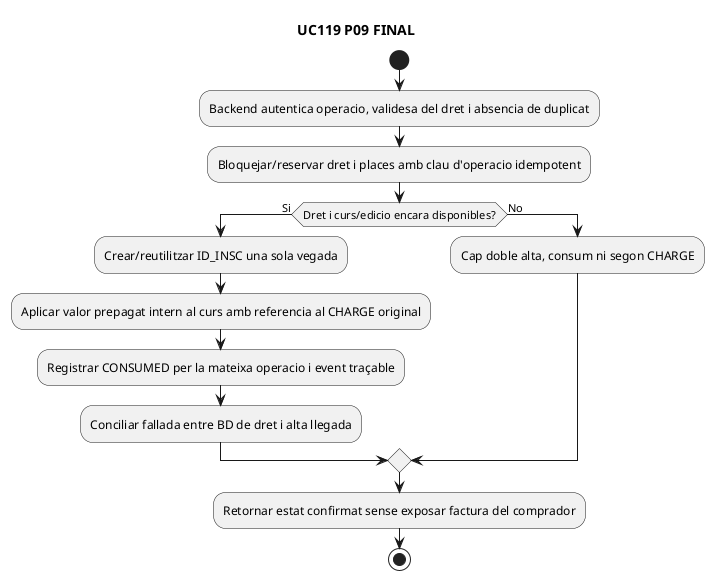

## Fronteres, traçabilitat i verificació

P01–P05: creació de targeta i comanda; P06: resultat bancari i factura del comprador; P07–P08: consulta del dret i preparació acadèmica; P09: vinculació d'inscripció i consum. **Canvi/baixa, reexpedició, caducitat i devolució** són accions diferenciades del cicle UC-119, amb pantalles reals no identificades exhaustivament en aquesta revisió; veure [UML UC-119](uc-119-cicle-complet-regal.md) i [auditoria de fonts i 14 proves](00-auditoria-casos-pendents-lot-08-uc-119-2026-09-25.md). **ACTUAL:** l'UPDATE de USAT segueix l'INSERT sense reserva/lock global acreditat. **FINAL:** un dret, una inscripció de destí per bescanvi d'ús únic i una sola entrada de caixa de compra. **DOC:** recorregut observat traçat; **IMP coordinador:** pendent; **TEST:** no executat; **PRODUCCIÓ:** no verificada.
