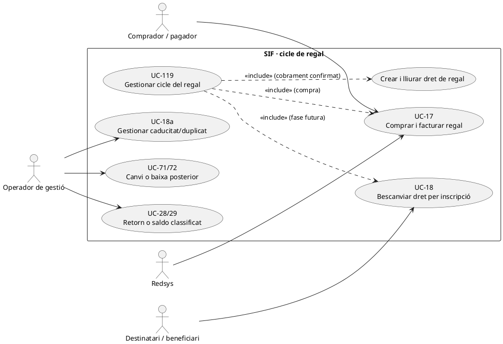
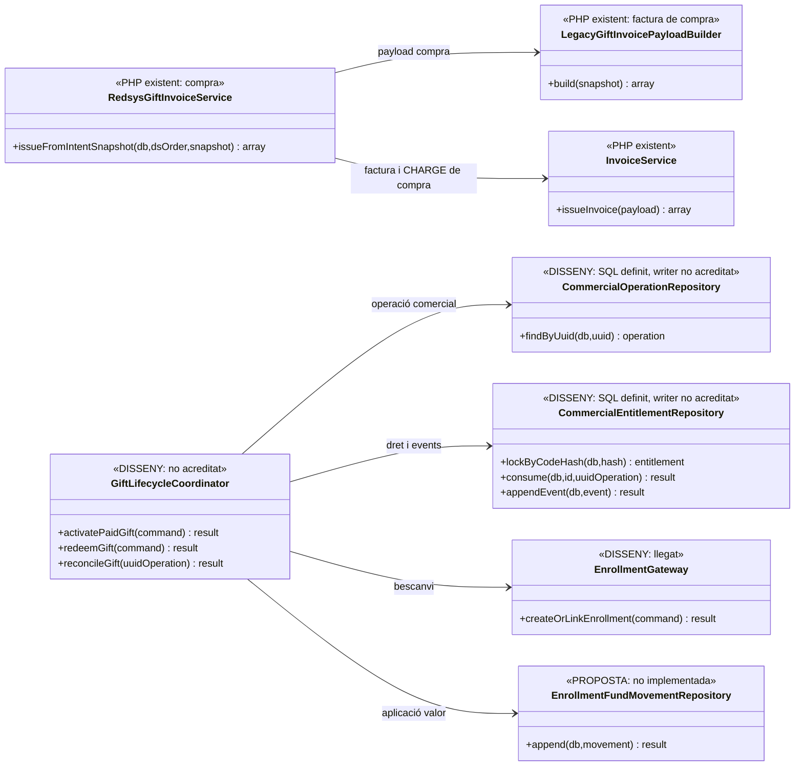
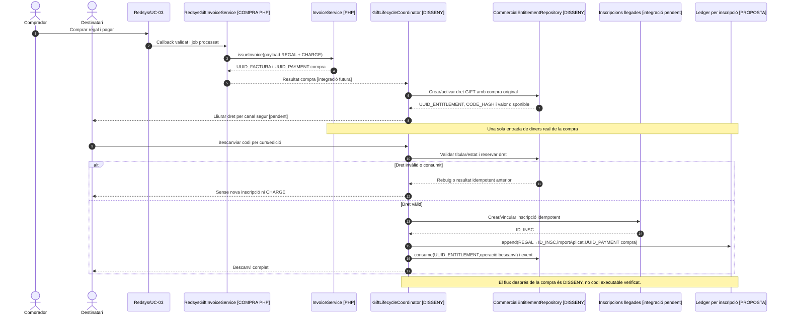
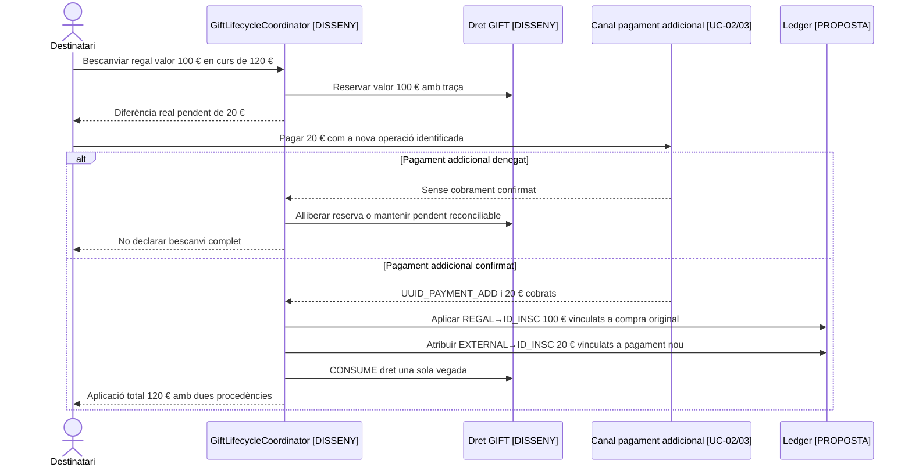

# UC-119 · Cicle complet d'un regal o codi de bescanvi

**Objectiu:** vincular la compra d'un regal, la factura del comprador, el pagament real, la titularitat del dret, el lliurament del codi, el bescanvi per una inscripció i qualsevol expiració/canvi/devolució **sense comptar dues vegades el mateix diner**. Aquesta és la coordinació de UC-17 (compra), UC-18 (bescanvi) i UC-18a (excepcions); no els substitueix.

**Estat contrastat:** compra i facturació parcialment implementades per `RedsysGiftInvoiceService`, `LegacyGiftInvoicePayloadBuilder` i `InvoiceService`. Les migracions defineixen `commercial_operation`, `commercial_operation_party`, `commercial_operation_line`, `operation_line_invoice_link`, `commercial_entitlement` i `commercial_entitlement_event`. **No s'ha identificat al PHP SIF un orquestrador d'extrem a extrem, un writer complet de drets/consums o una conciliació de fons de regal cap a inscripció.** Els components de coordinació representats aquí són **DISSENY**, encara que la BD ja tingui taules.

## 1. Fitxa del cas

| Element | Contracte i separació de responsabilitats |
| --- | --- |
| Actors | Comprador i pagador del regal, beneficiari/tenidor del codi, operador autoritzat, Redsys o banc. Poden ser persones diferents; no deduir el propietari del valor del nom de la persona inscrita. |
| Operació d'origen | `commercial_operation` amb `UUID_OPERATION`, tipus `GIFT` o classificació documentada, receptor/participants a `commercial_operation_party`, preu/versionat i UUID de factura/pagament quan existeixin. **La presència de les columnes no acredita un writer que les pobli avui.** |
| Factura de compra | UC-17: factura vinculada al regal i comprador/receptor fiscal, amb una entrada `CHARGE` només si el TPV ha confirmat un cobrament. El codi regal no substitueix el `UUID_PAYMENT` real. |
| Dret comercial | `commercial_entitlement` definit a BD amb `ENTITLEMENT_TYPE=GIFT`, `CODE_HASH`, `HOLDER_PARTY_KEY`, `ORIGIN_UUID_OPERATION`, `CONSUMED_UUID_OPERATION`, `RULE_VERSION`, valor, moneda, caducitat i estat. |
| Historial del dret | `commercial_entitlement_event` amb accions `ISSUE`, `ACTIVATE`, `VALIDATE`, `RESERVE`, `RELEASE`, `CONSUME`, `EXPIRE`, `CANCEL`, `REVERSE` i denegacions, segons diccionari; el SQL és contracte de dades, **no prova d'execució**. |
| Bescanvi | UC-18 crea o vincula una inscripció i marca el dret consumit **una sola vegada**. Per defecte, no crea segona factura/cobrament pel valor del regal ja facturat i ingressat; les diferències exigeixen classificació pròpia. |
| Efecte monetari | En el ledger objectiu: ingrés extern real → dret REGAL en UC-17, després dret REGAL → inscripció a UC-18. És **una entrada de caixa i una aplicació interna del seu valor**, no dos `CHARGE`. |
| Resultat final | Historial que permet seguir operació de compra → factura/pagament → dret/tenidor → inscripció beneficiària → saldo/retorn/rectificativa quan correspongui, amb UUIDs i imports per tram. |

### 1.1. Flux funcional complet objectiu

1. El comprador confirma producte/edició de regal, dades fiscals, destinatari i import; s'identifica l'operació comercial i es congela el snapshot abans del TPV (UC-63). El preu esperat i el dret a emetre un codi no són un ingrés bancari.
2. Redsys confirma el pagament signat, UC-03 processa el job i UC-17 emet/reutilitza la factura al comprador i registra l'únic `payment_transaction CHARGE`. Si el cobrament és denegat, **no** activar un dret de valor pagat.
3. El sistema objectiu emet/activa el dret `GIFT` vinculant la compra i l'origen del valor a `UUID_PAYMENT`; guarda el **hash** del codi en comptes de publicar-lo en logs/URLs. El lliurament al destinatari és una fase posterior amb permisos/canal i prova de lliurament propis.
4. El beneficiari demana bescanvi (UC-18); es valida titular, codi, vigència, estat i valor disponible. Es bloqueja/reserva dret i plaça, es crea o vincula inscripció i es marca `CONSUMED` amb `CONSUMED_UUID_OPERATION` i historial. **Cal conciliació entre dues BDs si la inscripció és al llegat: no fingir commit distribuït.**
5. Es registra el traspàs intern **`REGAL → ID_INSC`** per la quantitat aplicada, referenciant el pagament de compra UC-17. Si s'ha de pagar una diferència real, es crea **un cobrament addicional diferenciat** només quan sigui confirmat; no s'incrementa falsament l'import de la compra original.
6. Quan el valor no s'aplica totalment, es conserva saldo/dret residual o es classifica devolució conforme a condicions, titularitat, import cobrat i tractament fiscal; una diferència de preu no és automàticament un descompte ni una rectificativa.
7. Si el regal caduca, es disputa o es torna a usar, UC-18a bloqueja l'aplicació i obre incidència quan correspongui; el cas es resol sense alterar silenciosament la factura o crear una segona matrícula.
8. Un canvi/baixa després del bescanvi consulta **factura i pagament de compra, dret consumit, inscripció de destí i titular del retorn**; deriva a UC-71/72 i, si cal, UC-05/28/29. No retorna directament diners al beneficiari per defecte si els va pagar un altre titular.

### 1.2. Invariants i variants de prova

| Escenari | Invariant exigida |
| --- | --- |
| Compra denegada i codi generat prematurament | Cap dret de valor pagat utilitzable, cap `CHARGE`, matrícula o atribució fictícia. |
| Callback/worker repetits | Una compra, una factura/ingrés real i un dret d'origen reutilitzat; cap segona emissió per reintentar una notificació equivalent. |
| Codi bescanviat dues vegades | Un sol `CONSUMED_UUID_OPERATION`; segona petició equivalent recupera la inscripció anterior o es rebutja si és contradictòria. |
| Lliurament a persona diferent del comprador | La recepció del codi no atorga per si sola accés a les dades fiscals del comprador ni al seu PDF. |
| Bescanvi sense plaça o fallada del llegat | Reservar/revertir o mantenir incidència; mai deixar dret consumit sense destinació reconciliable. |
| Regal nominal de 100 €, compra ingressada 100 € i curs de 100 € | `CHARGE` extern únic de 100 €, transferència del dret a inscripció 100 €, segon `CHARGE` de 0 € **no creat**. |
| Regal de 100 €, curs de 120 € i diferència ingressada de 20 € | Ingrés original 100 € + ingrés extern addicional verificat 20 €; dues procedències diferenciades atribuïdes a una inscripció, amb classificació fiscal del diferencial. |
| Regal de 100 €, curs de 80 € | Aplicació 80 €; 20 € restants subjectes a regla de dret/saldo/retorn i a qui és titular, sense crear un `REFUND` bancari fins a fer-lo efectiu. |
| Regal retornat després de bescanvi | Qualsevol devolució ha de verificar import disponible per dret/inscripció i pagador original, i correspondre a un reemborsament real. |
| Regal caducat | Estat `EXPIRED` i decisió operativa/contractual; no inventar automàticament un nou ingrés o anul·lació registral. |

### 1.3. Registre llegat de regal, codi al document fiscal i lliurament del dret

**Compra i consulta reals del llegat.** El procediment de PrisMa identifica `regal.ID` com a origen; `buscarRegNoPayByCodi` i `buscarRegNoPayByDni` localitzen regals pendents per codi o DNI del comprador, `buscarRegalById` recupera `NOM_CURS/CCURS/NOMC/NIFC/MAILC/CODI/FACT_REL/ORIGEN/DESTI`, i `updFactRegal` desa `regal.FACT_REL`. El correu històric de compra inclou el codi i un enllaç a la targeta regal PDF. Aquesta **targeta comercial** i la factura fiscal emesa al **comprador** són documents diferents, amb destinataris i permisos diferents; `FACT_REL` és un agrupador llegat, no el substitut de `UUID_FACTURA` i del vincle posterior a l'inscripció.

**Risc concret del constructor de factura.** `LegacyGiftInvoicePayloadBuilder::build()` carrega `CODI` i el passa a `line()`, que fixa `detail = 'Codi regal ' . $code`; `giftMetadata()` torna a incloure `code` en el payload. **El codi bescanviable pot quedar exposat en el detall del document fiscal i en les traces/payloads que es conservin**, encara que només s'hagués d'enviar a qui té dret al regal. Per a noves emissions, cal decidir i implementar una política de presentació que separi el **codi operatiu íntegre**, que s'ha de lliurar de forma controlada, d'una referència comercial/fiscal que no permeti bescanviar-lo. No afirmar que el builder actual ja protegeix aquest valor ni reutilitzar l'`OBSERVACIONS` llegat com a magatzem segur. Les factures **ja emeses** no es reescriuen per ocultar-lo: revisar la distribució i, si hi ha exposició, obrir incidència amb abast documentat.

**Comprar no és lliurar ni consumir.** `LegacyGiftSnapshotRepository::loadByCode()` consulta la fila de `regal` per `CODI`; el builder emet la factura del comprador, però **no** implementa una transició atòmica `ACTIVE→CONSUMED` ni una alta acadèmica vinculada al beneficiari. Una notificació Redsys validada tampoc acredita per si sola que s'hagi creat el dret, enviat la targeta o obtingut una plaça al curs. Després de l'ingrés i la factura confirmats, la fase de lliurament ha de verificar el destinatari i l'estat del dret, i un retry de correu **no** emet una segona factura ni un nou codi de valor.

**Bescanvi i diners disponibles.** Quan el beneficiari introdueix el codi, UC-18 ha d'identificar **regal/compra/factura/pagament** originals i bloquejar el consum concurrent, crear o recuperar `ID_INSC`, comprovar plaça/curs i registrar la part aplicada. Per a un regal comprat i ingressat, el bescanvi del mateix valor és **aplicació interna del dret**, no un altre `CHARGE` de l'alumne. Si es paga una diferència externa, documentar separadament titular, import i document fiscal que correspongui. Una baixa o retorn després del bescanvi comprova comprador/pagador original i saldo no consumit: posseir el codi no acredita titularitat del reemborsament ni dret a veure el PDF del comprador.

### 1.4. Proves del codi i de la separació de documents (no executades)

| ID | Escenari | Resultat exigible |
| --- | --- | --- |
| RG-119-01 | El constructor rep `CODI` bescanviable i genera la factura | Detectar-ne presència en `detail/giftMetadata`; definir presentació no bescanviable per noves emissions, sense reescriure factures ja emeses. |
| RG-119-02 | S'ha cobrat el regal però falla el correu amb la targeta | Reprendre només lliurament del dret al destinatari autoritzat, no factura ni ingrés. |
| RG-119-03 | Beneficiari consulta PDF fiscal del comprador per posseir el codi | No concedir accés a factura per la sola possessió; targeta i factura separades. |
| RG-119-04 | Dos bescanvis simultanis del mateix codi | Un únic consum/destí acreditat o incidència; no dues places ni segon `CHARGE`. |
| RG-119-05 | Regal de 100 € i curs triat de 120 €, diferència de 20 € abonada | Origen regal i ingrés addicional traçats separadament, amb classificació fiscal prèvia. |
| RG-119-06 | Beneficiari demana devolució d'un regal pagat per una altra persona | Verificar titular econòmic, import disponible i operació original abans de decidir un reemborsament real. |

## 2. Diagrama UML de casos d'ús — cicle complet

## 3. Classes del cicle — codi real i orquestració pendent

## 4. Seqüència completa — compra ingressada i bescanvi posterior

## 5. Seqüència alternativa — regal inferior al curs (DISSENY)

## 6. Traçabilitat

[UC-119 original](../06-fitxes-funcionals/uc-119.md) · [UC-17 compra](uc-017-comprar-regal.md) · [UC-18 bescanvi](uc-018-bescanviar-regal.md) · [UC-18a incidències](uc-018a-regal-caducat-duplicat.md) · [Model de fons per inscripció](00-revisio-moviments-inscripcions.md) · [Taula commercial_operation](../../sif/database/migrations/2026_09_16_000004_add_commercial_operation_and_fiscal_fields.sql) · [Taules operació/dret/event](../../sif/database/migrations/2026_09_16_000005_add_operation_lifecycle_tables.sql) · [RedsysGiftInvoiceService](../../sif/src/Service/RedsysGiftInvoiceService.php).

**Proves no executades; el cicle integral, permisos, writer de drets, conciliació entre BDs i ledger quantitatiu continuen pendents.**
