# UC-120 — activitats ACTUAL/FINAL per superfície de canvi de dades personals

**Revisió:** 25/09/2026. **ACTUAL** = PHP/JS versionats observats; **FINAL** = contracte SIF proposat. [Fitxa funcional](../06-fitxes-funcionals/uc-120.md) · [auditoria lot 09](00-auditoria-casos-pendents-lot-09-uc-120-2026-09-25.md).

## P01 · Portal alumne — consultar i activar edició

### ACTUAL
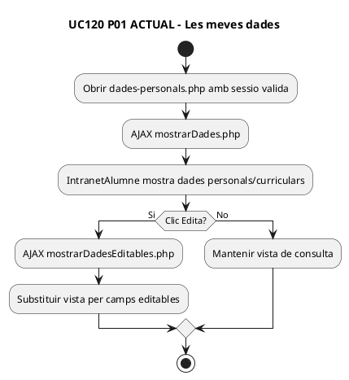

### FINAL
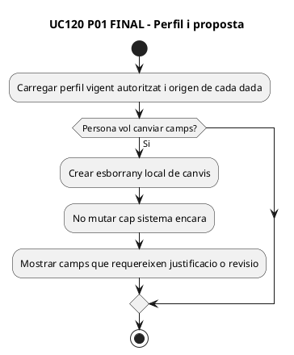

## P02 · Portal alumne — enviar petició

### ACTUAL
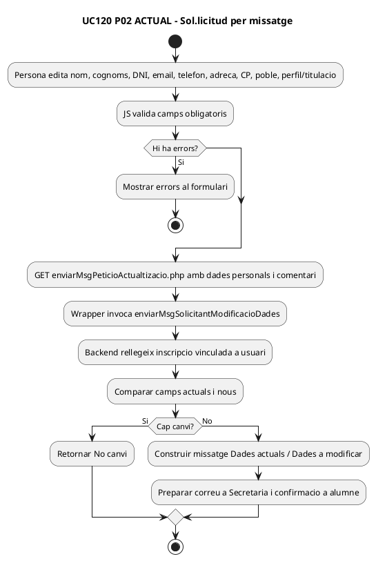

### FINAL
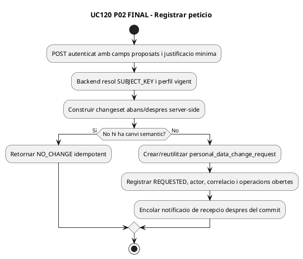

## P03 · Revisió de Secretaria/Gestió

### ACTUAL
No s'ha localitzat una pantalla específica de workflow «peticions de dades personals» amb estat REQUESTED/APPROVED/REJECTED. El correu és el mecanisme observat de traspàs a Secretaria.

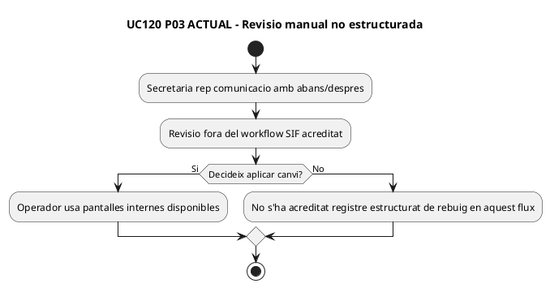

### FINAL
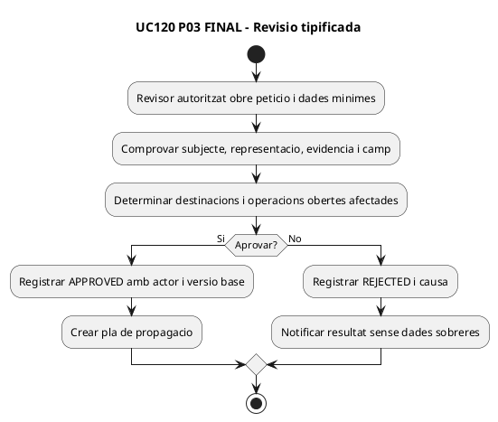

## P04 · Intranet interna — editar «Dades personals»

### ACTUAL
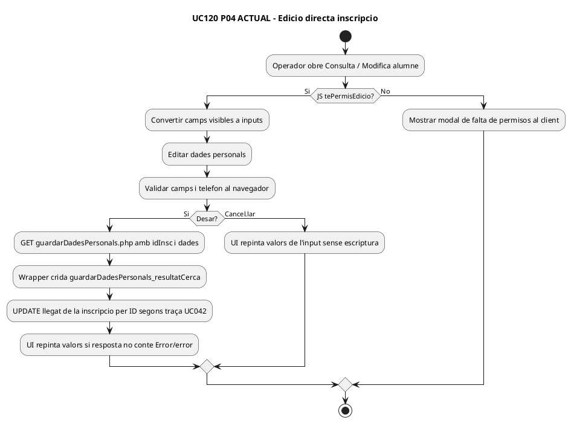

### FINAL
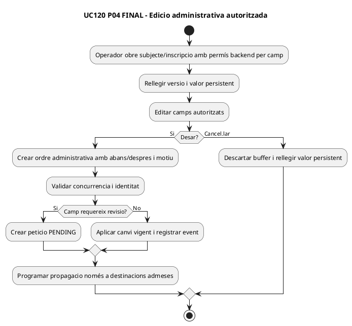

## P05 · Intranet interna — modal «Dades de la inscripció»

### ACTUAL
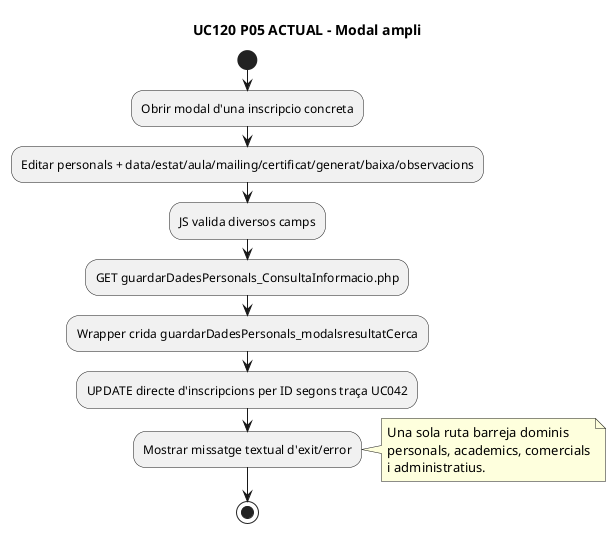

### FINAL
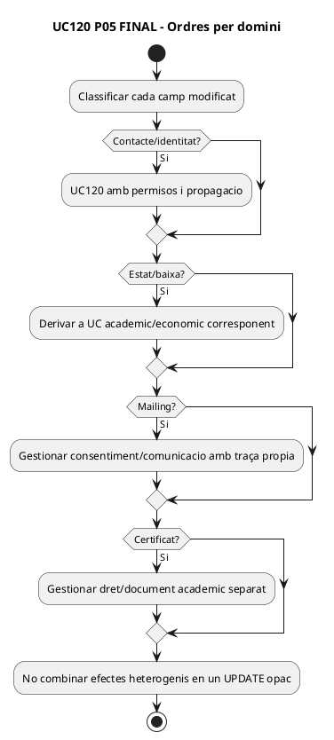

## P06 · Propagació multi-sistema i documents històrics

### ACTUAL
No s'ha acreditat un writer/worker PHP que utilitzi `personal_data_change_request.PROPAGATION_STATUS` i `PROPAGATION_RESULT_JSON`.

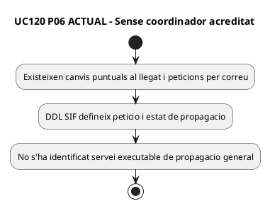

### FINAL
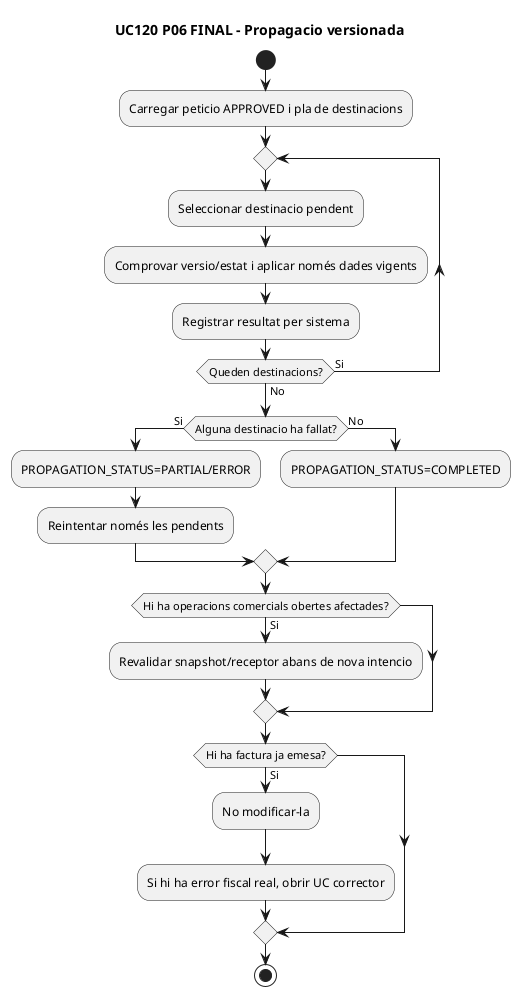

## Traçabilitat resumida

| Pas | ACTUAL acreditat | FINAL |
| --- | --- | --- |
| P01 | Consulta/edició visual en portal alumne | Esborrany sense mutació |
| P02 | GET + comparació + correus, sense fila SIF acreditada | Petició estructurada/idempotent |
| P03 | Revisió per correu sense workflow observat | Aprovar/rebutjar per camp/rol |
| P04 | UPDATE directe d'una inscripció | Ordre administrativa + versió + traça |
| P05 | UPDATE ampli barreja dominis | UCs/ordres diferenciats |
| P06 | DDL existeix, propagador no acreditat | Jobs per destí + estat parcial + immutabilitat fiscal |

**DOC:** 12 diagrames ACTUAL/FINAL. **IMP:** coordinador/worker no acreditat. **TEST:** no executat. **PRODUCCIÓ:** no verificada.
