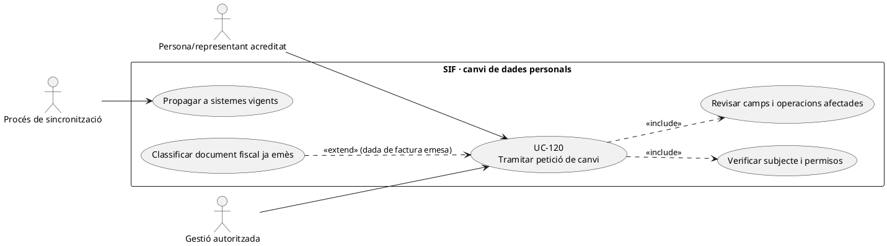
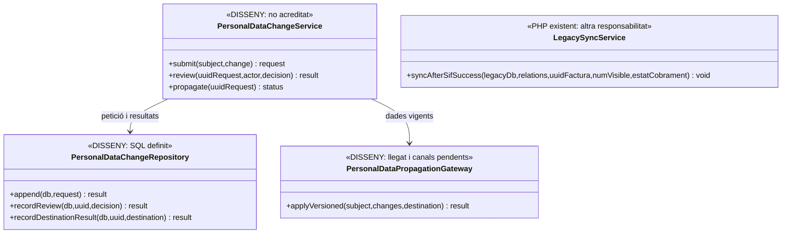
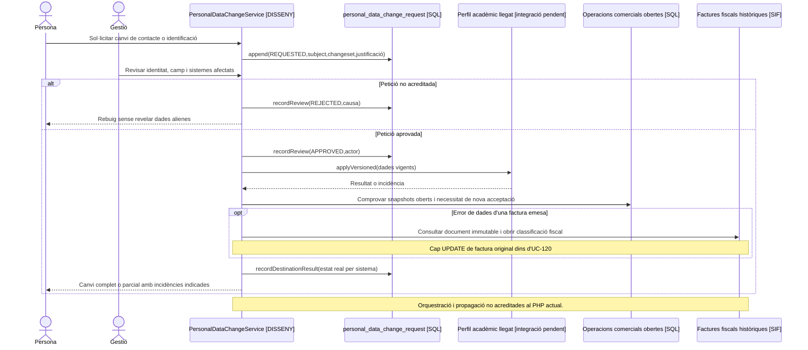
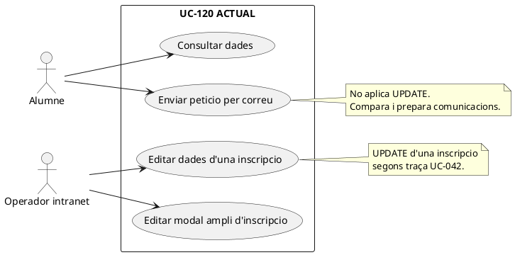
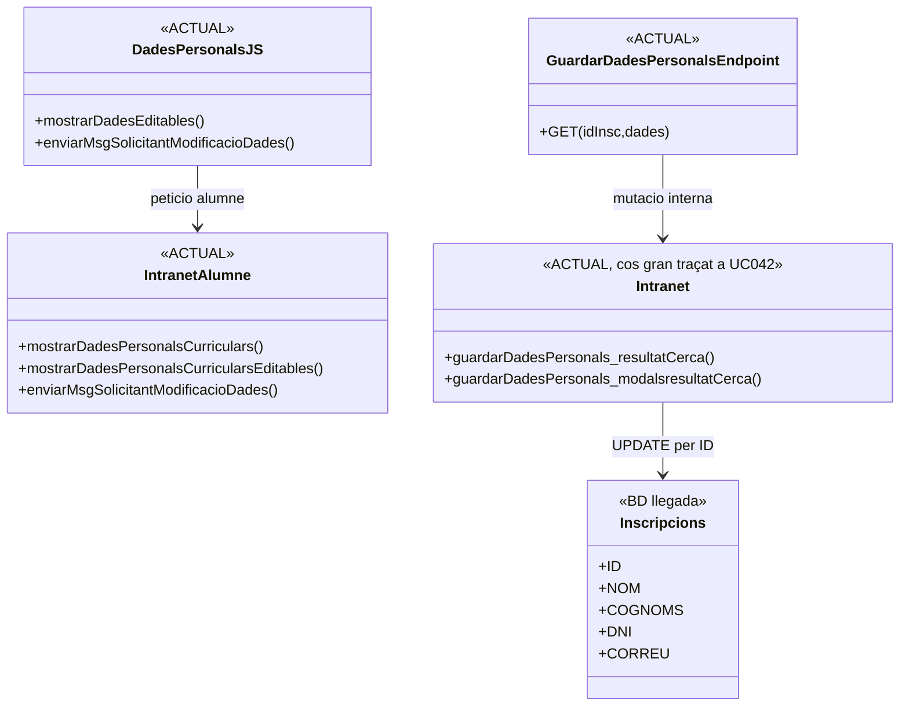
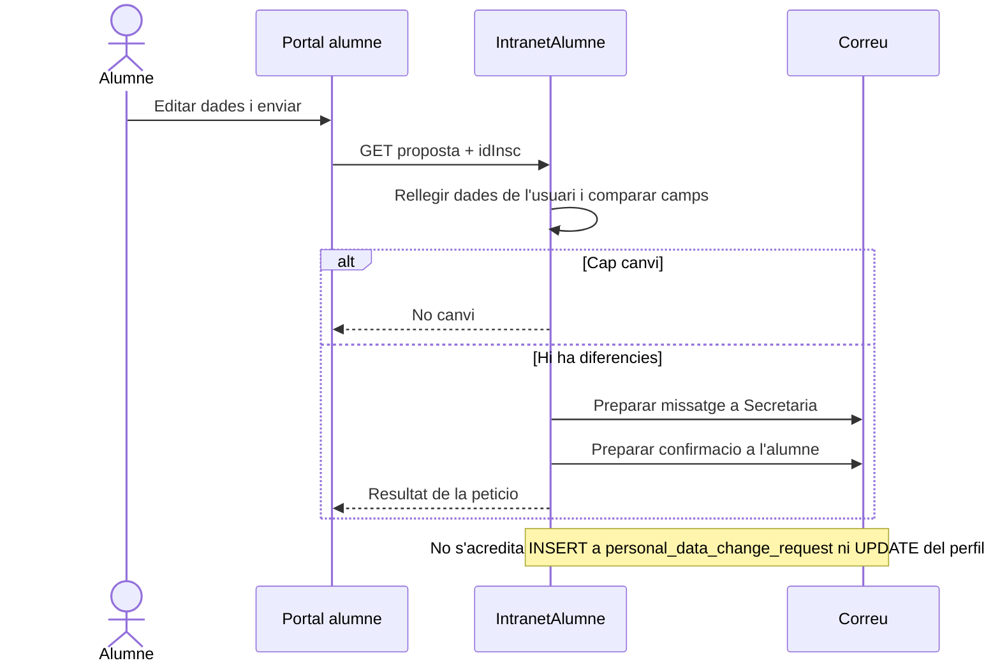
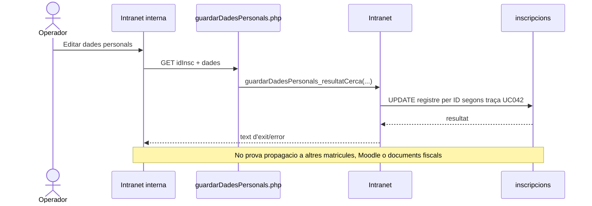

# UC-120 · Tramitar una sol·licitud de canvi de dades personals i propagar-la

**Objectiu canònic:** registrar abans/després, justificació, decisió, actor i sistemes afectats; **cap factura emesa ni snapshot històric es reescriu**. **Contrast 25/09/2026:** el portal alumne ACTUAL envia una petició per correu; la intranet interna ACTUAL pot fer UPDATE directe d'una inscripció. Els apartats 6–9 afegeixen aquesta separació al model, sense presentar el servei final com a implementat. La fitxa original deixa pendent determinar qui aprova cada camp, a quins sistemes es propaga i el tractament de rectificació/supressió sense alterar documents històrics.

**Evidència SQL:** `personal_data_change_request` inclou `SUBJECT_KEY`, `REQUESTER_ACTOR_ID`, `CHANGESET_JSON`, `JUSTIFICATION`, `EVIDENCE_STORAGE_REF/HASH`, estat i revisió, `PROPAGATION_STATUS`, `PROPAGATION_RESULT_JSON`, `AFFECTED_OPEN_OPERATIONS_JSON`, correlació i timestamps. **No s'ha acreditat** una classe PHP que gestioni la petició, autoritzi l'actor, modifiqui les dades acadèmiques i propagui per tots els canals. L'existència d'aquesta taula **no** implica que el canvi s'hagi completat en llegat, facturació, aula o enviaments.

## 1. Fitxa funcional específica

| Aspecte | Regla i distinció |
| --- | --- |
| Actors | Persona interessada o representant verificat; gestió amb permisos per camp; responsable de protecció de dades quan la sol·licitud requereixi revisió; procés de sincronització entre sistemes. |
| Entrada | Subjecte identificat, petició/actor, camp i valor anterior/proposat, motiu, prova mínima quan cal, llista de sistemes afectats, estat de les operacions comercials obertes i correlació. No incloure credencials, documents complets o proves sensibles en `CHANGESET_JSON`. |
| Tipus de canvi | Separar contacte/accés (per exemple email), identitat fiscal d'operació **encara oberta**, dades acadèmiques vigents i errors d'una factura **ja emesa**. Cada categoria té permisos i efectes diferents. |
| Persistència | `personal_data_change_request` pot registrar proposta, revisió, estat de propagació i incidències; el SQL **no** aplica el canvi a `inscripcions`, `factura`, `fact_rels` ni a altres sistemes automàticament. |
| Operacions obertes | Revisar snapshot i receptor/pagador de cada oferta pendent; si un canvi d'identitat fiscal afecta un checkout acceptat, fer nova classificació/acceptació quan correspongui, no substituir silenciosament la instantània usada per `DS_ORDER`. |
| Factura emesa | El document fiscal, emissor/receptor congelats, número, línies i cadena **no s'editen** a causa d'un canvi al perfil. Si l'error afecta dades fiscals d'un document emès, classificar la via de correcció fiscal aplicable amb UC-05/74; no deduir que qualsevol canvi personal exigeix rectificativa. |
| Dades històriques i supressió | Minimització/restricció i política de conservació a definir per tipus i sistema; no fer `DELETE` automàtic de factures històriques o evidències necessàries perquè una persona canvia el correu de contacte. |

### Flux objectiu

1. El canal verifica subjecte/representació, captura camp/s a corregir i justificant mínim, i limita qui pot veure dades anteriors. Registra `personal_data_change_request` amb correlació.
2. Un revisor habilitat determina camps/sistemes i comprova si la petició afecta únicament perfil acadèmic/contacte o també dades fiscals d'operacions obertes/factures emeses. Denegació amb causa tipificada i informació de resultat al sol·licitant.
3. Quan és aprovada, el coordinador **pendent** crea un pla de propagació idempotent amb destinacions i versions/estats, sense assumir una transacció distribuïda entre BD llegada, SIF i altres aplicacions.
4. Actualitza les dades **vigents** en cadascun dels sistemes pertinents i registra resultat per destinació a `PROPAGATION_RESULT_JSON`; un error parcial deixa `PROPAGATION_STATUS` pendent i un reintent del mateix canvi, mai un historial que diu «complet» sense verificar cada sistema.
5. Per operacions encara obertes, UC-112/114 classifica si el snapshot acceptat requereix nova aprovació del pagador; no reescriure la intenció `DS_ORDER` anterior.
6. Per factures ja emeses, mantenir història i derivar únicament els errors fiscals reals al procediment corrector corresponent. No propagar el nou NIF o nom al camp de receptor d'una factura antiga per simple actualització de perfil.
7. Tancar petició quan la propagació ha quedat registrada, les incidències pendents estan identificades i les restriccions de visibilitat/retenció han estat aplicades.

### Alternatives i proves

| Cas | Resultat |
| --- | --- |
| Correu nou abans de comprar | Actualitzar contacte vigent autoritzat; no tocar imports ni factura antiga. |
| Canvi de NIF amb compra pendent | Revalidar receptor fiscal i snapshot, determinar si cal nova acceptació/intenció segons l'estat de la compra. |
| Receptor equivocat en factura ja emesa | Expedient de correcció fiscal; no `UPDATE factura.BILLING_NIF` ni regeneració opaca del PDF. |
| Un sistema confirma i l'altre falla | Reintentar només la destinació pendent i mantenir `PROPAGATION_STATUS` de no completat. |
| Sol·licitant no acreditat o canvi d'una altra persona | Denegar accés i decisió sense exposar les dades personals de l'altre subjecte. |
| Sol·licitud de supressió incompatible amb alguna conservació aplicable | Classificar i documentar les dades i destinacions segons el règim aplicable, sense aplicar un esborrat global que alteri registres fiscals. |

**Pendents:** matriu de permisos per camp i destinació, esquema de propagation jobs, validació de representació/justificants, tractament d'operacions obertes i documents emesos, política de retenció, proves de fallada parcial i auditoria. No s'han executat proves PHP.

### 1.1. Abast real del canvi llegat i diferències entre destinacions

**Què modifica el circuit actual.** El procediment `Consulta - Modifica alumne` de `/alumnes/mostrar-alumne/` descriu `guardarDadesPersonals_resultatCerca()` com a via d'edició de dades operatives i assenyala que **només afecta inscripcions pendents de començar**. La mateixa fitxa pot mostrar inscripcions actives, acabades i congelades, i obrir factura, baixa, canvi de curs i certificat: veure-les a la pantalla **no** prova que el canvi es propagui a cada categoria o a cada servei vinculat. Cal capturar `ID_INSC`, versió/estat de cada origen i **destinacions realment modificades**, distingint la petició de canvi del seu resultat.

**Correu i DNI no tenen el mateix efecte.** Un nou `CORREU` de contacte pot afectar comunicacions d'una matrícula pendent, notificacions ja encolades i usuari acadèmic/Moodle, però no autoritza a substituir el contacte de lliurament d'una **factura d'empresa** sense validar el receptor i el mandat. El canvi de `DNI` pot resoldre identitat d'alumne per a futures operacions; si una factura individual ja existeix, les dades `BILLING_*` històriques segueixen sent les que es van emetre fins que UC-74 classifiqui un possible error del document. No utilitzar `FACTURA_RELACIONADA` per traspassar automàticament l'accés entre dues persones amb el mateix email.

**Propagació amb resultats parcials.** `personal_data_change_request.PROPAGATION_STATUS` i `PROPAGATION_RESULT_JSON` formen part de l'esquema previst, **sense writer executable acreditat**. Si el perfil d'intranet s'ha actualitzat i falla Moodle o un sistema de notificacions, desar l'event original i la fase pendent; repetir només l'actualització fallida i tornar a consultar el seu resultat, sense fer un nou canvi fiscal ni moure cobraments. Per als enllaços de document ja emesos o recordatoris de pagament encara pendents, revalidar destinatari i permís amb UC-49/58/80 abans d'enviar-los.

### 1.2. Proves de propagació i història (no executades)

| ID | Escenari | Resultat exigible |
| --- | --- | --- |
| PD-120-01 | El llegat actualitza només inscripcions pendents, però l'alumne en té d'acabades | Resultat per destí i cobertura explícits; cap «tot sincronitzat» fictici. |
| PD-120-02 | Correu compartit per dues persones | UC-126 decideix identitat, no fusió automàtica de perfils o matrícules. |
| PD-120-03 | Correu nou després d'encuar factura d'empresa | Revalidar destinatari/representació i cancel·lar missatge obsolet si cal. |
| PD-120-04 | DNI actual canvia i hi ha factura individual emesa | Mantenir receptor històric; classificar error fiscal només quan existeixi. |
| PD-120-05 | Intranet correcta, Moodle falla i es reintenta canvi | Reprendre només destí pendent, sense duplicar matrícula ni factura. |

## 2. UML de casos d'ús

## 3. Diagrama de classes — SQL definit, propagació pendent

`LegacySyncService` existent fa sincronització de **resultats de factura**; no s'ha d'interpretar com a gestor implementat de canvis de dades personals, per això no es dibuixa com a dependència executable d'UC-120.

## 4. Seqüència — actualització de perfil i document fiscal preservat

## 5. Traçabilitat

[UC-120 original](../06-fitxes-funcionals/uc-120.md) · [UC-114 versions](uc-114-versionar-producte-edicio.md) · [UC-112 snapshot](uc-112-congelar-snapshot-abans-tpv.md) · [UC-05 correcció](uc-005-rectificar-factura.md) · [UC-53 reconciliació](uc-053-detectar-resoldre-divergencies.md) · [Migració personal_data_change_request](../../sif/database/migrations/2026_09_16_000005_add_operation_lifecycle_tables.sql) · [LegacySyncService: sincronització fiscal diferent](../../sif/src/Service/LegacySyncService.php).

## 6. Components ACTUALS contrastats

| Component | Tipus | Responsabilitat observada |
| --- | --- | --- |
| `intranet-alumne/dades-personals.php` + JS | ACTUAL | Consultar/editar visualment dades i enviar proposta. |
| `IntranetAlumne::enviarMsgSolicitantModificacioDades()` | ACTUAL | Rellegir dades, comparar abans/després i preparar correus; no muta perfil. |
| `guardarDadesPersonals.php` | ACTUAL | Wrapper GET cap a mutació interna d'una inscripció. |
| `guardarDadesPersonals_ConsultaInformacio.php` | ACTUAL | Wrapper ampli per dades personals + estat/mailing/certificat/baixa. |
| `Intranet::guardarDadesPersonals_resultatCerca()` | ACTUAL segons traça UC-042 | UPDATE d'una fila d'`inscripcions` per ID; no propagació general. |
| `personal_data_change_request` | DISSENY SQL | Petició, revisió, evidència, propagació i resultats; writer no acreditat. |

## 7. UML de casos d'ús — ACTUAL

## 8. Classes i seqüències ACTUALS

## 9. Disseny FINAL: petició i propagació

El model de les seccions 1–4 continua sent **FINAL**. S'afegeix una regla explícita: la petició de l'alumne i l'edició administrativa directa són **dos orígens diferents** que desemboquen en el mateix historial de canvi, però poden tenir requisits d'aprovació diferents. El servei FINAL ha de registrar before/after, actor, base version, decisió, destinacions i resultats. Els camps de baixa, mailing i certificat del modal llegat es descomponen en ordres/UC específics.

Vegeu els [12 diagrames ACTUAL/FINAL](uc-120-activitats-dades-personals-actual-final.md) i l'[auditoria lot 09](00-auditoria-casos-pendents-lot-09-uc-120-2026-09-25.md).

**Estat:** DOC contrastada; servei `PersonalDataChangeService`/propagador no acreditat; proves no executades; producció no verificada.
