# UC-121 — activitats de renovació de reserva/enllaç per pàgina i acció ACTUAL/FINAL

**Revisió:** 25/09/2026. **ACTUAL** = flux estàticament observable al codi `main`; **FINAL** = contracte no implementat íntegrament. UC-121 no té una pàgina llegada específica «Renova reserva» acreditada: P01–P03 són els punts d'entrada actuals de pagament; P04–P05 són components backend reals; P06 és **només FINAL**. [Fitxa](../06-fitxes-funcionals/uc-121.md) · [UML](uc-121-repreuar-renovar-reserva-caducada.md) · [auditoria lot 10](00-auditoria-casos-pendents-lot-10-uc-121-2026-09-25.md).

## P01 · Web pagament de curs, consulta de dades i imports

**Font:** [`PagamentCursAutomatic.php` L26–117, L265–317](../../codi-drive/web-actual/PagamentCursAutomatic.php#L265-L317). Llegeix `IDPAG` i `A_PAGAR/PAGAMENT`; consulta dades d'edició `DATAI/DATAF`, que no són el venciment d'una reserva de plaça.

### ACTUAL
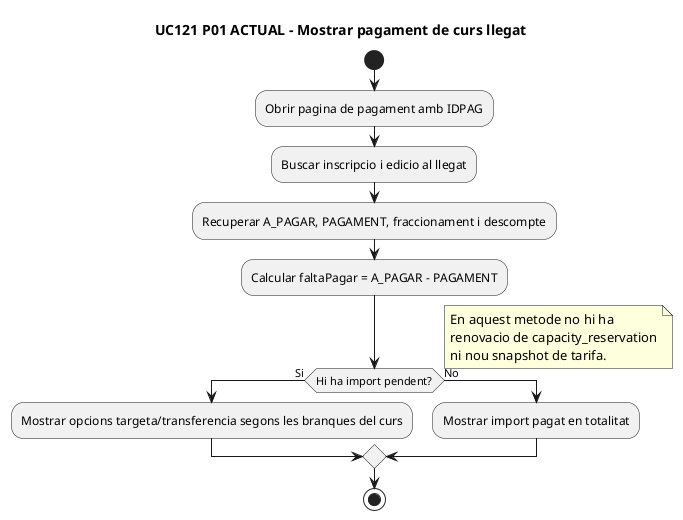

### FINAL
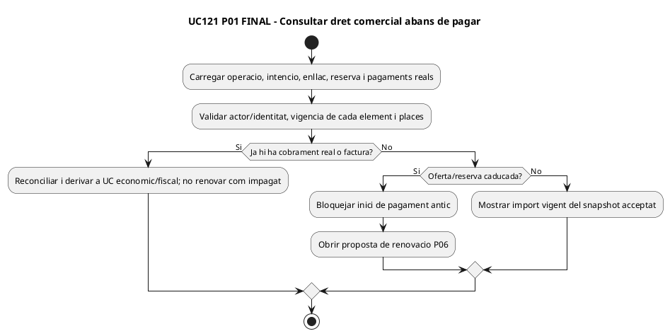

## P02 · Web confirmació/targeta d'inscripció pendent

**Font:** [`PagamentCursAutomatic.php` L328–395, L431–498](../../codi-drive/web-actual/PagamentCursAutomatic.php#L431-L498); [JS confirmació L140–248](../../codi-drive/web-actual/js1619773569/mostrarConfirmacioInscripcioAutomatic.min.js#L140-L248).

### ACTUAL
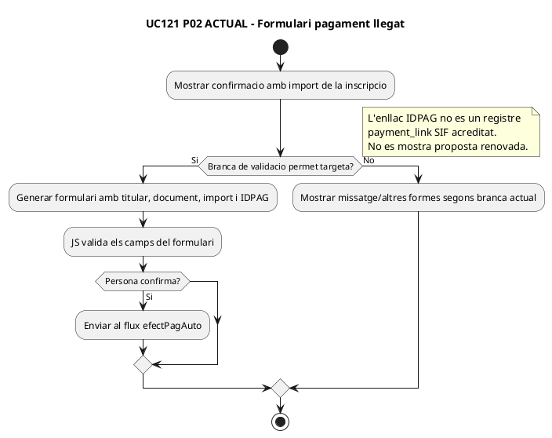

### FINAL
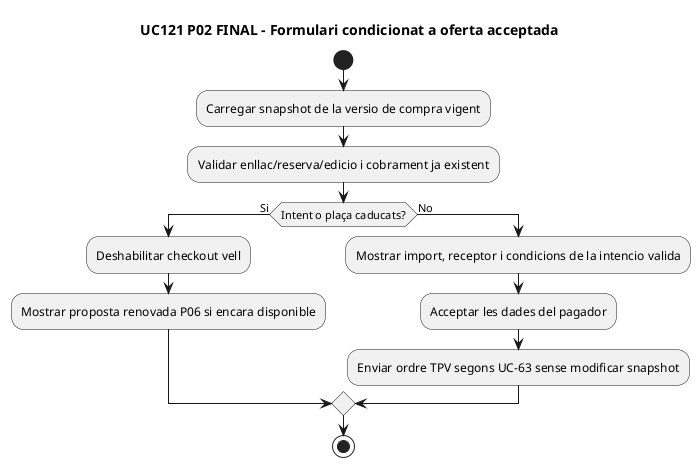

## P03 · Portal alumne, enllaç a pagament d'una inscripció

**Font:** [`ajax/cursos/obtenirUrlPagament.php`](../../codi-drive/intranet-alumne-actual/ajax/cursos/obtenirUrlPagament.php), [`IntranetAlumne.php` L2947–2978](../../codi-drive/intranet-alumne-actual/IntranetAlumne.php#L2947-L2978).

### ACTUAL
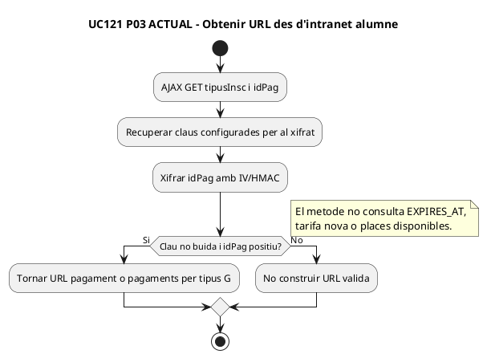

### FINAL
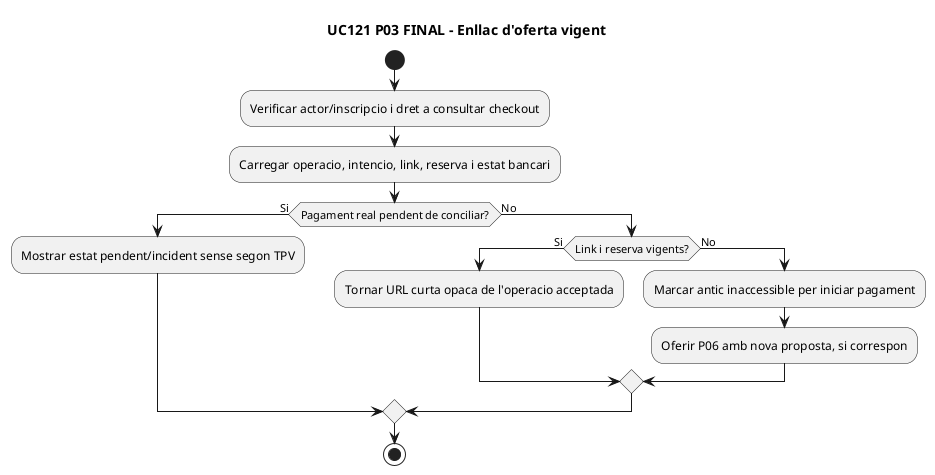

## P04 · SIF, crear/reutilitzar una intenció per DS_ORDER

**Font:** [`RedsysPaymentIntentService.php` L19–85](../../sif/src/Service/RedsysPaymentIntentService.php#L19-L85). És PHP real del SIF però no gestiona per si sol UC-121 complet.

### ACTUAL
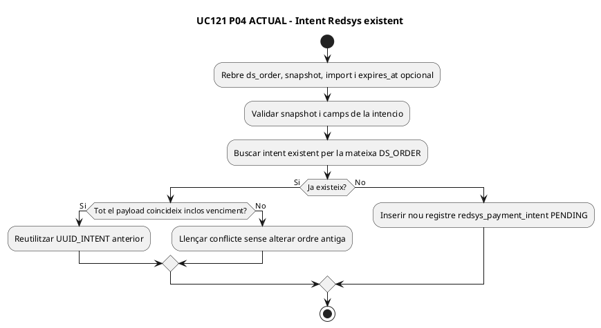

### FINAL
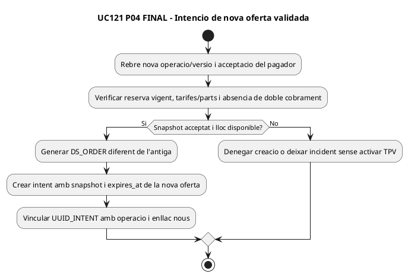

## P05 · SIF, callback signat de l'ordre antiga o renovada

**Font:** [`RedsysCallbackService.php` L21–90, L134–153](../../sif/src/Service/RedsysCallbackService.php#L134-L153). Confirmació de la notificació **no és confirmació de plaça comercial**.

### ACTUAL
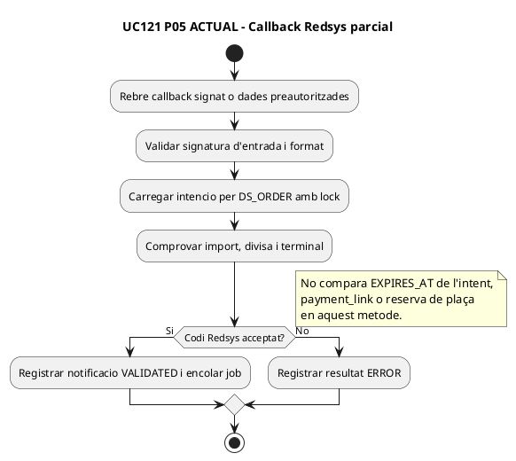

### FINAL
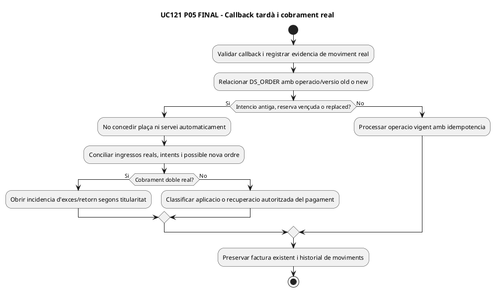

## P06 · Gestió SIF de renovar reserva caducada — només FINAL

**No hi ha pàgina/worker ACTUAL acreditat que compari un preu nou, revoqui enllaç, reservi plaça i demani acceptació.** La definició SQL de `payment_link` i `capacity_reservation` no es dibuixa com una pantalla ja operativa.

### FINAL
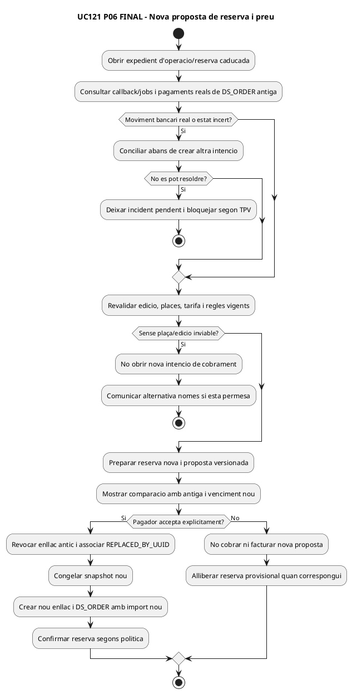

## Traçabilitat i límits

P01–P03 són **pàgines/punts web ACTUALS de pagament**, no pàgines específiques de renovació. P04–P05 són serveis SIF reals d'intenció/callback, **no** evidència d'un coordinador comercial de reserva. P06 és només disseny FINAL. La tolerància numèrica, política de disponibilitat sense plaça, acceptació amb import idèntic i gestió de reserva de descompte continuen com a decisions de negoci per formalitzar; no se n'ha inventat cap valor. **DOC:** 11 activitats PlantUML; **IMP:** parcial només en intenció/callback; **TEST:** cap executat; **PRODUCCIÓ:** no verificada.
