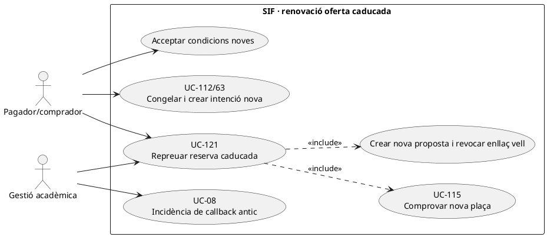
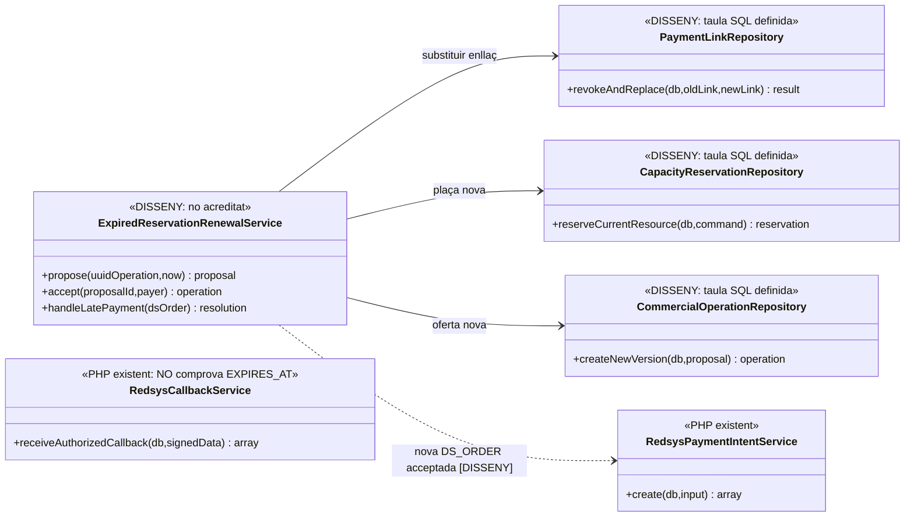

# UC-121 · Repreuar o renovar una reserva caducada abans del pagament

**Objectiu canònic:** una reserva/operació caducada **no recupera automàticament el preu antic**; es comprova disponibilitat actual, es prepara una proposta amb nova versió, reserva i enllaç, i el pagador l'accepta explícitament **abans de cobrar**. La fitxa original deixa pendents tolerància de caducitat i canvis de preu/plaça que exigeixen acceptació nova.

**Codi revisat:** `RedsysPaymentIntentService::create()` desa `EXPIRES_AT` opcional i compara aquest camp amb el d'una intenció repetida per **el mateix `DS_ORDER`**. `RedsysCallbackService::receiveAuthorizedCallback()` verifica signatura, intenció existent i import/divisa/terminal i crea job per resposta autoritzada; **en el codi inspeccionat no compara `EXPIRES_AT` amb l'instant del callback**, de manera que una resposta d'una ordre vella amb import correcte **no prova** que encara tingui plaça o oferta vigent. `payment_link` i `capacity_reservation` estan definits a SQL, però **no s'ha acreditat** el servei PHP que caduqui/renovi l'enllaç i la plaça conjuntament.

## 1. Fitxa específica

| Aspecte | Contracte |
| --- | --- |
| Actors | Pagador/comprador, ecommerce/operador i gestió acadèmica si cal autoritzar plaça o preu diferent. |
| Entrada | `UUID_OPERATION` i reserva/edició original, `UUID_PAYMENT_LINK` i `DS_ORDER` antics quan existeixin, preu i regla congelats abans, disponibilitat i preu actuals, persona/pagador, nova proposta/versió, data de caducitat, actor i petició idempotent. |
| Estat anterior | Operació o reserva caducada amb snapshot conservat **per a traçabilitat**, no com a preu i plaça reutilitzables sense consentiment. No es modifica retrospectivament el snapshot associat a una intenció anterior. |
| Model d'enllaç definit | `payment_link`: `TOKEN_HASH`, `UUID_OPERATION`, `EXPECTED_AMOUNT`, `STATUS`, `EXPIRES_AT`, revocació i `REPLACED_BY_UUID`. La definició SQL **no implementa revocació automàtica ni prohibició de servir l'enllaç antic**. |
| Model de plaça definit | `capacity_reservation` preveu estat, quantitat, expiració, `LOCK_VERSION`, confirmació i alliberament. **No** hi ha servei transaccional d'aforament acreditat (UC-115). |
| Nova acceptació | Mostrar al pagador **edició, plaça, import final, descomptes i receptor** de la nova oferta; després de l'acceptació, UC-112 congela el nou snapshot i UC-63 crea **nova** intenció/ordre quan pertoca. |
| Efecte fiscal/econòmic | Una reserva que venç **sense ingrés real** no crea factura, `CHARGE` o `REFUND`. Si un callback tardà acredita un pagament, **els diners reals no desapareixen** perquè l'oferta hagi vençut: cal incidència, conciliació i decisió econòmica/fiscal separada. |

### 1.1. Flux objectiu de renovació

1. El checkout rep una ordre de pagament sobre una operació/reserva **caducada**. Consulta també si hi ha `UUID_PAYMENT` confirmat d'un callback tardà **abans** de proposar una nova captura, per evitar doble cobrament.
2. Un coordinador **pendent** identifica preu/regla, aforament i data d'edició actuals; UC-115 prova una nova reserva de plaça. La regla exacta de tolerància és decisió de negoci, **no** la crea la columna `EXPIRES_AT`.
3. Crea una **proposta versionada nova** amb diferència de preu, places i termes, preserva l'operació caducada i prepara revocació de l'enllaç anterior; la taula `payment_link` admet `REPLACED_BY_UUID`, però el servei que n'executa i controla la transició no s'ha acreditat.
4. El pagador accepta o rebutja la nova proposta. Sense acceptació explícita, no iniciar un altre TPV amb el nou import ni crear una factura sobre el preu no consentit.
5. En acceptació, es congela nou snapshot UC-112 amb una intenció `DS_ORDER` **diferent de l'antiga** si han canviat import, venciment o dades. El servei d'intencions existent **rebutja** reutilitzar el mateix `DS_ORDER` amb contingut contradictori.
6. Si la nova intenció es cobra, UC-03 processa l'ingrés i UC-01 emet/reutilitza segons el circuit vàlid. La inscripció/plaça real queda confirmada amb la **nova** reserva i s'atribueix només l'import de caixa efectiu.
7. Si arriba més tard un callback **de la intenció antiga**, `RedsysCallbackService` pot considerar-lo vàlid si signatura, import/divisa/terminal coincideixen: el coordinador ha de detectar expiració/duplicació comercial, **no** concedir dues places ni cobrar/emetre dues vegades. Es deriva a UC-08/53 i a resolució UC-104/28 quan pertoqui.
8. Si la nova reserva o el TPV falla, queda traça de proposta i reintent, no es reactiva silenciosament l'oferta vella.

### 1.2. Alternatives i riscos

| Escenari | Efecte |
| --- | --- |
| Preu nou igual i encara hi ha plaça | **Igualment** aplicar política de caducitat i acceptació; no deduir del mateix import que l'antiga ordre recupera vigència. |
| Preu augmenta/disminueix | Nova oferta comparada amb l'anterior i acceptada; no canviar `EXPECTED_AMOUNT` de l'intent vell sota mateix `DS_ORDER`. |
| Sense plaça actual | No activar el pagament de la nova oferta; llista d'espera o proposta alternativa només segons política aprovada. |
| Enllaç antic encara accessible | Bloquejar-ne consum per estat/venciment en el servei futur; `TOKEN_HASH` i `STATUS` SQL no certifiquen aquest control. |
| Callback antic amb import correcte després de caducar | **Buit real del codi de callback:** no valida `EXPIRES_AT`; registrar l'ingrés real si existeix i investigar la situació acadèmica sense segona plaça fictícia. |
| Dos pagaments reals, ordre vella i nova | Dos ingressos bancaris si s'han produït; només el servei contractat es factura/aplica; l'altre es classifica com a excés/devolució/saldo amb titularitat i traça, **no** s'elimina el `CHARGE` per simplificar. |
| Operació ja facturada | UC-121 **no** renova/modifica una factura emesa: canvis de servei/import deriven a UC-74/71/72 i documents fiscals corresponents. |

**Proves bloquejants:** límits temporals/tolerància, oferta igual i oferta canviada, darrera plaça concurrent, substitució d'enllaç, acceptació/rebuig, callback vell després d'expiració, dues ordres i dos ingressos reals, dades de factura preexistent. No s'han executat proves PHP.

## 2. UML de casos d'ús



## 3. Classes: SQL i validació de Redsys existent



## 4. Seqüència — renovació i callback tardà de l'ordre vella

```mermaid
sequenceDiagram
autonumber
actor P as Pagador
participant R as ExpiredReservationRenewalService [DISSENY]
participant Cap as CapacityReservationRepository [DISSENY]
participant Link as PaymentLinkRepository [DISSENY]
participant Intent as RedsysPaymentIntentService [PHP]
participant Bank as Redsys
participant Callback as RedsysCallbackService [PHP]
participant Inc as Incidència/conciliació [UC-08/53]
P->>R: Intentar pagar reserva caducada DS_ORDER_OLD
R->>R: Comprovar si existeix cobrament previ, preu i regla nous
R->>Cap: Reservar nova plaça disponible
alt Sense plaça
 Cap-->>R: Conflicte
 R-->>P: Nova compra no disponible
else Plaça disponible
 Cap-->>R: UUID_RESERVATION_NEW
 R->>Link: Revocar enllaç vell i crear-ne un de nou
 R-->>P: Mostrar diferència/preu i noves condicions
 P->>R: Acceptar nova proposta
 R->>Intent: create(DS_ORDER_NEW,snapshotNou,importNou)
 Intent-->>R: UUID_INTENT_NEW
 R->>Bank: Pagament nova oferta
end
opt Callback signat de l'ordre antiga arriba tard
 Bank->>Callback: receiveAuthorizedCallback(DS_ORDER_OLD,importAntic)
 Callback-->>R: VALIDATED + job si dades TPV coincideixen
 R->>Inc: Investigar ingrés real, expiració, plaça i possible duplicat
 Note over Callback,Inc: Callback PHP no comprova EXPIRES_AT; el coordinador necessari és DISSENY.
end
```

## 5. Traçabilitat

[UC-121 original](../06-fitxes-funcionals/uc-121.md) · [UC-106 reserva](uc-106-crear-reserva-abans-pagament.md) · [UC-115 aforament](uc-115-reservar-alliberar-places.md) · [UC-112 snapshot](uc-112-congelar-snapshot-abans-tpv.md) · [UC-63 intenció](uc-063-crear-intencio-redsys.md) · [UC-104 excés](uc-104-gestionar-exces-cobrament.md) · [RedsysPaymentIntentService](../../sif/src/Service/RedsysPaymentIntentService.php) · [RedsysCallbackService](../../sif/src/Service/RedsysCallbackService.php) · [Esquema payment_link](../../sif/database/migrations/2026_09_16_000004_add_commercial_operation_and_fiscal_fields.sql) · [Esquema capacity_reservation](../../sif/database/migrations/2026_09_16_000005_add_operation_lifecycle_tables.sql).
