# UC-122 — activitats per pàgina i apartat de pack, ACTUAL/FINAL

**Contrast:** 25/09/2026, codi `main`. **ACTUAL:** codi de catàleg, compra i generació fiscal del pack **inicial**; no existeix en les fonts revisades una pàgina de substitució individual d'un component. **FINAL:** disseny de recomposició versionada per línia; no implementat pel fet de dibuixar-lo. [Fitxa](../06-fitxes-funcionals/uc-122.md) · [auditoria lot 11](00-auditoria-casos-pendents-lot-11-uc-122-2026-09-25.md) · [UML](uc-122-composicio-pack-component-indisponible.md).

## P01 — llistat / filtres de «Packs de cursos»

**Fonts:** [`pagina_packs.php`](../../codi-drive/web-actual/pagina_packs.php), [`mostrar_packs.php`](../../codi-drive/web-actual/ajax/mostrar_packs.php), [`buscantPacksDisponibles.php`](../../codi-drive/web-actual/inc/buscantPacksDisponibles.php).

### ACTUAL
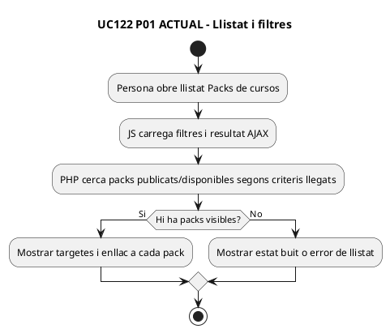

### FINAL
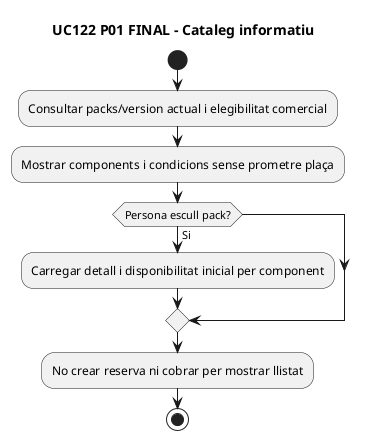

## P02 — fitxa individual, components/edicions/preu i «Inscriu-te»

**Fonts:** [`pagina_pack.php`](../../codi-drive/web-actual/pagina_pack.php), [`mostrar_pack.php`](../../codi-drive/web-actual/ajax/mostrar_pack.php), [`InfoPack.php` L155–255 i L1772–1808](../../codi-drive/web-actual/InfoPack.php#L1772-L1808).

### ACTUAL
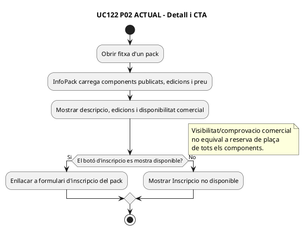

### FINAL
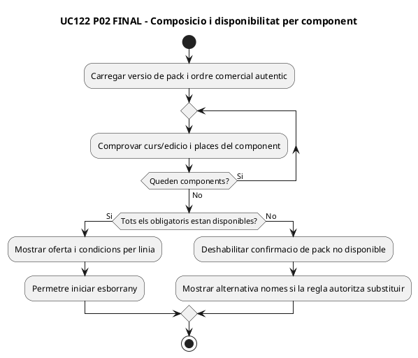

## P03 — formulari d'inscripció: edicions, dades personals/curriculars, preu i comentaris

**Fonts:** [`pagina_inscripcio_pack.php`](../../codi-drive/web-actual/pagina_inscripcio_pack.php), [`InscripcioPack.php` L84–146 i L298–349](../../codi-drive/web-actual/InscripcioPack.php#L84-L146), [JS L172–390](../../codi-drive/web-actual/js1619773569/mostrarInscripcioPack.min.js#L172-L390).

### ACTUAL
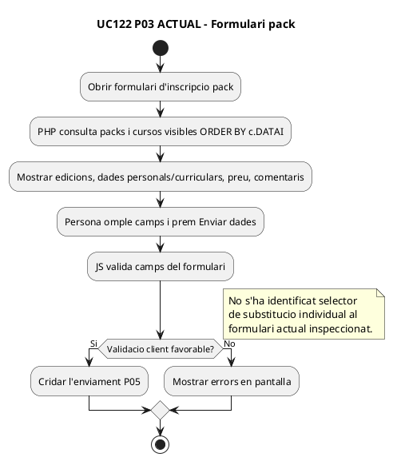

### FINAL
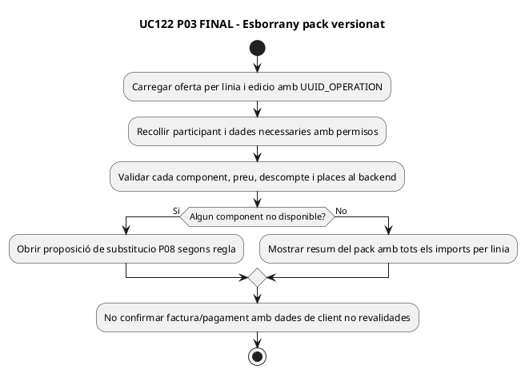

## P04 — consulta i presentació de preus totals del pack

**Fonts:** [`obtenirPreusPack.php`](../../codi-drive/web-actual/ajax/obtenirPreusPack.php), [JS L397–455 i L521–524](../../codi-drive/web-actual/js1619773569/mostrarInscripcioPack.min.js#L397-L455).

### ACTUAL
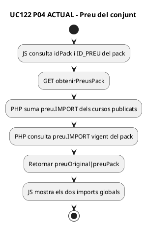

### FINAL
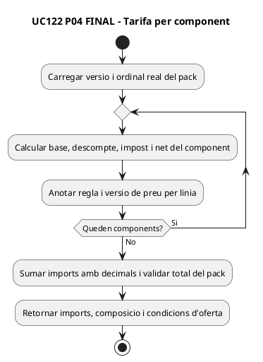

## P05 — «Enviar dades», alta de tots els cursos i IDPAG compartit

**Fonts:** [JS L1237–1328](../../codi-drive/web-actual/js1619773569/mostrarInscripcioPack.min.js#L1237-L1328), [`enviarInscripcioPack.php` L1–78, 125–161, 196–224 i 486–529](../../codi-drive/web-actual/ajax/enviarInscripcioPack.php#L486-L529).

### ACTUAL
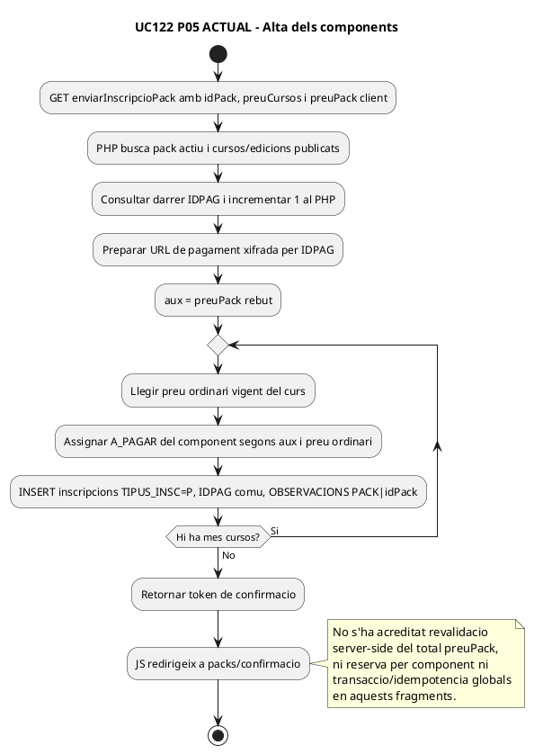

### FINAL
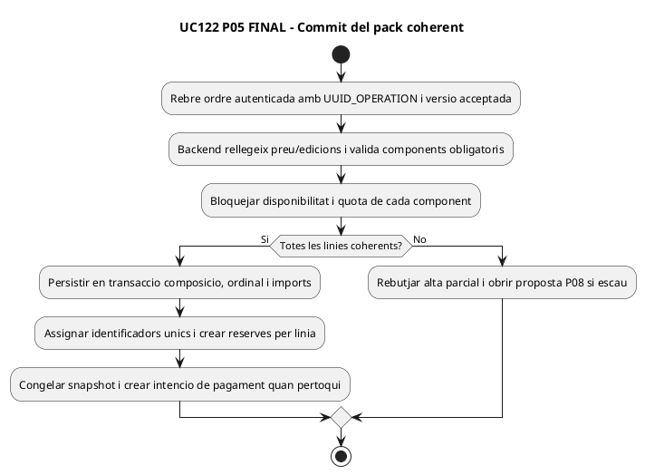

## P06 — confirmació, enllaç i frontera de pagament

**Fonts:** [JS L1310–1328](../../codi-drive/web-actual/js1619773569/mostrarInscripcioPack.min.js#L1310-L1328), [`enviarInscripcioPack.php` L196–224](../../codi-drive/web-actual/ajax/enviarInscripcioPack.php#L196-L224).

### ACTUAL
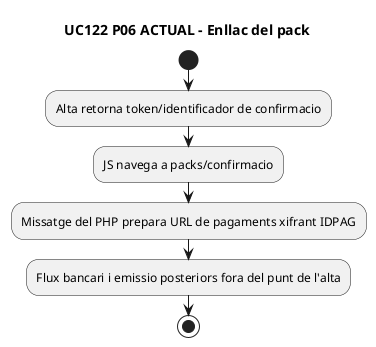

### FINAL
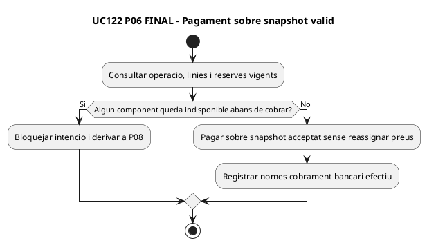

## P07 — lectura de components i construcció de factura inicial

**Fonts:** [`LegacyPackSnapshotRepository.php` L9–64, 103–119](../../sif/src/Repository/LegacyPackSnapshotRepository.php#L9-L64) i [`LegacyPackInvoicePayloadBuilder.php` L11–68, 119–189](../../sif/src/Service/LegacyPackInvoicePayloadBuilder.php#L119-L189).

### ACTUAL
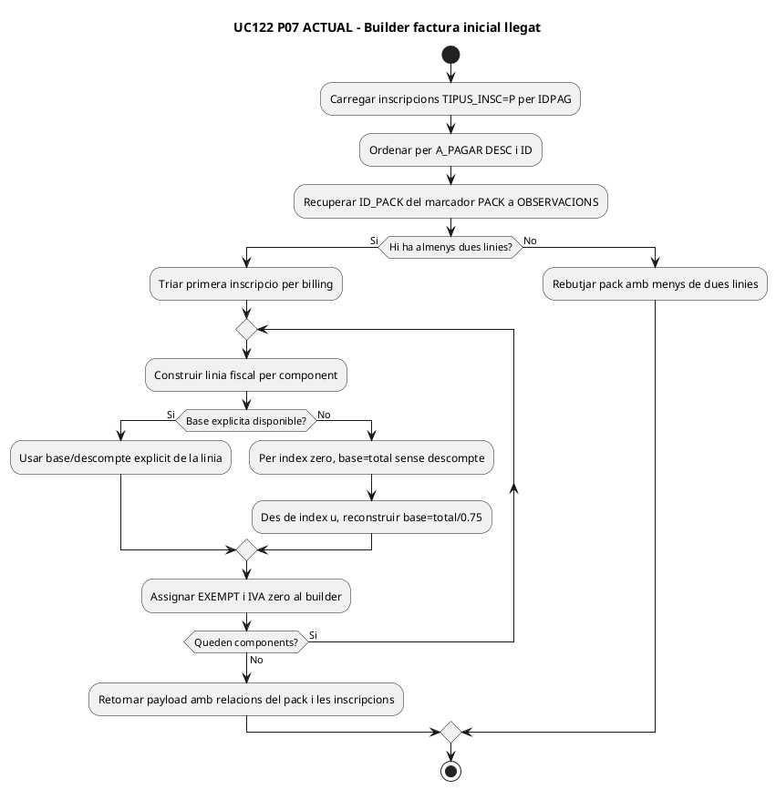

### FINAL
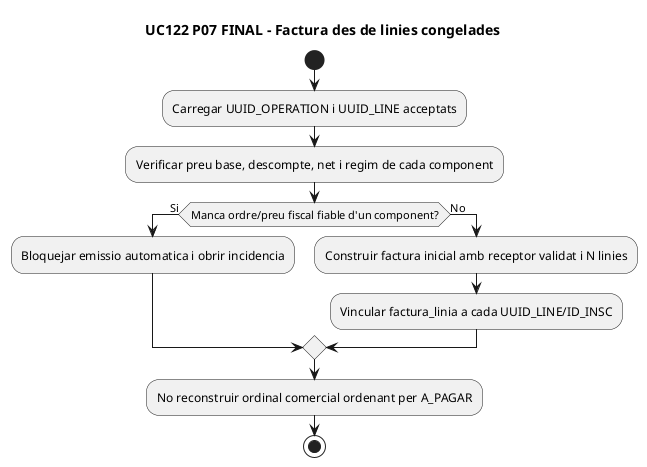

## P08 — component indisponible: recomposició del pack (NOMÉS FINAL)

**ACTUAL no acreditat:** cap pantalla/servei del recorregut públic inspeccionat que permeti substituir un component del pack i recalcular-ne l'efecte fiscal/econòmic després de l'alta. **No dibuixar una activitat ACTUAL fictícia.**

### FINAL
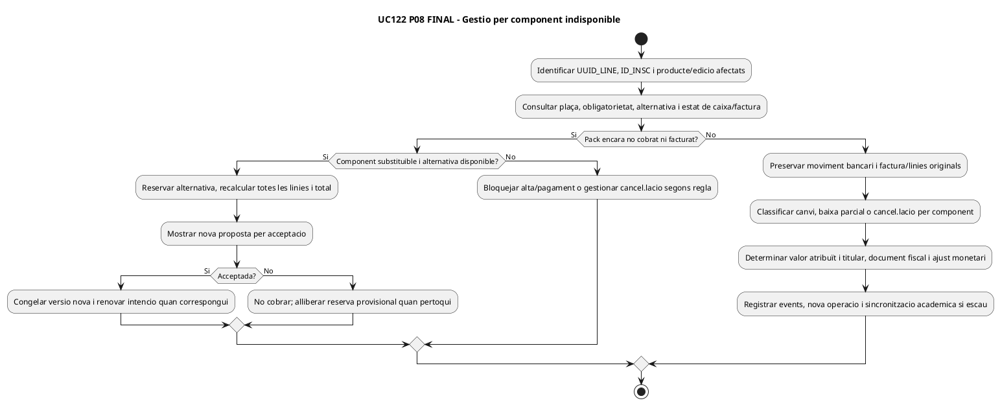

## Matriu de cobertura

| Pàgina / component | ACTUAL observat | FINAL dissenyat |
| --- | --- | --- |
| P01 | Llistat/filtres de packs | Visibilitat sense promesa de plaça |
| P02 | Fitxa components/edicions/CTA | Disponibilitat per línia |
| P03 | Formulari amb components fixats per pack | Esborrany/composició versionada |
| P04 | Dos totals de BD, resposta al JS | Base/descompte/impost per línia |
| P05 | GET amb preu client + N INSERT i IDPAG comú | Transacció/lock/versió per línia |
| P06 | URL i confirmació d'alta, no cobrament provat | Validació comercial abans de TPV |
| P07 | Lector + builder de factura inicial llegat | Ordinal i preu fiscal congelats |
| P08 | **No hi ha gestor de substitució acreditat** | Canvi abans/després de factura per component |

**DOC:** 15 diagrames PlantUML per P01–P08, P08 només FINAL. **IMP:** consulta/alta i builders existents; recomposició versionada per component i reserva/ajust monetari no acreditats. **TEST:** UC122-T01–T16 definits, no executats. **PRODUCCIÓ:** no verificada.
