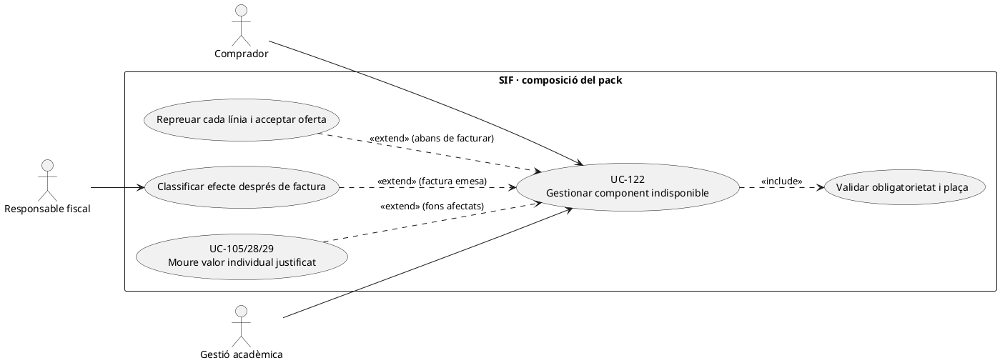
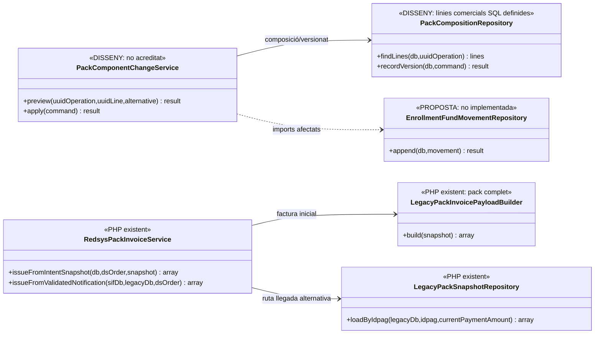
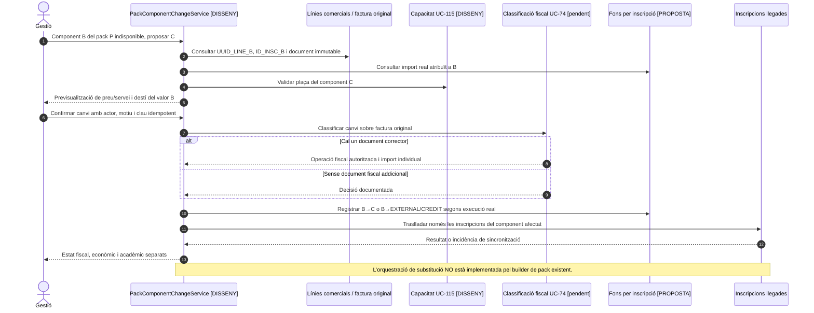
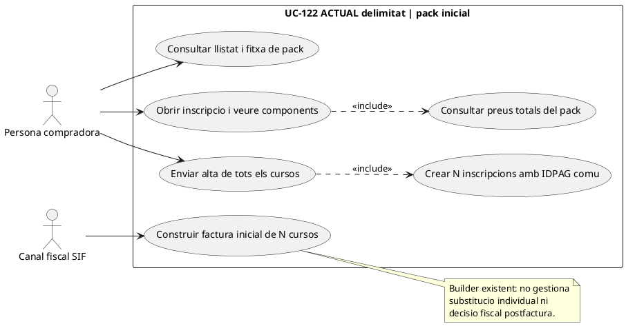
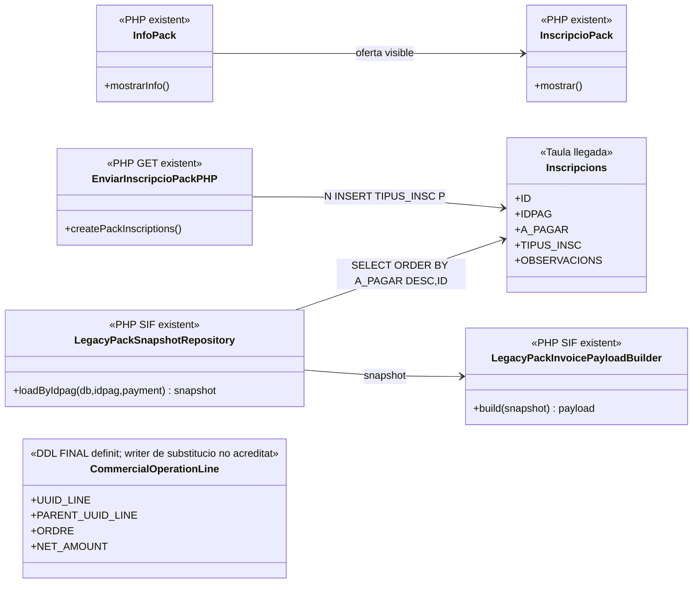

# UC-122 · Gestionar la composició d’un pack i la indisponibilitat d’un component

**Contrast dirigit 25/09/2026:** els apartats 1–6 preserven els límits de la revisió inicial i el disseny proposat; els apartats 7–10 inclouen el circuit PHP/JS ACTUAL de catàleg, alta i builder fiscal i el diferencien del gestor FINAL de canvis per component. DDL i diagrames NO acrediten execució de reserva/gestió de substitucions.

**Cas del catàleg:** cada component del pack ha de tenir línia identificada, plaça, preu, descompte i tractament fiscal; substitució, baixa parcial i cancel·lació exigeixen una decisió econòmica i fiscal. **Bloquejant explícit:** negoci i assessoria fiscal han de definir quins components són obligatoris/substituïbles i el càlcul de baixa parcial.

## 1. Codi real i límit funcional

`LegacyPackSnapshotRepository::loadByIdpag()` llegeix inscripcions llegades `TIPUS_INSC='P'` que comparteixen `IDPAG`, identifica `ID_PACK` cercant un marcador `PACK|...` a `OBSERVACIONS`, recupera `info_pack` i el curs de cada inscripció. `LegacyPackInvoicePayloadBuilder::build()` exigeix **almenys dues línies**, genera una línia fiscal `INSCRIPCIO` per component i `fact_rels` per pack i inscripcions. Utilitza la primera inscripció com a receptor fiscal i idempotència `LEGACY|PACK|IDPAG:...`. Aquesta ruta **construeix la factura d’un pack complet**, no modifica de forma segura la composició d’un pack ja facturat.

El builder té `PACK_DISCOUNT_PCT=25.0`; sense base explícita considera la primera línia sense descompte i reconstrueix la base de les posteriors dividint el total per `0.75`. Aquesta és una **regla concreta del codi**, no prova que s’apliqui correctament a packs amb tres components, preus/descomptes especials o canvis de producte. A més, el snapshot llegat pot partir de `A_PAGAR`: abans d’emetre cal demostrar si representa el **preu pactat** o només el **pendent després de cobraments**. El builder fixa `iva_regim=EXEMPT`, `iva_pct=0` per totes les línies; **no classifica règims diferents per component**.

`commercial_operation_line` i `operation_line_invoice_link` estan **definides a SQL** amb `UUID_LINE`, `PARENT_UUID_LINE`, producte/edició, participant, imports, règim, regla de preu i vincle a `factura_linia.ID`. `capacity_reservation` permet referenciar `UUID_LINE`, però no s’ha acreditat un servei PHP de disponibilitat o substitució per línia.

## 2. Fitxa específica

| Element | Regla del cas |
| --- | --- |
| Actors | Comprador/participant, operador acadèmic i responsable de facturació per a la decisió posterior a emissió. |
| Entrada | `UUID_OPERATION`, `ID_PACK`, `IDPAG` si existeix, `UUID_LINE` i `ID_INSC` per component, curs/edició, disponibilitat, preu base, descompte, import net, receptor, pagador i versió del snapshot. |
| Pack encara no cobrat ni emès | Comprovar si el component és substituïble; reservar-ne un d’alternatiu segons UC-115; **recalcular explícitament cada línia** i obtenir nova acceptació si canvien serveis/preu. Una intenció Redsys anterior no es reescriu amb el mateix `DS_ORDER` i snapshot diferent. |
| Pack cobrat/facturat | Conservar `factura`, `factura_linia` i `UUID_PAYMENT` originals. UC-71/72/74 classifiquen canvi, baixa parcial o cancel·lació; no eliminar la línia original ni usar el builder de pack complet per inventar una nova venda. |
| Diner individual | El cobrament bancari de tot el pack és **un moviment real**. Per cada `ID_INSC` cal import atribuït, origen i tram de devolució/saldo/reassignació quan es mogui el valor; `fact_rels` no conté els imports per inscripció. El ledger proposat encara **no existeix**. |
| Document fiscal | Un component substituït abans d’emetre pot formar part d’un snapshot **nou**. Després d’emetre, una correcció fiscal classificada és una operació separada; no suposar que qualsevol substitució té obligatòriament el mateix tractament. |

### Flux principal proposat

1. Llegir la composició **per `UUID_LINE`/`ID_INSC`**, no només el marcador `PACK` d’`OBSERVACIONS`. Confirmar producte/edició, plaça, política de substitució i situació real de factura i pagament.
2. Previsualitzar component indisponible, alternativa i diferència **per línia**: base, descompte, import net, règim fiscal i efecte sobre la promoció del conjunt. El 25 % fix del builder llegat **no substitueix** la regla comercial autoritzada per aquesta modificació.
3. Si l’oferta encara és oberta, validar/recuperar plaça amb UC-115, versionar components i acceptar el nou snapshot UC-112/121. Una intenció `DS_ORDER` amb import/snapshot diferent es refusa al servei Redsys existent: crear oferta i ordre noves quan pertoqui.
4. Si existeixen factura i cobrament, registrar una **decisió econòmica individual** sobre l’import efectivament atribuït al component, amb titular del diner original i import disponible; determinar factura nova/rectificativa o cap document fiscal segons el cas concret.
5. Una devolució real es registra **només després de la sortida efectiva** (UC-28); un saldo o traspàs és moviment **intern** (UC-29/105). En cap supòsit es crea un segon `CHARGE` perquè s’ha substituït un component.
6. Sincronitzar l’estat acadèmic de **cada component afectat** i deixar incidència si falla el llegat; no indicar que el pack està complet quan només ha finalitzat el canvi fiscal.

### Alternatives que s’han de provar

| Variant | Control |
| --- | --- |
| Component obligatori esgota places abans de pagar | Bloquejar l’oferta o proposar alternativa explícita; no forçar confirmació de plaça. |
| Component opcional substituït amb un preu diferent | Congelar preu/descompte per component i nou total; no recalcular el callback a partir de dades llegades canviants. |
| Pack de tres components amb descompte especial | **Buit a revisar:** builder actual reconstrueix un 25 % sobre línies a partir de la segona si no hi ha base explícita. Validar preu comercial real i test del tercer component abans d’emetre. |
| Component de pack facturat i posteriorment anul·lat | Conservar factura original; classificar correcció, baixa acadèmica i destí dels fons **del component**, no del total del pack. |
| Un pagament únic, dos components conservats i un retornat | No retornar tot el pack ni crear cobraments dels dos components conservats. |
| Reintent després de fallada entre SIF i llegat | Reutilitzar operació/document/moviment ja registrats amb correlació; evitar segona rectificativa o segona baixa. |

**Pendent de tancament:** política de components obligatoris, política de descomptes especials/3+ línies, classificació fiscal per component, verificació de titular del retorn, ledger individual, reserva i substitució implementades, proves de sincronització i del callback tardà.

### Ordre comercial del pack i error possible en reconstruir el descompte

**Dependència real de l'ordre del SELECT.** `LegacyPackSnapshotRepository::findPackInscriptionsByIdpag()` recupera els components `TIPUS_INSC='P'` amb `ORDER BY A_PAGAR DESC, ID`, mentre que `LegacyPackInvoicePayloadBuilder::lineAmounts($inscription, $index)`, **si no hi ha `IMPORT_BASE` explícit**, assigna a la **posició 0** import base igual a total i descompte zero; des de la **posició 1** reconstrueix la base dividint el total per `0.75`. El constructor també pren **la primera inscripció** com a receptor de factura. La documentació del flux comercial, en canvi, estableix descompte pack del 25 % al **segon curs**, no al curs amb menor `A_PAGAR` en el moment de consultar la BD. **Ordenar pel valor actual no acredita l'ordre de compra**; si canvien preus, fraccions, ajustos o els components tenen preus diferents, el builder pot assignar descompte o receptor a un component inadequat. No descriure aquesta reconstrucció com a verificació de la regla comercial.

**Regla de dades abans de qualsevol emissió.** Recuperar la composició **acceptada**: `ID_PACK`, `ID_INSC`/curs/edició de cada component, ordinal comercial, base original, descompte concedit i total net. Contrastar-la amb preus i promocions acreditats al moment de la venda i amb l'import de la intenció Redsys. Si l'ordre/base original no es pot recuperar, **bloquejar la reconstrucció automàtica** i classificar la incidència; no reparar-la ordenant per preu ni deduint el «segon curs» a posteriori. `A_PAGAR` és un camp operatiu de la inscripció: quan expressa pendent o valor modificat, no és necessàriament el preu fiscal congelat.

**Substitució abans i després de confirmar.** Si el component afectat es queda sense plaça abans d'emetre o cobrar, UC-115 comprova l'alternativa **per recurs** i UC-112 congela una nova proposta, amb l'ordinal i imports per línia acceptats; el mateix `DS_ORDER` no es reutilitza amb un snapshot contradictori. Si la factura ja és real, el component antic conserva `UUID_FACTURA` i identificador de línia; el nou component demana decisió UC-71/74/105 i, si correspon, document corrector i moviment de fons **individual**, no executar una segona vegada el builder de pack complet.

**Excepció de pagament fraccionat.** El flux comercial documenta que la divisió/fraccionament excepcional d'un pack és una **acció d'intranet**, no una opció de l'ecommerce. No inferir «una factura per component» de dos `ID_INSC` o de `FRACCIO`: primer establir si hi ha una factura real anterior, quants ingressos bancaris s'han rebut i a quins conceptes correspon cada document. La correcció d'un component no multiplica els `CHARGE` originals.

### Proves específiques d'ordinal i substitució (no executades)

| ID | Escenari | Resultat exigible |
| --- | --- | --- |
| PK-122-01 | Segon curs comercial passa a tenir `A_PAGAR` superior al primer | Ordinal i descompte del 25 % segons oferta acceptada; no reassignar-los per `ORDER BY A_PAGAR`. |
| PK-122-02 | Pack amb bases i descomptes explícits per component | Preservar imports d'origen i comprovar suma, sense reconstrucció `total/0.75` innecessària. |
| PK-122-03 | No consta l'ordre comercial antic i només hi ha `IDPAG`/imports actuals | Incidència de reconstrucció; cap factura automàtica amb descompte assignat per conjectura. |
| PK-122-04 | Component substituït després de factura emesa i un únic ingrés de pack | Original immutable i decisió/document/moviment per component, sense segon `CHARGE` global. |
| PK-122-05 | Intranet fracciona excepcionalment un pack amb factura prèvia | Recuperar documents i pagaments reals abans d'atribuir imports; no factures automàtiques per cada `ID_INSC`. |

## 3. UML de casos d’ús



## 4. UML de classes — builder existent i coordinació pendent



## 5. UML de seqüència — substitució després de cobrar (OBJECTIU)



## 6. Traçabilitat

[UC-122 original](../06-fitxes-funcionals/uc-122.md) · [UC-71 canvi](uc-071-registrar-canvi-curs-complet.md) · [UC-72 baixa](uc-072-registrar-baixa-decisio-economica.md) · [UC-105 traspassos](uc-105-reassignar-repartir-pagament.md) · [UC-115 places](uc-115-reservar-alliberar-places.md) · [LegacyPackSnapshotRepository](../../sif/src/Repository/LegacyPackSnapshotRepository.php) · [LegacyPackInvoicePayloadBuilder](../../sif/src/Service/LegacyPackInvoicePayloadBuilder.php) · [RedsysPackInvoiceService](../../sif/src/Service/RedsysPackInvoiceService.php) · [Línies comercials i vincle fiscal](../../sif/database/migrations/2026_09_16_000005_add_operation_lifecycle_tables.sql) · [Traça de fons](00-revisio-moviments-inscripcions.md).


## 7. Traçabilitat per pàgina, apartat i classes reals

[Fitxa funcional v2.0](../06-fitxes-funcionals/uc-122.md) · [15 activitats ACTUAL/FINAL per P01–P08](uc-122-activitats-pagines-pack-actual-final.md) · [auditoria lot 11](00-auditoria-casos-pendents-lot-11-uc-122-2026-09-25.md).

| ID | Superfície ACTUAL | Control/codi observat i límit |
| --- | --- | --- |
| P01–P02 | Llistat/filtres i fitxa individual | `pagina_packs.php`/`mostrar_packs.php`; `pagina_pack.php`/`mostrar_pack.php` → `InfoPack`, mostra edicions/preu i botó d'inscripció disponible/no disponible; la visibilitat del pack no prova reserva de places per línia. |
| P03–P04 | Inscripció pack, dades i preu | `InscripcioPack::mostrar()` consulta edicions i mostra dades personals/curriculars/preu; `obtenirPreusPack.php` suma `preu.IMPORT` per cursos i l'import del pack i retorna dos totals, no ordinal/preu per component. |
| P05 | Confirmar i crear N inscripcions | JS GET `idPack,preuPack,preuCursos` + dades personals → `enviarInscripcioPack.php`. Consulta components, darrer `IDPAG+1`, reparteix `$aux=$preuPack` contra preu ordinari de cada curs i insereix N registres `TIPUS_INSC=P, OBSERVACIONS=PACK|idPack`. El preu global rebut del client no es revalida contra tarifa de pack a l'INSERT inspeccionat. |
| P06 | Confirmació/enllaç | Token de confirmació i URL `/pagaments/` a partir d'`IDPAG`; preparar URL no prova `CHARGE`. |
| P07 | Builder fiscal inicial | `LegacyPackSnapshotRepository::loadByIdpag` ordena `A_PAGAR DESC,ID` i identifica pack per marcador; `LegacyPackInvoicePayloadBuilder::build` genera 2+ línies, receptor de la primera, i amb base implícita primer índex sense descompte i següents `total/0,75`. |
| P08 | Substitució/baixa per component | **Només FINAL:** no s'ha identificat pàgina/servei d'orquestració de nova reserva, versió, baixa/rectificació i moviments individuals en el recorregut auditat. |

## 8. UML de casos d'ús — recorregut ACTUAL concret



**El cas FINAL de l'apartat 3** descriu una orquestració de canvis de components que no s'ha acreditat com a UI/servei executable actual.

## 9. Classes ACTUALS i seqüència amb ordinal comercial no reconstruïble



```mermaid
sequenceDiagram
actor B as Comprador
participant UI as Formulari pack + JS
participant Prices as obtenirPreusPack.php
participant Enroll as enviarInscripcioPack.php
participant DB as inscripcions
participant Repo as LegacyPackSnapshotRepository SIF
participant Builder as LegacyPackInvoicePayloadBuilder SIF
B->>UI: Seleccionar pack i completar dades
UI->>Prices: GET idPack i idPreu
Prices-->>UI: preuCursosOriginal i preuPack
UI->>Enroll: GET idPack, preuPack, preuCursos i dades personals
Enroll->>Enroll: Consultar packs/edicions, darrer IDPAG + 1
loop Cada curs del pack en ordre del SELECT inicial
 Enroll->>Enroll: Consultar preu ordinari i assignar A_PAGAR segons aux
 Enroll->>DB: INSERT inscripcio TIPUS_INSC=P, IDPAG, PACK|ID_PACK
end
Enroll-->>UI: token confirmacio/enllac pagament
Note over UI,DB: L'alta i l'oferta no proven que hi hagi cobrament real.
Repo->>DB: SELECT per IDPAG, ORDER BY A_PAGAR DESC,ID
DB-->>Repo: N inscripcions ordenades pel valor existent
Repo->>Builder: Snapshot amb items en aquest ordre
Builder->>Builder: Primer index sense descompte; posteriors inferits a 25% si base absent
Note over Repo,Builder: Ordre de lectura fiscal no acredita ordre de venda ni regla originaria.
```

## 10. Distinció de documentació, implementació i proves

**DOC revisada:** pàgines P01–P07 ACTUAL/FINAL; P08 només FINAL, [auditoria de 16 escenaris UC122-T01–T16](00-auditoria-casos-pendents-lot-11-uc-122-2026-09-25.md). **IMP observada:** formularis, alta de components i builder inicial; **IMP no acreditada:** càlcul/traça d'ordinal per línia, reserva efectiva de totes les places, recomposició després de pagament i ajust econòmic/fiscal individual. **TEST:** proves existents del builder de factura inicial localitzades però no executades en aquest lot; proves de component indisponible no executades. **PRODUCCIÓ:** no verificada. Les decisions d'obligatorietat, alternativa i regla de preu especial no es dedueixen de `$aux` ni del 25 % inferit al constructor.
