# UC-123 — activitats per pantalla, modal, document i lliurament ACTUAL/FINAL

**Tall 25/09/2026.** **ACTUAL** = pantalles/codi de factura i PDF o repositori de metadades inspeccionats a `main`; no significa que siguin un procés integral de factura electrònica. **FINAL** = disseny a implementar. **P07 (transport format acordat)** no té pantalla/worker real acreditat, per tant només FINAL. [Fitxa](../06-fitxes-funcionals/uc-123.md) · [auditoria lot 12](00-auditoria-casos-pendents-lot-12-uc-123-2026-09-25.md) · [UML](uc-123-lliurar-factura-electronica.md).

## P01 — «Generar factura abans de pagar»: cerca i selecció d'inscripcions

**Font:** [`alumnes-genera-factura-abans-pagar.js` L90–236](../../codi-drive/intranet-actual/js/alumnes-genera-factura-abans-pagar.js#L90-L236).

### ACTUAL
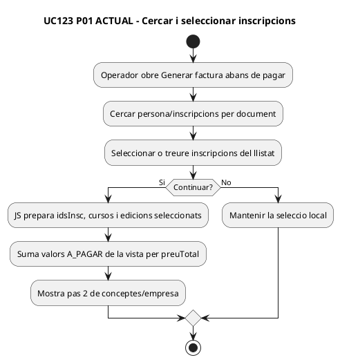

### FINAL
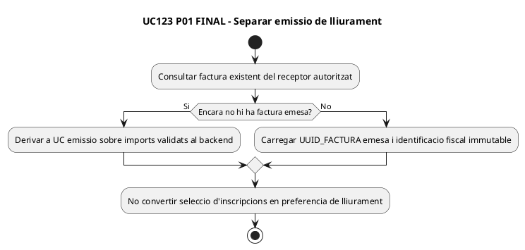

## P02 — «Generar factura abans de pagar»: empresa, concepte i «Factura creada!»

**Font:** [JS L304–390](../../codi-drive/intranet-actual/js/alumnes-genera-factura-abans-pagar.js#L304-L390) i [`generaFacturaElectronica_Factures.php`](../../codi-drive/intranet-actual/ajax/alumnes/generaFacturaElectronica_Factures.php).

### ACTUAL
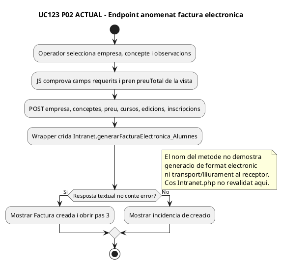

### FINAL
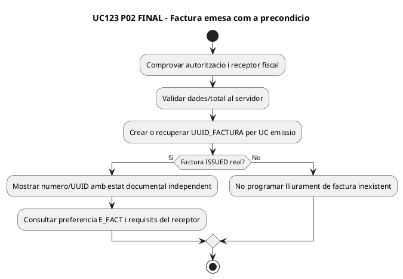

## P03 — Pas 3: dades, previsualització, descàrrega i fitxer temporal

**Font:** [JS L371–452](../../codi-drive/intranet-actual/js/alumnes-genera-factura-abans-pagar.js#L371-L452) i [wrappers AJAX de dades i inscripcions](../../codi-drive/intranet-actual/ajax/alumnes/mostraDadesFacturaElectronica_Factures.php).

### ACTUAL
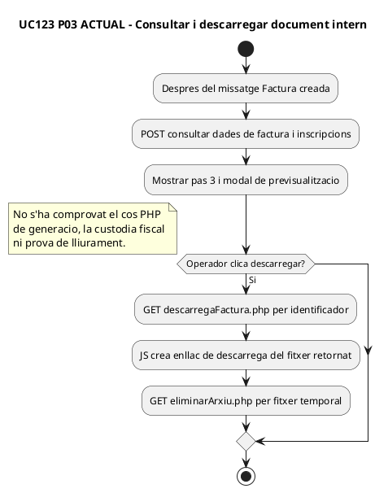

### FINAL
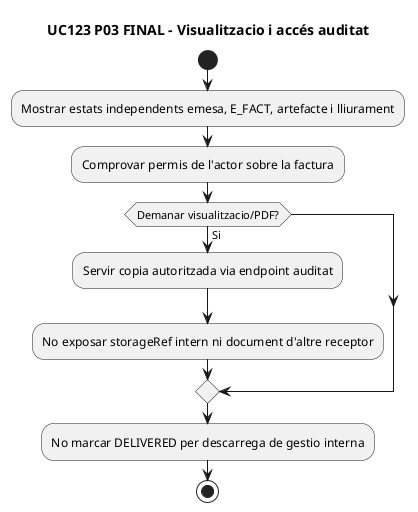

## P04 — «Consulta / Anul·la factura»: modal de dades i «Desar»

**Font:** [`alumnes-factura.js` L321–434](../../codi-drive/intranet-actual/js/alumnes-factura.js#L321-L434), [`guardarDadesFactura_Factures.php`](../../codi-drive/intranet-actual/ajax/alumnes/guardarDadesFactura_Factures.php).

### ACTUAL
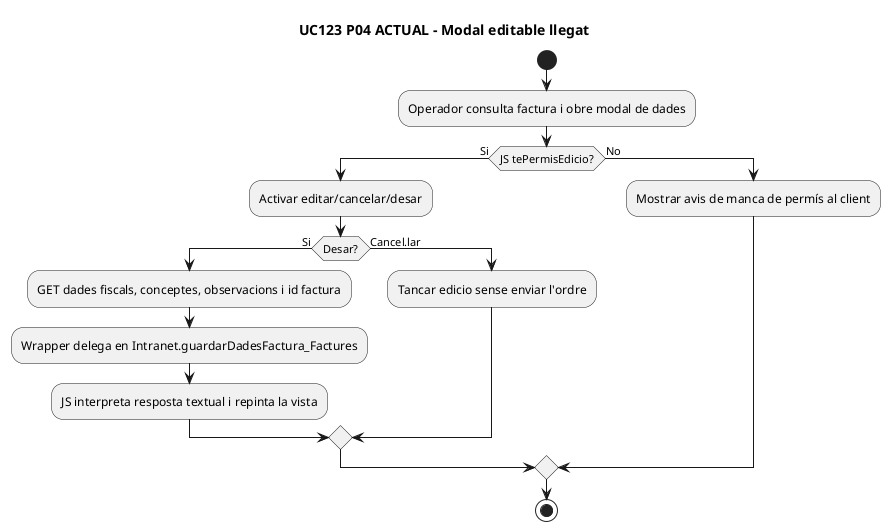

### FINAL
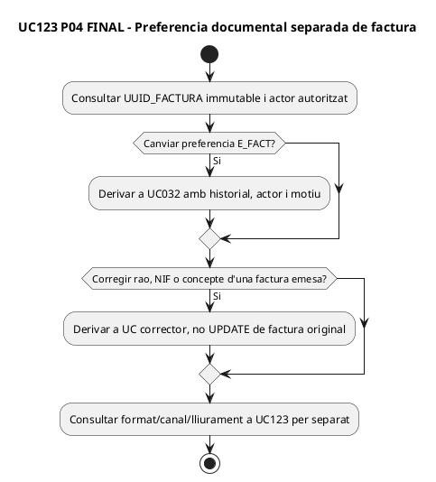

## P05 — Modal «Previsualitza» i descàrrega de factura

**Font:** [`alumnes-factura.js` L635–707](../../codi-drive/intranet-actual/js/alumnes-factura.js#L635-L707), [`descarregaFactura.php`](../../codi-drive/intranet-actual/ajax/alumnes/descarregaFactura.php).

### ACTUAL
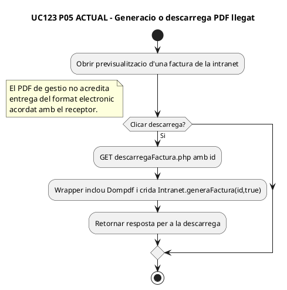

### FINAL
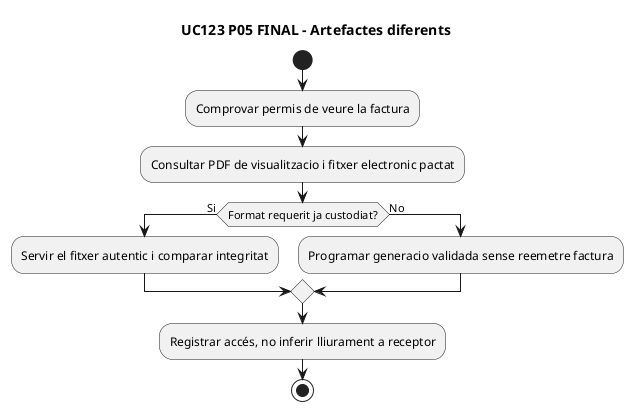

## P06 — SIF: registrar artefacte i indicador E_FACT

**Font:** [`DocumentRepository.php` L9–39](../../sif/src/Repository/DocumentRepository.php#L9-L39), [`InvoiceRepository.php` L81–124](../../sif/src/Repository/InvoiceRepository.php#L81-L124), [SQL 000005 L242–269](../../sif/database/migrations/2026_09_16_000005_add_operation_lifecycle_tables.sql#L242-L269).

### ACTUAL
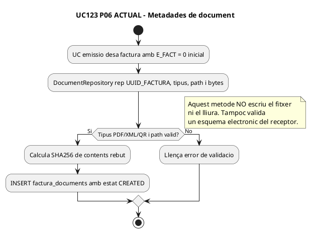

### FINAL
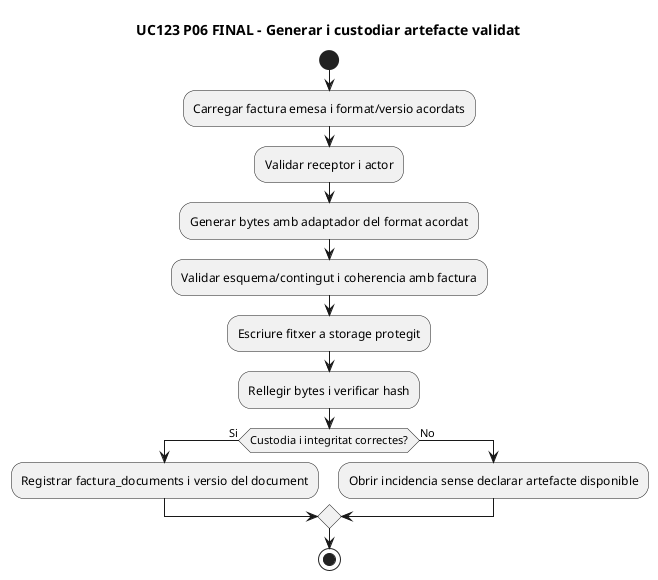

## P07 — canal de lliurament de factura electrònica, NOMÉS FINAL

**No s'ha identificat un writer/worker/transport real de `electronic_invoice_delivery` en les superfícies revisades.** El DDL defineix el contracte, però no es representa com a servei actual acreditat.

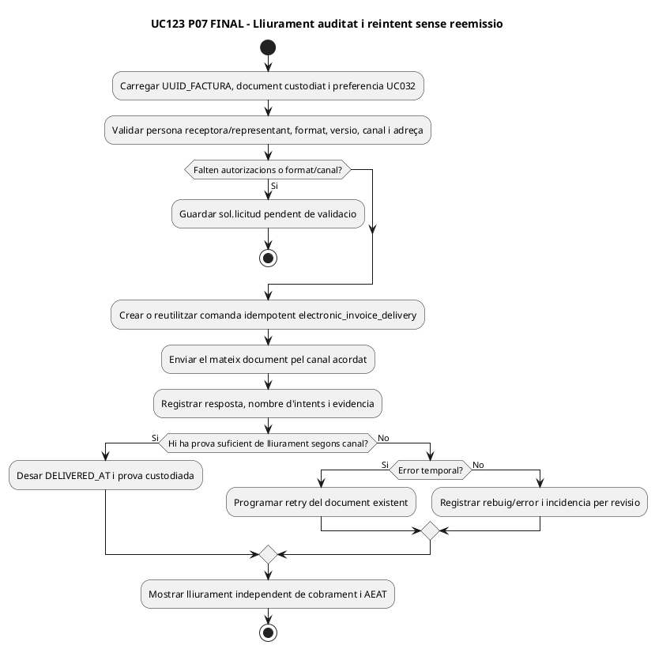

## Matriu de cobertura

| Superfície | ACTUAL acreditat | FINAL |
| --- | --- | --- |
| P01–P02 | Selecció/creació de factura abans de cobrar, endpoint amb nom «Electrònica» | Creació fiscal separada de preferència/lliurament |
| P03 | Consulta, vista i descàrrega temporal | Consulta autoritzada i estats diferents |
| P04 | Edició de dades de factura llegada | Preferència UC032 / correcció fiscal si escau |
| P05 | PDF de previsualització / descàrrega | PDF vs format electrònic estructurat |
| P06 | `E_FACT=0` inicial i metadada/hash `factura_documents` | Adaptador, validació i storage comprovats |
| P07 | **No hi ha servei de transport acreditat** | Comanda/intent/prova/retry per canal |

**DOC:** 13 activitats PlantUML (P01–P06 ACTUAL/FINAL, P07 només FINAL). **IMP:** UI llegada i metadades existents, procés integral UC123 no acreditat. **TEST:** proves de lliurament no executades. **PRODUCCIÓ:** no verificada.
