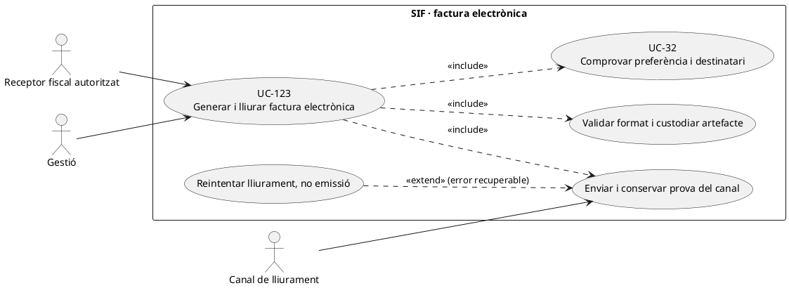
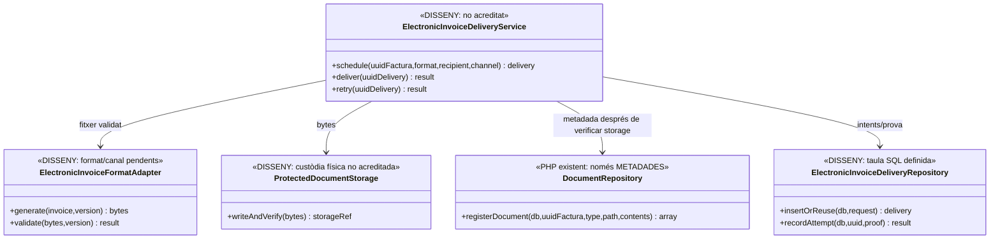
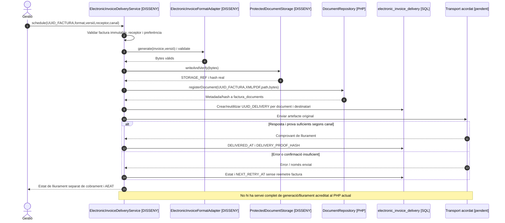

# UC-123 · Generar i lliurar una factura electrònica en format i canal acordats

**Objectiu canònic:** `E_FACT` és una preferència/indicador, **no el document ni la seva prova de lliurament**. El catàleg exigeix conservar format, versió, destinatari, consentiment quan pertoqui, hash del fitxer, canal, resultats, errors i reintents. **Bloquejant de negoci/protecció de dades:** format, canal, autorització del destinatari, SLA i política de reintent.

## 1. Codi real i dades definides

`DocumentRepository::registerDocument(db,uuidFactura,type,path,contents)` admet `PDF`, `XML` o `QR`, calcula **SHA-256 dels bytes aportats** i insereix metadades a `factura_documents` amb estat `CREATED`. **No escriu físicament els bytes a `path` ni prova que el fitxer s'hagi generat, emmagatzemat o servit**. La crida, per si sola, no garanteix un format electrònic acceptat pel receptor.

`electronic_invoice_delivery`, definida en SQL, preveu `UUID_FACTURA`, `FACTURA_DOCUMENT_ID`, `FORMAT_CODE/VERSION`, `RECIPIENT_ADDRESS_HASH`, `CHANNEL`, `STATUS`, clau idempotent, comptadors/reintents, `DELIVERED_AT` i prova d'entrega (`DELIVERY_PROOF_STORAGE_REF/HASH`). **No s'ha acreditat un servei PHP que ompli aquesta taula, implementi el canal d'enviament o verifiqui un justificant de recepció**. `InvoiceRepository::insertInvoice()` fixa `E_FACT=0` en l'alta: UC-32 és una decisió **separada**.

## 2. Fitxa específica

| Acció | Regla |
| --- | --- |
| Seleccionar | Validar receptor fiscal autoritzat i adreça/canal acordats; en grup/empresa, el participant no obté accés automàtic al document del receptor. No usar només `BILLING_EMAIL` sense comprovar preferència, identificació i versió del format requerit. |
| Generar | Partir de la **factura emesa i immutable**; usar el format/versió aprovat per al destinatari i validar estructura i integritat. Un `XML` arbitrari guardat com a tipus document **no acredita** que sigui una factura electrònica en l'estàndard acordat. |
| Custodiar | Persistir bytes en storage protegit, comprovar hash real, ruta/ACL i `factura_documents`. Separar fitxer fiscal/XML del PDF de visualització i del QR quan siguin artefactes diferents. |
| Enviar | Crear/reutilitzar `electronic_invoice_delivery` amb factura + document/versionat + receptor/canal, registrar cada intent i resposta; la clau idempotent evita duplicar la **mateixa comanda**, no substituir el comprovant de lliurament. |
| Completar | Declarar `DELIVERED` només quan el canal retorna **evidència segons el contracte acordat**; distingir enviat, rebut, rebutjat, pendent i error segons estàndard definit. Un HTTP 200 o correu a l'outbox pot ser insuficient per afirmar acceptació del destinatari. |
| Economia i fiscalitat | El lliurament no genera `CHARGE` ni renumera la factura; si falla només l'enviament, reintentar el lliurament **del document existent**, no emetre una segona factura. |

### Flux objectiu

1. Consultar factura real, preferència UC-32, destinatari legitimat, format/canal i document ja custodiat. Si falta decisió de canal/format, deixar pendent sense inventar un destinatari.
2. El generador pendent produeix artefacte en format **concret aprovat**, el valida, desa físicament i compara bytes/hash. `DocumentRepository` pot registrar-ne la metadada un cop es disposa dels bytes; no substituir el storage real per una fila SQL.
3. En una transacció/operació idempotent, el writer pendent registra `electronic_invoice_delivery` lligat a `FACTURA_DOCUMENT_ID` i destinatari/canal; la traça de cada intent persisteix sense duplicar el document fiscal.
4. El transport del canal acceptat envia **el mateix document immutable**; desar resposta i evidència, amb resultat terminal o `NEXT_RETRY_AT` si és recuperable. No exposar adreça real als logs quan un hash/referència sigui suficient.
5. El sistema mostra estat **document generat / enviament programat / enviat / lliurat o rebutjat** separadament d'`ESTAT_AEAT` i `ESTAT_COBRAMENT`; els tres processos tenen finalitats diferents.
6. En error de lliurament, reprendre el job amb **el mateix `UUID_FACTURA` i document**, control d'intents i permisos; si el receptor demana rectificar dades fiscals del document original, derivar a UC-05/74, no «corregir l'XML» deslligat de la factura.

### Alternatives i proves

| Cas | Resultat |
| --- | --- |
| Factura emesa amb `E_FACT=0`, sol·licitud vàlida posterior | UC-32 registra la preferència; UC-123 continua exigint format/canal/autorització; no regenerar factura fiscal. |
| Reenviament idèntic per timeout | Reutilitzar comanda de lliurament o registrar un intent nou de la mateixa, **sense nou número fiscal ni dos registres de venda**. |
| URL o adreça de destinatari incorrecta | Bloquejar lliurament de dades alienes i revisar identitat; no tractar un canvi d'email com a permís per alterar `BILLING_NIF_CIF` històric. |
| PDF o XML registrat però fitxer absent del disc/storage | `factura_documents` sola no acredita disponibilitat; incidència de custòdia UC-55 i reconstrucció supervisada, mantenint identitat fiscal. |
| Canal confirma enviament però no recepció | Estat d'enviament sense declarar prova de lliurament, segons SLA i contracte concret pendent. |
| Document fiscal ja lliurat i preferència després desmarcada | Conservar el document i prova; aplicar canvis només a actuacions futures segons política. |

**Pendents:** format/versió i validació efectiva, permisos/receptor, storage físic, transport/outbox, significat de confirmació per canal, retenció i proves de duplicats/accés i recuperació d'errors. No s'han executat proves PHP del flux end-to-end.

### 2.1. `E_FACT` en la pantalla antiga i factura electrònica efectiva

**Acció antiga separada de l'emissió prèvia.** A PrisMa, la pantalla «Consulta - Edita - Anul·la factura» és el lloc previst per gestionar l'indicador `E_FACT`, mentre que «Generar factura abans de pagar» crea una **factura real** amb `EMESA_ABANS_COBRAMENT=1`. El nom del mètode llegat `generarFacturaElectronica_Alumnes` **no converteix automàticament** aquella emissió prèvia en factura electrònica ni justifica marcar `E_FACT=1`; són dos fets independents, també quan el receptor és una empresa.

**Destinatari i canal no inferits de l'email de contacte.** El procediment de l'entitat diferencia dades fiscals de l'empresa i contacte `entitats_resp.CORREU`: el responsable pot rebre un enllaç de pagament o document **quan està autoritzat**, però aquest correu no determina per si mateix format/versionat de factura electrònica, canal acordat o prova de lliurament. Validar receptor fiscal, representació, preferència, adreça i canal abans de preparar el document. En grup, no enviar el format electrònic complet a cada participant perquè comparteixen `IDPAG`.

**Quatre resultats independents.** Mostrar per separat: (1) factura SIF **emesa** (`UUID_FACTURA`), (2) preferència/indicador `E_FACT`, (3) artefacte electrònic real i verificat (`FACTURA_DOCUMENT_ID`, format/versió i hash de bytes), i (4) resultat de la comanda `electronic_invoice_delivery` (preparada/enviada/rebuda segons prova). Una fila de `factura_documents` o un correu a l'outbox **no acredita** el lliurament del format requerit. El resultat AEAT de `fiscal_queue` correspon a una cinquena dimensió i tampoc acredita lliurament al receptor.

**Canvi posterior i retry.** Si l'empresa sol·licita factura electrònica després que ja existeixi una factura fiscal o després de pagar-la, mantenir **el mateix UUID i document fiscal d'origen**; generar l'artefacte de lliurament adequat amb versió i autorització, sense nou `issueInvoice()` ni `CHARGE`. Si falla només el canal de lliurament, repetir la comanda/intent del mateix document segons la seva política, no «corregir» les línies de la factura per reintentar.

### 2.2. Proves específiques d'empresa i lliurament (no executades)

| ID | Escenari | Resultat exigible |
| --- | --- | --- |
| FE-123-01 | Factura abans de cobrar amb E_FACT=0 | Factura real sense afirmar lliurament electrònic. |
| FE-123-02 | Marcar E_FACT=1 després d'emetre | Preferència separada i mateix UUID fiscal; format/canal continuen pendents de prova. |
| FE-123-03 | Correu del responsable però receptor fiscal entitat | Verificar autorització i canal de l'entitat abans del lliurament. |
| FE-123-04 | XML de remissió AEAT existent, XML de factura electrònica absent | No declarar document destinat al receptor com a generat/lliurat. |
| FE-123-05 | Notificació de correu SENT sense evidència de recepció segons canal | Informar enviament sense prova de lliurament, no estat DELIVERED fictici. |

## 3. UML de casos d'ús

## 4. UML de classes — metadades reals, lliurament pendent

## 5. UML de seqüència — enviar sense duplicar factura (OBJECTIU)

## 6. Traçabilitat

[UC-123 original](../06-fitxes-funcionals/uc-123.md) · [UC-32 preferència](uc-032-marcar-factura-electronica.md) · [UC-36 documents](uc-036-generar-consultar-documents.md) · [UC-55 custòdia](uc-055-custodiar-reintentar-documents.md) · [UC-01 emissió](uc-001-emetre-o-reutilitzar-factura.md) · [DocumentRepository](../../sif/src/Repository/DocumentRepository.php) · [InvoiceRepository](../../sif/src/Repository/InvoiceRepository.php) · [Migració electronic_invoice_delivery](../../sif/database/migrations/2026_09_16_000005_add_operation_lifecycle_tables.sql).
