# UC-124 — activitats ACTUAL/FINAL per accés, certificat, deute, baixa i pagador

**Revisió:** 26/09/2026. **ACTUAL** = comportament observable a `main`; **FINAL** = contracte proposat de reconciliació. Els diagrames no converteixen DDL o wrappers en serveis ja desplegats. [Fitxa](../06-fitxes-funcionals/uc-124.md) · [auditoria lot 13](00-auditoria-casos-pendents-lot-13-uc-124-2026-09-26.md) · [UML](uc-124-reconciliar-acces-certificat-baixa-deute.md).

## P01 · Portal alumne — cursos pendents/cursant

### ACTUAL
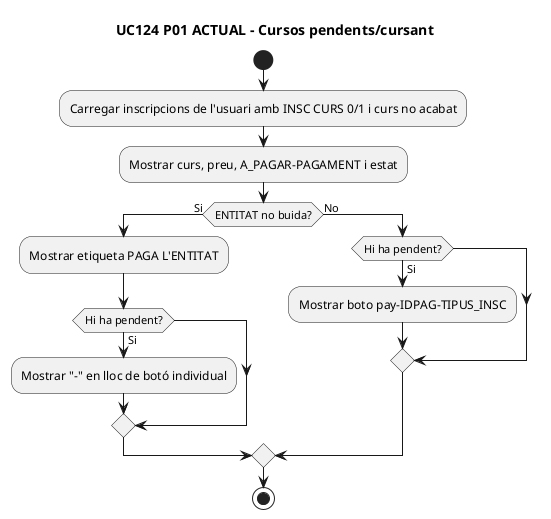

### FINAL
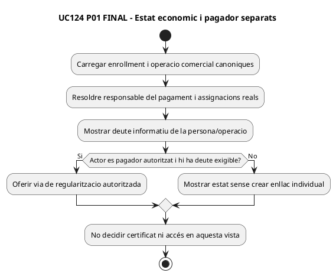

## P02 · Portal alumne — cursos acabats, certificat i Aula Oberta

### ACTUAL
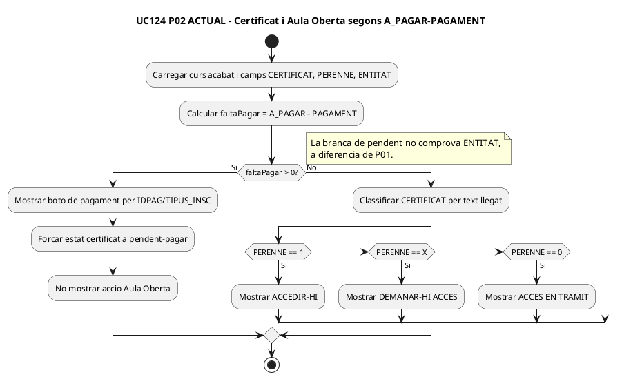

### FINAL
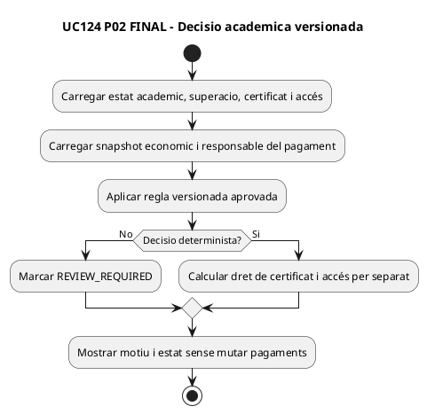

## P03 · Portal alumne — obtenir URL de pagament

### ACTUAL
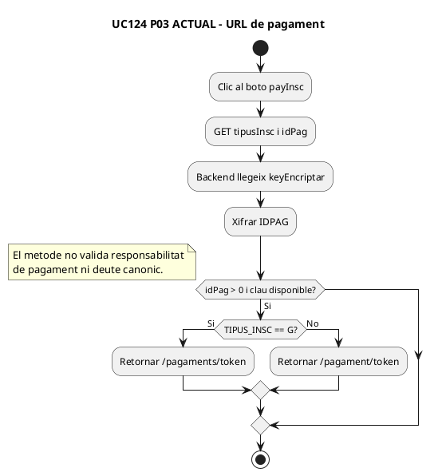

### FINAL
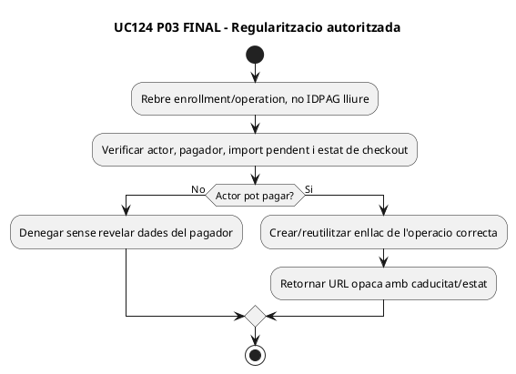

## P04 · Portal alumne — Aula Oberta

### ACTUAL
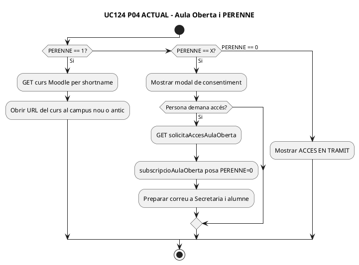

### FINAL
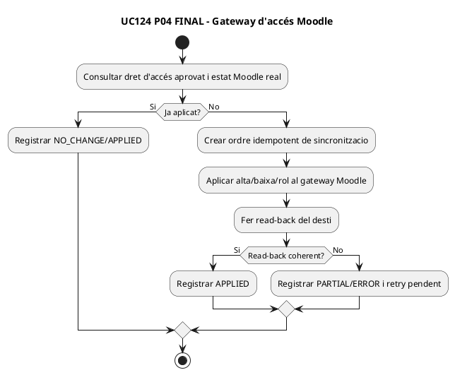

## P05 · Intranet — Control de morosos

### ACTUAL
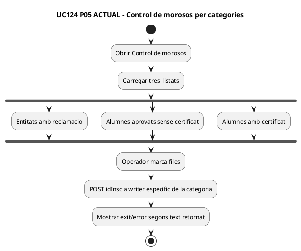

### FINAL
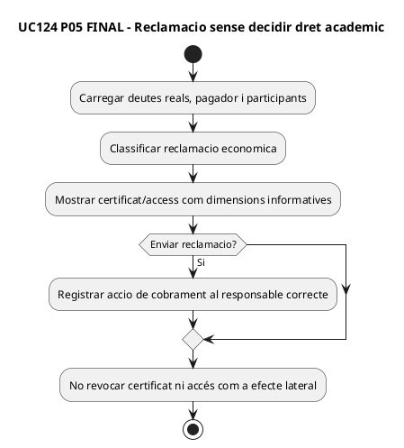

## P06 · Intranet — donar de baixa una inscripció

### ACTUAL
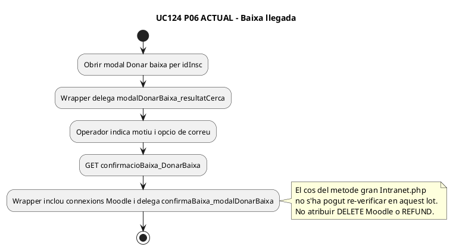

### FINAL
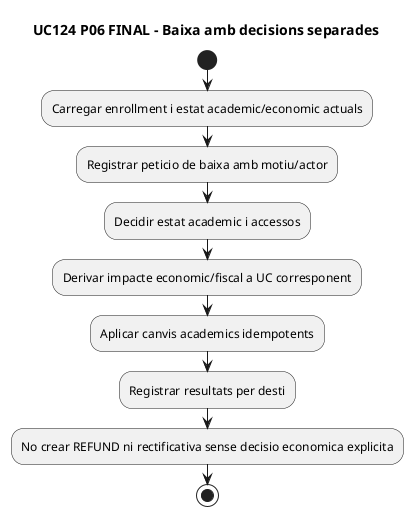

## P07 · Intranet — modal de certificat

### ACTUAL
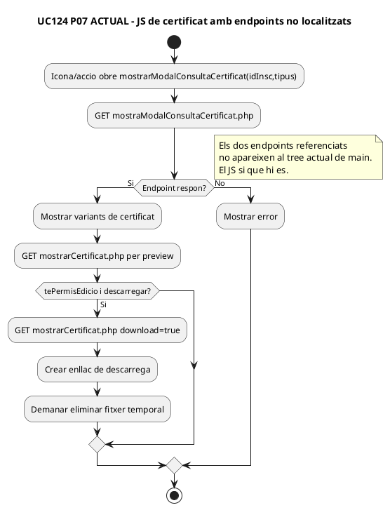

### FINAL
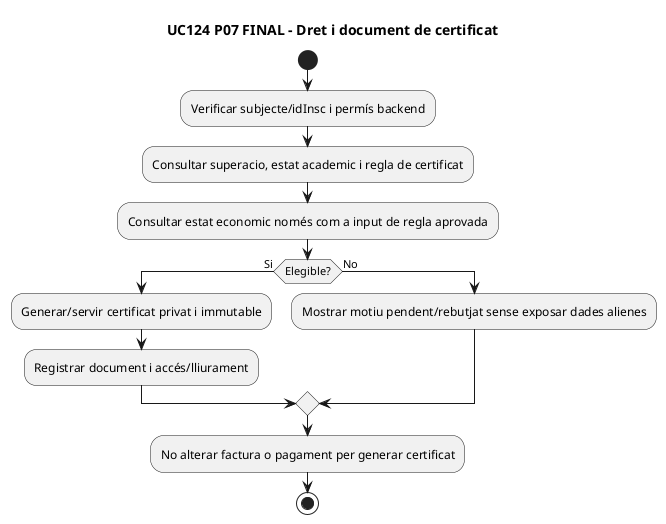

## P08 · SIF — reconciliació i event acadèmic/econòmic

### ACTUAL
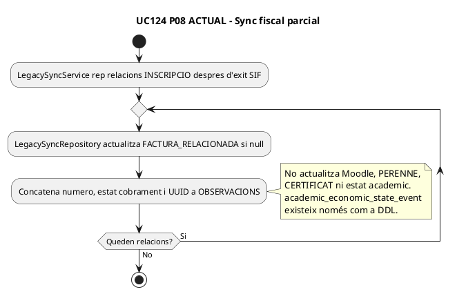

### FINAL
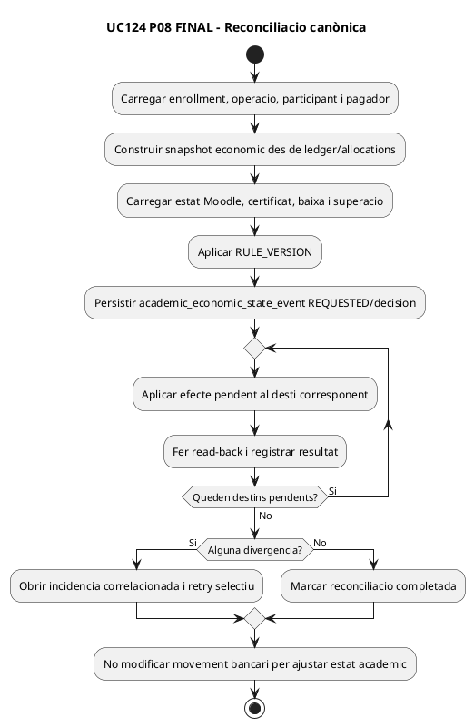

## Cobertura i estat

| Pas | ACTUAL acreditat | FINAL |
| --- | --- | --- |
| P01 | Diferencia ENTITAT vs pagament individual en curs actiu | Pagador canònic i regularització |
| P02 | Certificat/AO bloquejats per pendent llegat | Regla versionada per dimensions |
| P03 | URL xifrada per IDPAG | Autorització de pagador/operació |
| P04 | PERENNE X/0/1 + sol·licitud/correu | Gateway Moodle amb read-back |
| P05 | Reclamacions entitat/sense cert/amb cert | Cobrament separat de dret acadèmic |
| P06 | Wrapper de baixa a Intranet gran | Baixa acadèmica + decisió econòmica separada |
| P07 | JS de certificat; endpoints absents del tree main | Certificat privat, elegibilitat i auditoria |
| P08 | Sync només factura/observacions + DDL event | Coordinador/event/gateways idempotents |

**DOC:** 16 diagrames ACTUAL/FINAL. **IMP:** lògica llegada i sync fiscal parcial existents; reconciliador SIF no acreditat. **TEST:** UC124-T01–T18 no executats. **PRODUCCIÓ:** no verificada.
