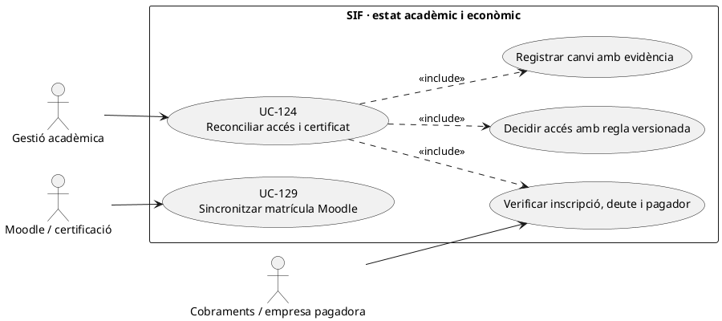
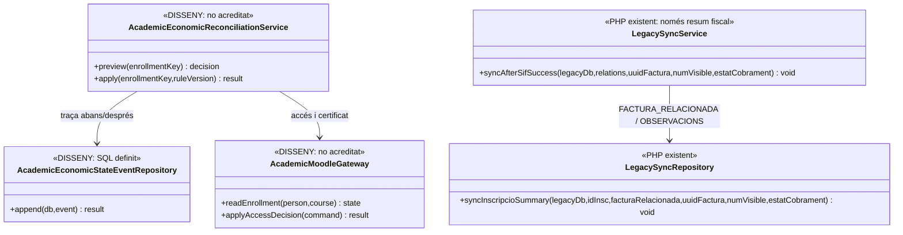
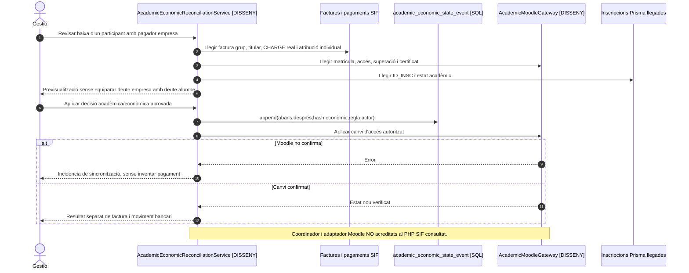

# UC-124 · Reconciliar accés acadèmic i certificat amb baixa, deute i pagador de grup

**Objectiu canònic:** l'estat d'inscripció, l'accés Moodle, el dret al certificat i l'estat econòmic són dimensions **diferents** que s'han de relacionar mitjançant decisions i esdeveniments identificables. **Bloquejant del catàleg:** quines combinacions de baixa, deute, pròrroga, pagador de grup i superació permeten accés i certificat. La fitxa no inventa una regla automàtica de bloqueig per impagament.

## 1. Evidència executable i dades disponibles

`LegacySyncService::syncAfterSifSuccess()` recorre relacions `INSCRIPCIO` de la factura i invoca `LegacySyncRepository::syncInscripcioSummary()`. Aquest repositori actualitza **`FACTURA_RELACIONADA` i `OBSERVACIONS`** de la taula llegada `inscripcions` amb número, estat de cobrament i UUID de factura. **No modifica ni verifica matrícula Moodle, accés, baixa o certificat.** A més, `OBSERVACIONS` rep text concatenat: aquest text no és un ledger quantitatiu de saldo ni una prova que l'estat acadèmic s'hagi sincronitzat.

La migració de cicle d'operació defineix `academic_economic_state_event` amb `ENROLLMENT_KEY`, `UUID_OPERATION`, `PARTICIPANT_PARTY_KEY`, `ACTION/RESULT`, estats acadèmic i d'accés **abans/després**, `ECONOMIC_STATE_SNAPSHOT` i hash, `RULE_VERSION`, actor, motiu, `CORRELATION_ID` i `CAUSATION_ID`. **No s'ha acreditat** un servei PHP que ompli aquests events ni un adaptador Moodle al SIF revisat. El camp de snapshot econòmic no substitueix `payment_transaction` ni les assignacions per factura/inscripció.

## 2. Fitxa específica

| Situació | Contracte |
| --- | --- |
| Actors | Alumne, gestió acadèmica, responsable de cobrament/empresa de grup i operador de Moodle/certificació amb permisos propis. |
| Identificadors | `ID_INSC` o `ENROLLMENT_KEY`, persona canònica, curs/edició, ID usuari/aula/matrícula Moodle, `UUID_OPERATION`, factura/es i pagaments reals, pagador i receptor fiscal. No deduir equivalència només de correu o `IDPAG`. |
| Dimensions independents | Inscripció activa/baixa, curs superat, accés actiu/suspès/caducat, certificat pendent/emès, factura pendent/pagada i situació de deute, pròrroga o empresa responsable. Els noms d'estat Moodle i la matriu de transicions **no estan definits pel PHP SIF**. |
| Font econòmica | Consultar factures, `payment_allocation`, `payment_transaction`, crèdits i el ledger individual **proposat** abans de concloure que la quota de la persona està cobrada. Una factura d'empresa pot estar pendent sense que l'alumne en sigui el pagador. |
| Regla de decisió | La matriu d'accés/certificat per combinació d'estats requereix aprovació de gestió acadèmica i cobraments; **no** bloquejar o emetre certificats automàticament a partir de `ESTAT_COBRAMENT` de la factura. |
| Persistència | Event d'estat acadèmic/econòmic amb abans/després, hash de la fotografia de deute i versió de regla, més resultat verificat en llegat/Moodle. La taula existeix com a **SQL**, no com a writer PHP acreditat. |
| Efecte fiscal i monetari | Activar/revocar accés o certificat **no emet factura, `CHARGE` ni `REFUND`**. Baixa o devolució real deriva a UC-72/28/74 amb import/titular originals; l'estat acadèmic no esborra un cobrament anterior. |

### Flux objectiu i alternatives

1. Reunir estat de la inscripció, matrícula i progrés Moodle, certificat existent, responsable del grup i situació de deute **per origen i per inscrit**. Comprovar identitat UC-126 i correspondència d'aula UC-129 abans de canviar cap accés.
2. Previsualitzar **per persona** la decisió segons matriu de regles versionada: baixa sense ingrés; baixa amb ingrés real; grup amb pagador empresa; pròrroga; superació amb deute pendent. Si no hi ha política aprovada, deixar revisió manual, no aplicar un bloqueig arbitrari.
3. Persistir petició/resultat i, quan la matriu existeixi, `academic_economic_state_event` amb snapshot econòmic correlacionat. L'escriptura del SQL és **disseny**, no comportament PHP actual acreditat.
4. Executar canvi d'accés o certificat **només després** de verificar la decisió; desar resultat per destinació i no afirmar èxit perquè s'ha anotat `OBSERVACIONS`.
5. Si hi ha baixa, canvi de curs o reassignació, coordinar UC-71/72/105 i mantenir l'únic ingrés bancari i les atribucions de diners per inscrit, sense crear ni eliminar un `CHARGE`.
6. Conciliar posteriorment SIF/llegat/Moodle/certificació. Si un sistema falla, deixar incidència amb mateixa correlació, repetir **només** l'efecte pendent i no revocar de nou un certificat ja processat.

**Proves concretes pendents:** alumne supera curs però paga l'empresa amb retard; grup pagat amb una inscripció de baixa; pròrroga activa; certificat ja emès; desconnexió Moodle; reintent de baixa; accés correcte però deute llegat erroni; permisos de consulta de factura d'empresa.

## 3. UML de casos d'ús

## 4. UML de classes: resum llegat real i coordinació pendent

## 5. UML de seqüència — baixa d'una inscripció de grup (DISSENY/PARCIAL)

## 6. Traçabilitat

[UC-124 original](../06-fitxes-funcionals/uc-124.md) · [UC-129 matrícula Moodle original](../06-fitxes-funcionals/uc-129.md) · [UC-72 baixa](uc-072-registrar-baixa-decisio-economica.md) · [UC-105 reassignació](uc-105-reassignar-repartir-pagament.md) · [UC-95 deute acadèmic original](../06-fitxes-funcionals/uc-095.md) · [LegacySyncService](../../sif/src/Service/LegacySyncService.php) · [LegacySyncRepository](../../sif/src/Repository/LegacySyncRepository.php) · [Esquema d'events](../../sif/database/migrations/2026_09_16_000005_add_operation_lifecycle_tables.sql) · [Traça individual de diners](00-revisio-moviments-inscripcions.md).
