# UC-125 — activitats ACTUAL/FINAL per butlletí, tastet, trobades i intranet

**Revisió:** 27/09/2026. **ACTUAL** = comportament observable al codi versionat; **FINAL** = contracte proposat. **Decisió específica UC-108 vigent des del 25/09/2026:** al tastet gratuït la subscripció al butlletí és obligatòria dins d'aquell cas, amb baixa posterior possible; substitueix el Sí/No opcional documentat el 22/09. [Fitxa](../06-fitxes-funcionals/uc-125.md) · [auditoria](00-auditoria-casos-pendents-lot-14-uc-125-2026-09-27.md) · [UML](uc-125-consentiment-comunicacions-separat.md).

## P01 · Home / footer — camp de butlletí i funció `news()`

### ACTUAL
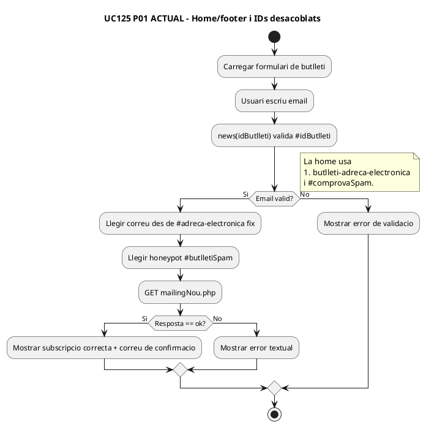

### FINAL
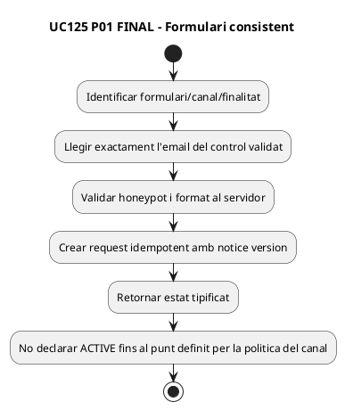

## P02 · Alta general `mailingNou.php`

### ACTUAL
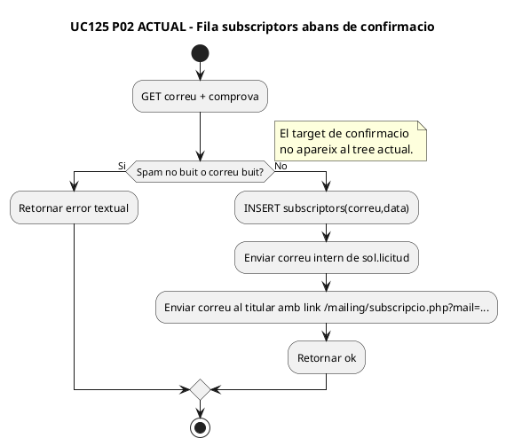

### FINAL
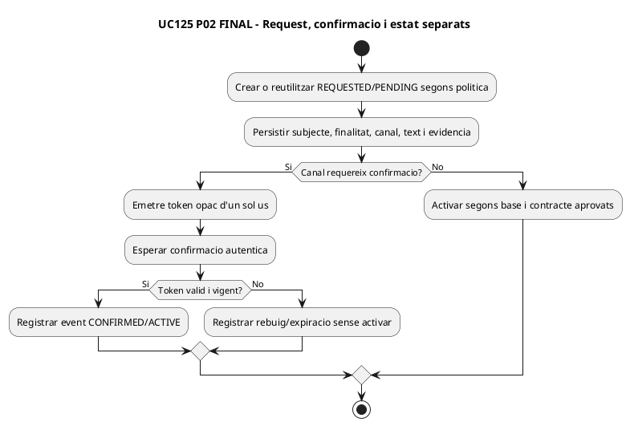

## P03 · Formularis de curs — `mailing.php` / `inscripcio_mailing.php`

### ACTUAL
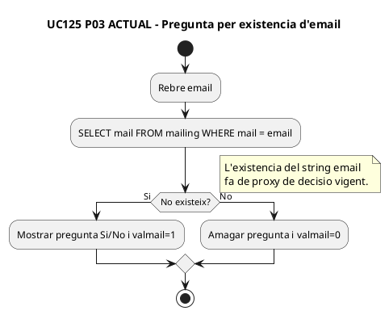

### FINAL
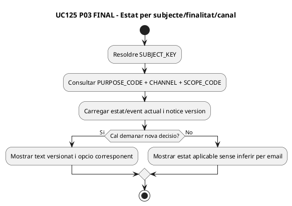

## P04 · Tastet gratuït — alta obligatòria de butlletí segons decisió 25/09

### ACTUAL
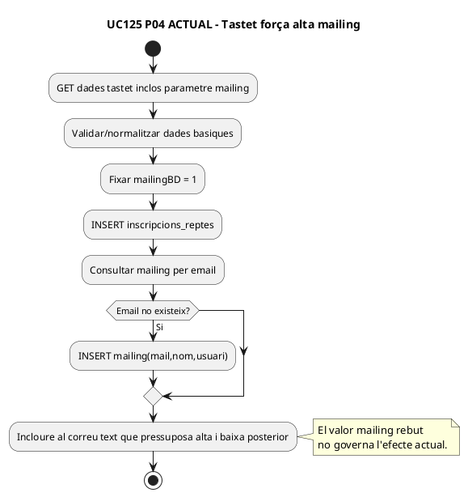

### FINAL
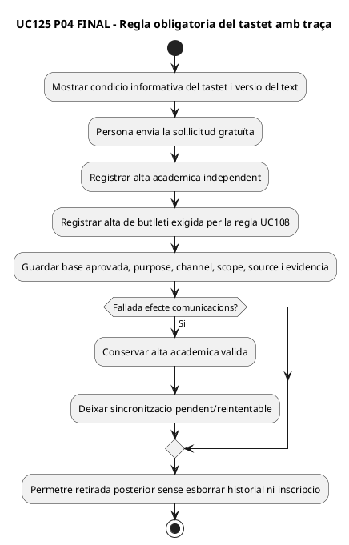

## P05 · Intranet alumne — editar `INSC_MAILING` amb altres camps

### ACTUAL
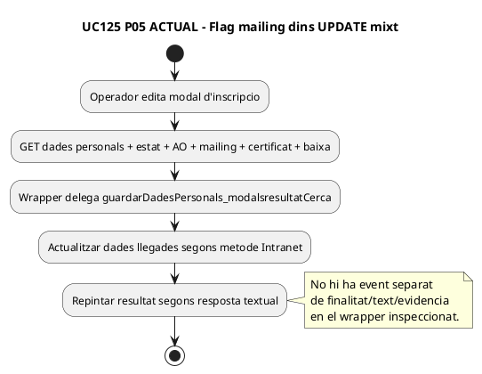

### FINAL
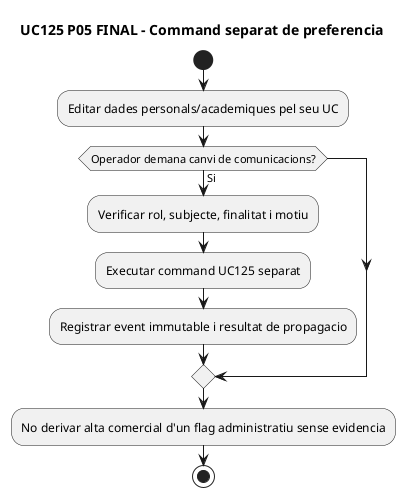

## P06 · Trobada individual — avís i butlletí general

### ACTUAL
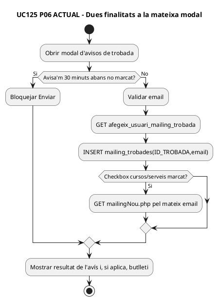

### FINAL
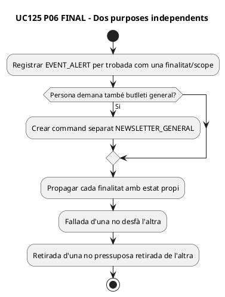

## P07 · Totes les trobades — una decisió, N destinacions

### ACTUAL
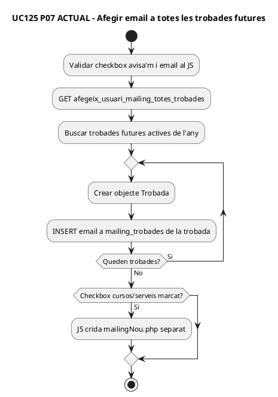

### FINAL
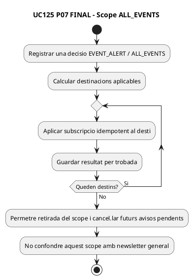

## P08 · SIF — `communication_consent` / event, NOMÉS FINAL EXECUTABLE

**ACTUAL documentat:** la migració 000006 defineix l'esquema, però no s'ha acreditat servei/repository/connector PHP que l'executi. Per tant, no es dibuixa un workflow ACTUAL fictici.

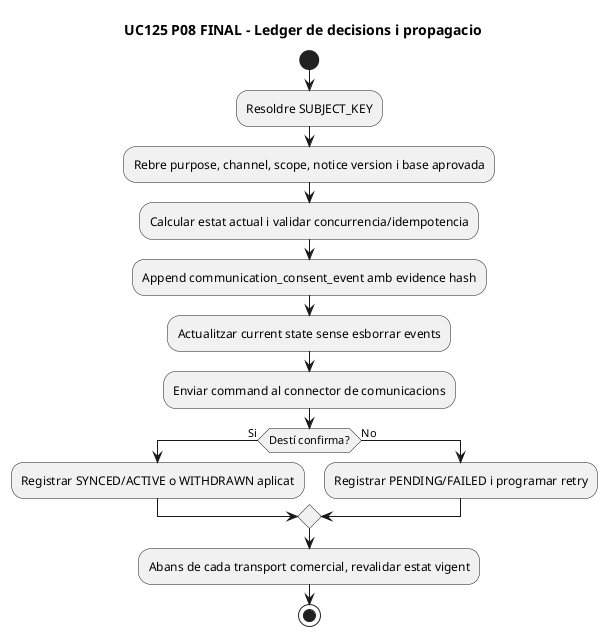

## Cobertura

| P | ACTUAL | FINAL |
| --- | --- | --- |
| P01 | Home/footer amb mismatch d'IDs potencial | Formulari coherent i request idempotent |
| P02 | INSERT `subscriptors` + email de confirmació | Estats request/confirmació/active |
| P03 | Existència email a `mailing` | Subjecte/finalitat/canal/scope |
| P04 | Tastet força mailing=1 | Regla obligatòria UC108 + traça + baixa |
| P05 | `INSC_MAILING` en UPDATE mixt | Command separat i event |
| P06 | Avís trobada + butlletí opcional | Dos purposes |
| P07 | N files `mailing_trobades` | Scope ALL_EVENTS amb resultats per destí |
| P08 | DDL definit, cap workflow runtime acreditat | Ledger + connector/retry |

**DOC:** 15 diagrames PlantUML. **IMP:** scripts llegats presents; model SIF executable no acreditat. **TEST:** UC125-T01–T20 no executats. **PRODUCCIÓ:** no verificada.
