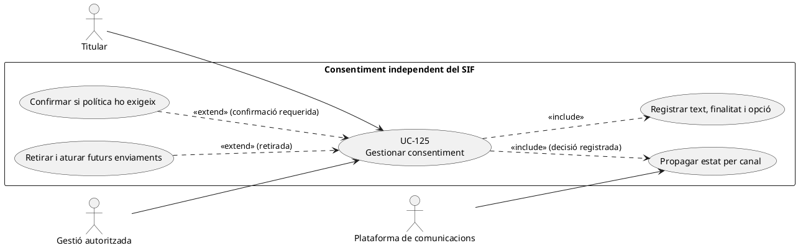
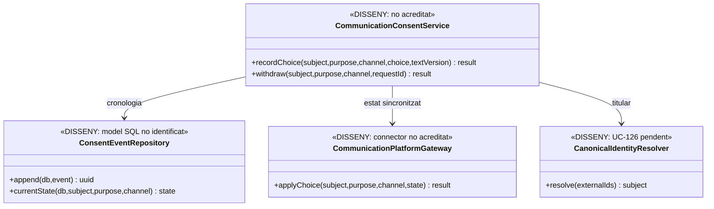
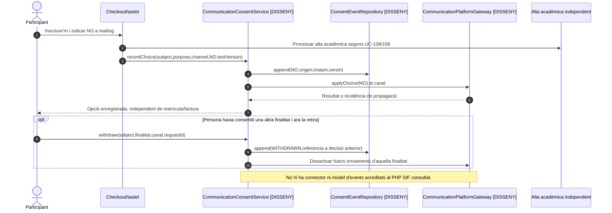

# UC-125 · Gestionar el consentiment de comunicacions separat de la inscripció

**Objectiu canònic:** alta, confirmació, denegació, canvi i retirada amb finalitat, canal, abast, versió del text, font, data i evidència. **Cap alta acadèmica, factura, compra o tastet gratuït acredita automàticament consentiment de comunicacions comercials.** Bloquejant de la fitxa original: finalitats, canals, textos/versionats, doble confirmació, caducitat i mecanismes de retirada.

## 1. Evidència del repositori i decisions pendents

La migració de cicle comercial conté `commercial_operation`, participants, `discount_evidence` i `academic_economic_state_event`, **però no s'ha identificat en aquest esquema una taula específica d'events de consentiment de comunicacions**. Tampoc s'ha acreditat a `sif/src/Service` un coordinador de consentiment o un adaptador a la plataforma de mailing. Els camps de correu de `inscripcions` i de `factura.BILLING_EMAIL` són dades de contacte, **no** prova del text, finalitat o instant d'una autorització comercial.

UC-108 permet alta gratuïta sense presumpció de mailing; UC-120 tracta dades personals vigents i propagació, però canviar una adreça de correu **no equival** a donar d'alta de nou una finalitat de comunicació que s'havia denegat o retirat.

## 2. Fitxa funcional específica

| Element | Contracte |
| --- | --- |
| Actors | Persona titular, representant acreditat quan correspongui, operació de màrqueting/atenció autoritzada i adaptador de comunicacions. |
| Identitat | Subjecte canònic UC-126, `ID_INSC` i `UUID_OPERATION` només com a referències **d'origen** de la recollida, correu/canal verificat i prova que l'opció va correspondre a la persona. No reutilitzar `IDPAG` com a identitat del titular. |
| Decisió | `PURPOSE_CODE`, `CHANNEL`, `SCOPE`, `TEXT_VERSION`, `SOURCE`, marca temporal, opció explícita, event/versió anterior, actor, correlació i prova mínima: camps d'un **model objectiu**, no esquema SQL ja creat. |
| Independència | El consentiment comercial es registra per finalitat/canal segons política acordada; una notificació operativa del curs o un document fiscal poden seguir un circuit diferent i **no s'han de tractar com a acceptació comercial**. |
| Consulta/retirada | L'opció vigent s'obté d'una cronologia d'events ordenats amb control d'identitat; retirada i denegació no esborren la prova de l'opció anterior, però impedeixen els futurs enviaments de la finalitat retirada quan la integració funcioni. |
| Economia i factura | `CHARGE`, `REFUND`, `payment_action_event` i dades de factura **no canvien** amb la decisió de mailing; cap canvi d'estat acadèmic ni fiscal derivat d'una retirada. |

### Flux objectiu i variants

1. El canal de compra, tastet o intranet mostra el text **concret versionat** i permet registrar per separat la decisió pertinent. No marcar l'opció comercial a partir del fet d'enviar el formulari o pagar.
2. Un gestor **pendent** valida identitat, finalitat i canal, registra event amb opció/instant/origen i crea o reusa la prova del mateix `REQUEST_ID` sense duplicar canvis.
3. Si la política exigeix doble confirmació, no marcar l'opció com a plenament confirmada fins a comprovar el pas de verificació. La necessitat, termini i mecanisme de doble confirmació **estan pendents d'aprovació**, no es presumeixen implementats.
4. Propagar decisió al sistema de comunicació per la mateixa clau de persona+finalitat+canal; només informar «sincronitzat» quan el destí l'ha confirmat. Si falla, deixar incidència/reintent idempotent.
5. En retirada, registrar nou event vinculat a l'anterior, revocar futurs enviaments de la finalitat/canal pertinents i comprovar que les cues pendents no tornen a marcar el contacte com a actiu per una sincronització antiga.
6. Si la persona canvia email o es detecta duplicat de subjecte, UC-126 resol titularitat abans d'unificar historials; no traslladar un consentiment antic a una persona diferent per coincidència de correu.
7. L'alta acadèmica, factura i document fiscal continuen intactes encara que la persona no autoritzi comunicacions comercials.

| Prova pendent | Resultat a exigir |
| --- | --- |
| Alta a tastet amb opció `NO` | Accés acadèmic possible segons regla de curs; cap subscripció comercial implícita. |
| Compra amb email compartit de dues persones | No atribuir a totes dues l'elecció feta per una. |
| Doble clic i reintent després d'error | Un sol event lògic per petició equivalent i estat de propagació coherent. |
| Retirada mentre hi ha enviament pendent | No reactivar finalitat per una resposta tardana; guardar resultats reals per destinació. |
| Canvi d'email | Conservar autoria i àmbit del consentiment amb subjecte acreditat, no amb string d'email com a única clau. |

**Pendents de tancament:** política de finalitats/canals/abast i textos, identificador canònic, consentiment representat i proves, custòdia/retenció, servei i repositori d'events, connector de comunicacions i proves de concurrència/privacitat.

### 2.1. Punts d'entrada de mailing documentats i límit de la confirmació

**Circuit concret documentat.** La revisió de `web-actual/ajax/mailing.php`, `mailingNou.php` i `inscripcio_mailing.php` recollida a `33-casos-us-sif.md` identifica tres passos del llegat: **demanar consentiment, crear una sol·licitud i enviar confirmació**. Aquesta evidència **no prova** que cada pas conservi la mateixa versió de text, finalitat/canal, titular, resultat de confirmació i eventual retirada en una cronologia comuna; els scripts no estan presents a la branca GitHub consultada i la seva execució actual en producció queda **pendent de verificació**. No reduir la decisió a «té correu» o «ha rebut un email de confirmació»: distingir sol·licitud, confirmació efectiva i subscripció vigent, cadascuna amb origen i prova pròpia.

**Alta de curs, tastet i avisos necessaris.** UC-108 permet accés a un tastet gratuït amb opció de mailing negativa; UC-109 identifica una inscripció subvencionada amb finançador, que tampoc implica alta comercial. Un avís de pagament, inici de curs, anul·lació d'edició o disponibilitat del document fiscal és una **comunicació operativa vinculada a un fet**, no una alta de mailing comercial. La notificació UC-43/49/58 ha de verificar destinatari i finalitat al seu propi circuit; l'opció de màrqueting no ha d'impedir per si sola una comunicació operativa que correspongui, ni autoritzar anuncis a partir de l'enviament d'una factura.

**Identitat i canvis de contacte.** `inscripcions.CORREU`, `entitats_resp.CORREU` i `factura.BILLING_EMAIL` poden ser iguals o diferents per a participant, gestor i receptor fiscal. La subscripció s'ha de vincular a **subjecte i abast acreditats**, no al primer registre retornat per l'email ni a `IDPAG` compartit. Si es modifica el correu operatiu UC-120 o el responsable d'empresa UC-41, no recuperar automàticament una opció comercial retirada, no enviar un missatge promocional a un tercer per heretar l'email i no traspassar permís de consulta del PDF.

**Prova de la retirada i cues antigues.** `notification_outbox` registra propostes de lliurament però **no substitueix un ledger de decisions de consentiment**. Una retirada efectiva ha d'impedir que una campanya pendent es lliuri per un snapshot antic; si un correu s'havia enviat realment abans, conservar l'event d'enviament en l'auditoria sense afirmar que s'ha pogut recuperar aquell missatge. La regla de consentiment, text i canal vigents s'ha de comprovar abans del transport quan correspon. Les finalitats, textos i model d'events exactes continuen **pendents d'aprovació i implementació**; no donar per feta una cancel·lació externa només per escriure una fila local.

### 2.2. Proves complementàries dels canals documentats (no executades)

| ID | Escenari | Resultat exigible |
| --- | --- | --- |
| CM-125-01 | `inscripcio_mailing.php` tramita una sol·licitud però no es confirma | Sol·licitud identificada; no declarar subscripció confirmada per haver enviat un correu. |
| CM-125-02 | Inscripció a tastet gratuït amb opció comercial negativa | Alta/accés acadèmic segons regla, cap subscripció promocional implícita. |
| CM-125-03 | `CORREU` coincideix per alumne i gestor d'una entitat | Dos subjectes/abasts; no compartir automàticament decisió ni accés documental. |
| CM-125-04 | Retirada amb campanya comercial ja pendent a l'outbox | Revalidar l'opció vigent i impedir l'enviament pendent d'aquella finalitat. |
| CM-125-05 | Canvi de correu després d'una retirada | Conservació de la decisió per subjecte/abast; no reactivació per l'email nou. |
| CM-125-06 | Enviar factura o avís operatiu a persona no subscrita | Validar destinatari i finalitat operativa sense crear una subscripció comercial. |

## 3. UML de casos d'ús

## 4. UML de classes — contracte pendent, no facturació

## 5. UML de seqüència — inscripció amb negativa i retirada posterior (DISSENY)

## 6. Traçabilitat

[UC-125 original](../06-fitxes-funcionals/uc-125.md) · [UC-108 tastet gratuït](uc-108-tastet-repte-gratuit.md) · [UC-120 canvi de contacte](uc-120-canvi-dades-personals-propagacio.md) · [UC-126 conflicte d'identitat original](../06-fitxes-funcionals/uc-126.md) · [UC-49 enviament documental original](../06-fitxes-funcionals/uc-049.md) · [Esquema de cicle comercial](../../sif/database/migrations/2026_09_16_000005_add_operation_lifecycle_tables.sql).
