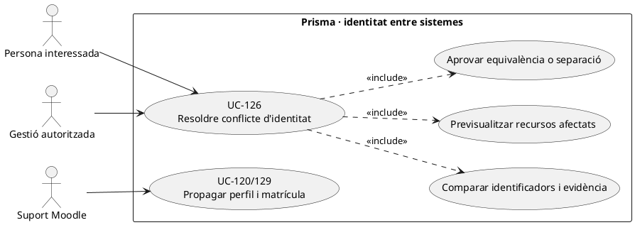
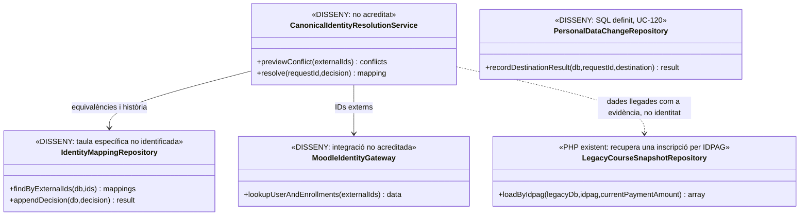

# UC-126 · Resoldre identitat i dades de contacte en conflicte entre sistemes

**Objectiu canònic:** cada identificador extern correspon a **un subjecte canònic acreditat** o queda en expedient de conflicte. Fusionar o separar persones no ha de barrejar matrícules, cobraments, factures, consentiments ni accessos Moodle. **Bloquejant del catàleg:** quin identificador és canònic, quines coincidències poden fusionar-se automàticament i qui aprova conflictes de DNI/correu/usuaris Moodle.

## 1. Evidència de les fonts

`LegacyCourseSnapshotRepository::findInscriptionByIdpag()` cerca `inscripcions` per `IDPAG` i obté `ID`, `NOM`, `COGNOMS`, `DNI`, `CORREU`, adreça, curs/edició i import. `LegacyGroupInvoicePayloadBuilder` utilitza un responsable com a receptor de grup. Això és un **snapshot d'origen fiscal**, no un servei d'identificació única de persones o de resolució de duplicats. Igualment, `fact_rels` identifica relacions documentals però no autoritza accés a una factura només perquè es comparteixi email o `IDPAG`.

La migració defineix `personal_data_change_request` amb `SUBJECT_KEY`, canvis proposats, evidència/revisió, sistemes afectats i estat de propagació. **No s'ha identificat** un model/writer PHP d'equivalències d'identitat Prisma↔Moodle↔SIF, resolució segura de conflictes ni fusió/escissió de perfils. Les factures ja emeses continuen amb el receptor fiscal històric, fins i tot quan el perfil actual canvia: la correcció d'un error fiscal és un altre cas.

## 2. Fitxa específica

| Element | Contracte |
| --- | --- |
| Actors | Persona interessada, gestió autoritzada, suport acadèmic i responsable de protecció de dades per conflictes sensibles; accés estrictament limitat al cas. |
| Claus d'entrada | `ID_INSC`, identificador intern de persona, `DNI/NIF` quan existeix i es valida, email i telèfon, identificador d'usuari i matrícula Moodle, receptor fiscal, `UUID_OPERATION` i `IDPAG` només com a **referències contextuals**. |
| Regla canònica pendent | Definir per política quin sistema/identificador preval per persona, contacte, titular de matrícula, pagador i receptor. **No** fusionar per un email compartit, nom semblant o el mateix `IDPAG`: un pagador pot abonar cursos de diverses persones. |
| Prova i decisió | Per conflicte, registrar fonts originals, coincidències/contradiccions, evidència mínima, decisió manual autoritzada, actor, instant i versió; no copiar justificants o dades alienes als camps fiscals. |
| Resultat de resolució | Vincular IDs al subjecte acreditat o mantenir conflicte sense moviment dels seus recursos; preservar història d'assignacions i possibilitat de revertir **la relació d'identitat** sense esborrar factures/cobraments. |
| Separació econòmica | Resoldre identitat no implica transferir titularitat de crèdit, reassignar `UUID_PAYMENT`, editar factura o crear `CHARGE`. Qualsevol canvi de fons requereix UC-105/29a i autorització del titular real. |
| Integracions | Un canvi en perfil actual s'encamina a UC-120 i una discrepància de matrícula/usuari Moodle a UC-129, amb resultat per destinació; el SIF no és el proveïdor de contrasenyes o permisos Moodle per defecte. |

### Flux objectiu

1. Detectar dues fitxes que podrien correspondre a una persona o una sola fitxa usada indegudament per dues. Capturar IDs i snapshots **abans de canviar-los**, amb control d'accés.
2. El resolutor **pendent** compara font i validesa de cada identificador i classifica duplicat real, email compartit, canvi legítim de contacte o usurpació/conflicte no resolt; **no** convertir una coincidència de dades en identitat provada.
3. Previsualitzar què passa amb matrícules, cursos, responsable de grup, consentiments UC-125, drets futurs UC-117, factures, pagaments i accés Moodle. Quan la resposta no és unívoca, deixar incidència i bloquejar només les mutacions que podrien exposar o moure dades alienes.
4. Un operador autoritzat aprova explícitament el mapeig/escissió amb referències d'origen i clau idempotent. Preservar els identificadors històrics de les factures sense un `UPDATE` de `BILLING_NIF_CIF` o de `ID_INSC` per «netejar» el passat.
5. Propagar els identificadors **vigents** als sistemes en què pertoqui amb UC-120/129, confirmant cadascun; la manca de resposta de Moodle no justifica declarar resolta la identitat d'accés.
6. Si la revisió revela una atribució errònia de diners o de receptor fiscal, obrir **un cas econòmic/fiscal separat** amb import i titular originals; un canvi de correu no autoritza traspassar la propietat d'un saldo.

### Alternatives i proves

| Cas | Resultat |
| --- | --- |
| Pare i filla comparteixen email i el pare paga | Dues persones, dues matrícules, pagador diferent; no fusionar per email ni repartir diners arbitràriament. |
| Mateixa persona té dos usuaris Moodle | Verificar identitat i estat de cada matrícula/activitat; decidir mapeig de compte sense tocar factures emeses. |
| DNI diferent però mateix nom i email | Conflicte d'identitat i revisió, **no** fusió automàtica. |
| Factura d'empresa vinculada a alumne que canvia contacte | Preservar receptor fiscal empresa i restringir visibilitat; actualitzar contacte només al sistema autoritzat. |
| Perfil unificat per error amb consentiments diferents | Reconstruir opcions per titular/finalitat i restaurar separació; no propagar consentiment d'una persona a l'altra. |
| Fallada de propagació a Moodle | Estat parcial + reintent específic, no duplicar persones/inscripcions a Prisma. |

**Pendents:** clau canònica i política de matching, estructura d'equivalències i historial, rols, consentiment i privacitat, propagació entre BDs, proves de merge/split i impacte sobre pagador/factura/certificat.

## 3. UML de casos d'ús



## 4. UML de classes — snapshots existents, resolutor pendent



## 5. UML de seqüència — email compartit i pagador diferent (DISSENY)

```mermaid
sequenceDiagram
autonumber
actor G as Gestió
participant S as CanonicalIdentityResolutionService [DISSENY]
participant I as IdentityMappingRepository [DISSENY]
participant L as Inscripcions / SIF fiscal
participant M as MoodleIdentityGateway [DISSENY]
participant P as Propagació UC-120/129 [pendent]
G->>S: Revisar dues matrícules amb mateix email i diferent DNI
S->>I: Cercar equivalències existents i fonts
S->>L: Comparar ID_INSC, pagador, receptor i factures sense mutar-les
S->>M: Consultar usuaris i matrícules Moodle
S-->>G: Dues persones o conflicte pendent; impacte dels recursos
alt Identitat no acreditada
 G->>S: Deixar en revisió
 S->>I: Registrar conflicte i accessos restringits
else Es confirma que són dues persones
 G->>S: Aprovar separació i relacions de pagador
 S->>I: Guardar mapping sense fusionar factures ni consentiments
 S->>P: Propagar contacte/matrícula a cada subjecte autoritzat
 P-->>S: Resultats per sistema o incidència
end
Note over S,P: Cap CHARGE, reassignació de saldo ni UPDATE de receptor fiscal d'una factura emesa.
```

## 6. Traçabilitat

[UC-126 original](../06-fitxes-funcionals/uc-126.md) · [UC-120 canvi de dades](uc-120-canvi-dades-personals-propagacio.md) · [UC-125 consentiment](uc-125-consentiment-comunicacions-separat.md) · [UC-129 Moodle original](../06-fitxes-funcionals/uc-129.md) · [UC-105 reassignar fons](uc-105-reassignar-repartir-pagament.md) · [LegacyCourseSnapshotRepository](../../sif/src/Repository/LegacyCourseSnapshotRepository.php) · [Migració personal_data_change_request](../../sif/database/migrations/2026_09_16_000005_add_operation_lifecycle_tables.sql).
