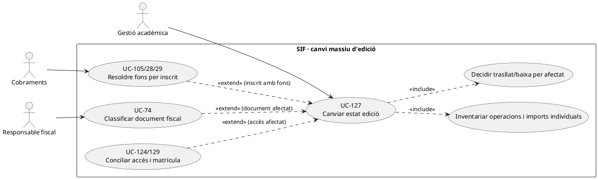
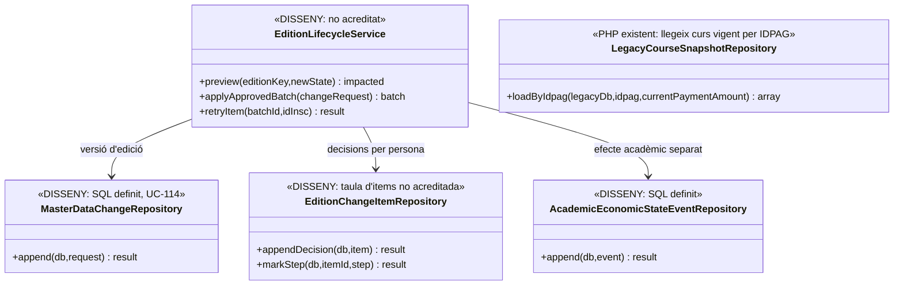
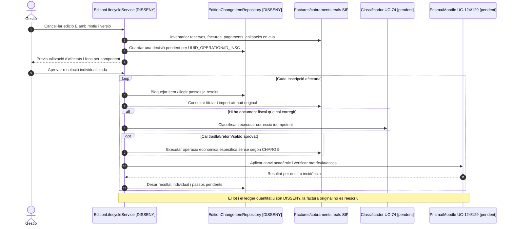
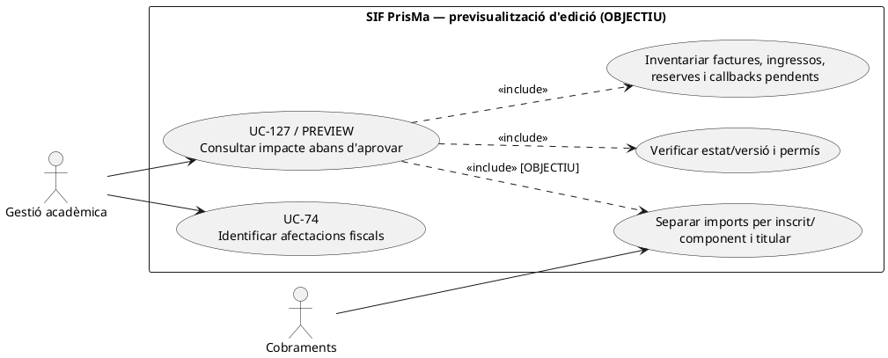
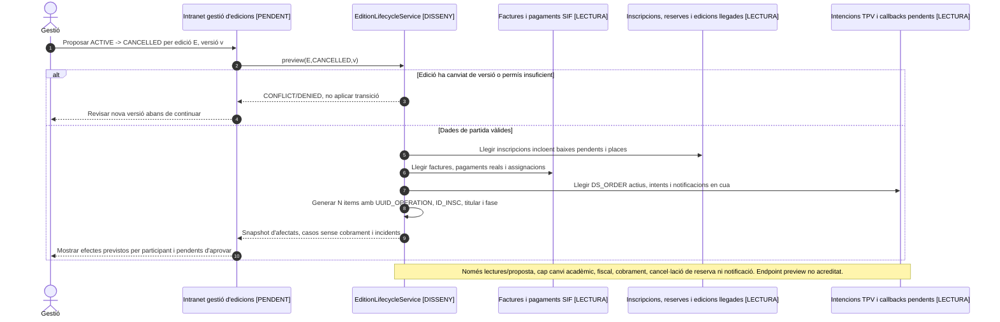
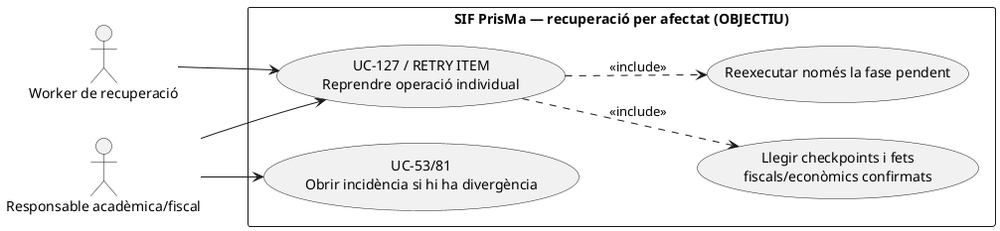
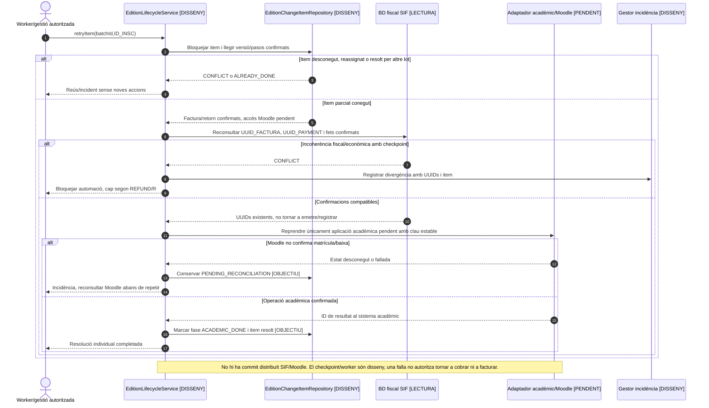
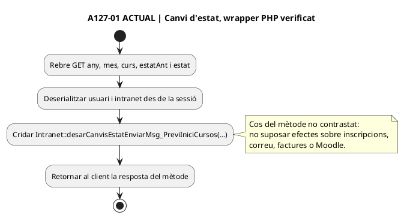
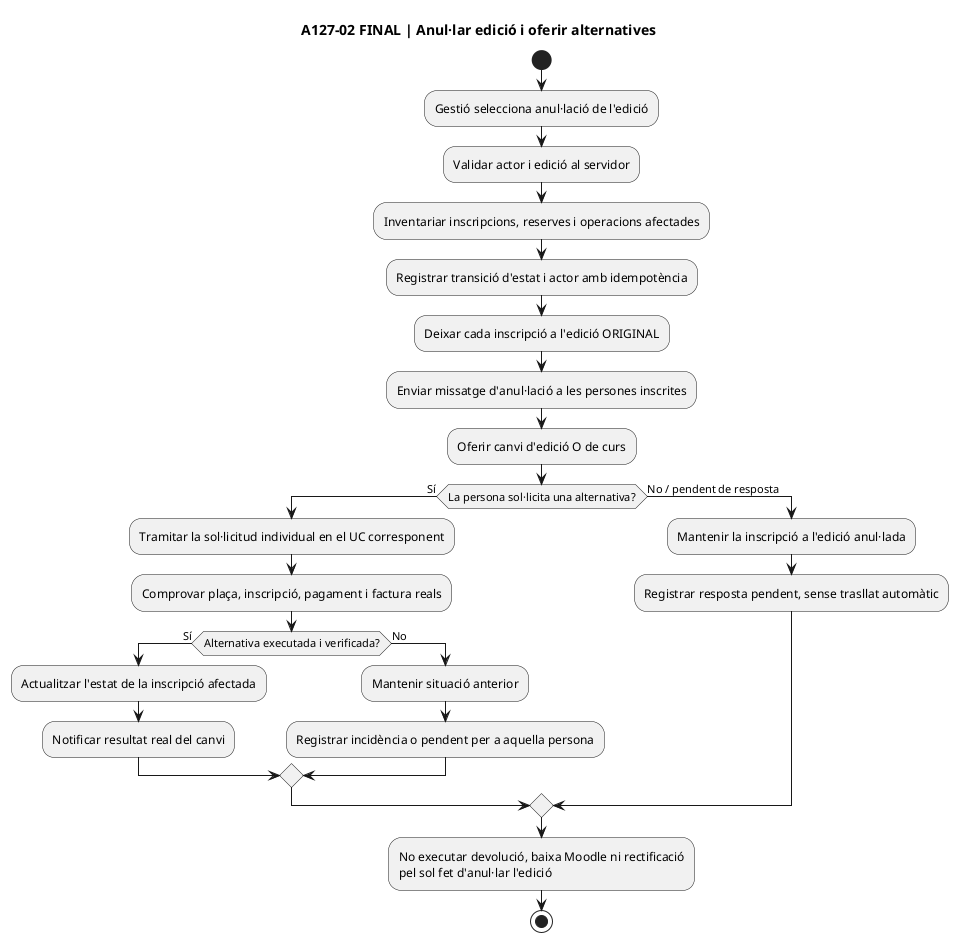
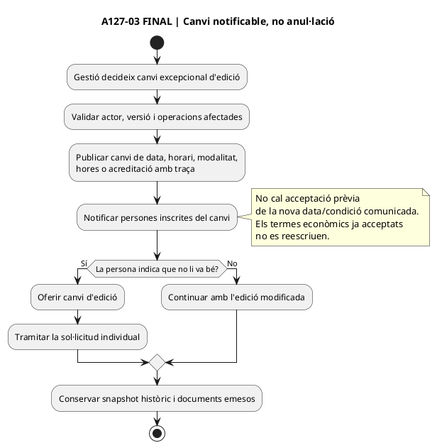

# UC-127 · Canviar l'estat d'una edició i resoldre totes les operacions afectades

**Objectiu canònic:** l'activació, ajornament, tancament o cancel·lació d'una edició ha de produir un **event massiu identificable** i un inventari de reserves, inscripcions, factures i pagaments afectats. Cada inscrit/operació rep **una decisió individual**: mantenir, traslladar, cancel·lar, retornar, crear saldo, rectificar o no actuar. **Decisió de negoci confirmada 22/09/2026:** en anul·lar l'edició, s'avisa les persones inscrites i se'ls ofereix canvi d'edició o de curs; **la inscripció es manté a l'edició original fins que se'n resolgui la situació**. No convertir l'anul·lació en trasllat, baixa o devolució automàtiques. El tractament econòmic/fiscal individual s'ha de classificar segons la situació real, sense inventar ingressos ni reescriure factures.

## 1. Evidència revisada

`master_data_change_request` té `ENTITY_TYPE`, `ENTITY_KEY`, `BASE_VERSION`, `PROPOSED_VERSION`, `CHANGESET_JSON`, `AFFECTED_OPEN_OPERATIONS_JSON`, actor, motiu, decisió i correlació. `commercial_operation` i `commercial_operation_line` emmagatzemen producte/edició i snapshots comercials; `capacity_reservation` relaciona places amb l'operació. `academic_economic_state_event` permet una traça **per inscripció** d'estats acadèmics, d'accés i fotografia econòmica. **Les taules estan definides a SQL; no s'ha acreditat un `EditionLifecycleService` PHP que inventariï i resolgui N operacions.**

`LegacyCourseSnapshotRepository` consulta les dades vives del curs per `ANY`, `MES` i `CURS` quan carrega dades llegades per `IDPAG`. La factura amb snapshot congelat **no s'ha de regenerar a partir de l'edició mutable** després d'un ajornament. `RedsysPaymentIntentService` rebutja reutilitzar un mateix `DS_ORDER` amb snapshot/import/venciment diferents, però `RedsysCallbackService` no comprova l'estat actual de l'edició o `EXPIRES_AT` de l'oferta.

## 2. Fitxa específica i invariant de diners

| Unitat | Contracte |
| --- | --- |
| Actors | Persona de l'equip amb accés a intranet que decideix el canvi d'estat, sense segona aprovació interna; persones inscrites destinatàries de la comunicació d'anul·lació i alternatives. Els efectes econòmics/fiscals derivats es tramiten amb les autoritzacions dels UC corresponents. |
| Capçalera massiva | `EDITION_KEY` (any, mes, curs o recurs inequívoc), estat anterior/nou, versions, causa, data efectiva, actor, `REQUEST_ID`, correlació, conjunt d'operacions trobades i nombre d'incidències. **No s'ha acreditat taula específica de lot per edició** amb item/resultat idempotent. |
| Registre per afectat | `UUID_OPERATION`, `ID_INSC`, línia de pack/grup, titular, pagador, estat de plaça, inscripció, accés, factura/es, pagaments **reals**, import individual atribuït, decisió i resultat d'execució. |
| Abans del pagament | Revocar o renovar reserva/enllaç segons UC-115/121; sense ingrés real, **cap `REFUND`**. Si es proposa altra edició/preu, cal nova acceptació quan la política ho exigeixi. |
| Després de cobrar | Conservar `UUID_PAYMENT` original i decidir per **tram atribuït** a cada inscrit o component: trasllat intern UC-105, saldo UC-29, retorn **quan sigui efectiu** UC-28 o cap canvi, amb titular verificat. **No** tornar el total de la factura d'empresa indiscriminadament a cada alumne. |
| Després de facturar | La factura/registre original continuen immutables. UC-74/05 classifica si cal document corrector per servei/import/receptor realment modificats; canviar només l'estat de l'edició **no insereix una rectificativa automàtica**. |
| Estat acadèmic | UC-124/129 gestiona plaça, baixa/trasllat, Moodle i certificat independentment de la resolució fiscal. Cada resultat queda correlacionat i recuperable en cas de fallada parcial. |

### Flux objectiu

1. Gestió proposa `ACTIVE→POSTPONED/CLOSED/CANCELLED` o transició real acordada. El servei **pendent** consulta versions, publica previsualització amb nombre i IDs d'operacions afectades, incloses intencions TPV pendents i callbacks encara en cua, reserves, pagaments, factures i components de packs/grups.
2. Classifica el lot en **fitxes individuals de decisió**: sense cobrament i sense factura, factura abans de cobrar, pagament parcial, ingrés complet individual, pack, grup amb empresa pagadora, plaça ja traslladada, factura correctora existent o incidència.
3. La mateixa persona de l'equip amb accés a intranet decideix el canvi, sense segon aprovador intern; registra actor/regla/versionat. Si s'anul·la l'edició, notifica a les persones inscrites i **conserva les inscripcions a l'edició original mentre esperen resolució**, oferint canvi d'edició o de curs. Cal definir un model append-only per a cada item i la seva clau idempotent; `AFFECTED_OPEN_OPERATIONS_JSON` **no prova que cada membre hagi estat resolt**.
4. Publica l'estat/versió de l'edició i registra els avisos i les alternatives. No mou ni dona de baixa les inscripcions per defecte en anul·lar: obre una resolució individual quan l'afectat decideixi o existeixi una decisió aplicable. Els canvis de data sense anul·lació se **notifiquen**, i, si no van bé, s'ofereix canvi d'edició (UC-114); no s'exigeix acceptació prèvia de la data. Si es canvien termes econòmics acceptats, preparar oferta nova, no mutar el snapshot original.
5. Per cada inscrit afectat amb diners reals, reconcilia import origen i saldo disponible **per `ID_INSC`**, titular i destí. Un moviment intern B→C no és un segon `CHARGE`; retorn només després de sortida real i amb idempotència.
6. Per cada document emès, classifica efecte fiscal i registra la correcció apropiada **només si correspon al cas individual**; no alterar de forma massiva `factura_linia` o `ESTAT_AEAT`.
7. Confirma resultats acadèmics/Moodle en un procés separat. El lot queda amb comptador d'items resolts/pendents/error, i els callbacks antics s'encaminen a conciliació, no es descarten perquè el curs està cancel·lat.

### Proves específiques

| Escenari | Resultat requerit |
| --- | --- |
| Cancel·lació d'edició amb 20 inscripcions: 10 pagades, 5 facturades sense cobrar, 5 gratuïtes | 20 decisions **individuals**; 10 imports reals analitzats, cap retorn automàtic de les altres, tractament fiscal per document existent. |
| Pack de tres cursos amb un component cancel·lat | Afectar únicament component/inscripció pertinent i reconsiderar descompte pack segons contracte, no retornar tres cops el mateix `UUID_PAYMENT`. |
| Grup amb factura i pagador empresa | Preservar identitat de qui va pagar i imports atribuïts per participant; no prometre ingrés al compte d'una altra persona. |
| Callback Redsys de l'edició antiga després de publicar cancel·lació | Reconciliar ingrés bancari real i estat de plaça; no ocultar `CHARGE` ni confirmar servei inexistent. |
| Reintent d'un item resolt després d'una fallada de Moodle | No duplicar factura correctora/retorn; repetir **només** el pas acadèmic no confirmat. |

**Pendents de tancament:** política d'estats per edició, actor que aprova el lot i els casos individuals, model/worker d'items idempotents, snapshot del deute individual, execució dels canvis acadèmics i fiscalitat específica per variant.

### 2.1. Operació llegada d'estat d'edició: un únic clic, N decisions individuals

**Origen concret de l'event massiu.** `Intranet::desarCanvisEstatEnviarMsg_PreviIniciCursos()` canvia una edició entre pendent, activa i anul·lada, pot donar de baixa alumnes, consulta factures i formes de pagament, cerca edicions futures i envia avisos. El mètode llegat reuneix actuacions que afecten **un conjunt d'inscripcions**, però el `master_data_change_request.AFFECTED_OPEN_OPERATIONS_JSON` previst al SIF és només **una capçalera amb una llista**, no una prova que s'hagin processat tots els inscrits ni que s'hagin comprovat els ingressos externs. L'orquestració objectiu necessita un resultat individual per `ID_INSC/UUID_OPERATION`, amb fase acadèmica, econòmica, fiscal i comunicació diferenciades.

**Inventari que evita perdre casos.** En preparar l'anul·lació o ajornament, incloure no només persones que `INSC_CURS` marca com a actives, sinó també reserva sense pagament, intenció `DS_ORDER` encara pendent, callback validat en cua, factura d'empresa emesa abans de cobrar, inscripció canviada de curs, participant d'un pack/grup amb altres línies vigents, pagament parcial i expedient ja rectificat. En cap cas l'estat d'edició actual de la web determina, per ell mateix, si s'ha cobrat realment o si la factura antiga és fiscalment improcedent.

**Matriu d'efectes per afectat.** (a) Reserva sense ingrés ni factura: decidir alliberament/alternativa UC-115/121, sense `REFUND`. (b) Factura real emesa abans de cobrar: preservar document i resoldre obligació/rectificació **segons el cas**, no transformar-la en proforma. (c) Ingrés confirmat de l'alumne o empresa: conservar `UUID_PAYMENT`, decidir canvi UC-71/105, saldo UC-29 o devolució **quan s'executi realment** UC-28. (d) Grup/pack: quantificar per participant/component només amb atribucions acreditades; no retornar a cada alumne el total ingressat per l'empresa. (e) Matrícula/accés Moodle: UC-124/129 aplica i verifica la decisió acadèmica, independentment que l'adaptador fiscal hagi acabat.

**Reintents i notificacions.** Un fallada després de canviar l'edició però abans d'avisar la tercera persona no justifica repetir baixa, emissió, `CHARGE` o reemborsament de les dues anteriors. Recuperar el mateix event massiu i **només els items/fases pendents**; revalidar la plantilla UC-43/58 perquè el missatge no afirmi «devolució efectuada» o «baixa a Moodle confirmada» fins a disposar del resultat real. Un callback d'una ordre anterior al canvi és evidència de banc a conciliar, no un registre que pugui descartar-se per estar l'edició anul·lada.

### 2.2. Proves addicionals de lot amb estats mixtos (no executades)

| ID | Escenari | Resultat exigible |
| --- | --- | --- |
| ED-127-01 | Anul·lar edició amb factura prèvia pendent i cap ingrés | Classificació individual d'obligació/document; cap devolució fictícia. |
| ED-127-02 | Grup d'empresa pagat, només un participant canvia d'edició | Fons i document analitzats per part afectada; cap retorn indiscriminat a participants. |
| ED-127-03 | Callback `DS_ORDER` antiga arriba després d'anul·lar | Preservar cobrament extern i obrir conciliació de la plaça/servei. |
| ED-127-04 | Fallada d'avís al tercer de cinc inscrits després de canvis confirmats | Reprendre missatge pendent i verificar fases per inscrit, no tornar a executar els efectes confirmats. |
| ED-127-05 | Operació mostra edició cancel·lada però accés Moodle encara actiu | Mostrar estat parcial i UC-129 fins a verificació acadèmica. |
| ED-127-06 | Pack amb dues línies i una sola edició cancel·lada | Resolució per línia/inscripció, sense crear una factura o un CHARGE nous per l'altra. |

## 3. UML de casos d'ús

## 4. UML de classes — capçalera SQL i coordinació d'items pendent

## 5. UML de seqüència — cancel·lació de pack/grup i cobrament tardà (OBJECTIU)

### 5.1. Acció independent: previsualitzar un canvi d'edició sense aplicar-lo — DISSENY

**Disparador propi:** gestió proposa una transició d'estat d'una edició; encara no l'aprova. **Precondicions:** clau/versió d'edició inequívoca, estat anterior i nou admès, accés de consulta autoritzat. **Postcondició:** inventari/versionat de totes les operacions impactades i proposta d'efectes per afectat; cap canvi de l'edició, `CHARGE`, `REFUND`, rectificativa, matrícula o missatge a l'alumne. No s'ha acreditat el mètode `EditionLifecycleService::preview()` com a PHP executable.

### 5.2. Acció independent: reprendre només un item parcial del lot — DISSENY

**Disparador propi:** canvi de l'edició ja aprovat, però un `ID_INSC`/`UUID_OPERATION` s'ha quedat a mig procés (p. ex. la decisió fiscal s'ha confirmat i ha fallat el pas acadèmic a Moodle). **Postcondició:** un únic resultat de recuperació per item, preservant factura, moviments i passos ja confirmats; incidència traçable si l'estat no és conciliable. `EditionLifecycleService::retryItem()` i `EditionChangeItemRepository` són propostes, **no** codi PHP implementat.

| ID de prova pendent | Entrada | Sortida exigible |
| --- | --- | --- |
| ED-127-07 | `preview()` sobre edició amb factura emesa pendent i callback antic en cua | Inventari de tots dos i cap mutació d'estat/cobrament/factura. |
| ED-127-08 | Versió d'edició canvia entre preview i aprovació | Conflicte de versió; regenerar inventari i requerir nova decisió. |
| ED-127-09 | Lot N: els primers dos items completats i tercer falla a Moodle | Reintentar només tercer i només fase pendent; cap segon `REFUND`, factura R ni `CHARGE`. |
| ED-127-10 | Falla la xarxa després que Moodle apliqui la baixa però abans d'obtenir resposta | Consultar estat real i recuperar l'operació idempotentment, sense executar una segona baixa incompatible. |
## 6. Traçabilitat

[UC-127 original](../06-fitxes-funcionals/uc-127.md) · [UC-114 versió producte](uc-114-versionar-producte-edicio.md) · [UC-122 component pack](uc-122-composicio-pack-component-indisponible.md) · [UC-105 traspassos](uc-105-reassignar-repartir-pagament.md) · [UC-124 estats acadèmics](uc-124-reconciliar-acces-certificat-baixa-deute.md) · [UC-121 reserva caducada](uc-121-repreuar-renovar-reserva-caducada.md) · [LegacyCourseSnapshotRepository](../../sif/src/Repository/LegacyCourseSnapshotRepository.php) · [Migració master_data_change_request i events](../../sif/database/migrations/2026_09_16_000005_add_operation_lifecycle_tables.sql) · [Model de fons individuals](00-revisio-moviments-inscripcions.md).

### Regla concreta per a una edició anul·lada · decisió confirmada 22/09/2026

**ACTUAL segons negoci, fins a contrast final del cos PHP i la pantalla:** enviar missatge d'anul·lació a les persones inscrites oferint **canviar d'edició o de curs** i **mantenir de moment la inscripció a l'edició original**. No derivar del sol canvi d'estat un trasllat/baixa acadèmica, baixa Moodle, devolució o rectificació fiscal. La mateixa persona de l'equip amb accés a la intranet decideix el canvi, sense segona aprovació interna. El resultat real de cada opció es documentarà segons les rutes específiques ja existents; cap import bancari es considera retornat sense l'operació corresponent.

**No barrejar ajornament i anul·lació:** si només canvia la data/hora/modalitat/hores/acreditació, es **notifica** i s'ofereix altra edició si no va bé, **sense exigir una acceptació prèvia**; el manteniment provisional a una edició anul·lada i l'oferta de canviar d'edició **o de curs** són el flux propi de l'anul·lació. No tractar com a «decisions pendents de negoci» aquestes dues regles ja facilitades. [Fitxa funcional UC-127](../06-fitxes-funcionals/uc-127.md).

**Limitació:** el codi complet d'`Intranet::desarCanvisEstatEnviarMsg_PreviIniciCursos()` i els seus efectes reals, les plantilles/destinataris i totes les variants de pantalla no s'han acabat de contrastar aquí. Una descripció històrica que el mètode «pot donar de baixa alumnes» no és prova que això sigui el comportament desitjat abans de rebre una resposta a una edició anul·lada.

### Diagrames d'activitat A127 — subfluxos concrets, font i estat

**Traça de pantalla:** canvi d'estat d'una edició des de la intranet; [wrapper actual `ajax/cursos/desarCanvisEstatEnviarMsg.php`](../../codi-drive/intranet-actual/ajax/cursos/desarCanvisEstatEnviarMsg.php#L11-L27), que llegeix `any`, `mes`, `curs`, `estatAnt`, `estat` per GET i crida `Intranet::desarCanvisEstatEnviarMsg_PreviIniciCursos()`. **Estat actual verificat: només el wrapper**, no el cos del mètode, els botons, la plantilla de correu ni els efectes persistents. Els dos diagrames finals són DISSENY amb regles de negoci confirmades i tasques tècniques pendents, **no codi implantat ni diagrames complets de tota la pàgina**. Aquestes accions pertanyen a UC-127 per estat, i a UC-114 per canvi de dades/versió; no fusionar-les.

#### A127-01 — ACTUAL: controlador de canvi d'estat (límit verificat)

#### A127-02 — FINAL: anul·lació d'edició (decisió de negoci confirmada)

**Variant econòmica:** si hi ha una petició individual amb diferència d'import, factura existent o cobrament real, la decisió i els documents/moviments se'n deriven als UC econòmics i fiscals; no han de quedar ocults dins la notificació. **Respostes i terminis no acreditats:** no inventar una caducitat de la petició ni un trasllat forçat per manca de resposta.

#### A127-03 — FINAL: canvi de data/horari sense anul·lació (vinculat a UC-114)

**Proves proposades, no executades:** (1) anul·lar amb tres persones: cap trasllat ni baixa per defecte i tres avisos rastrejables, una petició de canvi resolta independentment de les altres; (2) persona que no respon: inscripció encara a l'edició anul·lada; (3) canvi de data sense anul·lació: avís i cap exigència d'acceptació prèvia, amb alternativa si no li va bé; (4) factura o cobrament existent: cap devolució, rectificació o segona captura només per la notificació; (5) error d'enviament: reintentar només el missatge pendent, sense repetir el canvi d'estat ni els efectes individuals. Per tancar RM-037 falta contrastar la pàgina, els modals i el mètode llegat complet i executar aquestes proves.
