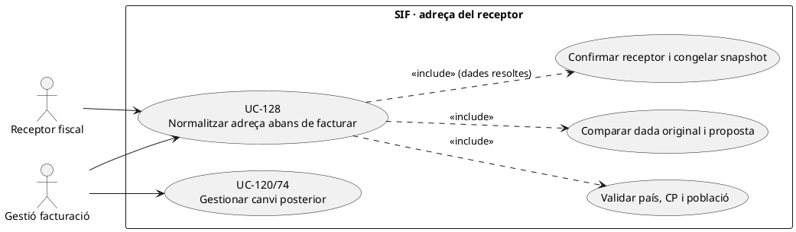
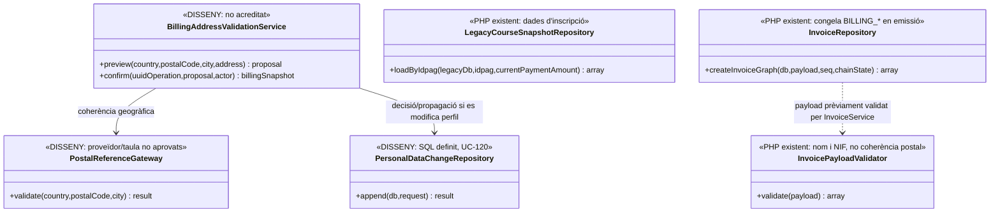

# UC-128 · Validar i normalitzar adreça, codi postal i població abans de congelar dades fiscals

**Objectiu canònic:** conservar valor original, proposta normalitzada, regla, decisió, actor i propagació. Les dades fiscals es revisen **abans de congelar el snapshot**; corregir un perfil després d'emetre **no reescriu el receptor d'una factura emesa**. **Bloquejant del catàleg:** font de validació de CP/població/país/adreça, responsable de discrepàncies i condicions en què es bloqueja l'emissió.

## 1. Evidència de PHP i esquema

`LegacyCourseSnapshotRepository::findInscriptionByIdpag()` llegeix de `inscripcions` `ADRECA`, `Codi_Postal` i `Poblacio` juntament amb `DNI`, `NOM`, `COGNOMS` i `CORREU`. `LegacyCourseInvoicePayloadBuilder` trasllada les dades del snapshot al bloc `billing`, però **no valida la coherència geogràfica** entre CP, població, província i país. `InvoicePayloadValidator::validate()` exigeix `billing.name` i `billing.nif` i comprova tipus/valors d'imports i línies: **no valida CP, població ni normalitza adreces**.

`InvoiceRepository::insertInvoice()` grava `BILLING_ADRECA`, `BILLING_CP`, `BILLING_POBLACIO`, `BILLING_PROVINCIA`, `BILLING_PAIS` en el moment de l'emissió, amb els valors del payload validat. `personal_data_change_request` està definida a SQL per a decisions de canvi i propagació, **no és** un normalitzador postal executable. No s'ha acreditat al PHP SIF un adaptador de codis postals ni una taula geogràfica de referència aprovada.

## 2. Fitxa específica

| Element | Contracte |
| --- | --- |
| Actors | Titular/receptor fiscal o representant acreditat, gestió autoritzada; servei de verificació postal **només si** el sistema/proveïdor és aprovat i integrat. |
| Entrada | `UUID_OPERATION` o petició de factura, receptor, país, província/regió, `ADRECA`, `CP`, `POBLACIO`, valor abans/proposta, font i versió de la regla; **no deduir adreça fiscal del lloc on resideix l'alumne si el receptor és una empresa**. |
| Política de validació | Definir formats per país i criteri de correspondència CP–població segons font acordada. **No** imposar cinc dígits d'Espanya a qualsevol país ni completar automàticament una població dubtosa. |
| Evidència | Registrar dada original, proposta, discrepància, font/resultat, actor que accepta o rebutja, data i versió. Una sugestió automàtica no substitueix la confirmació del receptor quan aquesta és necessària. |
| Persistència comercial | Guardar snapshot **acceptat** de receptor i adreça abans de l'intent TPV o d'emetre factura, amb correlació de l'operació. El model exacte de versió postal és disseny pendent; `personal_data_change_request` admet changeset/decisió però no valida geografies. |
| Factura existent | `BILLING_*` fiscal de la factura emesa es preserva. Un error real del document es classifica via UC-05/74; el nou domicili del perfil s'aplica a futures operacions sense reescriure l'original. |
| Diners | Un canvi postal **no crea `CHARGE`, `REFUND`, compensació ni canvi en `payment_allocation`**. Una intenció creada amb receptor antic requereix política de revisió/acceptació si la dada materialment canvia. |

### Flux objectiu

1. El canal recupera receptor fiscal proposat i dades d'adreça d'una **font concreta**; comprova si és alumne, empresa o altre responsable legitimat.
2. Un validador **pendent** aplica format i coherència segons país i regla/versionat. Desa valor d'entrada i proposta, sense sobreescriure silenciosament cap camp llegat ni fabricar CP si la font falla.
3. Si les dades són ambigües, obre expedient per gestió/receptor i, segons política aprovada, **bloqueja el congelament fiscal** fins a resoldre; la decisió exacta d'obligatorietat no la pren `InvoicePayloadValidator` actual.
4. En acceptació, UC-112 congela receptor i adreça normalitzada amb instant/regla. El constructor fiscal del canal rep aquests valors i `InvoiceRepository` els fixa en la factura **una sola vegada**.
5. Si després es demana canvi de domicili o es descobreix un error, UC-120 registra i propaga només dades vigents; UC-74 decideix separadament si cal document corrector de la factura emesa.
6. Una fallada en la propagació a la BD llegada deixa destí pendent i reintent idempotent; mai «arreglar» la factura amb una escriptura SQL directa a `BILLING_ADRECA`.

### Alternatives i proves

| Escenari | Comprovació |
| --- | --- |
| CP i població d'Espanya discordants | Mostrar discrepància i font; no substituir població sense verificació/decisió aprovada. |
| Receptor estranger | Validar formats de país especificat, no rebutjar automàticament per absència de CP espanyol. |
| Alumne matriculat però factura a empresa | Capturar adreça del **receptor fiscal validat**, no l'adreça acadèmica per defecte. |
| CP corregit després de crear `DS_ORDER` | Revisar snapshot de l'operació abans d'emetre; `RedsysPaymentIntentService` rebutja reutilitzar ordre amb snapshot diferent. |
| Factura antiga amb població errònia | Classificació fiscal específica i dades de perfil vigents separades, sense mutació del registre fiscal previ. |
| Format vàlid però adreça inexistent | El validador de format no acredita existència postal: prova de font/criteri real i revisió si és rellevant. |

**Pendents:** font postal i criteri de validació per país, definició de camps imprescindibles, representació i consentiment del receptor, normalitzador/writer PHP, tests geogràfics i de snapshot/intenció/factura emesa.

## 3. UML de casos d'ús



## 4. UML de classes — factura existent i normalitzador pendent



## 5. UML de seqüència — correcció abans d'emetre (OBJECTIU/PARCIAL)

```mermaid
sequenceDiagram
autonumber
actor R as Receptor fiscal
participant V as BillingAddressValidationService [DISSENY]
participant Ref as PostalReferenceGateway [DISSENY]
participant O as Operació i snapshot [SQL, writer pendent]
participant I as InvoiceService [PHP]
participant DB as factura BILLING_* [SQL]
R->>V: Proposar adreça, CP, població i país
V->>Ref: validate(country,CP,city)
alt Dades contradictòries
 Ref-->>V: Discrepància i font
 V-->>R: Proposta i revisió, sense factura
else Dades coherents i confirmades
 Ref-->>V: Validació segons regla/versionat
 V-->>R: Confirmar receptor i valors originals/proposats
 R->>V: Acceptar proposta
 V->>O: Congelar billingSnapshot abans d'emetre
 V->>I: issueInvoice(payload amb receptor validat)
 I->>DB: Guardar BILLING_ADRECA/CP/POBLACIO/PAIS i registre fiscal
 I-->>R: UUID_FACTURA immutable
end
Note over V,DB: El normalitzador no existeix al PHP revisat; InvoicePayloadValidator no comprova geografia.
```

## 6. Traçabilitat

[UC-128 original](../06-fitxes-funcionals/uc-128.md) · [UC-120 dades personals](uc-120-canvi-dades-personals-propagacio.md) · [UC-112 snapshot](uc-112-congelar-snapshot-abans-tpv.md) · [UC-74 classificar correcció original](../06-fitxes-funcionals/uc-074.md) · [InvoicePayloadValidator](../../sif/src/Service/InvoicePayloadValidator.php) · [InvoiceRepository](../../sif/src/Repository/InvoiceRepository.php) · [LegacyCourseSnapshotRepository](../../sif/src/Repository/LegacyCourseSnapshotRepository.php) · [Migració canvis personals](../../sif/database/migrations/2026_09_16_000005_add_operation_lifecycle_tables.sql).
