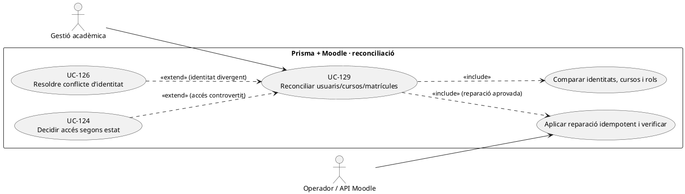
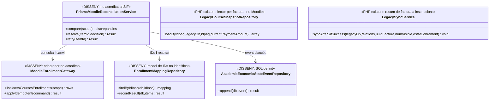
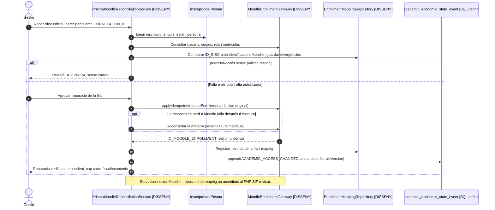

# UC-129 · Reconciliar inscripcions, usuaris, cursos i matrícules entre Prisma i Moodle

**Objectiu canònic:** cada execució identifica absències, sobrants, correus divergents, correspondència de curs/aula, rol i matrícula, i conserva una decisió per incidència. Corregir una matrícula Moodle o una inscripció Prisma ha de ser **idempotent i no crea ni modifica factures ni pagaments**. **Bloquejant del catàleg:** quin sistema preval per usuari, correu, curs, aula, rol i matrícula, i quines reparacions poden automatitzar-se.

## 1. Evidència disponible i límit de PHP

`LegacyCourseSnapshotRepository::loadByIdpag()` relaciona una inscripció llegada `inscripcions` amb `ANY`, `MES`, `CURS`, `ID`, persona/correu i el curs corresponent de `curs`; aquest repositori **llegeix dades per construir una factura**, no l'estat de l'usuari o matrícula Moodle. `LegacySyncService::syncAfterSifSuccess()` es limita a `FACTURA_RELACIONADA` i `OBSERVACIONS` de `inscripcions`, **sense crear, consultar o eliminar matriculacions Moodle**.

La migració defineix `academic_economic_state_event` amb `ENROLLMENT_KEY`, estats acadèmic/d'accés abans/després, `ECONOMIC_STATE_SNAPSHOT`, regla i correlació. **No s'ha identificat** un `MoodleReconciliationService` o un gateway Moodle a `sif/src`, ni una taula SQL de mapeig estable entre `ID_INSC`, usuari Moodle, curs Moodle i ID de matrícula. El catàleg reconeix el circuit llegat, però aquesta revisió **no certifica el comportament del connector Moodle productiu fora del repositori SIF**.

## 2. Fitxa específica

| Element | Regla |
| --- | --- |
| Actors | Gestió acadèmica i operador tècnic Moodle autoritzat; alumne visualitza només el seu accés/resultat. Els processos de sincronització tenen compte tècnic i permís mínim. |
| Clau per fila | `ID_INSC`/subjecte canònic UC-126, `ANY+MES+CURS` del producte d'origen, usuari Moodle, curs/aula Moodle, rol, matrícula i estat d'alta/baixa, amb hash/versió d'origen i destí. El correu sol **no és identificador inequívoc**. |
| Abast del diagnòstic | 1) Prisma té inscripció i Moodle no matrícula; 2) Moodle té matrícula sense inscripció vinculada; 3) usuari/correu/rol discrepants; 4) curs o edició/aula incorrecta; 5) baixa Prisma amb accés encara actiu; 6) pagador de grup diferent del participant. |
| Font de decisió | Definir sistema mestre **per camp i transició**: persona, email, curs, rol, matrícula, accés i certificat. No existeix una regla universal acreditada que faci prevaler sempre Prisma o sempre Moodle. |
| Correcció | Registrar una acció per discrepància amb actor, causa, origen/destí, abans/després, clau idempotent i resultat verificat; no esborrar matrícula amb progrés/certificat sense aprovació específica. |
| Efecte econòmic | La reconciliació acadèmica **no emet ni anul·la `factura`, ni registra `CHARGE`/`REFUND`**, ni canvia titularitat dels fons. Un deute/baixa que afecta accés passa a la decisió UC-124 i, si cal diners, al cas econòmic explícit. |
| Persistència pendent | S'ha de definir inventari per execució i item, mapeig d'IDs i estats de reintent, amb `academic_economic_state_event` per al canvi d'accés. L'existència d'aquesta taula no demostra que un compte Moodle s'hagi actualitzat. |

### Flux objectiu

1. Iniciar una execució amb `CORRELATION_ID` i finestra/edicions acordades. Llegir inscripcions i productes Prisma **i** usuaris/cursos/matrícules Moodle mitjançant adaptador autoritzat; correlacionar per IDs verificats, no per ordre de resultats o coincidència de nom.
2. Construir un inventari **per inscripció i matrícula** amb dades originals dels dos sistemes, hash/versió i tipus de divergència; no interpretar automàticament una matrícula Moodle «sobrant» com a fraude o alumne a eliminar.
3. Per cada discrepància, consultar UC-126 si hi ha conflicte de subjecte i UC-124 si deute, baixa, pròrroga o certificat condicionen accés. Determinar regla i aprovació que corresponguin, preservant el pagador de grup i la independència de l'estat de factura.
4. Previsualitzar acció idempotent: crear matrícula absent, corregir relació curs/aula/rol, actualitzar contacte vigent, suspendre o reactivar accés **només quan la política ho permet**; no modificar el receptor fiscal històric.
5. Escriure resultat d'intent i executar a **un destí concret**, tornar-lo a llegir per confirmar. En cas de fallada de xarxa, deixar pendent i reintentar la mateixa acció, no crear una segona matrícula diferent per compensació.
6. Registrar `academic_economic_state_event` objectiu amb estat abans/després, instant/actor i hash de la fotografia econòmica emprada per a la decisió. Si la comprovació econòmica és insuficient, **no** inventar `PAID` al llegat ni eliminar un `UUID_PAYMENT` ja existent.
7. Tancar l'execució amb comptadors de divergències detectades, resoltes, no aplicables i pendents; una execució sense errors tècnics no equival a exactitud fins a comparar els estats finals.

### Variants i proves

| Escenari | Resultat esperat |
| --- | --- |
| Alumna inscrita a Prisma però absent a Moodle | Decisió d'alta acadèmica segons política, mapeig correcte de curs/edició i verificació de matrícula creada una sola vegada. |
| Mateix email compartit per dos participants | UC-126 valida identitats; **no** fusionar usuaris ni barrejar expedients/certificats. |
| Baixa confirmada a Prisma però accés Moodle encara actiu | UC-124 decideix estat d'accés i certificat; UC-129 executa i verifica només el canvi autoritzat. |
| Moodle mostra participant d'un grup amb factura d'empresa pendent | No desmatricular-lo ni reassignar diners únicament per l'estat de la factura: política específica per pagador de grup i deute. |
| Matriculat al curs Moodle d'edició equivocada | Preservar evidència/progrés i rectificar destí només després de validar equivalències `ANY/MES/CURS`↔aula. |
| Primer intent crea matrícula, resposta es perd | Reconciliar al destí i retornar reús de la mateixa matrícula en el retry. |
| Import i deute divergeixen entre SIF i Prisma | Obrir UC-53/124: la reparació d'usuari Moodle **no** autoritza crear segon `CHARGE`. |

**Pendents:** font i política per cada camp/rol, API i permisos Moodle, model de mapeig d'IDs, paginació i inventari de l'execució, matrícules amb progrés/certificat, política de baixes/pròrrogues i proves de fallades parcials entre BDs.

### 2.1. Punts de comparació ja identificats a `Intranet.php` i conciliació real per matrícula

**Dues fonts Moodle, cap font fiscal.** El constructor `Intranet.php` manté diccionaris de consulta separats `consultesBD_Web`, `consultesBD_Moodle` i `consultesBD_MoodleAntic`. La documentació identifica ús de Moodle i Moodle antic per a **usuaris, matriculacions, visibilitat de cursos, qualificacions, fòrums i baixes**, però no com a font fiscal. Una mateixa inscripció acadèmica pot tenir historial en les dues instàncies: l'inventari de conciliació ha de conservar **sistema origen, usuari, curs/aula i matrícula concrets**, no comptar cada usuari trobat com una inscripció addicional ni alterar imports per una diferència d'aula.

**Comprovadors llegats concrets i límit.** `Intranet::mostrarTable_Alumnes_CorreuDiferentBDCampus()` compara el correu de la inscripció amb Moodle i pot derivar a un avís, mentre que `mostrar_Dades_ComprovacioNombreAlumnes()` compara el nombre d'usuaris PrisMa/Moodle. El document d'estat final reconeix que aquestes comprovacions **no defineixen una identitat canònica compartida ni proven la completitud del contingut o de l'execució**. Cal recuperar els identificadors estables i estats **per `ID_INSC`**, no donar per resolta una discrepància perquè el recompte global d'usuaris coincideixi o perquè s'ha modificat `CORREU` a la BD web.

**Punt de tall entre fiscal i acadèmic.** `LegacySyncService::syncAfterSifSuccess()` només escriu `FACTURA_RELACIONADA` i `OBSERVACIONS`; **no consulta Moodle ni prova l'alta, baixa, progrés o accés**. Un cobrament real que retorna `UUID_PAYMENT` mentre manca la matrícula Moodle genera una incidència per fase UC-53/129: conservar la factura i la prova bancària i comprovar abans d'alta si un primer intent ja ha creat la matrícula al destí. Una baixa de curs o canvi d'edició requereix preservar progrés/certificat i la decisió UC-124; no «sincronitzar» esborrant l'usuari d'una aula equivocada sense identificar la inscripció i rol correctes.

**Permisos i fets diferents.** Un alumne que és participant d'una factura d'empresa pot necessitar accés a Moodle sense ser el receptor fiscal o el titular del deute. Les consultes Moodle no concedeixen dret al PDF de l'empresa i l'absència d'un usuari Moodle no autoritza una segona factura. Les accions d'alta/baixa acadèmica, els recordatoris de pagament i la decisió sobre certificat han de conservar cadascuna identificador d'event i resultat verificat segons la política aprovada; les taules `academic_economic_state_event` són **model previst**, no un adaptador Moodle implementat al SIF.

### 2.2. Proves addicionals de comparació entre Moodle actual i antic (no executades)

| ID | Escenari | Resultat exigible |
| --- | --- | --- |
| MO-129-01 | Mateix usuari/curs apareix en Moodle actual i antic | Dues fonts identificades; ni doble matrícula Prisma ni dues factures. |
| MO-129-02 | Recompte total Prisma/Moodle coincideix, però una inscripció no té matrícula | Detectar discrepància per `ID_INSC`, no declarar èxit pel total. |
| MO-129-03 | Correu de l'alumne divergeix a Moodle i una altra persona el comparteix | Revisió UC-126, sense fusió automàtica de subjectes. |
| MO-129-04 | Pagament SIF confirmat i primer intent d'alta Moodle sense resposta | Rellegir el destí i recuperar la matrícula existent si la va crear; cap segon `CHARGE`. |
| MO-129-05 | Participant amb factura d'empresa pendent i matrícula Moodle activa | Regla acadèmica per participant i pagador; no bloqueig automàtic per deute global. |
| MO-129-06 | Baixa Prisma amb progrés/certificat a Moodle antic | Previsualitzar impacte i aplicar decisió individual autoritzada abans de canviar matrícula. |

## 3. UML de casos d'ús

## 4. UML de classes — conciliació objectiu, lector fiscal existent

## 5. UML de seqüència — matrícula Moodle absent i resultat perdut (DISSENY)

## 6. Traçabilitat

[UC-129 original](../06-fitxes-funcionals/uc-129.md) · [UC-124 estat acadèmic i certificat](uc-124-reconciliar-acces-certificat-baixa-deute.md) · [UC-126 identitat](uc-126-identitat-contacte-conflicte-sistemes.md) · [UC-53 divergències](uc-053-detectar-resoldre-divergencies.md) · [LegacyCourseSnapshotRepository](../../sif/src/Repository/LegacyCourseSnapshotRepository.php) · [LegacySyncService](../../sif/src/Service/LegacySyncService.php) · [Migració academic_economic_state_event](../../sif/database/migrations/2026_09_16_000005_add_operation_lifecycle_tables.sql) · [Traça individual de fons](00-revisio-moviments-inscripcions.md).
