# Pujada d'aules obertes — fitxa UML i diagrames de pàgina i apartats

**URL exacta confirmada per Meriem:** https://intranet.prisma.cat/cursos/fi-cursos/pujar-aules-obertes/ . **Fitxa funcional completa de 21 apartats:** [Pujada d'aules obertes](../06-fitxes-funcionals/uc-moodle-pujada-aules-obertes.md). **Codi base:** `main`, `e71958b3026549bde09fb4b25f2ec3ba370937ec`. **Frontera documental acordada:** només la pantalla, `PERENNE`, el CSV, el modal i els errors; no s'inclou ni es descriu el procés posterior de càrrega en un altre sistema. **Cas propi independent** de [generar fitxer de pujada d'alumnes a l'inici de curs](uc-moodle-pujada-alumnes-fitxa-activitats.md), de l'alta web UC-113 i del canvi de curs UC-026.

**Llegenda:** ACTUAL = lectura estàtica del PHP/JS versionat + ubicació de negoci; FINAL = objectiu d'adaptació no acreditat com a implantat; TEST = pendent d'execució. El número `CAND-UC-MOODLE-AO-01` és provisional fins a reconciliar el catàleg, però el cas funcional i la seva URL estan delimitats.

## 1. Identificació de pàgina i de les seves SET accions

| Àmbit | Secció | Efecte i codi |
| --- | --- | --- |
| AO-P00 | Pàgina completa | [PHP](../../codi-drive/intranet-actual/cursos-fi-cursos-pujar-aules-obertes.php), [JS](../../codi-drive/intranet-actual/js/cursos-fi-cursos-pujar-aules-obertes.js), [AJAX de main](../../codi-drive/intranet-actual/ajax/mostrarMain.php), [`Intranet.php L3278–3565`](../../codi-drive/intranet-actual/Intranet.php#L3278-L3565); 2 diagrames ACTUAL/FINAL. |
| AO-A01 | Entrada, sessió, resolució de l'URL i estat buit | [pàgina](../../codi-drive/intranet-actual/cursos-fi-cursos-pujar-aules-obertes.php), [mostrarMain](../../codi-drive/intranet-actual/ajax/mostrarMain.php), [Intranet.php L3278–3301](../../codi-drive/intranet-actual/Intranet.php#L3278-L3301). 2 diagrames ACTUAL/FINAL. |
| AO-A02 | Llistat de candidates, camps informatius i presentació per curs | [Intranet.php L3315–3461](../../codi-drive/intranet-actual/Intranet.php#L3315-L3461) i [consultes SQL](../../codi-drive/intranet-actual/Intranet.php#L499-L509). 2 diagrames ACTUAL/FINAL. |
| AO-A03 | Marcar i desmarcar participants | [JS L38–63](../../codi-drive/intranet-actual/js/cursos-fi-cursos-pujar-aules-obertes.js#L38-L63) i [HTML de la fila L3397–3429](../../codi-drive/intranet-actual/Intranet.php#L3397-L3429). 2 diagrames ACTUAL/FINAL. |
| AO-A04 | Confirmar, validar el permís client i crear CSV | [JS L64–103](../../codi-drive/intranet-actual/js/cursos-fi-cursos-pujar-aules-obertes.js#L64-L103), [crearFitxerAO.php](../../codi-drive/intranet-actual/ajax/inici/crearFitxerAO.php) i [Intranet.php L3488–3513](../../codi-drive/intranet-actual/Intranet.php#L3488-L3513). 2 diagrames ACTUAL/FINAL. |
| AO-A05 | Cada fila: POST, UPDATE de PERENNE i escriptura CSV | [JS L104–141](../../codi-drive/intranet-actual/js/cursos-fi-cursos-pujar-aules-obertes.js#L104-L141), [pujarAulesObertes.php](../../codi-drive/intranet-actual/ajax/inici/pujarAulesObertes.php), [Intranet.php L1073–1074](../../codi-drive/intranet-actual/Intranet.php#L1073-L1074) i [L3522–3565](../../codi-drive/intranet-actual/Intranet.php#L3522-L3565). 2 diagrames ACTUAL/FINAL. |
| AO-A06 | Modal de resultats, enllaç i tancament de la pàgina | [JS L57–63 i L116–141](../../codi-drive/intranet-actual/js/cursos-fi-cursos-pujar-aules-obertes.js#L57-L141), [modal PHP L3467–3482](../../codi-drive/intranet-actual/Intranet.php#L3467-L3482). 2 diagrames ACTUAL/FINAL. |
| AO-A07 | Errors, reintents, concurrència i dades personals | [JS L64–145](../../codi-drive/intranet-actual/js/cursos-fi-cursos-pujar-aules-obertes.js#L64-L145), [endpoints](../../codi-drive/intranet-actual/ajax/inici/pujarAulesObertes.php) i [Intranet.php L3488–3565](../../codi-drive/intranet-actual/Intranet.php#L3488-L3565). 2 diagrames ACTUAL/FINAL. |

**Pantalla de negoci:** el botó de fila és creat pel PHP amb el text `Qualifica` a la columna «Perenne», però el JS del selector `#pujar-ao` el presenta com a `Pujar` o `No Pujar`; **no executa una qualificació acadèmica**. La pàgina no ofereix aquí modal d'edició personal ni selector d'aula: el mateix JS conté handlers de `#pujada-inscr` d'una altra vista que **no s'han de comptar com a apartats d'aquesta URL**.

## 2. Diagrames d'activitat de PÀGINA COMPLETA

### AO-P00 · Pàgina completa — ACTUAL

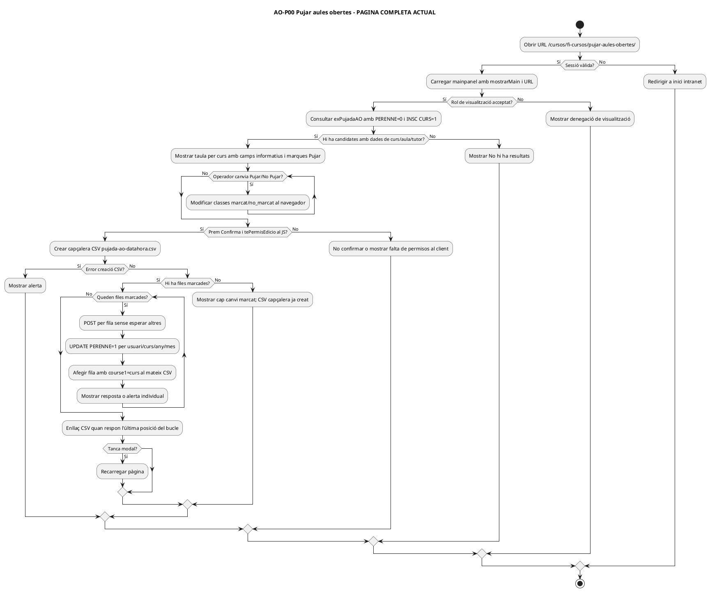

### AO-P00 · Pàgina completa — FINAL

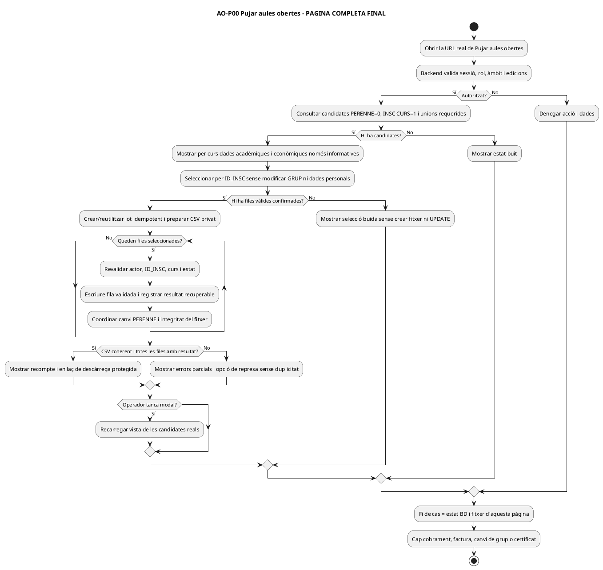

## 3. Diagrames d'activitat de TOTS ELS APARTATS de la pàgina

### AO-A01 · Entrada, sessió, resolució de l'URL i estat buit

**Fonts de l'apartat:** [pàgina](../../codi-drive/intranet-actual/cursos-fi-cursos-pujar-aules-obertes.php), [mostrarMain](../../codi-drive/intranet-actual/ajax/mostrarMain.php), [Intranet.php L3278–3301](../../codi-drive/intranet-actual/Intranet.php#L3278-L3301).

**ACTUAL (PHP/JS versionat)**

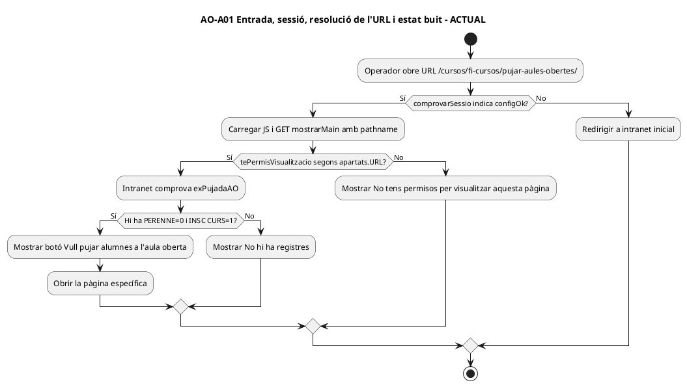

**FINAL (adaptació proposada, no implementada)**

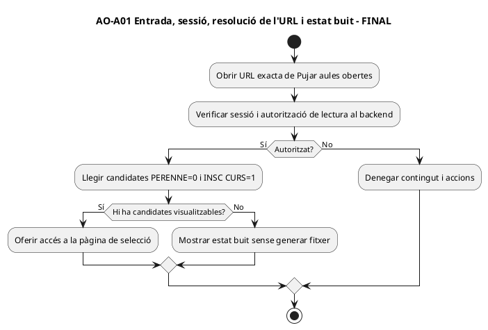

### AO-A02 · Llistat de candidates, camps informatius i presentació per curs

**Fonts de l'apartat:** [Intranet.php L3315–3461](../../codi-drive/intranet-actual/Intranet.php#L3315-L3461) i [consultes SQL](../../codi-drive/intranet-actual/Intranet.php#L499-L509).

**ACTUAL (PHP/JS versionat)**

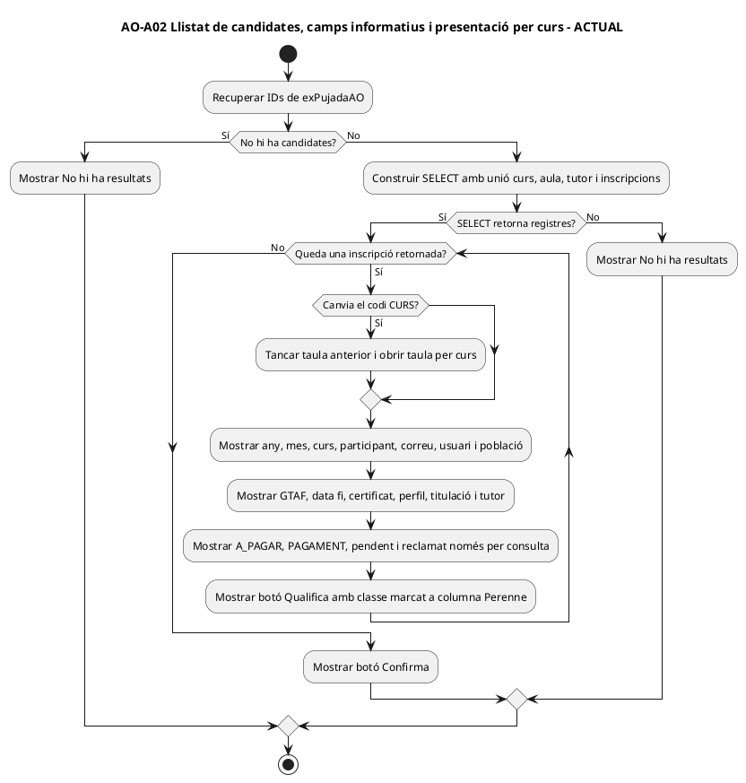

**FINAL (adaptació proposada, no implementada)**

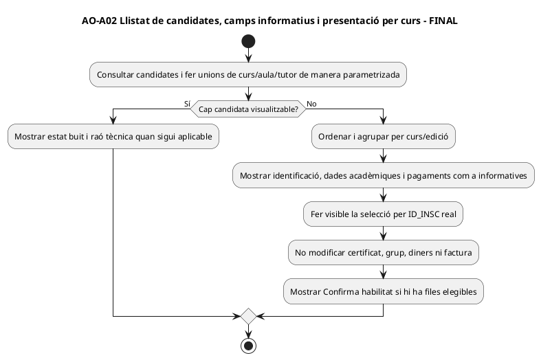

### AO-A03 · Marcar i desmarcar participants

**Fonts de l'apartat:** [JS L38–63](../../codi-drive/intranet-actual/js/cursos-fi-cursos-pujar-aules-obertes.js#L38-L63) i [HTML de la fila L3397–3429](../../codi-drive/intranet-actual/Intranet.php#L3397-L3429).

**ACTUAL (PHP/JS versionat)**

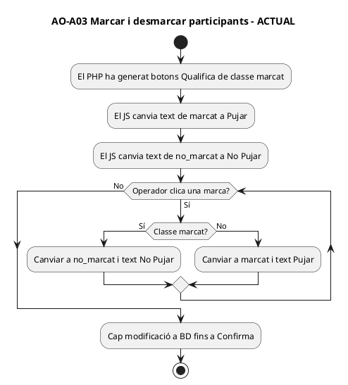

**FINAL (adaptació proposada, no implementada)**

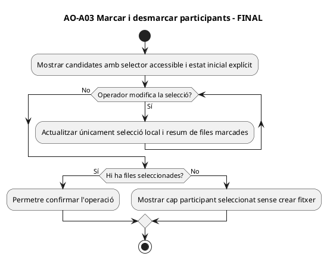

### AO-A04 · Confirmar, validar el permís client i crear CSV

**Fonts de l'apartat:** [JS L64–103](../../codi-drive/intranet-actual/js/cursos-fi-cursos-pujar-aules-obertes.js#L64-L103), [crearFitxerAO.php](../../codi-drive/intranet-actual/ajax/inici/crearFitxerAO.php) i [Intranet.php L3488–3513](../../codi-drive/intranet-actual/Intranet.php#L3488-L3513).

**ACTUAL (PHP/JS versionat)**

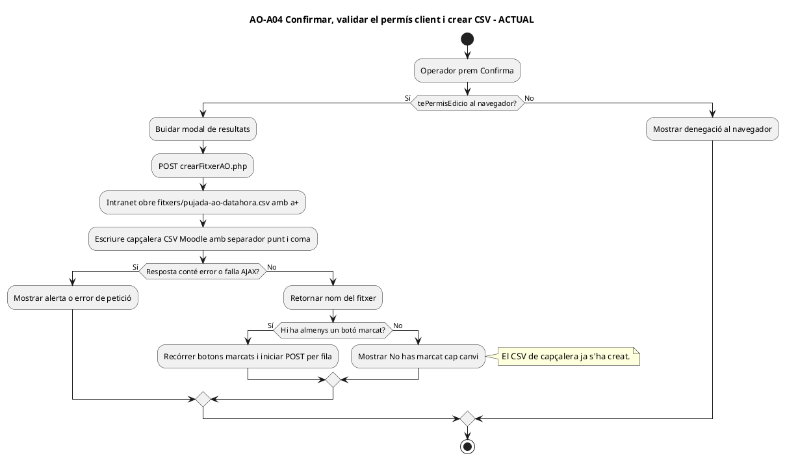

**FINAL (adaptació proposada, no implementada)**

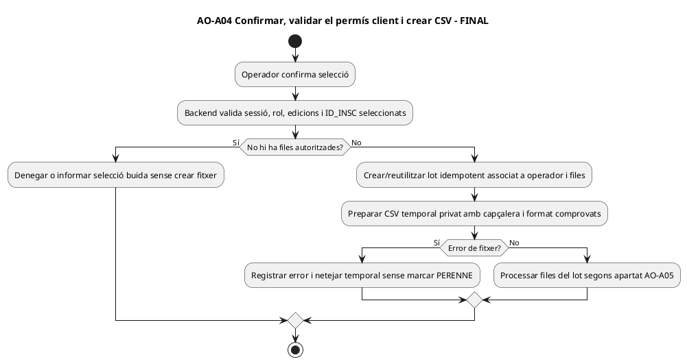

### AO-A05 · Cada fila: POST, UPDATE de PERENNE i escriptura CSV

**Fonts de l'apartat:** [JS L104–141](../../codi-drive/intranet-actual/js/cursos-fi-cursos-pujar-aules-obertes.js#L104-L141), [pujarAulesObertes.php](../../codi-drive/intranet-actual/ajax/inici/pujarAulesObertes.php), [Intranet.php L1073–1074](../../codi-drive/intranet-actual/Intranet.php#L1073-L1074) i [L3522–3565](../../codi-drive/intranet-actual/Intranet.php#L3522-L3565).

**ACTUAL (PHP/JS versionat)**

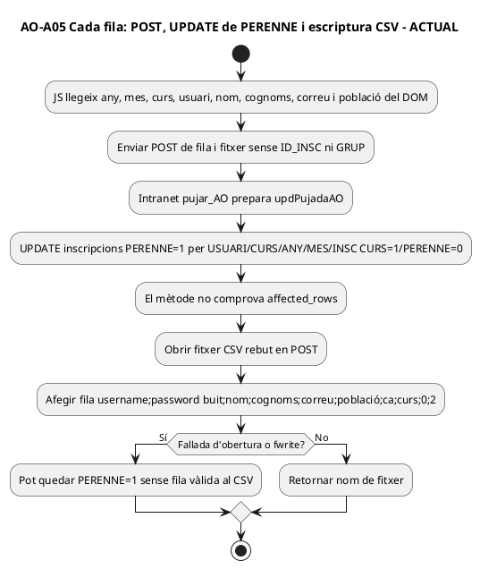

**FINAL (adaptació proposada, no implementada)**

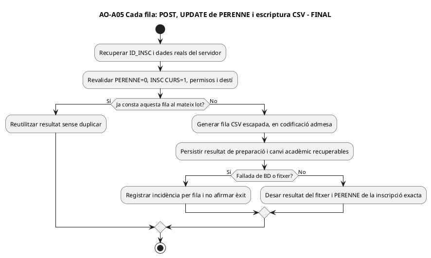

### AO-A06 · Modal de resultats, enllaç i tancament de la pàgina

**Fonts de l'apartat:** [JS L57–63 i L116–141](../../codi-drive/intranet-actual/js/cursos-fi-cursos-pujar-aules-obertes.js#L57-L141), [modal PHP L3467–3482](../../codi-drive/intranet-actual/Intranet.php#L3467-L3482).

**ACTUAL (PHP/JS versionat)**

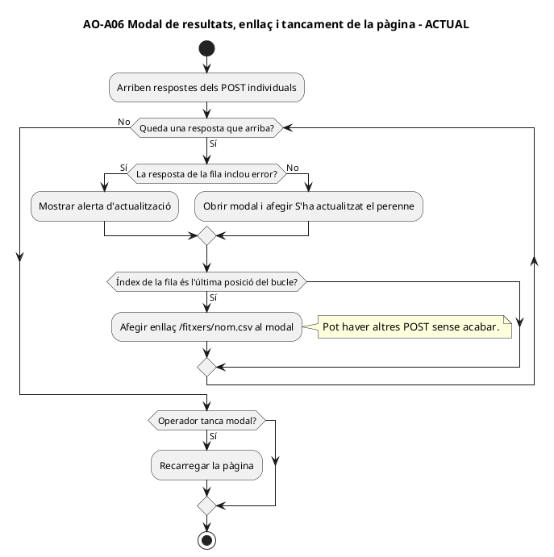

**FINAL (adaptació proposada, no implementada)**

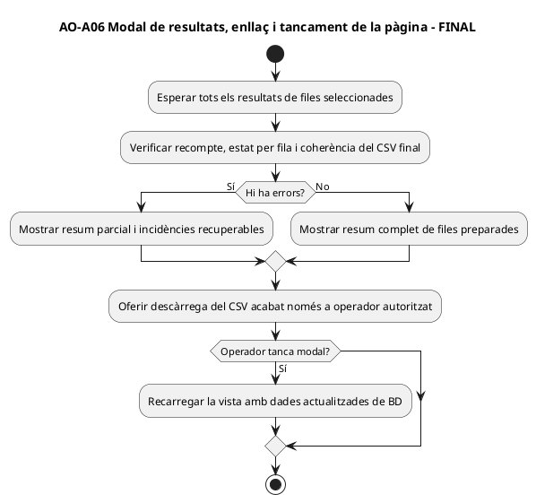

### AO-A07 · Errors, reintents, concurrència i dades personals

**Fonts de l'apartat:** [JS L64–145](../../codi-drive/intranet-actual/js/cursos-fi-cursos-pujar-aules-obertes.js#L64-L145), [endpoints](../../codi-drive/intranet-actual/ajax/inici/pujarAulesObertes.php) i [Intranet.php L3488–3565](../../codi-drive/intranet-actual/Intranet.php#L3488-L3565).

**ACTUAL (PHP/JS versionat)**

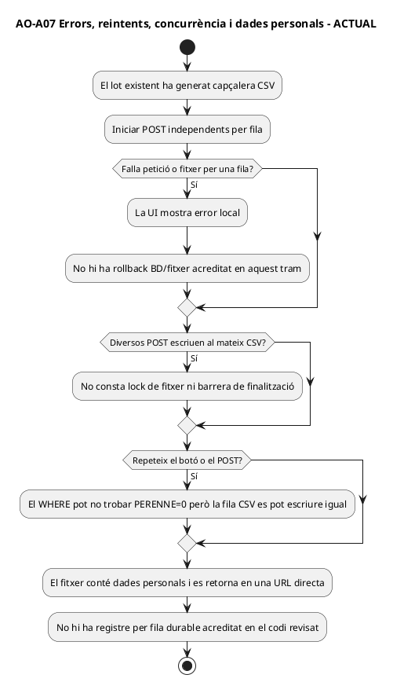

**FINAL (adaptació proposada, no implementada)**

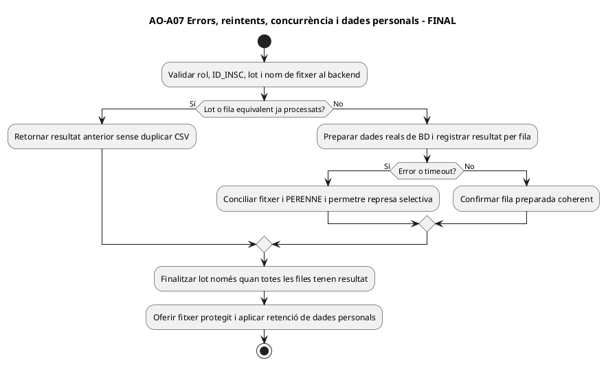

## 4. UML de casos d'ús — només els controls de la pàgina

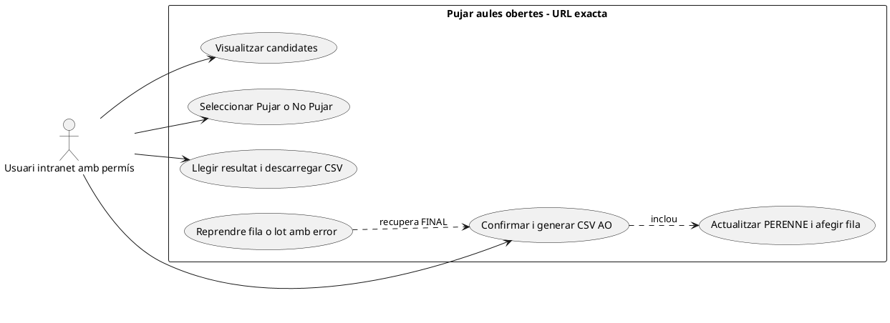

**No inclou:** crear una inscripció a PrisMa, canviar de grup, modificar un certificat ni una càrrega posterior en un campus.

## 5. UML de classes i components reals

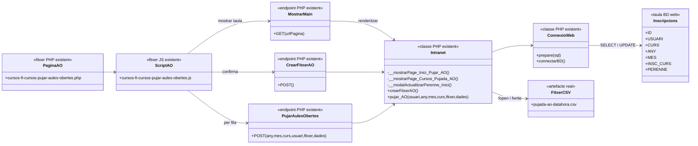

**Llegenda:** `Intranet` i `ConnexioWeb` són classes PHP reals; `PaginaAO`, `ScriptAO`, `MostrarMain`, `CrearFitxerAO`, `PujarAulesObertes`, `Inscripcions` i `FitxerCSV` són etiquetes de fitxer/endpoint/taula/artefacte, **no noves classes PHP**.

## 6. UML de seqüència ACTUAL i FINAL

### Seqüència ACTUAL de la URL

```mermaid
sequenceDiagram
autonumber
actor O as Operador
participant J as JS pàgina AO
participant M as ajax/mostrarMain.php
participant I as Intranet.php
participant B as BD web
participant F as fitxers CSV
O->>J: Obre /cursos/fi-cursos/pujar-aules-obertes/
J->>M: GET mostrarMain(url=pathname)
M->>I: mostrarPage(usuari)
I->>B: SELECT exPujadaAO i vista amb JOIN curs/aula/tutor
B-->>I: Inscripcions amb INSC CURS=1 i PERENNE=0
I-->>J: Taules, dades informatives, botó Pujar i modal
O->>J: Alterna marques i prem Confirma
J->>I: POST ajax/inici/crearFitxerAO.php
I->>F: fopen a+ i fwrite capçalera
I-->>J: Nom pujada-ao-datahora.csv
loop Per cada fila marcada, AJAX independent
 J->>I: POST pujarAulesObertes.php
 I->>B: UPDATE PERENNE=1 per USUARI,CURS,ANY,MES i estats
 B-->>I: Execució SQL (sense comprovació affected_rows)
 I->>F: fopen a+ i fwrite fila amb course1=curs
 I-->>J: Nom fitxer
end
J-->>O: Modal, missatges i enllaç quan respon l'última posició del bucle
O->>J: Tanca modal
J->>J: window.location.reload()
Note over I,F: UPDATE precedeix fwrite; els POST no esperen els altres.
```

### Seqüència FINAL, limitada a la mateixa pantalla

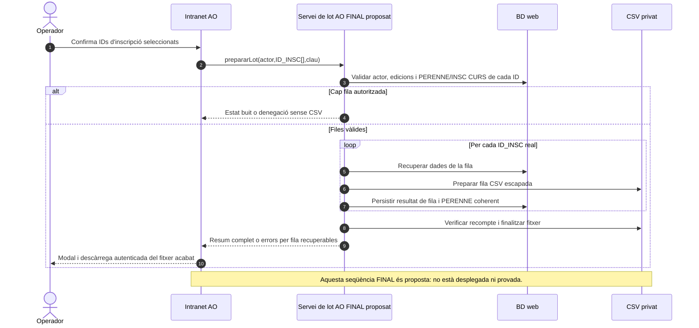

## 7. Matriu d'efectes i proves per a la pàgina

| Acció | ACTUAL observat | FINAL proposat | Test |
| --- | --- | --- | --- |
| Accedir i consultar | Sessió + rol lectura al `mostrarMain`, SQL `exPujadaAO`, unió de curs/aula/tutor | Autorització i candidats coherents | AO-AT-01…05 |
| Seleccionar | Classes JS `marcat`/`no_marcat`, «Pujar» per defecte | Selecció inequívoca per ID_INSC | AO-AT-06…08 |
| Confirmar | `tePermisEdicio` client; capçalera abans de comprovar zero files | Rol servidor; sense fitxer si selecció buida | AO-AT-07/15 |
| Escriure fila | UPDATE `PERENNE=1` abans de `fwrite`; WHERE sense ID ni grup | Execució per ID_INSC i coherència BD/CSV | AO-AT-08…12 |
| Resum i errors | POST per fila, enllaç a resposta darrera posició, recàrrega modal | Tots els resultats i arxiu íntegre abans de descàrrega | AO-AT-11…17 |
| Dades econòmiques i fiscals | Import/pagament/pendent/certificat **només informatius** | Cap cobrament ni factura al generar el fitxer | AO-AT-16 |

Els [17 tests reproduïbles estan detallats a la fitxa funcional](../06-fitxes-funcionals/uc-moodle-pujada-aules-obertes.md#18-proves-dacceptacio-de-pagina-proposades-no-executades). **NO EXECUTATS**: no s'ha inspeccionat el desplegament, les dades productives o l'autorització efectiva de la carpeta `fitxers`. **DOC tancable:** URL confirmada, fitxa real, activitats completes de pàgina/apartats i UML casos/classes/seqüència contrastats; això no certifica la implementació del FINAL ni les proves.

[Fitxa funcional completa](../06-fitxes-funcionals/uc-moodle-pujada-aules-obertes.md) · [Cas independent de pujada d'alumnes](uc-moodle-pujada-alumnes-fitxa-activitats.md) · [Registre mestre](../00-index-i-pla/42-registre-mestre-cobertura-funcional-implementacio-documentacio.md).
