# Cas d'ús específic — Pujada d'aules obertes al campus Moodle

**ID funcional provisional:** CAND-UC-MOODLE-AO-01. Cas independent de [Pujada d'alumnes als cursos](uc-moodle-pujada-alumnes-fitxa-activitats.md) i d'UC-113 per decisió de negoci. **Codi auditat:** `main` a `e71958b3026549bde09fb4b25f2ec3ba370937ec`, 22/09/2026. No és automàticament el mateix que `INSC CURS=1`: aquí l'escriptor modifica `PERENNE`, sobre inscripcions ja matriculades a curs. La pujada real al campus s'ha de contrastar amb l'importador de matrícules en lot **EXISTENT**; el seu executor concret no queda identificat només pel PHP d'aquesta pantalla.

## 1. Fitxa funcional específica

| Element | Contracte basat en codi i decisions |
| --- | --- |
| Actor i canal | Gestió acadèmica/operador amb accés a Intranet → Cursos → Fi de cursos → Pujar aules obertes; [pàgina](../../codi-drive/intranet-actual/cursos-fi-cursos-pujar-aules-obertes.php), [JS](../../codi-drive/intranet-actual/js/cursos-fi-cursos-pujar-aules-obertes.js). |
| Punt d'entrada | [`Intranet::__mostrarPage_Inici_Pujar_AO`](../../codi-drive/intranet-actual/Intranet.php#L3274-L3301) detecta candidates i ofereix botó. [`__mostrarPage_Cursos_Pujada_AO`](../../codi-drive/intranet-actual/Intranet.php#L3303-L3461) mostra la pàgina amb curs, dades de contacte, tutor, certificat, preu/pagament/deute i acció per participant. |
| Precondicions | Inscripcions ja existents i estat de curs; [`updPujadaAO`](../../codi-drive/intranet-actual/Intranet.php#L1073-L1074) requereix `INSC CURS=1` i `PERENNE=0`, a més de USUARI,CURS,ANY,MES. No crea una nova inscripció a PrisMa. |
| Selecció | [JS L38–63](../../codi-drive/intranet-actual/js/cursos-fi-cursos-pujar-aules-obertes.js#L38-L63) alterna Pujar/No Pujar. La consulta mostra import, pendent i certificat, però aquestes dades no són ordre de cobrar ni d'emetre factura. |
| Confirmació | [JS L64–141](../../codi-drive/intranet-actual/js/cursos-fi-cursos-pujar-aules-obertes.js#L64-L141) crea fitxer i envia POST independent per cada fila marcada. [`crearFitxerAO.php`](../../codi-drive/intranet-actual/ajax/inici/crearFitxerAO.php) crida [`Intranet::crearFitxerAO`](../../codi-drive/intranet-actual/Intranet.php#L3484-L3513). |
| Escriptura a BD i fitxer | [`pujarAulesObertes.php`](../../codi-drive/intranet-actual/ajax/inici/pujarAulesObertes.php) crida [`Intranet::pujar_AO`](../../codi-drive/intranet-actual/Intranet.php#L3515-L3565), que fa `UPDATE inscripcions SET PERENNE='1'` **abans** d'obrir el fitxer i escriure la fila CSV. La fila es genera amb USUARI, NOM, COGNOMS, EMAIL, POBLACIO, LANG, CURS; contrastar el shortname Moodle real abans de donar per confirmat el destí. |
| Sortida | [JS L121–136](../../codi-drive/intranet-actual/js/cursos-fi-cursos-pujar-aules-obertes.js#L121-L136): missatges per fila i enllaç a fitxer després de respondre la darrera posició del bucle. No queda acreditat que totes les peticions anteriors hagin acabat ni que s'hagi importat el fitxer. |
| Resultat real diferenciat | `PERENNE=1` és un estat del llegat; **NO** és una confirmació de matrícula Moodle, d'accés vigent, de certificat ni de pagament. La conciliació acadèmica correspon a UC-129. |
| Facturació | La pujada d'aula oberta no crea cap factura, `CHARGE`, `REFUND` ni alteració de la factura històrica; si hi ha deute, aplicar política UC-95/124 separada de la matrícula acadèmica. |

## 2. Pàgina i apartats independents (RM-037)

| Apartat | Dades visibles, decisió i efecte | Diagrames |
| --- | --- | --- |
| AO01 Accés | Botó d'inici i carregar edicions pendents | ACTUAL/FINAL |
| AO02 Llistat | Participants, tutor, certificat, import/pendent/reclamació i marques | ACTUAL/FINAL |
| AO03 Confirmació | Permís al navegador, crear fitxer i tractar errors inicials | ACTUAL/FINAL |
| AO04 Fila | POST, `PERENNE=1`, creació de línia CSV i fallades | ACTUAL/FINAL |
| AO05 Resultat | Modal, enllaç CSV, importació externa i verificació a Moodle | ACTUAL/FINAL; destí de lot existent per mapar |

## 2.1 Diagrames d'activitat de la PÀGINA COMPLETA — ACTUAL i FINAL

Aquest recorregut és propi de la URL/pàgina d'aules obertes i **NO** del generador de fitxer d'inici de cursos `/cursos/inici-cursos/generar-fitxer-pujada-alumnes/`, que disposa de la seva fitxa independent.

### P-MOODLE-AO-01 — Pàgina ACTUAL completa

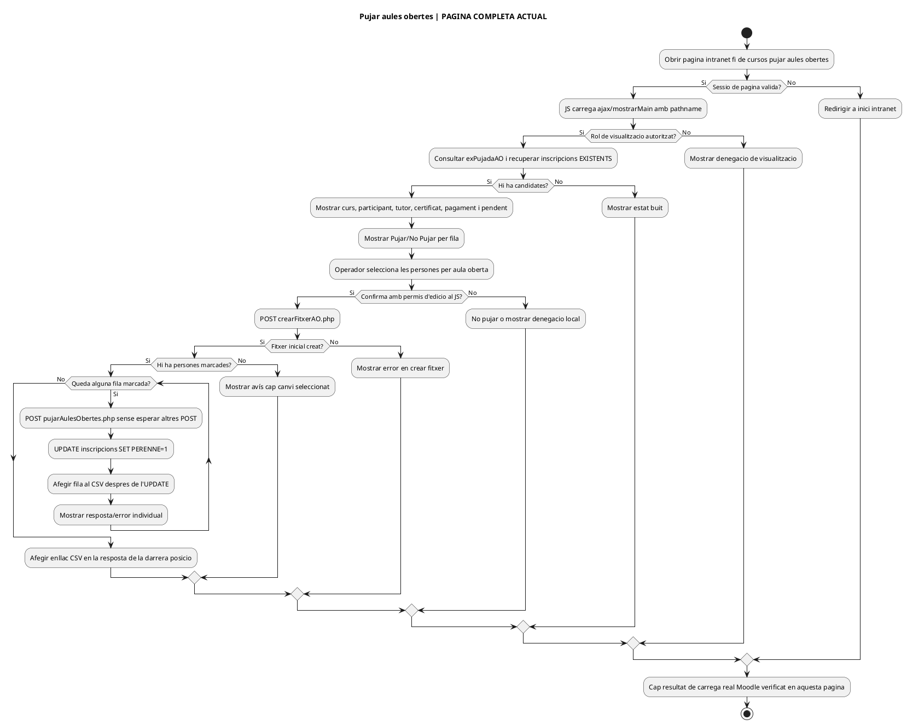

### P-MOODLE-AO-01 — Pàgina FINAL, proposta d'adaptació

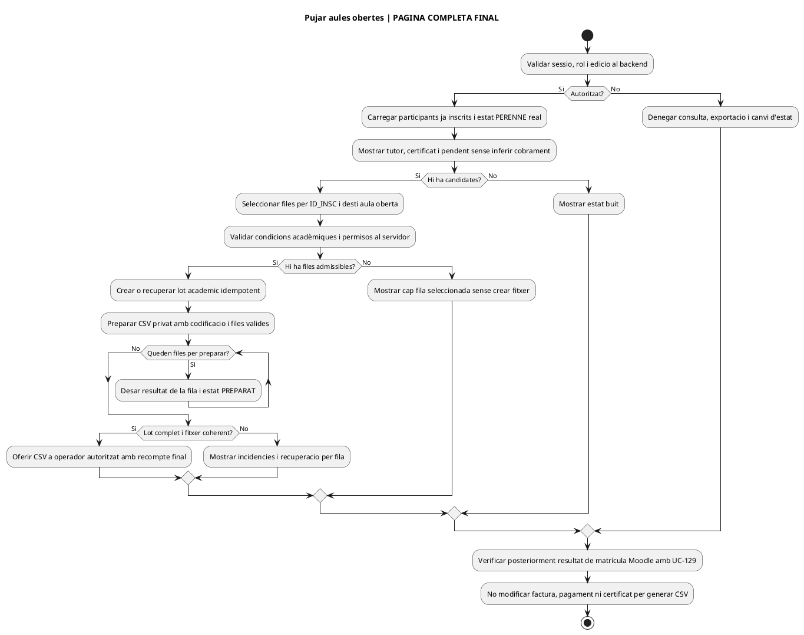

## 3. Diagrames d'activitat de pàgina i apartats

### AO01 · Accés i llista de candidates

**ACTUAL (PHP/JS versionat)**

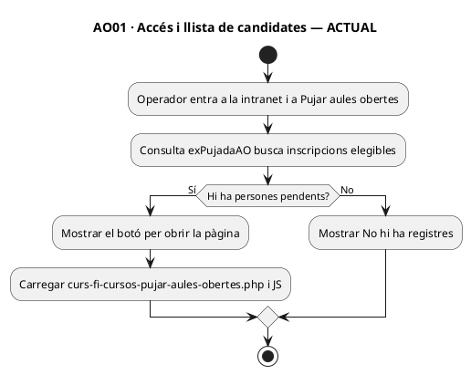

**FINAL (contracte d'adaptació)**

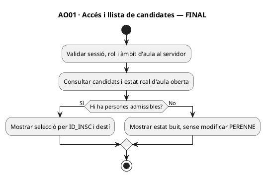

### AO02 · Taula, informació i marques Pujar/No Pujar

**ACTUAL (PHP/JS versionat)**

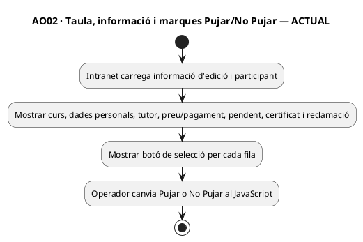

**FINAL (contracte d'adaptació)**

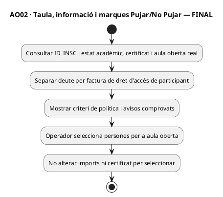

### AO03 · Confirmar i generar fitxer d'aules obertes

**ACTUAL (PHP/JS versionat)**

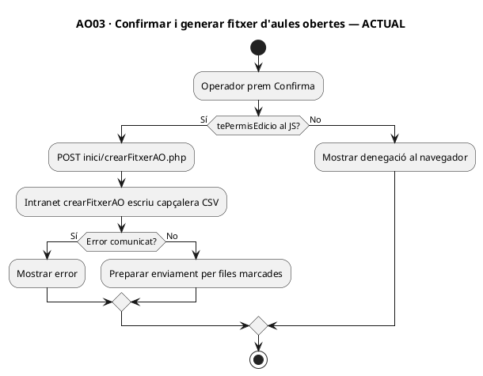

**FINAL (contracte d'adaptació)**

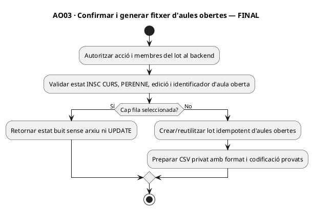

### AO04 · Cada fila: PERENNE i escriptura CSV

**ACTUAL (PHP/JS versionat)**

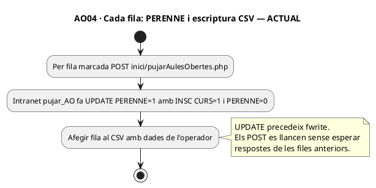

**FINAL (contracte d'adaptació)**

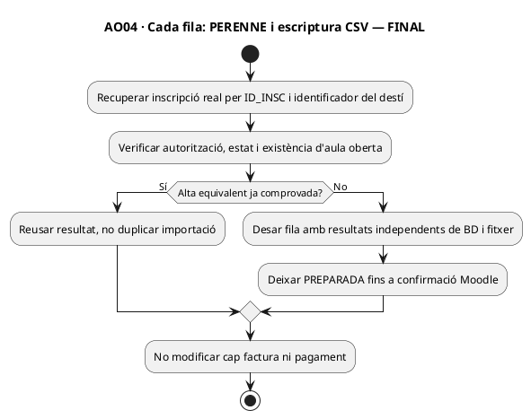

### AO05 · Modal, descàrrega i comprovació de destí

**ACTUAL (PHP/JS versionat)**

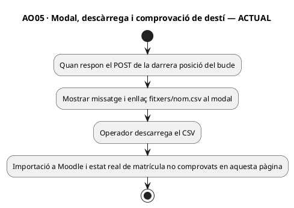

**FINAL (contracte d'adaptació)**

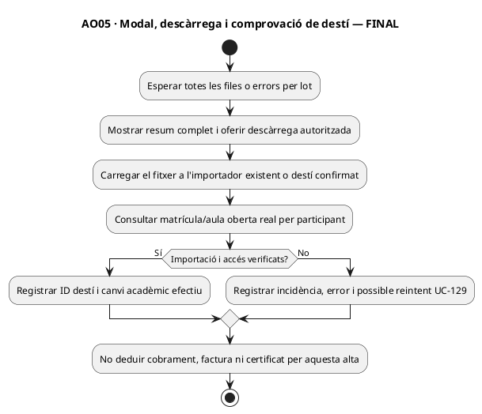

## 4. Requisits finals i proves de cada excepció (NO EXECUTADES)

| ID | Prova i resultat exigible |
| --- | --- |
| MO-AO-01 | Sense persones candidates: estat buit, no es genera fitxer. |
| MO-AO-02 | Un alumne amb `INSC CURS=0`: no marcar `PERENNE=1` per circumvenció directa de l'endpoint. |
| MO-AO-03 | Dues files del mateix USUARI però inscripcions diferents: operar per ID_INSC i destí, sense canviar totes per coincidència de clau parcial. |
| MO-AO-04 | POSTs paral·lels i en ordre diferent: CSV íntegre, un registre per fila, resultat només després de finalitzar tot el lot. |
| MO-AO-05 | UPDATE correcte però falla `fwrite`: registrar estat pendent i recuperar sense perdre fila. |
| MO-AO-06 | CSV generat però l'importador existent rebutja una fila: no mostrar-la com a aula oberta Moodle verificada. |
| MO-AO-07 | Repetició de pujada després de timeout: no duplicar matrícula/dret d'accés al destí. |
| MO-AO-08 | Persona amb factura d'empresa pendent: mostrar estat acadèmic separat d'obligació del pagador, sense CHARGE nou. |
| MO-AO-09 | Usuari sense permís invoca fitxer o POST directament: negar accés a dades i modificacions, també al servidor. |
| MO-AO-10 | Dades CSV amb accents/delimitadors: una fila per persona, sense exposició pública de dades personals. |
| MO-AO-11 | Moodle antic / curs diferent / baixa pendent: incidir a UC-129 i UC-124, no modificar factures ni certificats automàticament. |

## 5. Límit d'evidència i tancament

La fitxa documenta totes les accions d'aquesta **pàgina versionada** i el funcionament observable en el PHP/JS, amb una frontera explícita a l'importador de matrícules en lot existent. No s'ha inspeccionat la configuració productiva, el resultat de l'importador, permisos de descàrrega ni s'han executat les proves. **Aquest UC no equival al de pujada d'alumnes per a iniciar un curs; no reutilitzar les seves condicions INSC CURS en lloc de PERENNE.**

[Fitxa UC-113](../06-fitxes-funcionals/uc-113.md) · [Pujada d'alumnes](uc-moodle-pujada-alumnes-fitxa-activitats.md) · [Conciliació UC-129](uc-129-reconciliar-prisma-moodle-matricules.md) · [Registre mestre](../00-index-i-pla/42-registre-mestre-cobertura-funcional-implementacio-documentacio.md).
