# Cas d'ús específic — Pujada d'alumnes als cursos de Moodle

**ID funcional provisional:** CAND-UC-MOODLE-ALUMNES-01. La usuària confirma que és un UC **independent de la pujada d'aules obertes i d'UC-113**; atribuir ID numèric definitiu després de comprovar els 142 identificadors del catàleg. **Revisió:** 22/09/2026, codi `main` a `e71958b3026549bde09fb4b25f2ec3ba370937ec`. L'**importador de matrícules en lot EXISTENT** no s'ha de confondre amb el generador de CSV; si aquest importador és el destí del fitxer, el registre de resultat real s'ha de traçar al mètode/procediment corresponent, no fingir una crida Moodle al PHP d'aquesta pantalla.

## 1. Fitxa funcional detallada

| Camp | Funcionament actual contrastat i contracte funcional |
| --- | --- |
| Actor principal | Gestió acadèmica/operador de la intranet amb selecció de participants. Comprovació real de permisos a servidor del cas complet NO acreditada: el JS consulta `tePermisEdicio`. |
| Disparador i pàgina | Intranet → Cursos → Inici de cursos → Pujada d'alumnes. [Vista](../../codi-drive/intranet-actual/cursos-inici-cursos-pujar-alumnes.php), [JS](../../codi-drive/intranet-actual/js/cursos-inici-cursos-pujar-alumnes.js), [Intranet.php](../../codi-drive/intranet-actual/Intranet.php#L3571-L3801). |
| Precondicions | Inscripció ja EXISTENT a la BD web, curs/edició i aula coneguts; consulta de candidatures i avisos. Una fila no es crea de zero al confirmar la pujada. |
| Consultes i avisos | `__mostrarPage_Inici_Pujada_Inscripcions`, `__mostrarPage_Cursos_Pujada_Inscripcions`; mostra REALITZAT, DUPLICADA, DEUTOR; amb deute detectat marca No Pujar inicialment. Això no acredita una prohibició acadèmica universal. |
| Apartats | Accés des d'inici; taula per edició; filtres, avisos, marca Pujar/No Pujar, canvi d'aula; consulta i edició de dades; confirmar; modal d'estat; CSV/descàrrega; importació/validació a Moodle és un pas diferent. |
| Efecte web real | [`updPujadaInsc`](../../codi-drive/intranet-actual/Intranet.php#L1073-L1076): `INSC CURS='1', GRUP=?` sobre `USUARI,CURS,ANY,MES,INSC CURS='0'`. La identitat del `WHERE` no és ID_INSC: revisar col·lisions d'un usuari amb més d'una alta a la mateixa edició. |
| Fitxer real | [`crearFitxerPujadaInscripcions`](../../codi-drive/intranet-actual/Intranet.php#L4120-L4149) genera CSV amb capçalera Moodle; [`pujar_Inscripcions`](../../codi-drive/intranet-actual/Intranet.php#L4151-L4201) escriu dades de cada participant després de l'UPDATE. La columna `password` del CSV creat queda buida en la fila revisada. |
| Sortida visible | [JS L149–165](../../codi-drive/intranet-actual/js/cursos-inici-cursos-pujar-alumnes.js#L149-L165) afegeix missatges per fila i URL a fitxer a partir de resposta de l'última fila del bucle, sense barrera explícita per les altres respostes. |
| Resultat acadèmic | `INSC CURS=1` significa una escriptura llegada; no prova per si sola la matrícula efectiva ni l'accés confirmat Moodle. Verificar destí amb UC-129. |
| Efectes econòmics/fiscals | Aquest procés és acadèmic; **no** crear factura, CHARGE, devolució ni canviar receptor fiscal. Deute i accés es decideixen segons UC-95/124, no per una marca de CSV. |

## 2. Contracte de resultat i errors

**Resultat actual:** l'operador tria persones i aula, el sistema prepara fitxer, marca les inscripcions elegides i ofereix el CSV. **Resultat final previst:** a) fitxer preparat i custodiat; b) resultat per participant; c) importació/matrícula Moodle confirmada separadament; d) incidències per fitxer incomplet, error de destí o discrepància d'usuari/curs; e) idempotència de reexecució; f) cap efecte fiscal inferit. El procediment d'importació en lot **existeix** per confirmació de negoci, però el seu punt d'entrada i destí concret no són identificables amb certesa en aquest recorregut PHP.

**Errors contrastats:** cap fila marcada, error en crear fitxer, error en UPDATE, fallada d'escriptura CSV, POSTs concurrents i resultats desordenats, usuari sense permisos client, cursos/aules mal associats, alumne ja inscrit o amb deute, duplicat a Moodle i fitxer descarregable amb dades personals. No assumir que un correu de confirmació o l'estat `INSC CURS=1` acrediten per ells sols l'èxit a Moodle.

## 3. Matriu de pàgina i apartats (RM-037)

| Secció | Acció | Font | Diagrames |
| --- | --- | --- | --- |
| A01 | Entrada des de l'inici i càrrega de pàgina | `Intranet::__mostrarPage_Inici_Pujada_Inscripcions` | ACTUAL/FINAL A01 |
| A02 | Consulta, avisos, selecció i aula | `Intranet::__mostrarPage_Cursos_Pujada_Inscripcions`, JS | ACTUAL/FINAL A02 |
| A03 | Consulta i edició de persona | `modalEditaInscripcio_pujadaAlumnes`, `actualitzaDadesPersonals_pujadaAlumnes` | ACTUAL/FINAL A03 |
| A04 | Confirmar i crear CSV | `crearFitxerPujadaInscripcions.php` i mètode PHP | ACTUAL/FINAL A04 |
| A05 | Actualització de la matrícula origen i fila CSV | `pujarInscripcions.php`, `updPujadaInsc` | ACTUAL/FINAL A05 |
| A06 | Resum/descàrrega i frontera importador campus | JS, ruta de fitxer; destinació d'importador per acreditar | ACTUAL/FINAL A06 |

## 4. Diagrames d'activitat de cada apartat

### A01 · Inici: accés a «Pujada d'alumnes»

**ACTUAL (codi versionat)**

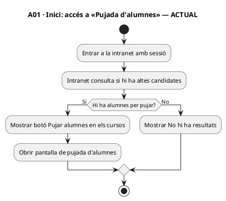

**FINAL (adaptació proposada)**

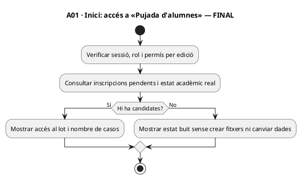

### A02 · Pàgina: consulta, avisos i selecció d'aula

**ACTUAL (codi versionat)**

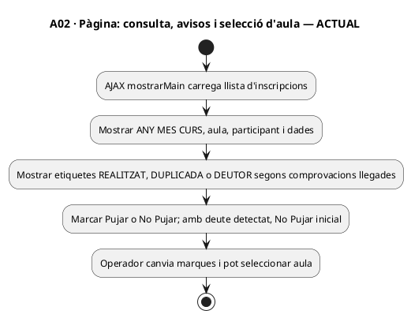

**FINAL (adaptació proposada)**

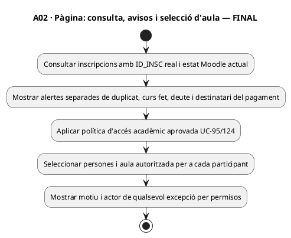

### A03 · Apartat: consultar i editar dades de l'alumne

**ACTUAL (codi versionat)**

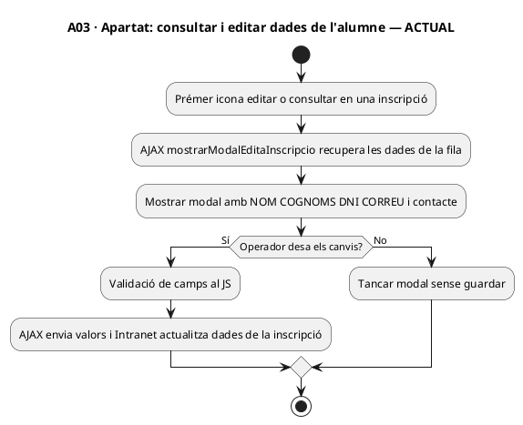

**FINAL (adaptació proposada)**

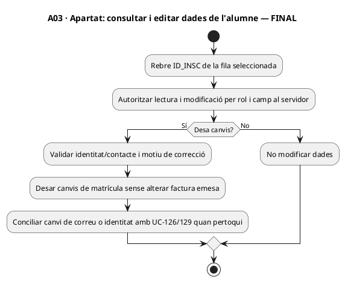

### A04 · Apartat: confirmar i crear fitxer CSV

**ACTUAL (codi versionat)**

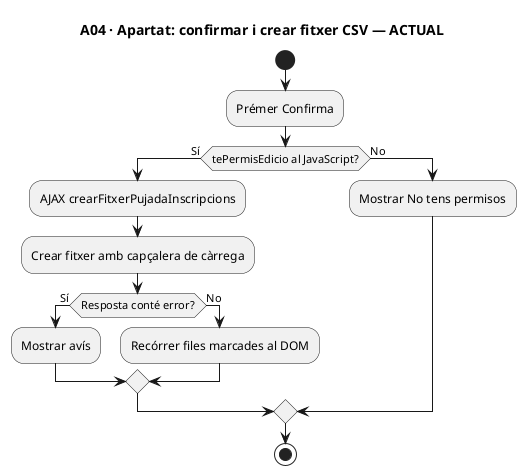

**FINAL (adaptació proposada)**

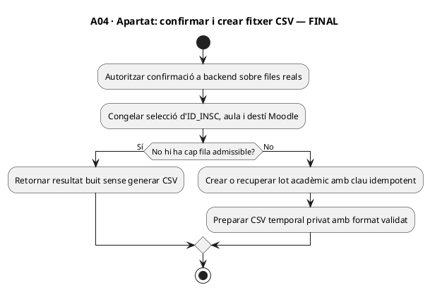

### A05 · Apartat: actualitzar cada inscripció i afegir fila

**ACTUAL (codi versionat)**

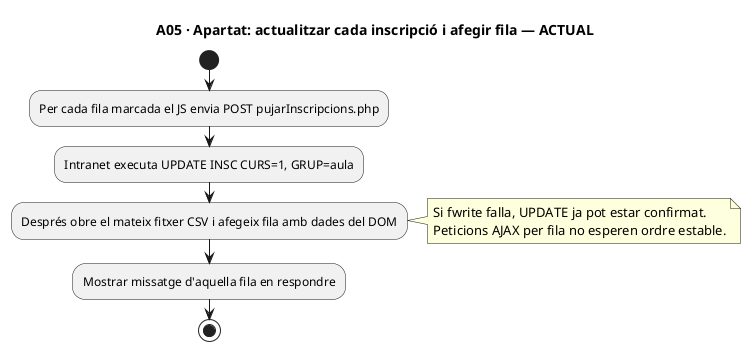

**FINAL (adaptació proposada)**

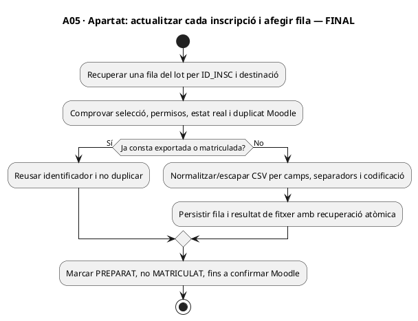

### A06 · Apartat: resum, descàrrega i càrrega al campus

**ACTUAL (codi versionat)**

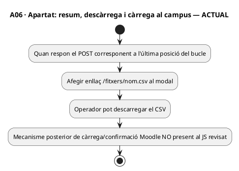

**FINAL (adaptació proposada)**

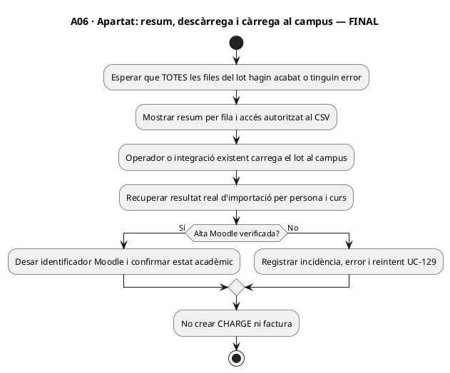

## 5. Proves obligatòries (NO EXECUTADES)

| ID | Acció i resultat esperat |
| --- | --- |
| MO-AL-01 | Obrir pàgina sense inscripcions: no hi ha botó de pujada ni cap CSV creat. |
| MO-AL-02 | Una persona amb dues inscripcions legítimes: es marca només ID_INSC seleccionat, no tot USUARI indiscriminadament. |
| MO-AL-03 | Amb deute en grup/empresa: aplicar política acadèmica aprovava per participant, no bloqueig econòmic implícit. |
| MO-AL-04 | Persona REALITZAT o DUPLICADA: avís i decisió explícita; cap segona matrícula al destí sense raó. |
| MO-AL-05 | Error després d'UPDATE i abans d'escriure CSV: recuperar estat sense afirmar importació correcta. |
| MO-AL-06 | Deu POST fora d'ordre: mostrar resultat complet quan tots han finalitzat, amb recompte exacte. |
| MO-AL-07 | Crear fitxer amb zero participants: missatge sense modificació de BD ni descàrrega falsa. |
| MO-AL-08 | Usuari no autoritzat invoca endpoint directe: cap UPDATE i cap fitxer exposat; comprovar servidor. |
| MO-AL-09 | Correu/nom amb separadors de CSV o salts de línia: format estable sense dades sobreres. |
| MO-AL-10 | CSV preparat però importació Moodle rebutjada: estat de preparació independent de matrícula verificada i incidència UC-129. |
| MO-AL-11 | Dades personals editades després de factura real: no alteració retroactiva de document fiscal. |
| MO-AL-12 | Reexecutar mateixa selecció després de timeout: reús del destí, no duplicar matrícula ni pagament. |

## 6. Traçabilitat i estat

**DOC:** funció actual, apartats i diagrames de pàgina documentats a partir del PHP i el JS, **frontera del sistema importador existent pendent de mapar en el punt concret de càrrega**. **IMP:** el codi llegat existeix; la consistència per fila, autorització, idempotència i reconciliació final no s'han acreditat. **TEST/producció:** no executat/no comprovat. **No és UC-113**, no és [pujada d'aules obertes](uc-moodle-aules-obertes-fitxa-activitats.md) i no és UC-129, que comprova la correspondència posterior.

[UC-113](../06-fitxes-funcionals/uc-113.md) · [UC-129](uc-129-reconciliar-prisma-moodle-matricules.md) · [UC-95](uc-095-estat-academic-deute-pendent.md) · [registre mestre](../00-index-i-pla/42-registre-mestre-cobertura-funcional-implementacio-documentacio.md).
